# 商船队机器学习的六大课程

> 原文：<https://medium.com/geekculture/6-machine-learning-lessons-from-the-merchant-navy-2e17421ae1d1?source=collection_archive---------10----------------------->

## 他们运作的规模可以教会你很多关于设计 ML 管道的东西

最近，我有机会与在商船队工作的 Ravi Budhwar 船长交谈。Budhwar 船长在海上度过了许多年，是海上贸易和船运所有复杂事务的专家。他目前正与该领域的领导者 [Fleetship Management](https://www.fleetship.com/) 一起航行。在他的职业生涯中，他也多次获奖。与他交谈非常有见地，因为作为一个陆地居民，很容易忘记航运。然而，这是一个至关重要的行业。事实上，全球商船队在 2020 年运送了【2020 亿载重吨。没有航运，现代供应链就不会存在。

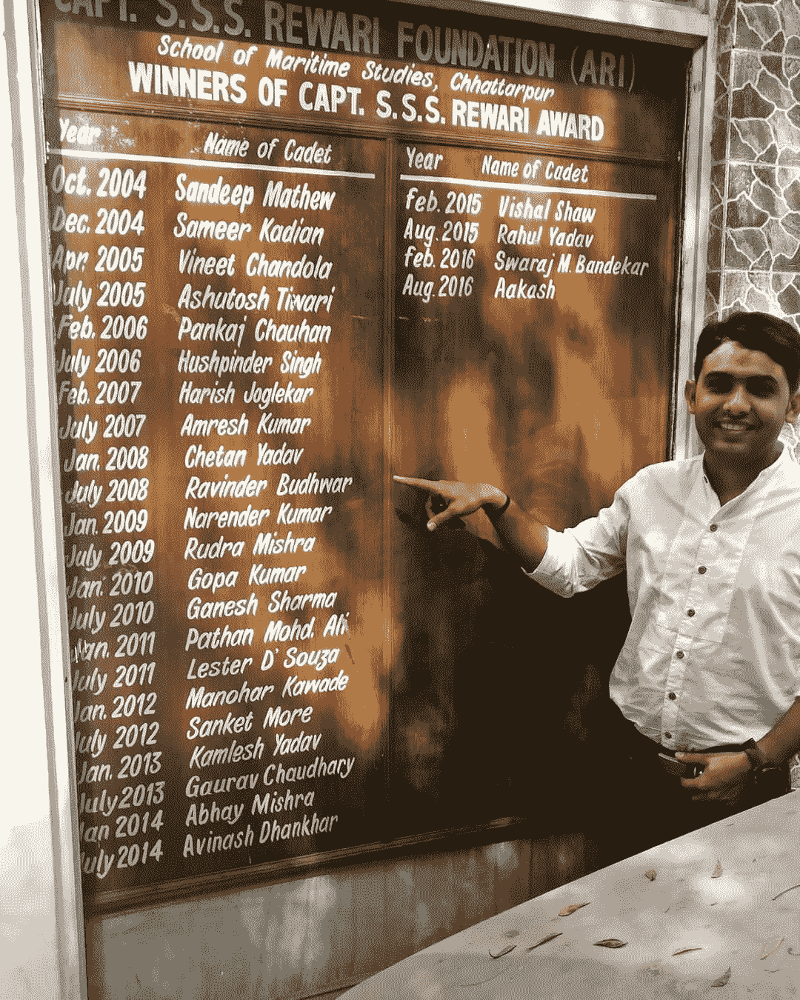

Capt. SSS Rewari award is given to the best cadet of their batch. Captain Ravi won it during his Pre sea training days

当拉维船长解释航运业的规模时，我很惊讶。一艘中型船的重量超过 90，000 吨，连续几个月不间断地在海上航行。船上的船员必须面对各种挑战，如恶劣的天气、不断变化的海景、24 小时航行、不断变化的时区。如果船在中途出了问题，修理会很困难。最令人印象深刻的是他们如何用很少的船员来管理这一切(这些船上船员的平均规模在 20 到 30 人之间)。

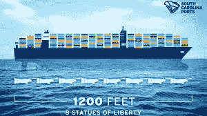

This is a mid-sized ship. Imagine the size of the large cargo ships. Much smaller cruise ships have crews numbering in the 100s

关于他的经营规模和他的团队的效率的谈话让我对使这成为可能的系统非常感兴趣。我想知道船只和工业是如何创造出解决如此复杂问题的系统的。这些船在组织和管道设计方面有一些精彩的课程，我们可以将其用于我们的机器学习系统。我将检查我认为最有趣的。

# 明确定义的责任+优先事项

一艘船最显著的特点之一是每个船员都确切地知道他们必须做什么。每个船员都被分配了一个特定的班次，他们的职责被详细地记录下来。这甚至延伸到紧急责任。详细程度高有很多好处。最明显的是在紧急情况下，机组人员可以立即行动，而不是浪费时间。

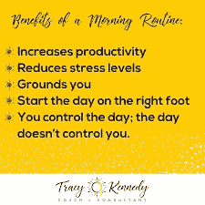

Most self-help gurus preach about the benefits of a routine. On the ship, this is taken to the next level

即使在最平凡的日子里，这也起着至关重要的作用。由于每个人都确切地知道自己在不同的时间需要做什么，所以在空转中浪费的时间很少。这些任务按时有效地完成了。这也增加了问责制。如果一项任务没有完成，工作人员确切地知道谁应该负责，这使得诊断问题更快。

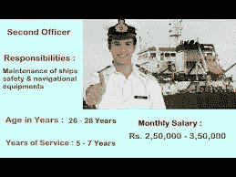

Every officer has sections dedicated to their roles

这是许多组织可以使用的东西。根据我的经验，管理层对项目的想法往往是不成熟的。大量时间被浪费在检索数据集(没有人知道哪些是相关的)，与利益相关者一起解决细节问题，以及因为需求突然改变而重做整个部分。我曾经花了整整一周的时间等着学习我必须做的事情。一个更加清晰和严格的分工，明确定义的角色和责任，将有利于公司/组织。

# 证明文件

说到最后一点，我注意到商船队在记录事情上有点极端。每天，所有的事件和天气情况都记录在日志上。除此之外，船员们汇总一天中完成的所有工作，并向船长提交一份报告。除此之外，还有单独的周报和月报。

It’s very easy to get lost in one of these. Photo by [Ian Taylor](https://unsplash.com/@carrier_lost?utm_source=medium&utm_medium=referral) on [Unsplash](https://unsplash.com?utm_source=medium&utm_medium=referral)

这还是有点理智的。然而，海军对文件有点神经质。每扇门都贴了标签。你甚至可以在进入房间之前就知道你将进入哪个房间。电梯里有所有楼层的目录，所以你可以知道你需要去哪一层。有大量的文件记录着船上的每一个小决定。

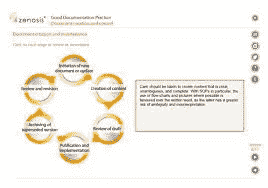

I will do a whole article on Documentation, make sure you’re following me to catch that

幸运的是，我们并不需要变得如此激进才能受益。涵盖项目、使用的数据源、选择和放弃的特性、使用的协议等的合理文档就足够了。不幸的是，大多数公司(包括大公司)需要在文档方面投入更多。否则，会浪费大量的时间来重做先前团队已经完成的程序和测试。这是重新发明轮子的时间。在文档方面的一些前期投资将在未来节省大量资源。

# 计划维护系统

看着这些船的规模，我对一件事感到好奇:“你如何阻止东西破裂？”这对船舶尤其重要。请记住，这些船都在海上，一旦出现问题，维修并不容易。这些庞然大物的体积也意味着将它们从深水中拖出来将是一个挑战(货船很容易使航空母舰相形见绌)。还有成本。一天的延误会导致**数百万美元的损失。**

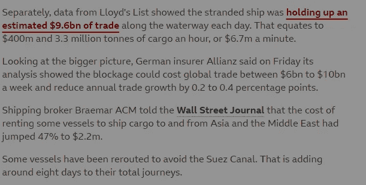

Some number from the Ever Given fiasco. Taken from BBC News: [https://www.bbc.com/news/business-56559073](https://www.bbc.com/news/business-56559073)

还有一个安全问题。船只在深海中发生故障会对船员的安全造成严重威胁。根据货物，它还会对周围地区的海洋生物产生不利影响。**因此没有犯错的余地。**

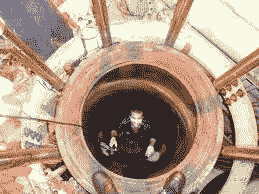

The pistons used in the ships are much bigger than people. Pistons used by large cars can be held by you.

那么，20 名船员如何维护一艘数千吨、设计复杂、有数千个管道、排水管和其他活动部件的船呢？尤其是当其中一些部件比船员本身还大的时候(这些船上的发动机比大多数房子都大)。作为一名技术人员，我期待大量的高科技监控系统和人工智能监控。解决方案要简单得多。

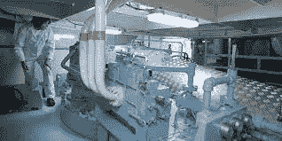

PMS is literally a lifesaver

虽然该团队确实有大量的监控设备，但秘密在于工作人员采取的积极主动的方法。该团队不是等待出现问题的迹象，而是对零件进行定期检查，而不管其功能如何。这些被称为计划维护系统的检查是提前计划好的。精确的分工让机组人员可以快速工作，检查比他们大得多的设备。PMS 使长途运输既安全又经济。

引用一句老话，*预防胜于治疗*。这也适用于机器学习。[这就是为什么在你自己的项目中集成多种错误度量并监控数据漂移是至关重要的](https://www.youtube.com/watch?v=A5wfVTyzv9E&t=141s&ab_channel=Devansh%3AMachineLearningMadeSimple)。这些步骤被大多数人忽略了

# 裁员

安全是所有水手的第一要务。这以各种方式表现出来，从停工(任何工作人员如果发现不安全都可以停止工作)到坚持对细节的极度关注。这方面最明显的例子是船只内置的冗余。

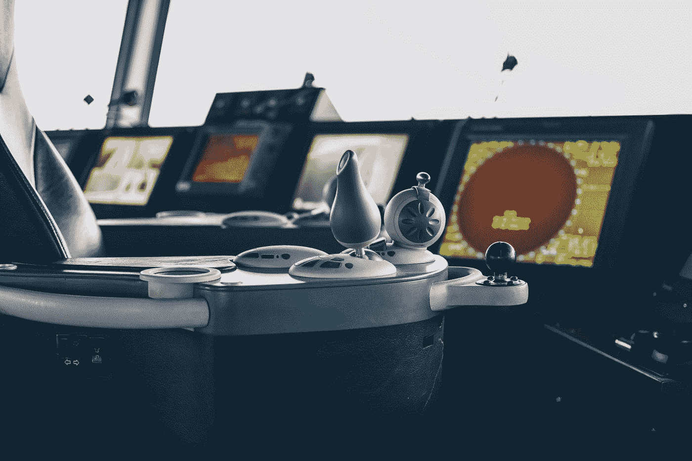

Radars are crucial to ships. This is why ships have multiple backup radars. Photo by [Ibrahim Boran](https://unsplash.com/@ibrahimboran?utm_source=medium&utm_medium=referral) on [Unsplash](https://unsplash.com?utm_source=medium&utm_medium=referral)

在长距离上，一度的误差会让你偏离航向数千英里。这就是为什么船上有多部雷达随时都在使用。船员使用所有这些读数来微调他们的导航。他们也有不同种类的指南针，最失败的是，*工具使用星星导航*。

每艘船也有 2 艘救生艇。这些救生艇的总容量是船只容量的 200%。万一停电，船上有多台发电机(并有备用)。

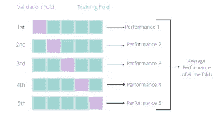

The number of people who miss this is shocking.

如何将这一点应用于机器学习？第一件事:**交叉验证一切**。任何时候你使用一个 ML 模型，你都需要使用交叉验证。很简单，很有效，而且严重利用不足。之后，开始尝试测试不同的事件。机器学习是非常脆弱的，你永远不应该在一次配置后就放弃它。这篇文章，[为什么你需要花更多的时间来评估你的机器学习模型](/mlearning-ai/why-you-need-to-spend-more-time-evaluating-your-machine-learning-models-e1e3258fe7d)提供了更多关于在建立你的深度学习/人工智能模型时看似任意的决定如何严重扭曲结果的细节。

除了将随机性和变化性整合到您的数据中，使用一组更多样化的评估协议也将允许您的模型具有更多样化的“视角”。[编写更好的机器学习评估协议(回归)](/mlearning-ai/writing-better-machine-learning-evaluation-protocols-regression-4efa804f3587)给出了你可以使用的代码框架。

Words from a Wise Man

虽然急于测试模型可能很有诱惑力，但要确保首先做好基础工作。一个好的模型可能会提高你 5%的性能，但是如果你必须不断地重新训练和重建，你的系统将会赔钱。花大量时间在吨上，交叉验证/多次拆分，这并不性感，但这是至关重要的。

# 金钱在于规模

我们已经花了很多时间讨论航运业有多大。如果没有大规模航运的存在，世界也不会存在。这些船的大小和规模使它们非常有价值。装满货物的中型船**价值超过十亿美元。有 20 个国家的 GDP 低于其中一艘船。这也体现在机组人员的报酬上。**

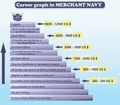

Remember, when the crew is on the ship, they have no expenses. The salary is their take-home monthly

当你试图从事机器学习时，请记住这一点。你的解决方案在大规模运作之前不会真正有价值。当我与 ICICI 银行合作时，我们的数据集每天增加**1000 万个样本**。我在 ForeOptics 的工作是在全球范围内进行的(供应链分析)。约翰·霍普金斯大学要求我评估整个州的健康政策。

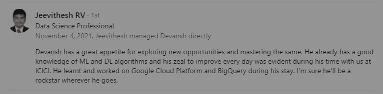

The reason I was able to do well in ICICI Bank is that I built a solution that the bank could use at scale

我强调健壮性、通用性和成本效益的原因正是如此。当处理非常复杂的高维数据和/或大量样本时，使用复杂的技术会使您的成本失控。正如在我的文章和视频中多次展示的那样，更简单的低成本技术将提供最好的投资回报。谷歌可以在多台服务器上投入 1 万个训练小时。你们组不行。

# 船长无所不能(医生、导航等)

这可能是最令人惊讶的方面。拉维船长告诉我，船长还兼任医疗专业人员、领航员以及其他任何需要的职务。他们有权签署出生、死亡和婚姻证明。他们还必须与海关和港口当局打交道。他们对这艘船有最终的权力(和责任)。如果其中一名船员有任何问题(包括技术问题)，船长会替他们解决。

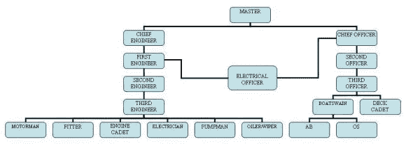

Master is another word for captain. A captain has to oversee all the aspects of the ship

要做好本职工作，机长必须能把每件事都做好。这使得像拉维船长这样的船长成为现实生活中的英雄，掌握多种技能。它让船长不仅能在需要时介入，还能真正理解船员面临的挑战。一套全面的技能也让船长能够真正预见问题，并积极创造解决方案。

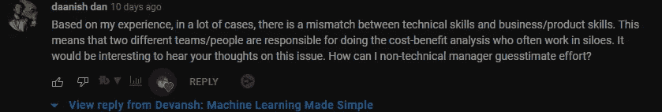

This backs up what I’m saying. Too many managers don’t know enough

这种方法在科技领域非常有效。管理层和开发人员之间往往存在巨大的脱节，导致不合理的期望和非常不明确的指示。这样的安排只有输家。拥有大范围项目技术技能的经理更适合领导。这甚至不需要该领域的专业知识，只需要扎实的理解。

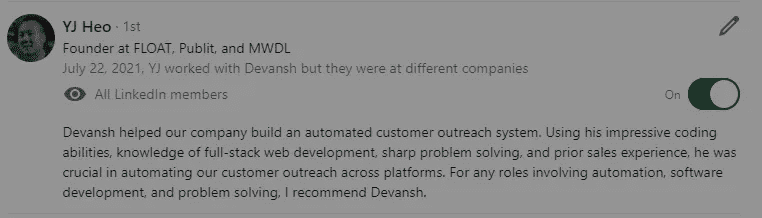

My understanding of Web Development and Automation helped me scrape the web for ForeOptics.

这也适用于你的个人层面。你对不同的想法了解得越多，你就越能更好地解决问题。尽管我专攻机器学习，但我接触过 Android 开发(JavaScript 和 Kotlin)、Web Dev (JS、React、Python)、函数式编程(Haskell)和服务器端编程(Java)。这有助于我的机器学习，因为我可以采取更大的代理，并在我的项目中尝试更多的东西。

Programming is a must for Machine Learning. Get good at Python and learn 2–3 other languages

这也是为什么我在我的文章[如何在 2022 年学习机器学习](/geekculture/how-to-learn-machine-learning-in-2022-9ef2ea904986)中谈论数学、编程和计算机科学基础知识的重要性。所有这些都会给你对 ML 至关重要的视角(机器学习/深度学习/人工智能是这些领域的交集)。如果你想在后两个方面发展你的技能，看看[简单编码面试](https://codinginterviewsmadesimple.substack.com/)。这是由我创建的每周编码时事通讯。利用我在辅导中的发现来帮助你轻松提高成绩，这是一种行之有效的方法。 [在这里了解更多信息](https://codinginterviewsmadesimple.substack.com/about)

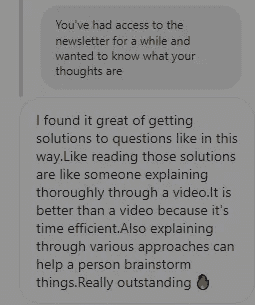

The newsletter is a proven way to easily boost your performance in coding interviews.

发展你在不同领域的技能会让你把这些点联系起来，并成倍地提高你的成果。[记住，机器学习主要是一个决策问题](https://www.youtube.com/watch?v=sDiVoK8dtvQ&ab_channel=Devansh%3AMachineLearningMadeSimple)，知道得越多，你的决策就越好。

这篇文章已经很长了，所以我就讲到这里。当然，这篇文章甚至没有触及航运业务的各种复杂性的表面，所有这些都是需要学习的。想了解更多，请随时联系[上尉拉维·巴德瓦](https://www.facebook.com/ravi.budhwar.75)。他是一名经验丰富的水手，在个人和专业方面指导过许多水手。他还参与了[全会学校，一个彻底改革教育的教育机构](https://theplenumschool.edu.in/)。他总是乐于和感兴趣的人交谈。

如果你喜欢这篇文章，看看我的其他内容。我定期在 Medium、YouTube、Twitter 和 Substack 上发帖(所有链接都在下面)。我专注于人工智能、机器学习、技术和软件开发。如果你正在准备编码面试，看看:[编码面试变得简单](https://codinginterviewsmadesimple.substack.com/)，我的免费每周时事通讯。

为了帮助我写更好的文章和了解你[填写这份调查(匿名)](https://forms.gle/7MfQmKhEhyBTMDUD7)。最多花 3 分钟，让我提高工作质量。

如果你也有任何有趣的工作/项目/想法给我，请随时联系我。总是很乐意听你说完。

以下是我的 Venmo 和 Paypal 对我工作的金钱支持。任何数额都值得赞赏，并有很大帮助。捐赠解锁独家内容，如论文分析、特殊代码、咨询和特定辅导:

https://account.venmo.com/u/FNU-Devansh

贝宝:[paypal.me/ISeeThings](https://www.paypal.com/paypalme/ISeeThings)

# 向我伸出手

你可以在任何平台上联系我，或者查看我的其他内容。如果你想讨论家教，发短信给我。查看免费的罗宾汉推荐链接。我们都得到一个免费的股票(你不用放任何钱)，对你没有任何风险。**所以不使用它只是损失免费的钱。**

查看我在 Medium 上的其他文章。:[https://rb.gy/zn1aiu](https://rb.gy/oaojch)

我的 YouTube:【https://rb.gy/88iwdd 

在 LinkedIn 上联系我。我们来连线:【https://rb.gy/m5ok2y】T4

我的 insta gram:[https://rb.gy/gmvuy9](https://rb.gy/gmvuy9)

我的推特:[https://twitter.com/Machine01776819](https://twitter.com/Machine01776819)

如果你正在准备编码/技术面试:[https://codinginterviewsmadesimple.substack.com/](https://codinginterviewsmadesimple.substack.com/)

获得罗宾汉的免费股票:[https://join.robinhood.com/fnud75](https://www.youtube.com/redirect?redir_token=QUFFLUhqa0xDdC1jTW9nSU91WXlCSFhEVkJ0emJvN1FaUXxBQ3Jtc0ttWkRObUdfem1DZzIyZElfcXVZNGlVNE1xSUc4aVhSVkxBVGtHMWpmei1lWWVKNzlDUXVJR24ydHBtWG1PSXNaMlBMWDQycnlIVXNMYjJZWjdXcHNZQWNnaFBnQUhCV2dNVERQajFLTTVNMV9NVnA3UQ%3D%3D&q=https%3A%2F%2Fjoin.robinhood.com%2Ffnud75&v=WAYRtSj0ces&event=video_description)