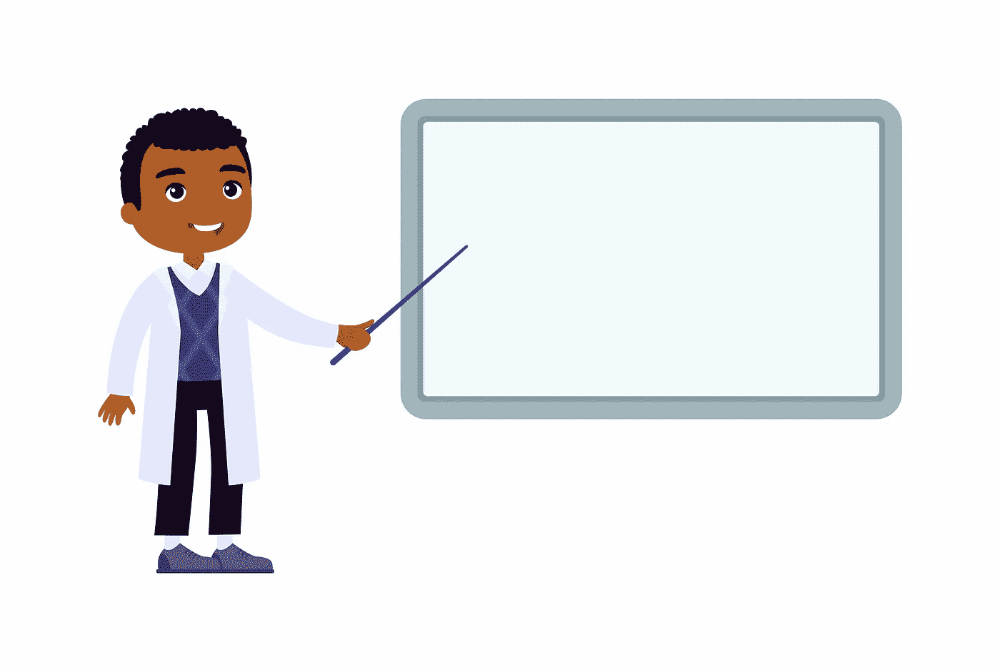
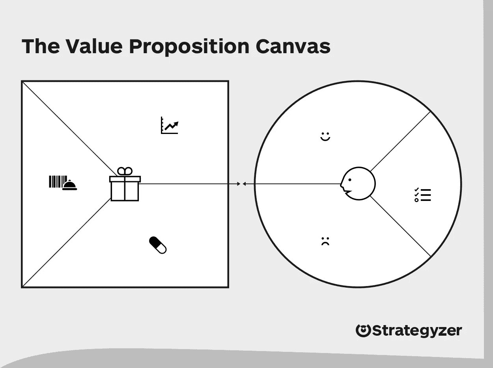

# 让你的技术演示更好的 6 点

> 原文：<https://medium.com/geekculture/6-points-to-make-your-tech-demos-better-b2bb5bf3c7a0?source=collection_archive---------45----------------------->

Demo Anyone? Image credits: <a href=’[https://www.freepik.com/vectors/medical'](https://www.freepik.com/vectors/medical')>Medical vector created by nizovatina — [www.freepik.com](http://www.freepik.com)</a>

自从第一个发明轮子的人把轮子卖给第一个人以来，演示就一直存在。今天，编排演示的艺术和科学是它自己的产业(深夜电视广告有人吗？)

客户演示在 IT 中也很常见。到目前为止，在我的任期内，我已经向两个小的(<4) and large teams of stakeholders. While there are many things that are specific to each team and the context, I see that a general checklist can be followed to make demos more effective.

Even before diving into any list, I would state that demos can have vastly different purposes. From selling the product to eliciting feedback to even shortlisting prospective users or even picking out prospective employees!

However, as a CTO of a firm I worked with said to me, the basic sanity check of a demo gone well is that “we haven’t embarrassed ourselves”. That is the low-bar the following checklist aims to clear. I know it’s really low. But from the half a thousand odd demos I have done, trust me that we do end up embarrassing ourselves a bit too often when we aren’t careful enough!

1- **与你的观众产生共鸣**)交付了超过 500 个演示——这是一个明显的候选人，但超级重要，有时会被遗忘。问问你自己，

> “我的客户走进演示时处于什么状态？”

顾客刚起床吗？他们是不是在你之前参加了一个恶心的会议？没有万无一失的方法知道这些答案。

> 因此，在开始演示之前，给它们涂上一点肥皂是明智的。

寒暄，询问关于狗等，但要真诚。如果你发现他们看起来精力不足，那就提出重新安排时间。如果你继续，甚至可能缩短你的演示的长度。我经常看到团队兴高采烈地进入演示模式，却看到一个无精打采的客户被分散了注意力，变得冷漠。同一个顾客一天前还兴致勃勃。此外，您可能已经使用 Docker 在 Azure 实例中部署了 3 ML 模型，或者创建了 3D 图来建模多元数据。但是如果你的顾客或者甚至你的一个顾客不喜欢这些东西，你就会失去他们。不断简化，直到演示中的每一位客户都确信在使用信息方面花费了最少的精力。

2.**有一个团队支持你** -当然你会为演示做好充分准备。但是如果你在进行演示，运行测试脚本，做笔记，回答问题，你会很快发现自己如履薄冰。

> 在你主持节目的时候，让一个团队负责后台工作。

除非您的演示不需要您修改任何其他内容，或者不需要您回答随机问题(例如网络研讨会)，否则您可以独自完成。在许多最初的演示中，直到最后才提出问题并不容易。许多利益相关者可能会在早期感到焦虑，并会不断打断你。有人注意到这些问题是很重要的，这样你的心流才不会完全失控。

3.**适应** -这是上一点的延续。有时，客户对你的首要特性不感兴趣，但他们想知道，“你如何允许单点登录”或“你如何获取那些报告，它们看起来如何”——基本上是你认为不重要的东西。接个电话。是否有更多的利益相关者对你准备的流程感兴趣？或者是在演示中约定蜿蜒去另一个地方。如果利益相关者是强大的，这将是棘手的，因为其他人无论如何都会同意。

> 如果没有完整的背景，议程的改变没有意义，那么你必须努力让客户原谅你，并坚持一分钟。

如果您可以切换到另一个特性而不丢失上下文，您完全可以这样做！

4.**有干净的、有组织的测试数据，没有晦涩难懂的东西**——我记得演示者键入一些看起来很可怕的数据的次数更多了。更糟糕的是，您需要在每次保存表单后“清空缓存”。听起来很熟悉？在开始演示之前，您的系统和数据需要处于最佳状态。

> 将你的测试数据安排在一个漂亮的小电子表格中，并清晰地标出测试用例。

也不要把他们从你的记忆中抹去(我已经为此感到内疚了)，因为那些期待做 UAT 的人会被吓到的。案例的电子表格使每个人的生活变得更容易，并回答了一些与测试数据覆盖、如何对此进行 QA 等相关的未被问到的问题。还要确保系统不需要任何你在真实的 UAT 中不会想到的修补。如果你在嘲笑数据，那么试着用优雅的方式代替复杂的邮递员呼叫(除非你的客户每天都使用邮递员)

5.**早出晚归。一直都是。**——列表中最明显的一点，但总是礼貌地提前一点离开上一次会议(或者安排它早点结束)。当你提前到达演示现场时，无论是实体的还是虚拟的，你都有时间评估会议音频，对早到的人说他的，打破一些僵局，设置你的背景等，如果你需要的话，喝水并做一些小事来保持你的心态准备好和警觉。

> 如果你从一个会议跳到另一个会议，勉强按时完成，演示会让人感觉压力很大。

6.**保持迭代值** -使用这种质量检查来删除任何你认为不会给客户增加价值的东西。如果有疑问，请将这些功能推到演示的最后。希望你已经做了一些研究，以确保你的猜测不会是 100%的！

> 在演示过程中，不断将你展示的一切与如何提升他们的收益或减轻他们的痛苦联系起来。

事实上，在进入最重要的演示(【https://www.strategyzer.com/canvas/value-proposition-canvas】T2)之前，可以使用方便的价值主张路线图

Strategyzer’s Value Prop Canvas. Credits: [https://www.strategyzer.com/canvas/value-proposition-canvas](https://www.strategyzer.com/canvas/value-proposition-canvas)

作为奖励，这是我最近看到的一个很棒的演示。【https://www.youtube.com/watch?v=A5-wgSjRrcE 

即使你不喜欢雪花或数据之类的东西，几分钟的演示就会告诉你演示的人正在扼杀它！

你认为是什么让演示成功了？请在评论中告诉我！