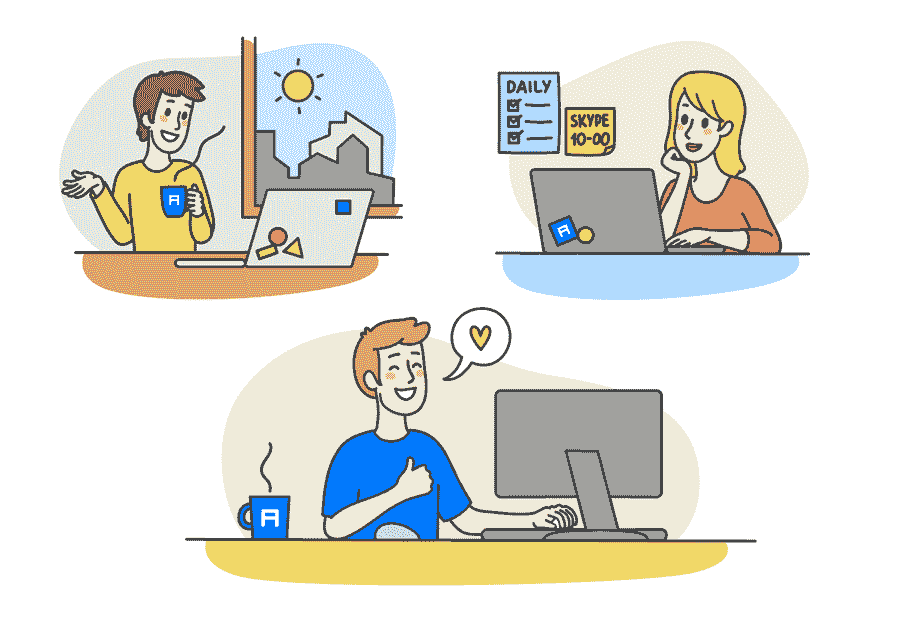
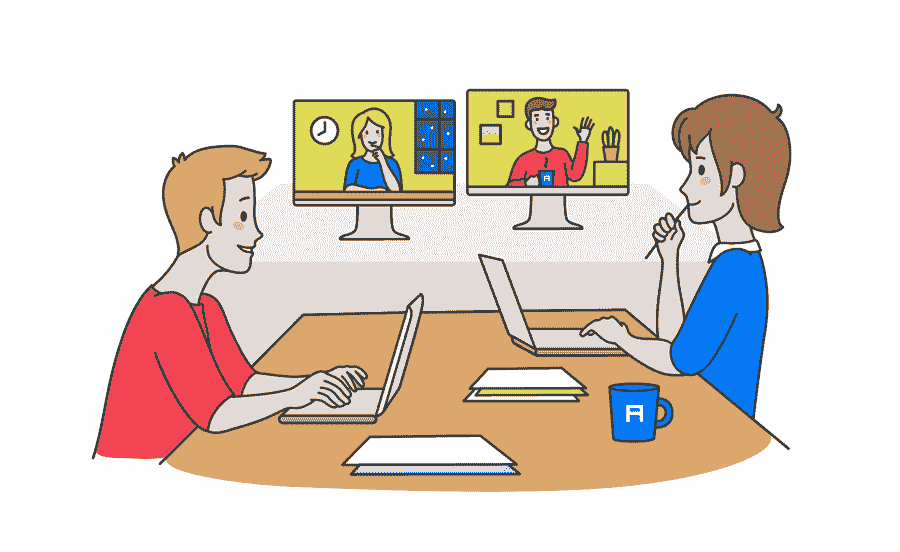

# 应对您最大远程工作挑战的 6 种解决方案

> 原文：<https://medium.com/geekculture/6-solutions-to-your-biggest-remote-working-challenges-8f819d0da60?source=collection_archive---------13----------------------->

来自一家拥有近 20 年“无办公室化”经历的 IT 公司的建议！

这是我们两部分远程工作系列的第二篇文章。通过这个系列，我们将从一家已经成功运营“无办公室”公司近 20 年的公司的角度来看看远程工作。

在本系列的[第一篇文章](https://blog.alconost.com/en/how-alconost-runs-a-successful-remote-company?utm_source=medium&utm_campaign=remote-work-part-2)中，我们从一家自 2004 年成立以来就一直这么做的公司的角度来看“无办公室”工作场所的含义。

[Alconost](https://alconost.com/?utm_source=medium&utm_campaign=remote-work-part-2) 是一家全球应用、游戏、视频和网站本地化服务提供商，提供 70 多种语言。我们还制作广告和教育视频。我们在全球 9 个国家拥有员工，以及 700 多名翻译人员。

对我们来说，远程工作是公司运营的最有效方式，也是激励员工和充分利用团队的最佳方式。最重要的是，它削减了运营办公室的巨大成本，提高了员工的生产率，允许员工灵活工作，并允许人们更好地平衡工作和生活。我们在本系列的第一篇文章中讨论了所有这些问题，你可以点击这里查看。

尽管有很多好处，远程工作确实带来了挑战，尤其是考虑到世界各地的公司开始采用远程工作模式的速度。在疫情事件之后，超过一半的远程工作者认为技术问题是他们在家工作时面临的最大问题。沟通和虚拟会议问题排在第二和第三位。

那么，公司如何确保解决员工面临的一些普遍问题呢？在本文中，我们将了解作为一家“无办公室”公司所面临的一些挑战，以及我们如何找到应对这些挑战的解决方案，从而提高幸福感、生产力，并更好地平衡工作和生活。

# 创建一个“混合”的工作场所

有一个中间值，它可能比其他人更适合一些员工。这被称为混合工作。这是一种工作安排，人们有时在家工作，有时在办公室工作。

Alconost 有两个办公室，位于共同工作空间，供想要使用它们的人使用。这并不是强迫人们每天到办公室来，而是让人们选择在适合他们的时候使用办公室。我们仅在两个城市设有办公室，虽然一些本地员工经常使用工作场所，但我们大多数人更喜欢远程工作。这种工作方式在 COVID 疫情上市时被证明非常有用，许多公司不得不适应移动远程工作。

为什么有些 Alconost 的员工经常在办公室工作？嗯，他们喜欢“水冷却器”聊天，在那里他们可以与同事快速叙旧或亲自讨论项目挑战。事实上，同事之间在办公室的这些自发互动已经被证明在工作表现和幸福感中扮演着重要的角色。

根据 [Chargifi](https://chargifi.com/uk/newsroom/employees-reveal-how-unexpected-work-chats-boost-productivity-for-over-an-hour/) 的一项研究，超过 70%的员工在这些会面后感到更快乐、更有动力。此外，超过 55%的人表示，这些自发的对话是办公室经历中最棒的事情。

# 定义办公室的目的

企业面临的一个挑战是，在后 COVID 时代界定办公室的目的。对我们来说，它有很多功能。办公室是培养新本地化经理的好地方。也是我们面试候选人的地方。但最重要的是，这是一个*合作的地方。*

在缩放环境中，白板和头脑风暴会议已经显著减少，因此如果可能的话，这些面对面的互动仍然很重要。我们的高层管理人员开玩笑地称自己为“董事会”，他们每周四在办公室开会，分享公司新闻，谈论生活，只是想知道发生了什么。

同样重要的是要考虑到，不是每个人都会在家里有一个良好的工作环境。也许他们的孩子在胡闹，或者他们不得不在卧室狭窄的桌子上工作，或者他们没有一个可以排除一切干扰的专用空间。如果是这样的话，人们就有机会在他们认为合适的时候来到办公室。

我们发现，当我们迎合每个人的需求时，效果最好——灵活，为每个人提供远程和办公室工作，让每个人都开心。

是的，我们相信远程工作是让您的团队发挥最大作用并让他们开心的最佳方式。但是它也不是没有挑战。这里是我们在 Alconost 发现的一些最大的。

# 沟通是关键

定期的一对一(例如，一名经理与团队中的每个成员)帮助团队保持联系。我们都确保使用网络摄像头，因为它使交流更加个性化，也让你更好地了解对方。

或者正如 Alconost 的首席执行官兼创始人亚历克斯·穆劳斯基所说:

> “在一个项目上一起工作会让人感到心有灵犀。您将您的同事添加到 7 鹅系统的 OKR 目标中，并共同努力实现该目标。你们俩在一张特雷罗卡片上交换意见，然后把事情做完。所有这些都让人们感到联系在一起，即使他们生活在不同的城市或国家。”

但对经理来说，最重要的工作可能是与团队成员保持密切联系。定期的一对一帮助解决这一问题，与员工进行非正式的交流，这样经理们就可以了解他们是否在努力工作，缺乏联系，有技术问题，或者只是怀念在办公室的环境。了解你的员工精神和情感状况的唯一方法就是和他们交谈。

# 让人们保持联系

这是远程工作的另一个重要方面，当在办公室工作并看到每天与你一起工作的人时，远程工作变得容易得多。以下是我们在 Alconost 发现的一些有助于人们感受到与公司的联系和融入公司的事情:

*   认可(在 7 googes 平台和一对一通话中获得，或在团队通话中获得，此时此人可以分享他所学到的知识，并从同事那里获得积极的反馈)
*   规则是:如果你做了某件事，那么你必须把它展示给所有人！我们喜欢分享我们的积极成果，因为这有助于团队保持积极性，并感觉与公司有联系。
*   一起做项目(Slack 和 Trello)
*   关注对方的 Instagram 账户:)
*   一年两次的公司聚会(如新年聚会和夏季度假)，明斯克员工也有定期的娱乐活动
*   酒精专家。这是我们的每月公司杂志，当员工表达他们不确定他们的行为和工作对公司有什么贡献时，它就会出现。该杂志关注每个部门的成就，让员工了解客户新闻，让他们感觉自己是公司愿景和方向的一部分。

# 保持人们的积极性

当我们谈到工作场所中激励和激励的重要性时，它对无办公室公司的员工变得更加重要，我们不仅仅指薪酬。当你不和你的老板、同事或下属一起工作时，你会失去团队意识。

通常，在远程工作一段时间后，我们发现员工往往会经历某种危机:他们失去了在公司工作的感觉，可能会忘记共同的使命和企业文化。

这个问题没有一个公认的解决方案。我们发现，让员工为媒体写文章或在会议上发言对我们很有效。当你在写一篇演讲或文章时，你会记得你学到了什么，让自己沉浸在主题中，让自己回到事物的摇摆和流动中。有时候，进行非正式的聚会会有所帮助，比如见面喝一两杯威士忌。

# 找到合适的工具

我们花了很长时间努力寻找分配和管理工作的合适工具。然后我们找到了 Trello——简单易用——剩下的，你可以说是历史了。

在沟通方面，我们的常用工具是即时消息和快速呼叫，如果我们通过小组电话会议或传统的电子邮件进行讨论，Zoom 或 Google Meet 就不够用了。

对于大型本地化项目，我们通常通过云与翻译人员合作。我们使用谷歌文档进行任何营销或内容工作(对我们来说没有什么是离线的！)，设计用的 Figma，程序员用的 GitHub，绩效管理用的 7 鹅，然后还有各种 app 比如 Todoist 作为我们的组织工具来完成事情。

寻找沟通和协作工具对我们来说是绝对必要的。如果没有上面列出的一些工具，Alconost 根本不可能成为今天的公司。他们使我们能够保持高标准的工作，简化我们的内部沟通和流程，提高我们的生产力水平，并快速交付项目。

# 支持混合工作场所的未来

现在你已经看到我们是如何使用远程工作模式成功工作了近 20 年。是的，有挑战。但正如你所看到的，这些问题可以通过对员工的正确态度来解决，并确保公司将员工放在第一位，找到并使用正确的技术来促进沟通和协作，并采用“混合”工作模式来满足每位员工的需求和生产力，无论是喜欢在办公室工作的员工还是不喜欢在办公室工作的员工。