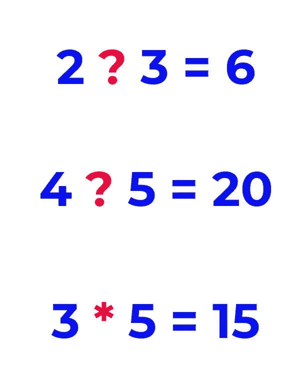

# 成为机器学习专家的 6 个步骤

> 原文：<https://medium.com/geekculture/6-steps-to-become-a-machine-learning-expert-5a1f155f7207?source=collection_archive---------0----------------------->

## 成为机器学习专家需要知道的一切。

机器学习在数据中寻找模式，以做出合适的决策。深度学习是机器学习的一个分支，使用多层神经网络。今天，计算机视觉、自然语言处理、无人驾驶汽车等问题都可以用深度学习来解决。

要能做深度学习项目，推荐你先学机器学习。大学没有单独的机器学习系。不过还好网上有很多免费的资源和培训视频。

无论你是学生、想转行的员工，还是想在你的业务中使用机器学习的人，**你都可以很容易地从开源学习机器学习**。

在这篇文章中，我将讨论以下主题:

*   什么是机器学习？
*   机器学习的编程语言
*   Python 和 R 的库
*   你应该知道的机器学习工具
*   你需要学习的学科
*   机器学习算法
*   机器学习的资源和 YouTube 频道

在开始之前，请不要忘记订阅[我的 youtube 频道](https://youtube.com/c/tirendazacademy)，在那里我创建了关于人工智能、数据科学、机器学习和深度学习的内容。

# 什么是机器学习？

如你所知，随着互联网和社交媒体的发展，产生的数据量也在增加。如果说 AI 是今天的电，数据就是今天的油。谷歌、脸书和亚马逊等公司之所以成为大公司，是因为它们对获得的数据进行了评估。要用油，就得加工对吧？为了从数据中提取有意义的信息，你需要处理它。

> 机器学习是人工智能的一个子领域，旨在使用数据自动建立模型。

你可能会问机器学习是怎么来的。我来简单解释一下。以前，规则被输入到机器中，并根据这些规则为输入产生输出。

Machine Learning vs Traditional Approach

在这种技术中，人们控制着固定的规则，这不是一种非常灵活的方法。后来，出现了机器能否像人类一样学习的问题。为了研究这一点，给机器输入和输出，结果证明机器可以学习规则。

让我简单地向你展示机器是如何学习的。例如，你想教机器乘法。你给程序很多数据，比如 2 和 3 等于 6，4 和 5 等于 20。这个程序从输入和输出中学习乘法。然后，当你让程序将任意两个数相乘时，程序会返回答案。

(image by author)

机器学习广泛应用于金融、教育、生物、医学等诸多领域。让我们来看看成为机器学习专家的 6 个步骤。

# 第一步。程序设计语言

机器学习的一个重要部分就是编程。你需要了解一门编程语言来预处理数据和建立模型。机器学习最常用的编程语言是 Python 和 r，Python 更受青睐，因为它是一种语法简单的通用编程语言。

使用 Python，你既可以做基于数据的项目，也可以在许多领域工作，比如 web 编程或游戏开发。Python 是机器学习和深度学习中使用最多的语言。另一方面，R 是一种强大的机器学习语言。r 也有很多机器学习的库。r 主要用于统计分析。

现在我们来看看你需要了解的关于机器学习的库。

 [## 10 大 Python 库和 5 本最佳数据科学书籍

### 在这篇文章中，我将谈论数据科学家应该知道的 10 个 Python 库。我还会推荐 5 本书…

levelup.gitconnected.com](https://levelup.gitconnected.com/top-10-python-libraries-and-5-best-books-for-data-science-fa0d0cf171a6) 

# 第二步。机器学习库

你可以从零开始建立一个机器学习模型。但是，没有必要重新发明轮子。您可以使用 scikit learn 等库来构建更快、更实用的模型。

在处理机器学习项目时，库使您的工作变得更容易。让我们深入研究机器学习最常用的库..首先我会解释 Python，然后是 R 库。

## NumPy

在机器学习中，你要做大量的矩阵和数组运算。多维数组操作需要知道的库是 NumPy。

## 熊猫

另一个重要的图书馆是熊猫。真实世界的数据集是肮脏的。为了清理这些脏数据集，需要进行数据预处理。要做到这一点，你可以用熊猫。

## Matplotlib 和 Seaborn

在建立模型之前探索数据是很重要的。数据可视化是探索数据最简单的方法。Matplotlib 和 seaborn 库主要用于数据可视化。

Matplotlib 是一个强大的库，你可以用这个库创建很棒的可视化效果。对于统计图，seaborn 库是王道..

## sci kit-学习

机器学习的主要目的是建立一个好的模型。您可以使用 scikit-learn 库来构建一个模型。你可以在 scikit-learn 库中找到许多监督和非监督学习算法。

## 张量流和 Keras

另一个制作机器学习项目的重要库是 TensorFlow。使用 TensorFlow，您可以构建端到端的机器学习项目。换句话说，使用 TensorFlow，您可以完成从数据预处理到部署模型的每个步骤。此外，还添加了 Keras API，以便于使用 TensorFlow 进行分析。Keras 是一个应用广泛的 API，尤其是深度学习。

可以为机器学习描述更多的库。这里我提到了你应该知道的最基本的库。

## 面向 R 的机器学习库

虽然 Python 库在机器学习中使用的非常频繁，但是 R 也有非常强大的包。我可以告诉你 R 编程需要知道的库， ***ggplot2*** 用于数据可视化， ***dplyr*** 和 ***date.frame*** 用于数据操作， ***caret*** 和 ***mlr*** 用于构建机器学习模型， ***shiny*** 用于制作交互式 web 应用。

现在让我们看看你可以在机器学习中使用的工具。

 [## 7 个了不起的计算机视觉项目创意

### 计算机视觉项目创意机器学习应用深度学习人工智能项目 Python AI…

www.youtube.com](https://www.youtube.com/shorts/iYSWwZeEC2c) 

# 第三步。机器学习需要知道的工具

有许多工具可以用于机器学习。我们来看看机器学习需要知道的工具。

## 蟒蛇

拥有超过 2000 万用户的 Anaconda 是一个非常棒的平台，它包含了许多库和工具。您可以同时使用许多库而不会出错。我强烈推荐你用 Anaconda 做机器学习项目。此外，您可以使用许多不同的项目在 Anaconda 中创建一个虚拟环境。

## Jupyter 笔记本

编辑器或 IDE 允许您轻松编写代码。jupyter notebook 可能是分析数据时编写代码最常用的工具。Jupyter notebook 是基于网络的，是可视化数据的好工具。Jupyter 笔记本也有可以写文章的单元格。

你可以在 PyCharm 和 VS Code 中使用它作为编辑器，但是我强烈推荐你使用 Jupyter Notebook，在那里你既可以分析也可以呈现。

## 科拉布

另一个可以用于机器学习的神奇工具是 Colab。Colab 是谷歌提供的免费云服务。Colab 附带了许多库，如 TensorFlow。Colab 的界面类似于 jupyter 笔记本。

## Git 和 Github

团队合作可以使用的一个重要工具是 git。Git 是一个版本控制系统。使用 Git，您可以在您的文件和代码上与您的队友协作。你可以在 GitHub 上免费存储你的项目。有了 GitHub，你也可以向全世界展示你的项目，分享你的代码。

## 其他工具

你可以使用 ***观念*** 工具来管理你的项目。概念是一个基于网络的工具，你可以很容易地保存你的笔记。

据说音乐是精神食粮。你可以使用 ***Spotify*** 工具专注于你的项目。你可以根据自己的心情选择 Spotify 上的任意播放列表。

# 第四步。机器学习的学科

你可以用库做机器学习项目。但要了解机器学习的步骤，你需要知道 ***数学*** 、 ***概率、统计*** 、线性代数 。看到这些学科不要害怕。学习机器学习，基本了解这些学科就够了。

了解你所从事的领域也很重要。比如做生物信息学领域的项目，还需要了解生物学、遗传学等学科。如果你不了解这个领域，你可以和这个领域的专家一起工作或者获得支持。

# 第五步。机器学习算法

数据质量对于机器学习项目的成功非常重要。另一个要点是使用适合数据的算法。有许多算法可以用于机器学习。我们可以将这些算法分为 ***监督学习*** 和 ***非监督学习*** 。

如果您的数据有标签，您可以使用监督算法，如回归和分类，如果您的数据没有标签，您可以使用非监督算法，如 k-means 和 PCA。如果数据集很大，可以使用卷积神经网络、递归神经网络或 LSTM 等算法。

 [## 8 大机器学习算法

### 机器学习算法是机器学习的一个巨大部分。在这篇文章中，我将谈论 8 个算法，数据…

medium.com](/geekculture/top-8-machine-learning-algorithms-df30277b2056) 

现在让我们来看看你可以用来进行机器学习的免费网站。

# 第六步。机器学习网站

有很多网站可以用来进行机器学习。Kaggle 在这些网站中排名第一。

## 卡格尔

Kaggle 是全球最大的数据科学和机器学习平台之一。这个平台的注册用户超过 100 万。一些世界顶尖的数据科学家积极使用这个网站。

在这个平台上，你可以找到很多数据集和笔记本来启发你。你也可以使用像 Google Colab 这样的笔记本，Kaggle 在那里提供免费的 GPU 或 TPU 服务。熊猫、NumPy、TensorFlow 等库都安装在这个笔记本里。

参加 Kaggle 可以获得分数。一些公司可以给这个网站上高分的人提供工作。

您可以通过在该平台上增加分数来将您的成就添加到您的作品集中。在 Kaggle 上，你可以找到许多培训，如数据科学、机器学习和深度学习，如果你完成了这些培训，你甚至可以获得证书。

## 中等

我推荐的另一个网站是中型网站。你可以在这个网站上找到很多关于机器学习和数据科学的博文。你可以阅读这些博客文章来了解最新动态。

最好的学习技巧是讲述，对吗？你也可以在 Medium 上免费创建一个账户，分享你在这个平台上学到的东西。你甚至可以从这个平台赚到钱。你也可以通过写博客来扩大人脉，获得更多的认可。这样可以丰富自己的投资组合，更容易找到工作。

## 机器学习掌握

我推荐的另一个很棒的网站是[机器学习大师](https://machinelearningmastery.com/start-here/)网站。这个网站有一些关于机器学习和深度学习的伟大文章，包括理论和实践。

## YouTube 频道

如今，视频讲座非常受欢迎。你可以在 Coursera 或者 Udemy 上找到很多免费的机器学习课程。

另一个可以找到视频教程的平台是 youtube。，我们都经常使用。大多数人使用 YouTube 进行娱乐，但许多频道提供教育内容。让我们来看看 youtube 频道。

第一个，我可以推荐的渠道是 [FreeCodeCamp](https://www.youtube.com/c/Freecodecamp) 。在这个频道中，你可以在 1 个视频中找到许多领域不同导师提供的教程，另一个频道是亚马逊创办的[机器学习大学](https://www.youtube.com/channel/UC12LqyqTQYbXatYS9AA7Nuw)。可以在这个频道看机器学习教程。Edureka 和 [Simplilearn](https://www.youtube.com/c/SimplilearnOfficial) 是很棒的频道。他们还提供认证培训。 [Tech with Team](https://www.youtube.com/c/TechWithTim) 是一个很棒的 youtube 频道。他制作编程和机器学习内容。其他与机器学习相关的渠道有 [Codebasics](https://www.youtube.com/c/codebasics) 和 [Krisnaik](https://www.youtube.com/user/krishnaik06) 。在这些渠道中，你可以找到基本的图书馆教程和机器学习项目，以及对数据科学领域工作人员的采访

如你所知，机器学习不仅仅是通过观察来学习的。对于机器学习，你必须通过用真实世界的数据做项目来弄脏你的手。

就是这样。在这篇文章中，我提到了一个路线图，并谈到了成为机器学习专家的 6 个步骤。我希望你喜欢它。

 [## 深度学习和机器学习的 7 个区别

### 当今最热门的三个领域是人工智能、网络安全和云计算。特别是…

levelup.gitconnected.com](https://levelup.gitconnected.com/7-differences-between-deep-learning-and-machine-learning-b5f2ff0ae00a) 

别忘了在 YouTube 上关注我们🎞， [GitHub](https://github.com/tirendazacademy) 🌱， [*碎碎念*](https://twitter.com/TirendazAcademy) 😎*、*、[卡格尔](https://www.kaggle.com/tirendazacademy)📚，[*LinkedIn*](https://www.linkedin.com/in/tirendaz-academy)*👍*

*下一篇博文再见…*