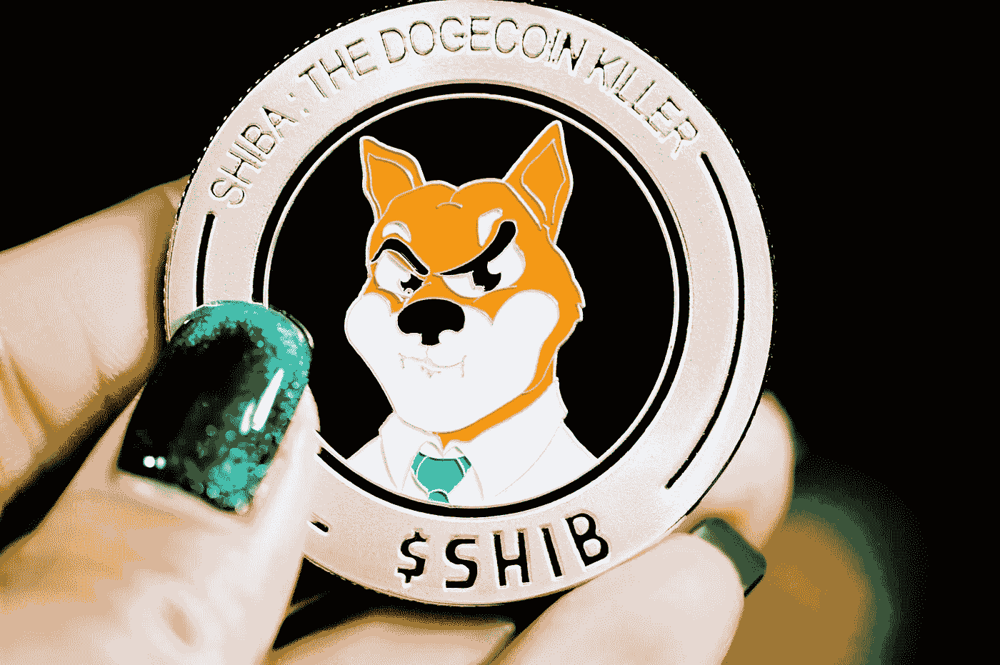

# 6 强有力的论据证明柴犬是一个严肃的项目

> 原文：<https://medium.com/geekculture/6-strong-arguments-that-shiba-inu-is-a-serious-project-3d8a5b1b8181?source=collection_archive---------3----------------------->

## 不仅仅是一个迷因硬币

Photo by [Executium](https://unsplash.com/@executium?utm_source=unsplash&utm_medium=referral&utm_content=creditCopyText) on [Unsplash](https://unsplash.com/s/photos/cryptocurrency?utm_source=unsplash&utm_medium=referral&utm_content=creditCopyText)

成立于 2020 年 8 月的[柴犬](https://shibatoken.com/)在 2021 年底于[熊猫](https://www.bitpanda.com/)上市时引起了我的注意。在投资加密方面，我现在只使用 Bitpanda，所以当我看到 SHIB 上市时，我很兴奋。已经有足够多的炒作让我感兴趣。我知道 Bitpanda 只列出他们认为值得上市的币。

从那以后，我做了研究，尽可能多地寻找这枚硬币，特别是因为我自己投资了大约 200 美元，正如你可以在我以前的文章中读到的那样:

 [## 我的第一个一百万柴犬币

### 我买它们的原因是

medium.com](/geekculture/my-first-1-million-shiba-inu-coins-cff070304297)  [## 我全押了柴犬

### 把我所有的硬币换成 SHIB

marchisflorin82.medium.com](https://marchisflorin82.medium.com/i-went-all-in-with-shiba-inu-c71f2d3fd189) 

我发现柴犬不仅仅是一个备忘录硬币，这使得它比 Doge 更好。许多事情证明柴犬是一个严肃的项目，或者至少它正在发展成为最好的加密货币之一。它是独一无二的。

让我向你介绍 SHIB 的优点:

# 1.围绕 SHIB 建立的巨大社区

你知道柴犬 2021 年 11 月保有量已经突破 100 万了吗？很神奇，不是吗？这发生在仅仅一年半的时间内。

它在 Twitter 上也有 200 多万粉丝。有许多拥有成千上万成员的脸书团体在谈论柴犬，柴犬是 10 月份推特上讨论最多的加密货币。

很高兴知道你投资的硬币有这么大的社区。

# 2.现有的 ShibaSwap 交换

当它出现在我使用的应用程序中时，我已经意识到围绕这枚硬币的炒作。一些人仍然称它为迷因币，就像它类似于[道奇](https://en.wikipedia.org/wiki/Dogecoin)。事实是，这是一个迷因硬币，但还不止于此。它有一个名为 ShibaSwap 的交易网站，在那里你可以购买 SHIB，还可以做许多其他事情。

ShibaSwap 的主题和与 token 相关的一切都代表了柴犬犬种。

在这个网站上，除了 SHIB 之外，你还有两个信物，分别是树叶和骨头。您还可以获得名为 Shiboshis 的 NFT、获得回报的 stake (burry 或 woof)令牌、交换令牌以及其他有用的选项。一个很酷的期权允许你去挖掘，这意味着向一个资金池提供流动性，并根据你提供的流动性获得回报。

柴犬目前唯一真正的障碍是其巨大的流通供应量，超过 5 万亿。

可能需要烧掉大量硬币才能达到可以与道奇和其他目前排名前 20 的硬币匹敌的价格。

# 3.即将推出的 Shibarium 区块链

柴犬已经有了一个生态系统，但名为柴犬的第二层解决方案的承诺将是一个很好的理由，使令牌更可靠，并获得其价格的上涨。

现在，SHIB 居住在以太坊网络上，但是由柴犬的创造者规划的生态系统将有更多的令牌和它的区块链，称为柴犬。

期待这个更新，我们只能期待更好的。

# 4.达到所有加密货币的前 10 名

谁能想到柴犬这样的迷因币会这么快进入所有加密货币按市值排名的前 10？想想吧！

自 2013 年以来，Dogecoin 一直在努力成为今天的样子。

柴犬从 2020 年才来到这里，并且已经进入了前 10 名。这对柴犬和它的粉丝来说是一个重大的成就。

# 5.继续在主要交易所上市

虽然罗宾汉交易所的上市仍有待等待，因为罗宾汉首席运营官克里斯汀布朗没有提到任何可能很快上市的事情，但其他交易所让 SHIB 的投资者感到高兴。她只是钦佩社区的雄心，但没有说任何关于潜在的上市。

北海巨妖也在等待名单上，但让 SHIB 粉丝失望了，因为他没有遵守承诺，即当 Twitter 上的帖子获得 2000 个赞时，他会将硬币列出来。获得了超过 77000 个赞，但他们仍然没有列出 SHIB。

就在过去的几个月里，我目睹了以下交易所将 SHIB 列入他们的名单:[、](https://www.bitpanda.com/)[、](https://www.binance.com/)、[、](https://www.coinbase.com/)、 [CoinDCX、](https://coindcx.com/)、 [Gemini](https://www.gemini.com/) 以及许多其他交易所。此外， [AMC 剧院网络](https://twitter.com/amctheatres)将在几个月后接受这种硬币的支付，三星的加密钱包 [ZenGo](https://zengo.com/welcoming-shib-to-zengo) 刚刚在其硬币列表中欢迎了柴犬。

这些都是好消息，我们仍在等待更多的消息！

# 6.现有硬币创造者和白皮书

Dogecoin 也有一个创造者(实际上是两个)，但这个硬币只是为了好玩而制造的，通过从区块链复制现有代码并编辑它来制造新硬币。

Dogecoin 的联合创始人之一似乎不太相信他的硬币，因为他在 2015 年用他所有的 Doge 和他拥有的其他加密货币买了一辆本田思域。他没想到硬币会涨这么多。

另一方面，柴犬的创造者是一个不知名的人，他自称为 Shytoshi Kusama，定期在社交媒体(包括媒体)上发布关于柴犬生态系统进一步发展的公告。

柴犬的市值和前 10 名的位置已经超过了 Doge。它现在退却了，但我相信它在未来会走得更远。许多在 SHIB 投资的人着眼于长远。

我们还是乐观一点，等硬币长出来吧！这需要耐心，但许多投资者在下跌时成为恐慌性抛售的受害者。

*如果你喜欢这篇文章，只要你订阅了媒体***，你就可以无限制地访问我的所有文章和所有媒体的文章。每月只需 5 美元，但你得到的价值要大得多。**

*[**现在就订阅！**](https://marchisflorin82.medium.com/membership)*

***免责声明:** *本人不是理财顾问。我写的所有关于加密货币的内容都是为了提供信息，不应该作为金融建议。加密投资是有风险的，你不应该投资超过你能承受的损失。**