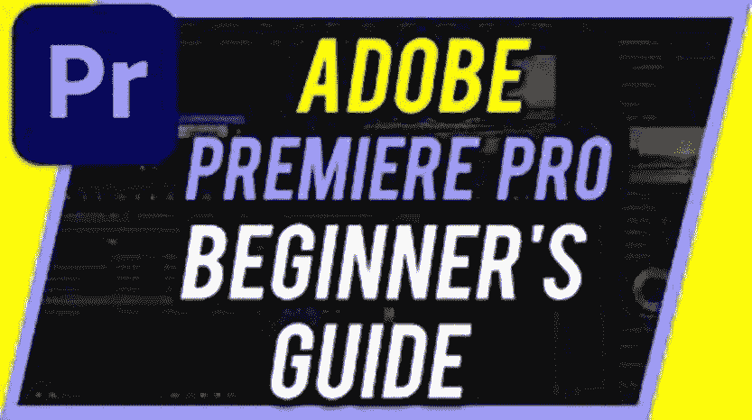

# adobe premiere pro 初学者指南的 6 个技巧

> 原文：<https://medium.com/geekculture/6-tips-for-adobe-premiere-pro-for-beginners-guide-f67afdb25fab?source=collection_archive---------15----------------------->

由于 Adobe Premiere Pro 出色的编辑功能，越来越多的人正在寻求如何使用该程序的提示。Premiere Pro 是最好的视频编辑器之一，经常被专业电影制作人和摄像师使用。然而，Premiere Pro 也可以用于业余爱好者和那些很少或没有视频编辑经验的人。

What is the Best Way to Learn Adobe Premiere Pro?