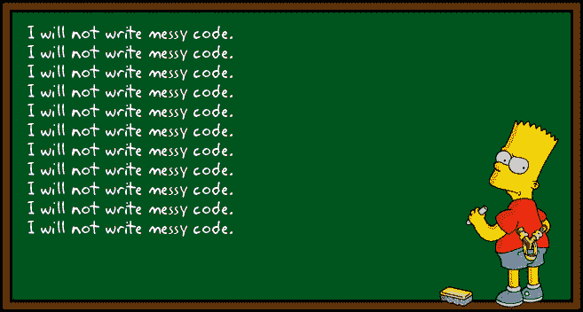
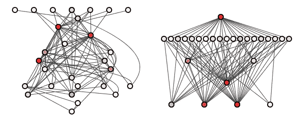

# 更清晰编码的 6 个技巧

> 原文：<https://medium.com/geekculture/6-tips-for-cleaner-coding-8ba490039131?source=collection_archive---------26----------------------->

成为一名优秀的软件开发人员不仅仅是学习正确的语言或者知道如何使用每一个框架。这不仅仅是了解您可以使用的每一个包或库的问题。成为一个好的软件不是写花哨的代码，而是写好的代码。好的代码是由跟随你的人识别的，他们阅读你写的东西。容易理解吗？意思清楚吗？容易改变吗？这些都是干净代码的标志，能够编写干净的代码是开发人员能够拥有的最重要的技能。

在软件工程的世界里，没有人想继续某个项目，这是很常见的事情，不是因为他们看不到这个项目的价值，也不是因为他们认为自己不具备必要的技能，而是因为代码很乱，读起来很可怕。开发人员可能编写混乱的代码有几个原因。这可能是因为他们在即将到来的截止日期的压力下，或者因为他们是自学的，不知道如何干净地编码。无论哪种方式，它都会导致一个没有人愿意参与的项目，因为他们阅读代码的时间是你编写代码的时间的十倍。

# 什么使代码变得干净

干净代码有几个共同的特征。熟悉这些将有助于我们掌握编写优秀代码的艺术。

1.  可读性:干净的代码应该易于阅读。如果有人稍后阅读你的代码，他们应该感觉像在阅读散文。
2.  优雅:与第一个特征相似，你的代码应该易读。
3.  简单:你的代码应该易于阅读和理解。它应该遵循单一责任原则，也就是说，代码中的每个方法/变量应该服务于一个单一的目的。稍后会详细介绍。
4.  可更改性:如果有人需要更新代码以满足新的需求，那么以后对代码进行更改应该很容易。
5.  最后，干净的代码应该通过所有的测试。

# 如何编写更干净的代码

现在我们将进入如何保持代码整洁的细节。在标题中，我承诺了写更好代码的六个技巧，它们是:

## 使用有意义的名称

你将在你的代码中写很多名字。你会有变量、函数、类、方法、包等等，每一个都需要一个特定的名字。编写干净代码的第一步是让这些名字清晰而有意义。你使用的任何名字都有三个目的。它应该清楚地传达它是做什么的，它为什么存在，以及它是如何被使用的。对于简单的变量名，您可能需要包含一个注释来进一步解释变量的用途。请记住，无论此刻对你来说有多明显，将来阅读你的代码的任何人都不会知道你在试图完成什么，他们需要能够根据你的代码本身很容易地理解它。因此，良好的命名和注释模式是必要的。

## 单一责任原则

我告诉过你我们会再讨论这个的。当您编写方法、类和函数时，当您了解到需要新功能时，添加新功能会很有诱惑力。起初，你的功能只做一件事，但后来你意识到你想增加一个新的特性，然后是另一个，然后是另一个…在你知道之前，你已经有了一个同时完成七件不同事情的功能。尽管这种冲动很强烈，但你必须抵制它。就像拥有简单明了的名字很重要一样，拥有简单明了的功能也很重要。你写的每一个方法应该做一件事，而且只做一件事。这有助于使您的代码更具可读性，更容易更改，因为当代码被清楚地标记并且功能简单时，更容易找到关键的代码段。

## 避免写额外的评论

我知道我刚刚谈到了注释的用处，以及它们如何使你的代码更具可读性，但是避免写太多注释是很重要的。它们使得在你的代码中移动东西变得更加困难，因为你必须记住移动所有相应的注释，并且它们实际上使得第一次尝试跟随你的代码的人更加困惑。随着你越来越清楚明确地命名你的变量和方法，你需要的注释会越来越少，直到只剩下真正必要的。

## 编写可读的代码

我知道所有这些技巧都是为了让你的代码更具可读性，但是特别是这一条，它非常容易实现，可以获得巨大的回报。请记住，总有一天会有人阅读这段代码，您希望它像散文一样流畅。为此，记得适当缩进和使用换行符。你不希望任何人必须滚动到一边才能看到你的代码行的结尾。仅仅因为您正在使用的编码环境没有强制执行单词换行，并不意味着您在编写时不应该记住它。

## 注意你的依赖

如果可能的话，你的依赖应该总是在一个单一的方向上。假设您有一个名为 car 的类，该类依赖于另一个名为 wheel 的类。只要轮子不依赖于汽车，那就是单向依赖。汽车可以使用轮子，这很好，但轮子不在乎谁使用它——它可能是汽车、飞机，甚至是船。没关系。当你使轮子也依赖于汽车时，麻烦就来了。即使这些类应该是相互独立的，它们也只能真正地共存。更新双向依赖的系统变得很困难，所以要确保你的系统只能单向运行。

## 保持你的代码有条理

清理代码从您的文件夹和项目目录开始。像使用变量名一样明确地使用文件夹名，并确保每个文件都位于您期望的位置。很难在第一天就创建一个完美的组织结构，但是随着你继续从事你的项目，你需要开始小心你的文件夹和目录的组织结构。拥有一个组织良好和维护良好的项目目录是获得可读和干净代码的第一步。

# 结论

编写干净的代码是一个不断学习的过程。没有一个开发人员第一次就完全正确。不幸的是，许多人从未这样做过。重要的是，你要继续改进，并在你工作的每个后续项目中编写更多可读的代码。要获得更多的帮助，我建议查看您使用的任何语言和框架的现有风格指南，以获得更详细和深入的建议。一如既往，感谢您的阅读，下周再来看另一篇文章！