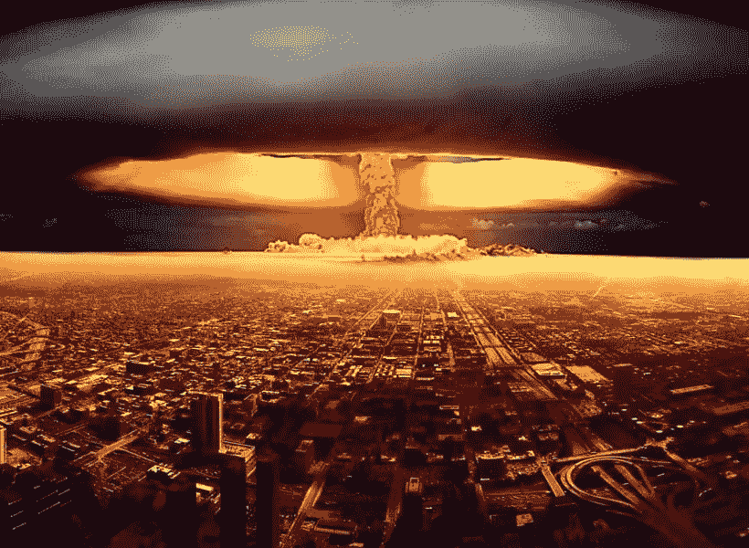

# 6 件你永远想不到的核灾难必备物品

> 原文：<https://medium.com/geekculture/6-wierd-things-youd-never-think-to-pack-for-a-nuclear-apocalypse-a10a9a4c2ecb?source=collection_archive---------6----------------------->

## 其中一些可能比你意识到的更有用…

Credit: [Modern Diplomacy](https://moderndiplomacy.eu/2018/03/18/why-at-least-two-nuclear-super-powers-are-essential/)

当你为一个潜在的灾难性情况打包行李时，你首先想到的是什么？

***食物、水、药物和力量，对吗？***

毕竟这些都是每个人为了生存所需要的必需品。