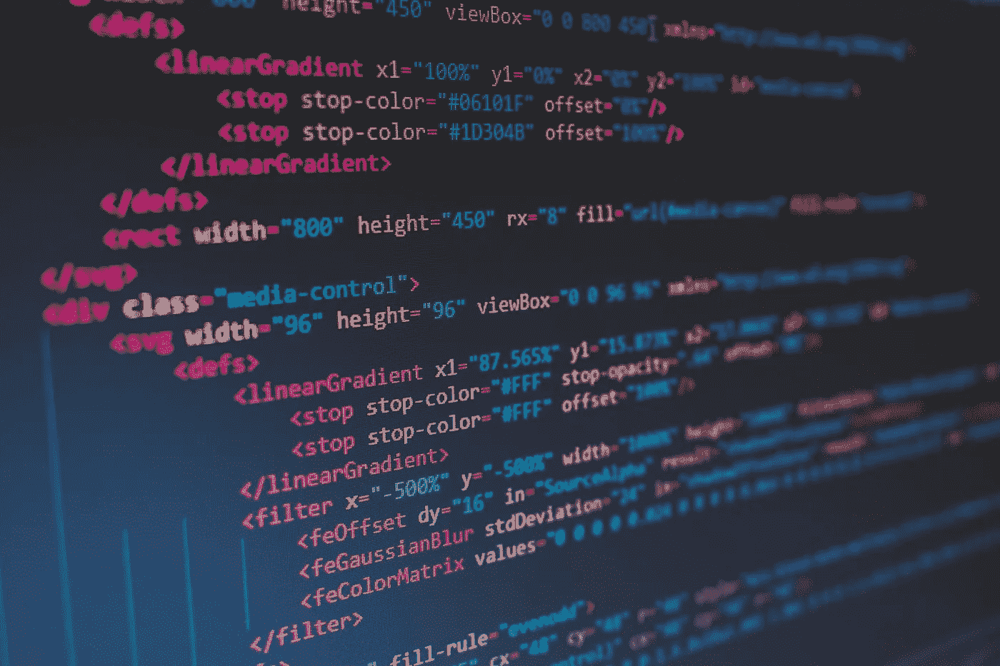

# 65 件我希望在开始编码时就知道的事情🌱🚀

> 原文：<https://medium.com/geekculture/65-things-i-wish-i-knew-when-i-started-to-code-d79e80c3982c?source=collection_archive---------1----------------------->

Photo by [Florian Olivo](https://unsplash.com/@florianolv?utm_source=unsplash&utm_medium=referral&utm_content=creditCopyText) on [Unsplash](https://unsplash.com/s/photos/code?utm_source=unsplash&utm_medium=referral&utm_content=creditCopyText)

没有一个成功的故事是相同的，我们在学习过程中都有起起落落，有些事情我们希望一开始就知道。

如果你是一个新的、有抱负的开发人员，这 65 件事将为你未来的漫长旅程做好准备。把它们作为你自己学习道路上的一条捷径。

## 1.编码是为了解决问题。