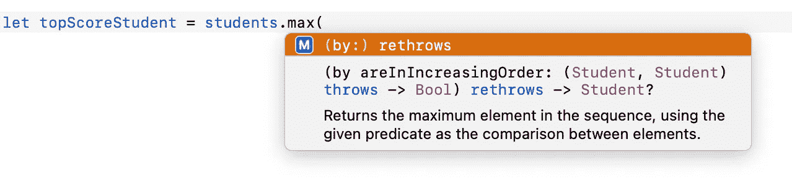

# 每个 Swift 开发人员都应该知道的 7 个阵列特性

> 原文：<https://medium.com/geekculture/7-array-features-every-swift-beginner-must-know-745a11b8f6f1?source=collection_archive---------12----------------------->

## 简化开发代码的最有用的数组方法

Photo by [Jeswin Thomas](https://unsplash.com/@jeswinthomas?utm_source=unsplash&utm_medium=referral&utm_content=creditCopyText) on [Unsplash](https://unsplash.com/?utm_source=unsplash&utm_medium=referral&utm_content=creditCopyText)

大家应该熟悉 Swift [集合](https://docs.swift.org/swift-book/LanguageGuide/CollectionTypes.html)包括*数组、Set* 和*字典*。这三种类型在 iOS 开发中以集合形式存储数据非常有用。

在本文中，我们将讨论可用于数组的有用方法。数组在有序列表中存储相同类型的数据，它的元素可以通过从零开始的索引来访问。它可以存储各种数据类型(Int、String、Double、Any、Optional 等)以及任何类型的用户定义的类或结构。

# 基本语法

在我们讨论每个方法之前，让我们稍微修改一下数组的基本语法。请参见下面的代码以及注释中的解释。

Basic syntax of Array

下面是显示带有对象的数组的代码。我们将为将要讨论的每个特性处理这个样本数据。不错！

Array of Objects

# 1.获取第一个和最后一个项目

如果没有这些`first()`和`last()`，通常我们会使用`index 0`和`N-1`来访问第一个和最后一个元素。其中`N`是数组中的总项数。

Simple first() and last() example

## 有条件

这是简单的权利。但是，如果我们想从数组中得到第一个“分数小于 50”的数组，该怎么办呢？是的，我们仍然使用`first()`方法，但是这次使用了包含特定条件的`where`闭包。我们也可以对`last()`方法应用相同的封闭条件。

Example of method first(where:) and last(where:)

参见上面的代码，`$0`是传递给内联闭包的第一个速记参数。在这种情况下，传递的参数是“学生”对象。在接下来的部分中，我们将继续使用带有`$0`和`$1`的内嵌闭包。

Swift [文档](https://docs.swift.org/swift-book/LanguageGuide/Closures.html)中很好地解释了速记参数。

> Swift 自动为内联闭包提供简化的参数名称，可以通过名称`$0`、`$1`、`$2`等引用闭包的参数值。

# 2.使用映射变换数组

在本节中，我们将使用`map()`方法。下面是从`students`映射的 3 个不同的数组(Int、String 和 User 的数组)。

Map example

# 3.紧凑地图

它类似于 map 方法，但是当我们想要获得带有非可选项目的结果时使用它。在下面的例子中，我们将得到一个学生位置的列表。查看`map()`和`compactMap()`之间的输出差异。

CompactMap to map and remove nil item

# 4.按条件排序

在这个例子中，学生数组最初按`score`排序，然后映射到一个数组`String`(排序后的学生姓名)。

Sort example

# 5.过滤

`filter()`方法用于根据闭包内的给定条件查找匹配元素。让我们设法得到一份分数在 50 分以上的学生名单。其次，我们会得到一份男同学的名单。

Filter example

# 6.获取最高和最低值

获得最高或最低值的常见方法是使用带有`first()`或`last()`的`sort()`方法。然而，Swift 提供了一个更简单的解决方案，使用`max()`和`min()`方法来实现类似的结果。

从上图中，我们知道排序顺序是递增的，这意味着我们的条件应该写成从小数字到大数字获取值。

Get highest and lowest score

# 7.移除具有特定条件的数组元素

Swift 为数组提供的移除方法很少。为了删除指定条件下的一个元素或多个元素，我们可以使用这两种方法。

1.  `removeAll(where:)`
2.  更长的解决方案，使用`firstIndex`查找出现的索引，然后调用`remove(at:`删除特定索引处的项目。

注意`removeAll()`将删除所有符合条件的项目，而不是删除一个项目。

Photo by [bruce mars](https://unsplash.com/@brucemars?utm_source=unsplash&utm_medium=referral&utm_content=creditCopyText) on [Unsplash](https://unsplash.com/?utm_source=unsplash&utm_medium=referral&utm_content=creditCopyText)

# 大家干得好！

你可以尝试在你的项目中实现它，希望这篇文章能帮助你提高你的开发技能。感谢您的阅读，请与您的朋友分享这份精彩。非常欢迎反馈。编码快乐！

"学习，这是我们提高编码技能的方式."

# 参考

[https://docs . swift . org/swift-book/language guide/collection types . html](https://docs.swift.org/swift-book/LanguageGuide/CollectionTypes.html)

[https://docs . swift . org/swift-book/language guide/closures . html](https://docs.swift.org/swift-book/LanguageGuide/Closures.html)