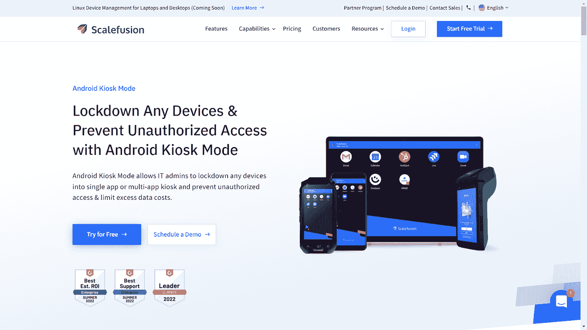
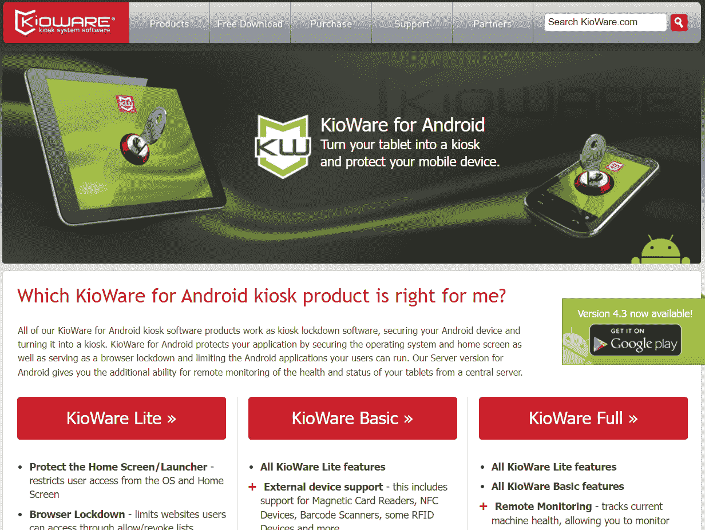
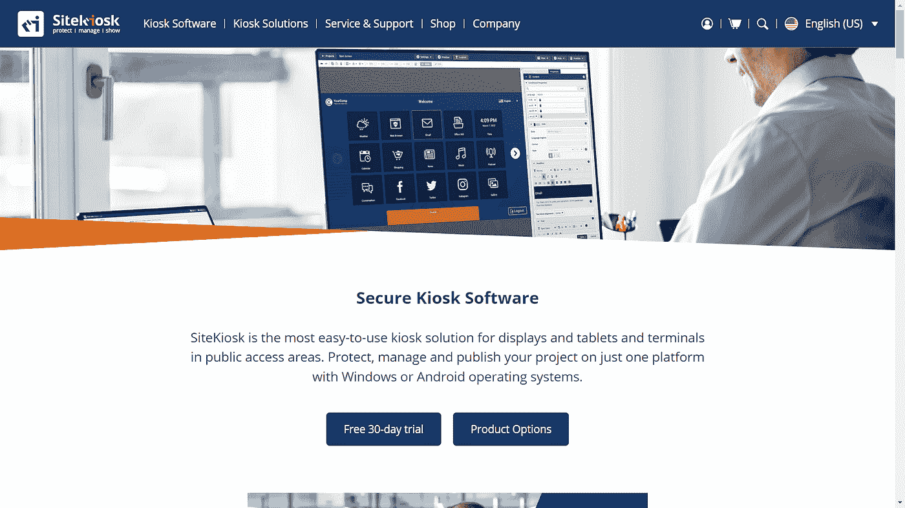
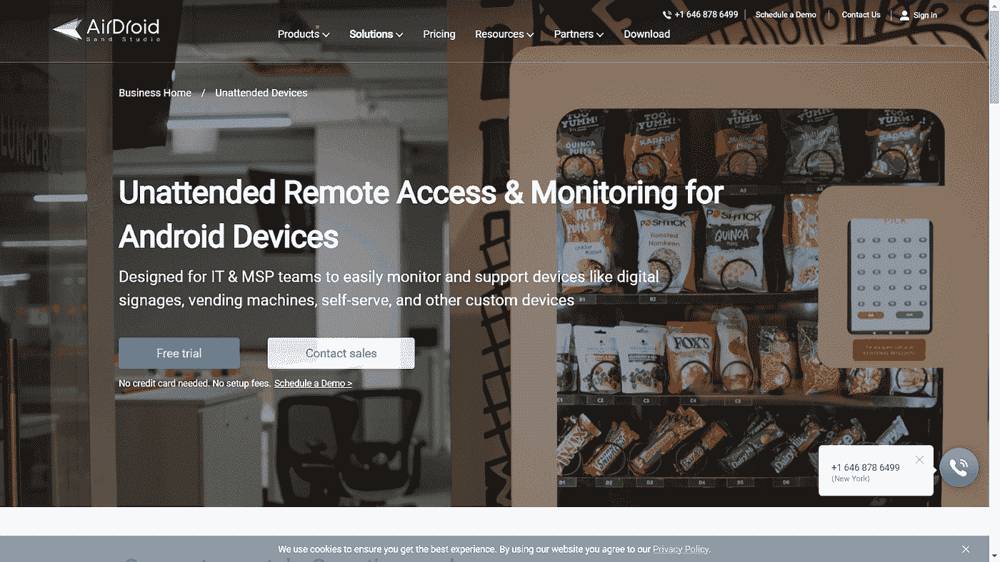
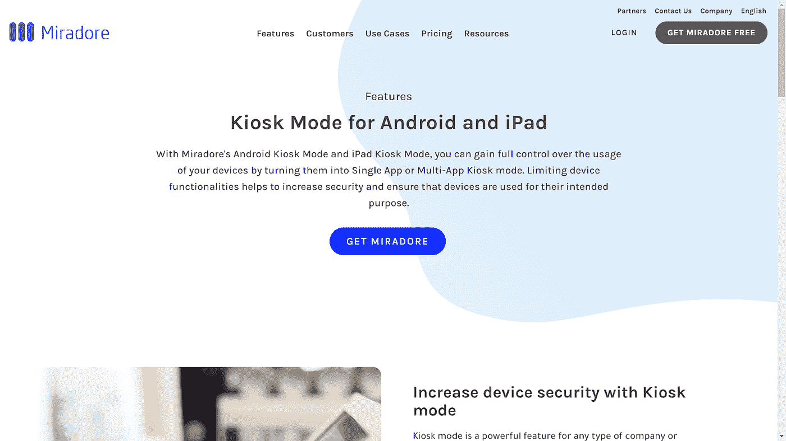
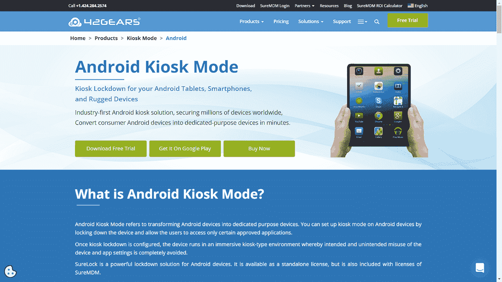

# 7 款最适合小型企业的 Android Kiosk 软件

> 原文：<https://medium.com/geekculture/7-best-android-kiosk-software-for-small-businesses-54dbd4d307da?source=collection_archive---------12----------------------->

Android 是全球最受欢迎的操作系统，在 190 多个国家拥有超过 25 亿活跃用户。Android 是一种多功能操作系统，适用于智能手机、平板电脑、加固设备和 POS 系统等设备，这些设备在许多行业用例中都有应用。

Android 设备的易用性和定制功能使其成为工业和商业用途中使用最多的设备。Android kiosk 软件用于将设备限制为单应用模式或多应用模式，以便它们可以用于专用目的。Android kiosk 模式支持设备用于特定的应用和用例。

我们先来看看什么是 Android kiosk 软件，以及它如何适用于不同的业务。

# **什么是 Android kiosk 软件及其行业应用？**

Android kiosk 软件将 Android 设备锁定于单应用或多应用的 kiosk，限制对单个应用或一组预先批准的 Android kiosk 应用的访问。它将设备转换为单一用途的专用设备，并提供有限的应用程序供专用业务使用。

换句话说，Android kiosk 模式允许 IT 管理员将 Android 设备锁定为 kiosk 模式，以避免未经授权的访问。通过限制对预先批准的应用程序和网站的访问，它还有助于降低额外的数据成本。Android kiosk 软件用于定制设备以进行品牌推广，并根据不同的使用情况以单屏幕、单应用模式或多应用模式运行这些设备。

## 面向小型企业的 Android kiosk 软件的一些使用案例如下-

**答:**限制员工设备上的应用和网站访问，以保护他们的活动

**b.** 访问精选应用和网站，提高工作效率

**c.** 用作 POS 系统的设备

**d.** 用作机场值机亭和商店结账亭的设备

**e.** 用于收集客户反馈和调查的设备

**f.** 用作广告和信息亭数字标志的设备

Android kiosk 软件在企业中的各种使用案例可以是通常由员工使用的组织内部案例，也可以是为客户使用 Android kiosk 的组织外部案例。要在 Android 设备上部署和管理 kiosk 模式，您需要 Android kiosk 软件，即移动设备管理或 MDM 软件。

以下是 7 个最好的专门从事企业 MDM 的 Android kiosk 服务提供商-

# **1。缩放融合**

[Scalefusion](https://scalefusion.com/android-kiosk-mode) 将 Android 设备锁定为 Android kiosk 模式，仅允许访问白名单中的应用和网站。Android kiosk 应用程序可以锁定为单应用程序或多应用程序模式，用于特定的业务目的。设备主屏幕可以定制壁纸、字体大小和公司品牌的应用程序图标。

Scalefusion MDM 允许您远程管理和保护在 kiosk 模式下运行的设备。可以使用整个设备屏幕来运行专用的单个应用程序，也可以使用多个预先批准的应用程序和网站，并在 kiosk 设备上定制品牌。

Scalefusion kiosk lockdown 通过远程广播和控制提供 VoIP 呼叫的附加功能，有助于远程对 kiosk 设备进行故障排除，并降低设备停机成本。

Scalefusion 提供竞争性订阅计划，起价为每台设备每月 2 美元。它以其可靠和免费的客户支持脱颖而出，为其客户提供不间断的信息亭服务。

# 2.基奥瓦尔

KioWare 是一款 Android kiosk 软件，通过将你的 Android 设备变成 kiosk 来锁定它们。它通过限制用户访问操作系统和主屏幕来保护应用程序，还将 Android kiosk 浏览器锁定在允许的列表中。它限制用户访问预先批准的应用程序。KioWare for Android 支持 kiosk 模式下的浏览器重置，在这种模式下，它会清除之前用户的浏览器会话，包括 cookies 和缓存。

KioWare 提供外部设备支持、摄像头支持、NFC 和第三方客户端插件支持，以及远程监控、内容更新和远程设备重置等功能，但需要额外付费。

KioWare Android kiosk 许可证起价为 162 美元/年，如果您在一年后继续使用，则每台设备每年的额外支持费用为 27 美元。

# **3。网站亭**

SitekKosk 是一款易于使用的 Android kiosk 软件，可以将设备转换为公共访问区域的显示器。您可以使用 SiteKiosk 的集中式仪表板在 Android 操作系统上发布、管理和保护您的项目。

您可以通过云方便地在 kiosk 模式下远程控制和配置远程终端、平板电脑或 PC。它允许您使用下拉菜单、语言选择器和注销按钮来设计您的用户界面。通过 Android 浏览器锁定，您可以控制浏览器访问权限，仅允许预先批准的用户访问。

SiteKiosk 云订阅计划的起价为 239 美元，包含 9 台设备。费用随着售货亭数量的增加而增加。

# **4。Android Kiosk**

Android Kiosk 提供了两个独立的版本，一个用于锁定浏览器，另一个用于锁定单个或多个应用程序的启动器。kiosk 浏览器版允许您将设备锁定到一个 URL。您可以通过使用其定制功能并创建 kiosk 浏览器的定制版本来选择品牌。

Kiosk Launcher edition 允许用户只访问授权的应用程序，而限制对其他应用程序的访问。在单应用模式下，当设备打开或恢复时，应用会自动启动。它有一个内置的网络浏览器，你也可以安排自动应用程序更新。这些设备具有密码保护设置和 Wi-Fi 设置，以防止设备数据丢失和被盗。您可以选择在信息亭上展示的主题。

它提供了为期 5 天的免费试用，您可以使用它来探索可扩展到各种规模的组织的功能。

# **5。AirDroid**

AirDroid 是一个带有 Android kiosk 软件的远程设备管理解决方案，可支持无人值守的设备，并在您将设备用于专用业务目的时远程控制它们。它提供无人值守的远程访问，以连接数字标牌、信息亭、POS 终端、平板电脑和电话，从而避免设备停机，并提供即时支持。

AirDroid 包括剪贴板、键盘和屏幕录制等工具，用于实现强大的远程控制。您可以更新应用程序和数字内容，批量删除多个设备上的过期文件，并方便地整理设备。

AirDroid 的订阅计划定价为每台设备/年 33 美元。

# **6。米拉多**

Miradore 支持所有 Android 设备上的 Android kiosk 模式。它允许您锁定设备和应用各种配置文件，并定义用户界面功能，如主页按钮，通知空间，图标大小等。此外，它允许您设置设备限制，如禁用工厂重置或屏幕超时。

Android kiosk 对零售、餐馆、教育机构或运输等任何类型的小型企业都很有用，这些企业希望控制和管理多个用户使用的设备。

Miradore 的定价计划可根据设备数量进行调整，起价为每台设备每月 2.75 美元。

# 7.SureLock

SureLock 提供 Android kiosk 软件来锁定 Android 设备，并将平板电脑、智能手机和电视转变为专用的 kiosk。它限制只能访问管理员批准的应用程序，并取代了默认的主屏幕或启动器。您可以在设备上设置 Android kiosk 模式，并允许用户仅访问某些允许的应用程序。

SureLock 允许管理员在所有设备上安装应用程序，同时将它们设置为 Android kiosk 模式。设备可以锁定到单个应用程序或一组多个应用程序。面向 Android 的 Kiosk lockdown 软件有助于降低数据丢失和被盗的可能性，因为它阻止用户访问未经授权的文件。

您可以购买 SureLock 作为独立许可证，也可以在 SureMDM 许可证中选择它。其 Android 订阅计划的起价为每台设备每月 2.99 美元。

**Android kiosk 软件对小型企业来说是最简单的**

Android 是使用最多的操作系统，Android kiosk 软件被认为是 Android kiosk 设备中最简单和最可靠的，具有简单的用户界面。它用途广泛，适用于各种规模的行业，通常小型企业也买得起。

如果您想要锁定、管理和保护您的 Android 设备，并在 Kiosk 模式下高效地操作它们以用于专门的业务目的，Kiosk for Android 是满足各种业务需求的解决方案。Android 信息亭被小型企业广泛用作广告活动的数字标志、零售店的自助信息亭、酒店和餐馆的自助订购信息亭、机场的登记信息亭以及商店的结账信息亭。

根据您的需求，寻找您选择的软件的功能，为您决定的预算制定最佳套餐，并确保 kiosk 服务提供商提供最佳的售后客户支持。

# **最后一个字**

Android kiosk lockdown 软件简化了将 Android 设备转变为 kiosk 并对其进行远程管理的过程，即使设备无人值守也是如此。它节省了单调的 It 工作，因为它使 IT 管理员能够从一个集中的控制面板管理多个设备。设备设置和定制也可以在特定于企业的信息亭上进行配置。探索不同的软件，考虑可以满足您最具挑战性的需求的软件，并选择功能和成本最佳结合的软件。