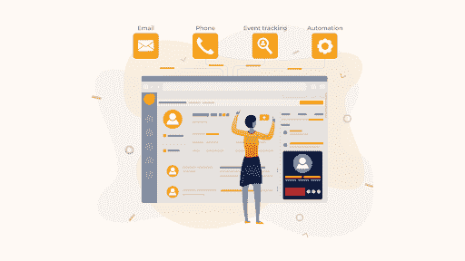

# 营销自动化的 7 个最佳 CRM 工具

> 原文：<https://medium.com/geekculture/7-best-crm-tools-for-marketing-automation-84d8a48984e?source=collection_archive---------12----------------------->

营销自动化是一种自动化重复营销任务的软件。

营销部门可能会自动执行繁琐的流程，如电子邮件营销、社交媒体发布，甚至广告活动，这不仅是为了提高效率，也是为了给消费者提供更加个性化的体验。

利用软件来自动化枯燥、重复的营销操作的过程被称为营销自动化。使用自动化来产生潜在客户，完成销售，维护客户关系。当一家公司在营销自动化之前需要新的销售线索时，他们会在报纸、电视和广播上做广告。

**营销自动化的作用是什么？**

营销自动化通过简化您的数字营销运营、减少人为错误和提高效率，帮助您取得显著成效。你可以专注于更具战略性的任务，比如规划和设计、目标设定、做研究、发展品牌一致性、衡量 KPI，而不是完成手动的、重复性的操作。

尽管大多数人听到“营销自动化”时会想到电子邮件营销自动化，但这个软件的功能远不止这些。例如，营销自动化可能会使以下工作变得更容易:

*   销售线索的产生、培育和分级
*   受众的细分和定位
*   交叉销售和追加销售行动
*   客户维系和生命周期营销是两种类型的客户维系活动。
*   分析和报告可以帮助你更好地了解什么在吸引你的受众，这可以帮助你改进你的营销和内容计划(即，调整主题标题或发送时间)
*   A/B 测试，评估哪些标题、优惠、内容和图片最有效

**这里有一些最好的营销自动化工具:**

1.  [**快手**](https://quickwork.co/)

Quickwork 是一款无代码、实时的企业 iPaaS，包含 1，000 多个预集成的应用，用于构建企业和消费者工作流、发布 API 以及管理对话。Quickwork 在 130 个国家拥有用户，正在成为企业的首选 iPaaS。企业使用 Quickwork 构建简单和复杂的工作流程，创建和发布安全的 API，并管理与客户、员工和合作伙伴的对话交互，以提供出色的用户体验。

2. [**汇图**](https://www.marketo.com/)

Marketo 是希望使用该工具所有功能的企业的理想选择，它超越了简单的营销自动化。它不是最昂贵的工具，但也不是最便宜的。如果您不打算使用系统的复杂功能，您可以使用一种较便宜的工具来完成相同的结果。然而，如果你想从基础开始，并在不久的将来转向更广泛的功能，从 Marketo 这样的产品开始可能是一个明智的想法，这样你就不必在之后迁移所有的数据和活动。

3.

**Eloqua 是 Oracle 营销自动化软件即服务(SaaS)平台，旨在帮助 B2B 营销人员和公司管理营销活动和销售线索创造。该程序跟踪打开的电子邮件、客户活动和潜在客户在营销商网站上的行为。**

**4. [**Bubble.io**](https://bubble.io/blog/build-no-code-salesforce-clone/)**

**Bubble.io 是一个结合了可视化编程语言和 web 开发框架的非技术平台。Bubble.io 的目标很简单:为刚刚开始构建 web 应用程序的所有企业和企业家提供一站式服务。**

**5. [**帕多**](https://www.pardot.com/)**

**对于 B2B 销售和营销企业，Pardot 是 SalesForce 的软件即服务(SaaS)营销自动化平台，包括电子邮件自动化、有针对性的电子邮件活动和销售线索管理。Pardot 自动执行基本的营销操作，如消费者行为跟踪。**

**6.**

****滴滴的电子邮件营销自动化是专为电子商务企业设计的，因此它可以与您现有的所有电子商务解决方案集成。基于消费者的行为，你可以开发定制的内容和自动化的活动。滴滴不仅仅是电子邮件自动化，它还能确保你所有的内容都是一致的，并共同鼓励客户购买。****

****7. [**轮毂点**](https://www.hubspot.com/products/marketing/marketing-automation)****

****HubSpot 是一家著名的联系关系管理(CRM)、营销、销售和客户支持软件公司，其使命很简单:帮助企业增加收入和促进增长。****

****营销自动化软件通过增强和存储消费者数据来帮助改善客户档案。客户数据可用于定制每一次遭遇，并在所有频道上提供无缝的个性化体验。****