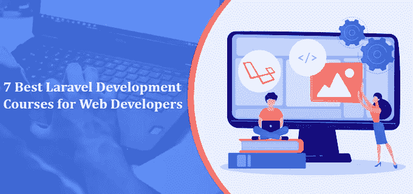
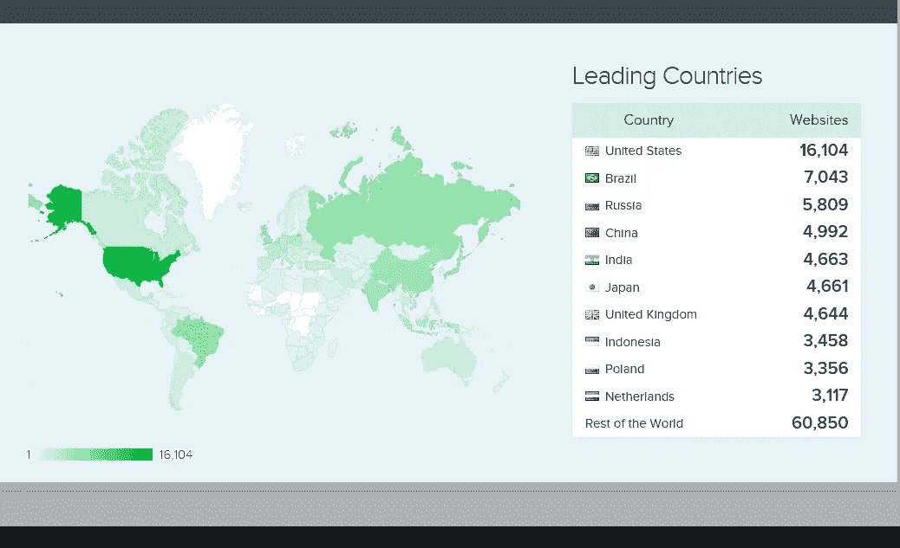
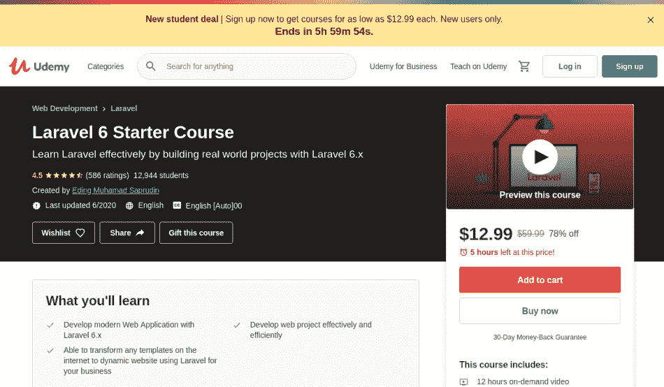
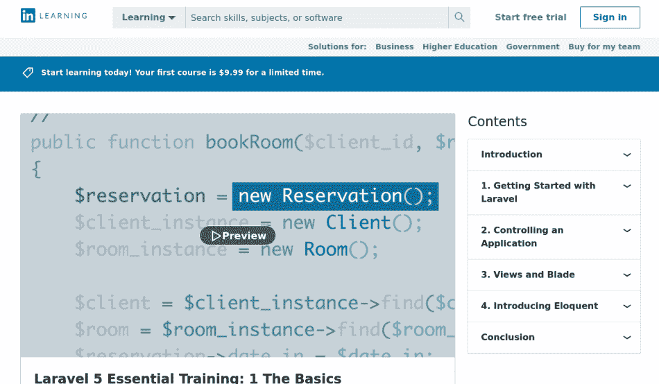
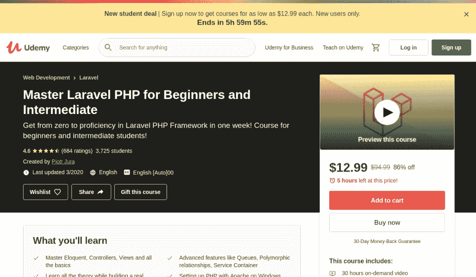
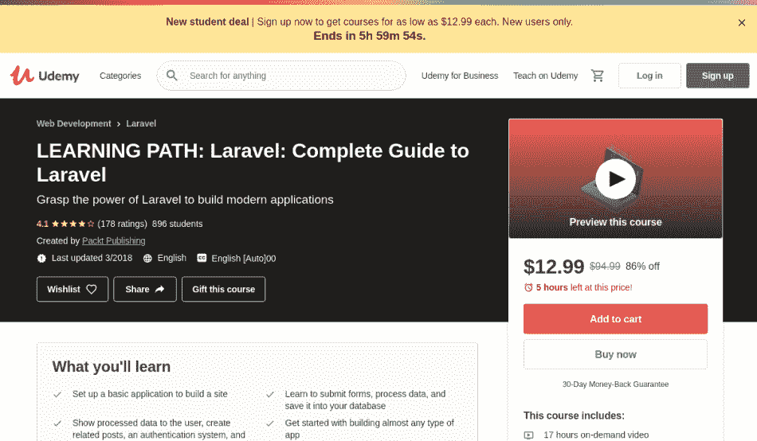

# 面向 web 开发人员的 7 门最佳 Laravel 开发课程

> 原文：<https://medium.com/geekculture/7-best-laravel-development-courses-for-web-developers-3b2fd7cc3164?source=collection_archive---------35----------------------->

***目录***

1.  [**Laravel 发展概述**](#89ff)
2.  [**web 开发人员前 7 名 Laravel 开发课程列表**](#9639)
3.  [**最后一句话**](#1fa0)

# Laravel 开发概述

如果你想在 web 开发中获得更好的效果，那么 Laravel 是你的不二之选。因为这个 PHP 框架提供了广泛的资源和工具来开发应用程序。事实上，Laravel development 还通过各种工具保证了有效的 web 开发。

如果你是一个想要简化 web 开发过程的 web 开发人员，那么 Laravel 框架就是让你的代码变得干净和可重用的合适技术。只有少数开发技术拥有的框架的丰富特性和灵活性使 Laravel 成为开发网站和在线应用程序的最伟大的平台之一。

[来源](https://yourstory.com/mystory/why-startups-should-choose-laravel-for-web-develop/amp)

# Laravel 使用市场份额

[来源](https://www.similartech.com/technologies/laravel)

# 面向 web 开发人员的 7 大 Laravel 开发课程列表

# 1. [Laravel 6 入门课程](https://click.linksynergy.com/deeplink?id=*IbDNxAPXZU&mid=39197&murl=https%3A%2F%2Fwww.udemy.com%2Fcourse%2Flaravel-blog-development%2F)

如果你想快速学习 Laravel，那么这门课程是你的最佳选择。Laravel 6 入门课程将教你如何使用 Laravel 开发平台。完成课程后，您会收到一份可以下载的结业证书。

每个初学者都有一个梦想，向该领域的佼佼者学习技能，Muhamad Saprudin 就是这些专家之一。他是一名全栈 web 开发人员，也是一名讲师。他在 make Udemy 平台上教授 Laravel 6 入门课程。成千上万有创造力的人已经注册了这门课，并从中受益匪浅。

您将从本课程中学到的技能:

*   学习 Laravel 的基本概念
*   知道如何使用 Laravel 通过模板转换建立一个动态网站
*   了解数据库迁移、雄辩和视图等基本特性
*   熟悉控制器、路由、身份验证和查询范围
*   通过实践项目构建有效的 web 应用程序
*   具有 HTML 和 PHP 基础知识的学生，或者对学习 Laravel 真正感兴趣的人，或者希望增加他们的技术知识的 Laravel 开发人员，都非常适合这个课程，也可以报名参加。
*   整个课程总共大约需要 13 个小时。因此，经过 13 个小时的培训，您已经准备好进入世界并构建您的 Laravel 项目。

# 2.[面向初学者的 PHP 与 Laravel——成为 Laravel 大师——Udemy](https://click.linksynergy.com/deeplink?id=JVFxdTr9V80&mid=39197&murl=https%3A%2F%2Fwww.udemy.com%2Fcourse%2Fphp-with-laravel-for-beginners-become-a-master-in-laravel%2F)

PHP Laravel 初学者——成为 Laravel 大师是 Udemy 为渴望从基础开始成为 Laravel 大师的人提供的课程。本课程包括教授学生从基础的路线、控制器和视图到高级的概念，如数据库、中间件和 CRUD 操作。

这是 Udemy 上最畅销的课程之一。但是如果你正在考虑报名参加这个课程，你必须有 PHP 面向对象编程的基础训练。这也是一个大型课程，因为视频培训内容长达 43 个小时。在这些视频中，Laravel 开发的所有方面都解释得非常清楚，非常好。

它们提供了关于您可以在 Laravel 项目中使用的一些额外特性的附加信息。该课程还可以引导您了解 Laravel 框架的最新版本。如果你能抽出足够的时间来获得这方面的专业知识，那么你必须继续学习这门课程。

# 3.【Lynda.com[Laravel 5 必备培训:1 基础在线课| LinkedIn Learning，原名](https://linkedin-learning.pxf.io/7YWPQ)

Laravel 通过一个叫做模型-视图-控制器(MVC)架构的概念来工作。本课程由 LinkedIn Learning 为您带来，涵盖了 Laravel 开发框架的所有基本概念。通过本课程的培训，你将能够创建一个真实的 PHP 应用程序。

来自苹果的 DevOps 工程师 Bernardo Pineda 通过 LinkedIn 学习平台上的在线课程为这款 Laravel 5 提供必要的基础培训。你必须知道，到目前为止，已经有超过 18000 名学生注册了这个在线课程并从中受益。

您将从本课程中学到的技能:

*   学习 Laravel 框架的基本概念
*   理解 MVC 架构和简单的数据库集成等基本特性
*   熟悉服务提供商的引导组件
*   发现 web 开发中的工具，如路由到控制器
*   主依赖注入、刀片模板、视图、表单创建和表单验证
*   构建自己的可伸缩的高质量 Php 应用程序。

如果你或其他任何人想要获得更深入的知识，或者想要清楚自己的基础知识，那么这门课程非常适合你。它专门针对使用 PHP 和 MVC 进行有效的 Laravel web 应用程序开发。最棒的是。课程只有 3 个小时。想象一下，在三个小时之内，你将准备好构建一个真正的 PHP 应用程序。

# 4.[初级和中级掌握 Laravel PHP](https://click.linksynergy.com/deeplink?id=*IbDNxAPXZU&mid=39197&murl=https%3A%2F%2Fwww.udemy.com%2Fcourse%2Flaravel-beginner-fundamentals%2F)

如果你想尽快学会 Laravel，那么你就需要学习这门课程。这是初学者或中级水平，并希望掌握这个 PHP 框架的完美选择。最后，当你完成课程后，你将获得一个在线证书。

Udemy 为 web 开发人员和讲师 Piotr Jura 提供了一个平台，用于教授初级和中级课程。值得注意的是，已经有 4000 多名学生注册了这些在线培训课程。此外，本课程的持续时间约为 31 小时。

您将从本课程中学到的技能:

*   通过 Laravel 学习 web 开发中的有效工具和现代技术
*   理解 PHP 的基本概念
*   发展关于交响乐框架的基本知识
*   使用 Laravel PHP 构建一个高效的 web 应用程序

# 5.[拉弗尔项目:了解拉弗尔 10 号楼项目](https://click.linksynergy.com/deeplink?id=JVFxdTr9V80&mid=39197&murl=https%3A%2F%2Fwww.udemy.com%2Fcourse%2Fprojects-in-laravel-learn-laravel-building-10-projects%2F)

这是为那些喜欢实际学习东西的人开设的一种课程。Laravel 中的项目:学习 Laravel 构建 10 个项目意味着你将通过参与 10 个不同的项目来学习 Laravel。

这听起来像是一门复杂的课程，但它非常简单。它从一个简单的项目开始，给你一个任务清单。写完之后，你将进入下一个项目，在那里你必须建立一个基本的 Laravel 网站。同样的，课程会在你完成上一个之后，逐渐带你进入另一个层次。

随着课程的进展，您将开始使用照片库、REST API，最后，通过使用最高级的项目(如 VueJS 联系人管理器和带管理区的背包网站)来完成课程。

但是如果你想注册这门 Laravel 课程，你必须具备 PHP、HTML 和 JavaScript 的基础知识。这门课程非常珍贵，因为它专注于教授 Laravel 框架和其他相关的重要概念，如前端开发和 API 集成。如果你对 PHP 的基础很好，你也可以选择这门课程，因为它让你对中级水平有更好的理解和训练。

# 6.[学习路径:Laravel:Laravel 完全指南](https://click.linksynergy.com/deeplink?id=*IbDNxAPXZU&mid=39197&murl=https%3A%2F%2Fwww.udemy.com%2Fcourse%2Flearning-path-laravel-complete-guide-to-laravel%2F)

现在，借助 Udemy 上的这门课程，从头开始学习 Laravel。它可以教你一切，从基本和必要的概念，以开发简单的高级 web 应用程序。最后你还会获得课程结业证书。

Packet Publishing 是 Tech Knowledge in Motion 的出版商，它正在提供学习路径——Laravel:Udemy 平台上 Laravel 的完整指南。到目前为止，已经有 1000 多名学生注册了这门课程。

完成本课程后，您将具备的技能:

*   了解 Laravel 在 web 开发中的基本特性
*   知道如何通过使用路线和连接数据库来建立一个在线论坛
*   建立有效的认证系统
*   发现定制和重新设计现有 PHP 应用程序的工具和技术

这是一个初学者课程，是专门为想创建 Laravel web 应用程序的人设计的。此外，本课程的持续时间是十七个小时。

# 7.[Laravel——真实项目完全指南](https://click.linksynergy.com/deeplink?id=JVFxdTr9V80&mid=39197&murl=https%3A%2F%2Fwww.udemy.com%2Fcourse%2Fbest-laravel%2F)

不管你是 PHP 或 Laravel 框架的初学者还是专家。Laravel 2021 —真实世界项目的完整指南是 Udemy 平台上每个人的课程。该课程涵盖了真实世界的项目，学生可以从一些简单的项目开始，然后逐渐过渡到复杂和高级的项目。这也是一门为那些喜欢实际学习的人开设的课程。

参加这个项目的基本要求是学生必须知道 PHP 和 PHP composer 中的面向对象编程。

这本完整的 Laravel 指南由四个项目组成:一个博客、一个任务应用程序和一个完整的论坛。这门课程中的项目以一种令人兴奋的方式教授，而讲师也会定期给你更新课程内容。

# 最后的话

我希望你喜欢阅读这篇关于面向 web 开发人员的 7 大 Laravel 开发课程的文章。根据您的需求或您想要获取的知识，您可以注册一门或多门课程。我们祝您在学习 Laravel 发展课程的过程中一切顺利，充满乐趣。如果你喜欢这个列表或者认为我们忘记了什么，请在评论区分享给我们。