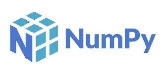
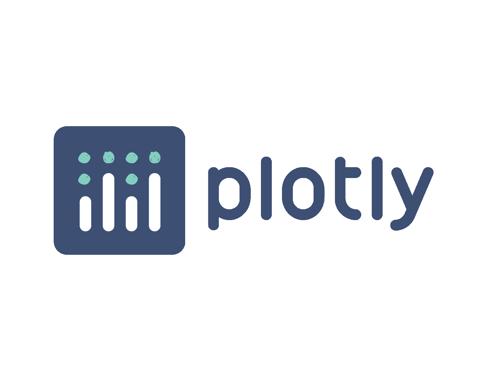

# 2021 年你不应错过的 7 个最佳 Python 库

> 原文：<https://medium.com/geekculture/7-best-python-libraries-you-shouldnt-miss-in-2021-83cfff7cd847?source=collection_archive---------4----------------------->

Python 库从一开始就减轻了编写代码的需要。Python 是机器学习、数据科学和数据可视化中最流行的编程语言之一。

# 如今有超过 137，000 个 python 库可用，选择一个与您的项目相关的库是一项挑战。

如果你想开始一个**数据科学职业**，Python 库是至关重要的。然而，我们将带您浏览今年值得学习的一些最好的图书馆。

话虽如此，让我们开始谈论 Python 库。

# 1#数字

NumPy 用于支持 N 维数组。它的数组特性是多维的，与 Python list 相比，它的健壮性是后者的近 50 倍，这使得这个库成为数据科学家最喜爱的库之一。

TensorFlow 等其他库也使用 NumPy 来检测张量上的内部计算。Python 库以扩展难以手动解决的数值例程的快速预编译函数而闻名。

# 2#熊猫

大多数数据科学家花时间清理数据、管理数据和探索数据。因此，Pandas 被广泛用于数据分析，并且是最流行的 Python 库之一。熊猫有一套很棒的工具，可以用来收集数据、清理数据和分析数据。这个 Python 库(Pandas)甚至可以加载、准备各种数据——无论是结构化的还是非结构化的。

学习 Python 库的一些最好的地方是通过识别在线提供的数据科学的 [**最佳认证**](https://www.dasca.org/) 。确保您获得的认证在全球范围内都是可信的。

# 3#梯度

使用 Gradio 构建和部署机器学习模型的 web 应用程序变得更好。现在只需三行代码就可以完成这个过程。尽管它与 Flask 和 Streamlight 的目的相同，但它可以更容易、更快速地部署您的 ML 模型。

Gradio 的一些额外优势——进行演示的理想方式，更容易分发和实施，因为公众只需共享一个链接就可以直接访问 web 应用程序，如果需要，它还允许进行进一步的建模。

# 4# SciPy

SciPy 非常适合从 NumPy 获得的科学函数和数学函数。

主要功能包括信号处理功能、统计功能和优化功能。SciPy 非常擅长优化和求解微分方程。

SciPy 的最佳特性是——它们具有多维图像处理能力，能够执行高效的线性代数计算，并解决傅立叶变换。

# 5# Plotly

Plotly 是一个必备的工具，可用于可视化。它功能强大，易于使用。也许这是构建可视化的主要优势之一。

Dash 是另一个很适合 Plotly 的工具，它可以构建动态仪表盘。作为一个基于 web 的 Python 接口，Dash 最大限度地减少了对分析性 web 应用程序使用 JavaScript 的需求。因此，这些情节可以在线上和离线运行。拥有 Python 库的技能对于成功的 [**数据科学职业**](https://dzone.com/articles/data-scientists-career-path-from-associate-to-dire) 来说至关重要。

# 6# Seaborn

Seaborn 构建在 Matplotlib 之上，是用于构建不同可视化的理想库。

界面是高级的，主题可以定制。由于这些特性，Seaborn 可以提供有吸引力的数据可视化。

Seaborn 的最大特点包括放大的数据视觉效果。

# 7#喀拉斯

Keras 非常适合希望创建像神经网络这样的深度学习模型的数据科学家。Keras 建立在 Theano 和 TensorFlow 之上，可以轻松地帮助建立神经网络。然而，与其他库相比，这个库相对较慢，因为它倾向于使用后端基础设施生成计算图。

# 结论

众所周知，Python 拥有大量的库，在有抱负的数据科学家和机器学习专家中很受欢迎。当处理更大的项目时，这些库是完美的。无论是哪种情况，学习 Python 及其库都是开启数据科学职业生涯的好方法。

【https://dzone.com】最初发表于**。**