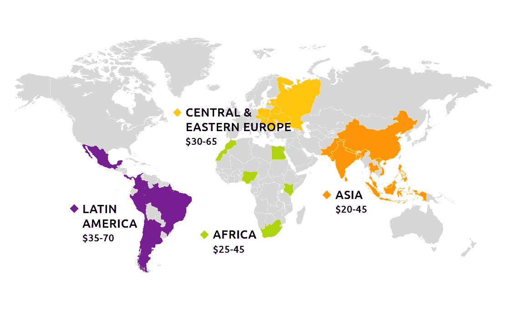

# 在零工经济中雇佣最佳开发人员的 7 个最佳策略

> 原文：<https://medium.com/geekculture/7-best-strategies-to-hire-the-best-developers-in-the-gig-economy-54d6a7cf92c3?source=collection_archive---------18----------------------->

公司雇佣全职员工并培训他们做运营业务所需的特定工作的日子已经一去不复返了。

如今，许多公司转向自由职业者和独立承包商来完成工作，不仅因为这样更划算，还因为这样可以让他们挑选‌the 最优秀的人才。

全球每天都有成千上万的开发者成为自由职业者，加入到零工经济中。

像 Upwork、Guru 和 Fiverr 这样的平台是零工经济的一部分，像 Freelancer 和 LinkedIn 的 ProFinder 这样的自由职业网站也是如此。

在这篇文章中，我们将介绍七种最佳策略，你可以用它们在零工经济中找到并**雇佣专门的开发团队**而不影响质量或服务。

我们开始吧

*又读:* [*为什么要从估价师中聘请开发人员？*](https://www.valuecoders.com/blog/industry-news/why-should-you-hire-developers-from-valuecoders/)

# 在零工经济中雇佣最佳开发人员的 7 个最佳策略

当 [**雇佣开发人员**](https://www.valuecoders.com/hire-developers#utm_source=hire_dev&utm_medium=Guest_Blog&utm_campaign=Medium&utm_id=NKY) 时，零工经济既呈现机遇也呈现挑战。机会在于有更大的人才库。然而，寻找具有特定技能和经验的专职电子商务开发人员可能具有挑战性。克服这一挑战的最佳方式是采取战略性的方法。

## **1。定义你需要的技能和经验**

要在零工经济中雇佣最好的开发人员，你必须首先定义你需要的技能和经验。然后，你可以开始在网络平台上发布招聘信息。

审查申请时，仔细阅读每个候选人的简介。一旦你缩小了选择范围，邀请最优秀的候选人参加面试。

面试时，问一些关于他们技能和经验的具体问题。通过一点努力，你应该能够为你的项目雇佣定制软件开发人员。

## **2。混合使用传统和在线采购方法**

企业可以利用求职公告板和社交媒体平台发布职位空缺，接触潜在的候选人。这将有助于广泛撒网，并确保只有最合格的候选人申请该角色。

企业也可以与专门招聘零工的职业介绍所合作。这些机构拥有识别顶尖人才所需的网络和资源，而且它们还能提供有益的筛选和审查服务。

你也可以使用视频会议技术，如 Skype 或 Zoom，来面试非本地的求职者。

通过混合使用这些方法，企业可以在 Gig 经济中找到最好的开发人员，而不管他们在哪里。

## **3。彻底审查候选人**

当你雇佣开发人员时，花时间彻底审查他们是很重要的。这会让你对他们的技能和经验有一个正确的认识。你必须‌look 在他们的评论和评级从过去的客户。如果他们的反馈大多是正面的，这是一个好迹象。

求参考。一个好的开发人员应该能够为你提供过去客户的联系信息，这些客户可以为他们的工作提供担保。

也可以直接联系开发者，询问他们的体验和流程问题。这将有助于你更好地了解它们是否适合你的项目。

通过花时间审查候选人，carefully‌，你雇佣了满足你需求的最好的开发人员——并避免任何代价高昂的错误。

## **4。纳入特定角色测试**

不可否认，正如我们所知，零工经济已经改变了工作格局。随着可供选择的专业人才库不断扩大，企业现在可以获得曾经难以企及的顶级人才。

然而，随着这种访问的增加，一个新的挑战也随之而来:你如何确定你为这项工作雇佣了最好的开发人员？

一个非常有效的策略是在招聘过程中加入针对特定角色的测试。通过测试候选人工作所需的特定技能和知识，您可以更准确地评估他们是否适合该角色。

这不仅有助于确保你雇佣了最好的候选人，还能让你淘汰那些仅仅“够好”的人。

因此，如果你想在零工经济中雇佣最好的开发人员，请确保在招聘过程中加入针对特定角色的测试。在找到这份工作的最佳候选人方面，这可能会有很大的不同。

## **5。提供有竞争力的价格**

随着企业越来越依赖零工经济来满足员工需求，知道如何雇佣最好的开发人员变得比以往任何时候都重要。吸引顶尖人才的一个重要方法是提供有竞争力的价格。开发人员的需求量很大，而且薪水也很高。

通过提供有竞争力的薪水，你将更有可能吸引最好的开发人员到你的项目中来。此外，开发人员通常会寻找能够提供挑战和回报平衡的项目。下图显示了开发人员在世界不同地区的每小时工资。

[来源](https://www.daxx.com/blog/development-trends/average-rates-offshore-developers)

通过提供有竞争力的工资，你将‌show 他们‌you 是认真对待你的项目，并愿意投资他们的成功。

所以，如果你想雇佣最好的开发人员，提供有竞争力的薪水是一个很好的开始。

## **6。提供明确的期望和指导方针**

当在零工经济中雇佣最好的开发人员时，提供清晰的期望和指导方针是至关重要的。这将有助于确保您能够找到满足您需求并且愿意在您设定的参数范围内工作的个人。

通过提供清晰的指导方针，你将会淘汰那些不适合这个项目的人。

同样重要的是要清楚你的项目预算。

这将确保您不会在开发人员身上过度花费，他们可能不会‌deliver 您需要的结果。

为项目建立一个时间表也是有益的，这样每个人都同意什么时候事情需要完成。

遵循这个建议，你将会在 [**为你的下一个项目雇佣一个专门的开发团队**](https://www.valuecoders.com/dedicated-development-teams#utm_source=hire_dedicated_team&utm_medium=Guest_Blog&utm_campaign=Medium&utm_id=NKY) 。

*也读作:* [*一条全面的决定性信息雇佣远程团队的开发者*](https://www.valuecoders.com/blog/outsourcing-and-off-shoring/a-piece-of-comprehensive-decisive-information-to-hire-remote-team-of-developers/)

## **7。与你的团队保持定期沟通**

为了在零工经济中雇佣最好的开发人员，与你的团队保持定期沟通是很重要的。您可以安排每周或每两周一次的视频会议，与团队保持联系。

你也可以使用像 Asana、吉拉和 Trello 这样的项目管理软件来帮助你跟踪截止日期和分配的任务。这些工具确保‌everyone 同意，没有人落后。你应该鼓励你的团队提出问题并提供改进项目的建议。

这样，你可以创造一个更具协作性的环境，并最大限度地发挥团队的技能。

最后，随时准备回答‌questions ‌your 团队可能有的问题。

通过遵循这个重要的提示，你可以建立一个强大的开发团队，他们可以在零工经济中有效地合作。

## **8。关注文化契合度**

找到合适人选的最好方法之一是关注文化契合度。一个非常适合你的团队文化的开发人员将更有可能与现有的团队动态很好地融合，更有生产力和参与度，并长期坚持下去。

要评估文化契合度，你需要密切关注硬技能和软技能。当然，您会希望确保开发人员拥有这项工作所需的技术技能。

但是你也要衡量个性、态度和工作风格。他们是团队成员吗？他们有积极的态度吗？他们认同你公司的价值观吗？

这些重要问题的答案会让你对某个特定的开发人员是否适合你的团队有一个很好的认识。通过关注文化契合度，你可以确信你正在 [**雇佣电子商务开发人员**](https://www.valuecoders.com/hire-developers/hire-ecommerce-developers#utm_source=hire_eCom_dev&utm_medium=Guest_Blog&utm_campaign=Medium&utm_id=NKY) 在零工经济中开发电子商务解决方案。

*也可阅读:* [*从头开始创建电子商务应用的全面指南*](https://www.valuecoders.com/blog/ecommerce-cms/a-comprehensive-guide-to-create-an-ecommerce-app-from-scratch/)

# 总结一下！

有了合适的团队，你可以相信你的下一个项目会成功。 [**雇佣定制软件开发人员**](https://www.valuecoders.com/custom-software-development-services-company#utm_source=hire_cust_dev&utm_medium=Guest_Blog&utm_campaign=Medium&utm_id=NKY) 在零工经济中，这是快速高效完成项目的好方法。

然而，花时间为这项工作找到合适的人是很重要的。通过遵循这些 tips‌，你可以为你的下一个项目找到最好的开发者。