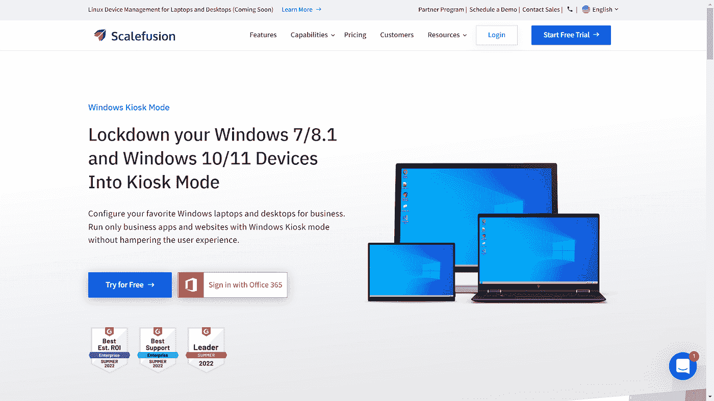
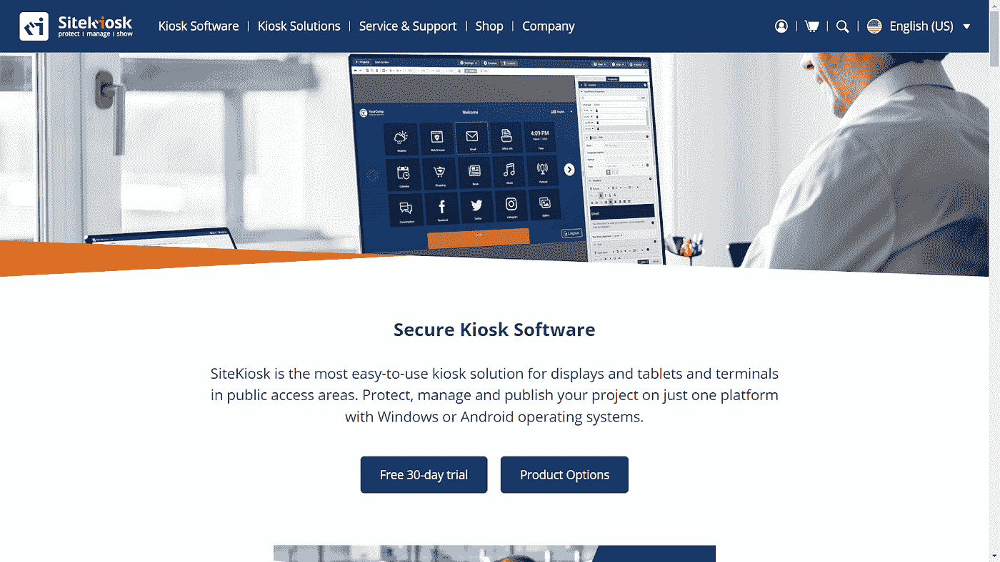
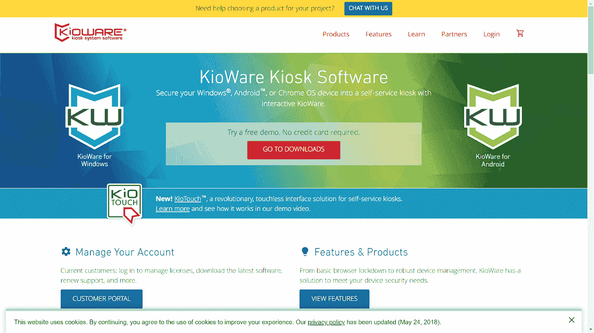
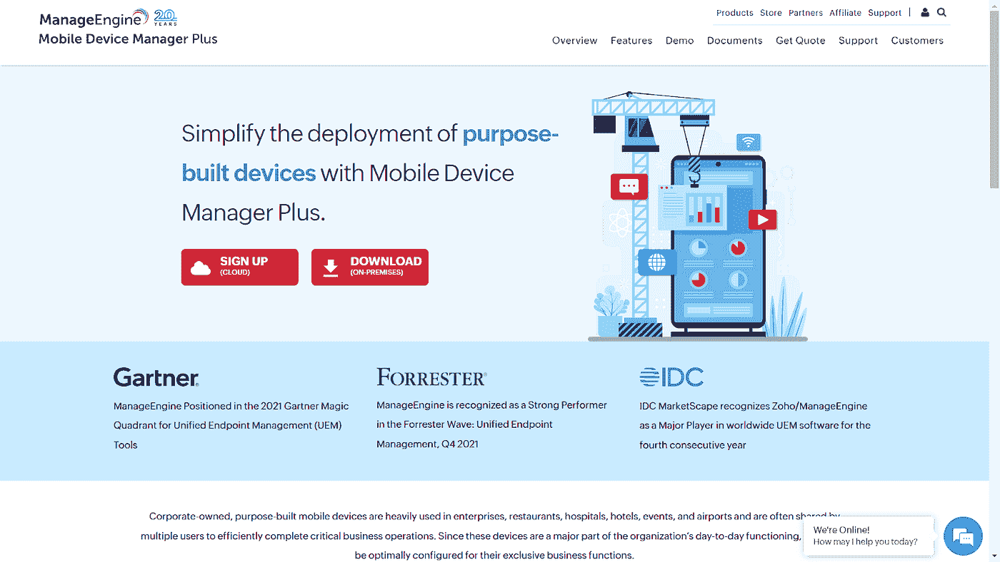
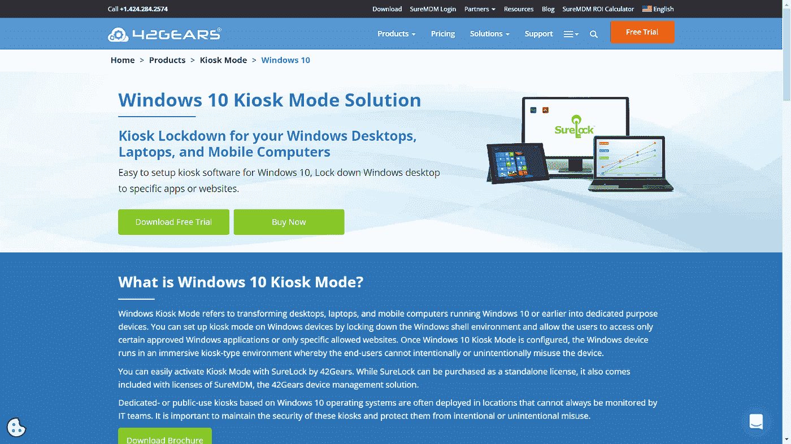
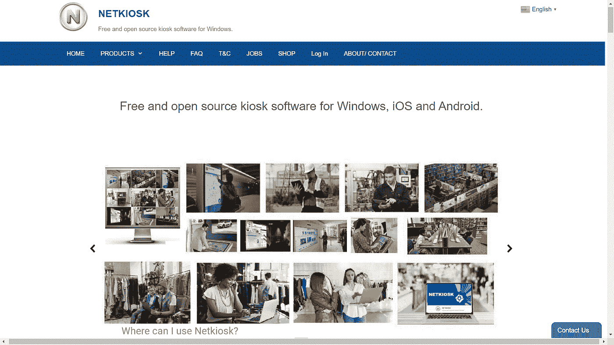
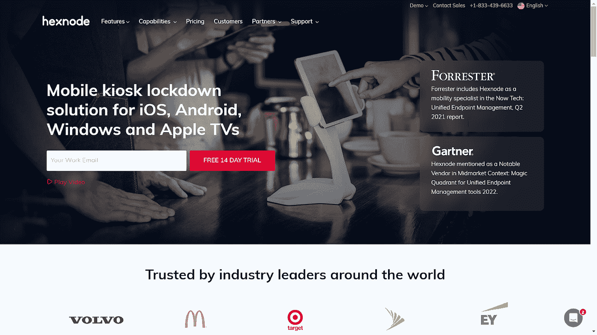

# 7 款最适合小型企业的 Windows Kiosk 软件

> 原文：<https://medium.com/geekculture/7-best-windows-kiosk-software-for-small-businesses-1954793dab3b?source=collection_archive---------3----------------------->

Windows 是第二受欢迎的操作系统，包括移动和桌面，其次是 Android。Windows 以超过 76%的份额统治着全球台式机市场。Windows 的大量使用使其成为不同业务领域中许多用例的首选。

最常见的使用案例之一是 Windows kiosk 软件或 Windows kiosk 模式，它使企业能够锁定笔记本电脑、台式机、平板电脑和移动电话等设备供企业专用。

让我们先来看看什么是 Windows kiosk 软件，以及它如何适用于不同的业务。

# **Windows kiosk 软件及其行业应用**

用于 Windows 的 Kiosk 软件只允许访问特定的应用程序或批准的网站。这些设备被锁定在单应用或多应用模式下，以使其专用于业务目的。

换句话说，面向 Windows 的 kiosk 模式软件不允许用户对设备设置进行任何更改或自定义任何内容。这些设备被限制在多个应用程序或单个屏幕上，并针对不同的使用情况列出了一系列限制。

**Windows kiosk 软件**用于管理所有地理位置的企业的 Windows 设备，其使用案例包括

1.  限制访问员工设备上的应用和网站，以保护他们的活动
2.  减少员工分心，提高员工生产力
3.  用于收集客户反馈/付款的设备
4.  机场自助值机亭
5.  显示广告的数字标牌

**Windows kiosk 模式软件**根据业务的性质，用例要么以员工为中心，要么以客户为中心。要在 Windows 设备上部署和管理 kiosk 模式，您需要 kiosk 软件，即移动设备管理软件。

在继续了解最好的 Windows kiosk 软件之前，让我们首先了解哪些 Windows 设备支持 Windows 的 kiosk 软件。

大多数 **Windows kiosk 锁定软件**支持 Windows 11、10、8.1 和 7 操作系统版本。这使您能够利用信息亭锁定软件的所有功能，并且您可以无缝地部署和管理设备。对 Windows 设备兼容性的预先检查将使您能够有效地使用 kiosk 软件。

以下是 7 款最佳 Windows kiosk 软件,可以帮助小型企业获得最可靠的 kiosk 服务

## **1。缩放融合**

[Scalefusion 的 Windows kiosk 软件](https://scalefusion.com/windows-kiosk-mode)是一种简单安全的 kiosk 模式，适用于 Windows 台式机、笔记本电脑、平板电脑、手机和数字签名。用于 Windows 的 **kiosk 模式软件支持 Windows OS 版本 11、10、8.1 和 Windows 7，在 Windows 10 kiosk 软件中具有丰富的功能。**

如果您希望将 Windows 设备锁定到单个应用程序或浏览器，Scalefusion 可以提供单应用程序模式，也可以提供多应用程序模式，以便使用多个选定的应用程序或浏览器。它还允许您使用 Windows 10 及更高版本上可用的 Windows Autopilot 在 Windows 设备上配置业务应用程序和设置。终端用户第一次启动时，设备会进入 kiosk 模式策略设置。

Scalefusion 的 **Windows 10 kiosk 软件**可以通过配置 chrome 设置、阻止私下浏览、限制浏览器历史记录以及允许或阻止网站，为您的员工或客户提供安全的浏览体验。它因其远程投射和控制功能而广受欢迎，可帮助您随时随地排除设备故障，并为您的业务提供不间断服务。

除了 Windows kiosk 软件，Scalefusion MDM 还管理和控制在 Android、iOS 和 macOS 上运行的所有终端。其定价计划从每年每台设备每月 2 美元开始。它还提供了 [**14 天的免费试用期**](https://app.scalefusion.com/users/sign_up?utm_campaign=Scalefusion%20Promotion&utm_source=Medium&utm_medium=social&utm_term=VS) 。该解决方案目前在多年计划上提供 25%的年终优惠，这对小型企业非常有利。它提供 18x5 免费客户支持，以确保出色的客户服务。

## **2。网站信息亭**

**SiteKiosk** 是一款易于使用的信息亭解决方案，用于公共区域的展示。这是一款信息亭锁定软件，可以保护 Windows 电脑、平板电脑、标牌和显示器免受公共区域的任何操作。它被认为是 Windows 10 的最佳 kiosk 软件之一。

它具有强大的功能，如强大的内容管理系统、全面的应用程序控制、远程管理以及使用双因素身份认证、报告和实时统计数据的监控。其他功能包括实时内容过滤，以消除不适当的内容，一个简单的用户界面，以及 Windows 设备中的时间和事件控制。

汽车经销商、零售店、加油站、药店、超市、酒店和餐馆等小型企业可以从使用 SiteKiosk 作为显示数字信息的 Windows 锁定软件中受益。

SiteKiosk 在线云的年度计划从每台 239 美元开始，最多 9 个信息亭，随着信息亭数量的增加，价格逐渐上涨。

## **3。Kioware**

**Kioware** 提供 Windows 锁定软件，让您保护您的 Windows 设备，并将其转换为自助服务亭。它还有助于管理您的设备设置，仅限受限的基于云的应用程序和允许的网站。kiosk 模式的 Windows 锁定软件还提供基本的授权和键盘过滤，控制弹出窗口，并阻止文件下载。

Kioware 为零售、医疗保健、银行、酒店和餐馆等企业的公共访问区域设备提供浏览器锁定安全性。KioCall 功能通过 kiosks 提供视频会议选项，因此您的用户可以发起或接收视频通话。

Kioware 允许您以大约 4950 美元的价格购买一个服务器许可证，用于大量的 kiosk 部署，这是一个带有额外支持费用的一次性购买。

## **4。ManageEngine 移动设备管理器 Plus**

**manage engine**kiosk management 将智能手机、平板电脑、台式机和电视等移动设备转变为 kiosk 模式下的单一用途设备。它以零接触方式装载设备并管理它们。kiosk 模式软件允许您自定义设置，并将设备限制为一个或多个专用应用程序。

它通过移动设备管理、应用程序管理和内容管理等功能消除干扰并提高企业安全性，从而帮助提高员工的工作效率。

manage engine Mobile Device Manager Plus 标准计划对 50 台设备的云订阅每年统一收费 1195 美元，对其他技术人员收取额外费用(345 美元起)。

## **5。SureLock**

**sure lock**sure MDM 的 Kiosk lockdown 将智能手机、平板电脑、个人电脑或任何定制设备等企业设备转换为 Kiosk，以提高员工的工作效率。Windows interactive kiosk 软件将设备转换为交互式设备，帮助用户访问屏幕上白名单中的应用程序和内容。

将这些现成的移动设备部署为高客流量区域的信息亭，使更多的受众能够访问它们并实现增加销售额的商业目的，企业也从中受益。用于 Windows 的 Kiosk 软件还通过将移动设备锁定在 kiosk 模式来帮助节省基础设施成本。企业对应用程序有更多的控制权，可以限制用户访问一个或多个特定的应用程序。

SureMDM 定价计划起价为每台设备每月 3.99 美元，适用于各种规模和类型的部署。

## **6。网络亭**

**Netkiosk** 是一款面向 Windows 的开源 kiosk 软件。这是一个计算机亭软件，旨在使用和保护公共访问 PC 或商业 PC。它可以与现有的 Windows 设置协同工作，限制程序访问。Netkiosk 浏览器限制用户在 Windows kiosk 模式下访问一个或多个网站。它还允许您将浏览器布局更改为交互式信息亭模式。

它的应用包括公共信息亭、工厂设备、图书馆电脑和交互式显示器。它是一个适用于 Windows 10 和 11 的 kiosk 软件。它也适用于 Windows 7、8 和 XP。

Netkiosk 有一些明确的计划，但价格没有透露。

## **7。六角节点**

**Hexnode** 将您的移动设备锁定为 Windows 10 kiosk 模式。kiosk 软件使用户能够确保用户对应用程序的访问受到限制；他们不能离开应用程序或对设备设置进行任何更改。Windows 单一应用程序 kiosk 模式非常适合公共使用，是无人值守设备的首选。

kiosk 设备可以配置为在每次重启时启动相同的应用程序。它可以锁定特定的应用程序，多个用户可以使用相同的设备。适用于 Windows 10 的 Hexnode kiosk 软件用于公共区域的数字签名。

Hexnode 在其最终计划中提供基本的 kiosk 软件，起价为每台设备每月 3.6 美元。它还提供 14 天的免费试用。

# **Windows kiosk 软件最适合小型企业**

无论组织规模如何，Windows kiosk 模式软件不仅有利于内部组织需求，也有利于小型企业使用它来提高他们的销售，将 Windows kiosk 模式用作单一用途的专用设备。

当用作广告活动的信息亭、公共场所的独立计算机、自助服务信息亭、自助结账信息亭、机场的自助登记信息亭或数字签名时，最好的信息亭软件可以管理和保护设备。以上提到的所有 kiosk 软件或多或少都提供类似的功能，在为您的小型企业做出选择时，需要注意的一件重要事情是它们提供的售后客户支持。

## **关闭线**

Windows kiosk 软件减少了 IT 部门管理设备的工作量，并限制了这些设备的专用用途。设备设置和定制也由 IT 部门控制，并针对业务进行远程配置。在为 Windows 选择 kiosk 软件时，要考虑的最重要的因素是它是否能满足客户富有挑战性的需求，是否具有成本效益，以及是否在所有软件中表现最佳。