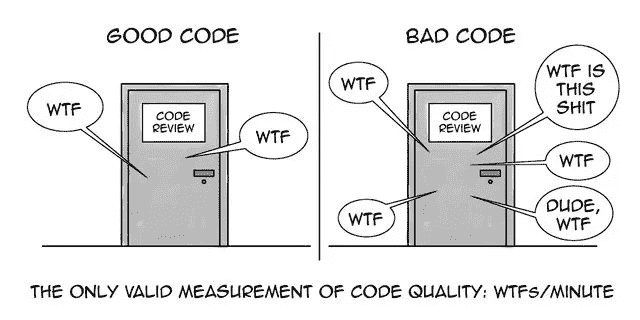

# 每个开发人员都应该在他们的日常工作中包含 7 个干净的代码实践

> 原文：<https://medium.com/geekculture/7-clean-code-practices-every-developer-should-include-in-their-day-to-day-work-9b2764d79860?source=collection_archive---------26----------------------->

编码是一回事，好的编码是另一回事。本文将指导您完成一些实践，这些实践可以很容易地包含在您的例程中，以使您的代码更好。

# 什么是干净代码？

干净代码的概念可以追溯到 Robert C. Martin 和他的书《干净代码手册》