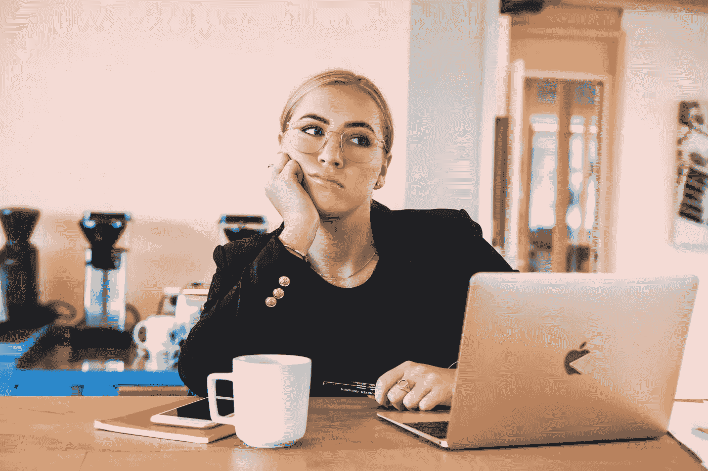

# 在家工作时使用的 7 个网络安全检查点

> 原文：<https://medium.com/geekculture/7-cybersecurity-checkpoints-to-use-when-working-from-home-bbd28b17b184?source=collection_archive---------32----------------------->

## 你知道吗:自新冠肺炎事件以来，网络犯罪上升了 600%

Photo by [Magnet.me](https://unsplash.com/@magnetme?utm_source=unsplash&utm_medium=referral&utm_content=creditCopyText) on [Unsplash](https://unsplash.com/s/photos/work-from-home?utm_source=unsplash&utm_medium=referral&utm_content=creditCopyText)

自从新冠肺炎疫情爆发以来，大多数公司都被迫接受远程工作，至少在某种程度上是为了生存。

对雇主和雇员的好处都得到了证实:省钱，更好的工作生活平衡，更少的…