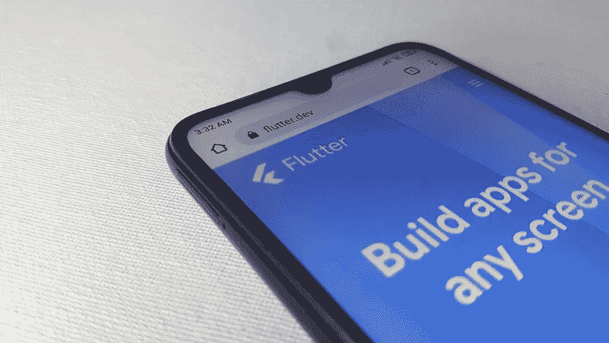

# 7 Flutter 优点:Flutter 对你的下一个 App 好吗？

> 原文：<https://medium.com/geekculture/7-flutter-advantages-is-flutter-good-for-your-next-app-50ec3cf9974b?source=collection_archive---------5----------------------->

大多数业务都围绕着移动设备和应用。尽管现在移动应用行业竞争非常激烈，但这也是初创公司和开发者努力的地方，他们总是试图找到更快、更便宜、性能更好的开发工具。

其中就有颤振。

# **什么是颤振？**