# 每个数据科学家都应该知道的 7 个重要距离指标。

> 原文：<https://medium.com/geekculture/7-important-distance-metrics-every-data-scientist-should-know-11e1b0b2ebe3?source=collection_archive---------6----------------------->


Photo by [Forest Simon](https://unsplash.com/@forest_ms?utm_source=medium&utm_medium=referral) on [Unsplash](https://unsplash.com?utm_source=medium&utm_medium=referral)

*你好，*

距离度量在大多数机器学习模型中起着至关重要的作用。距离度量基本上用于增强基于相似性的算法的性能。

*距离度量的用法从一开始就存在。基本上，距离提供了两个数据点之间的相似性度量。基于距离的度量的最流行的例子之一是众所周知的用于分类的最近邻规则，其中新样本被标记为其最近邻内的多数类。*

最近邻分类器背后的算法是基于距离的学习背后的主要动机。这些类型的算法有标准的距离度量，如欧几里德距离，以便测量数据的相似性。作为与非相似数据的比较，数据带来的距离参数可以显著提高这些算法的质量。

> 有效的距离度量提高了我们的机器学习模型的性能，无论是分类任务还是聚类。

在这篇博客中，我们将介绍一些最常用的距离指标，这些指标是每个数据科学家都必须知道的

*   **欧几里德距离**
*   **曼哈顿距离**
*   **切比雪夫距离**
*   **闵可夫斯基距离**
*   **汉明距离**
*   **余弦相似度**
*   **Jaccard 相似度**

> **欧几里德距离**

欧几里德距离是最常用的距离度量之一。从数学上来说，它是两个不同数据点之间的差异之和的平方根。

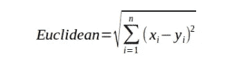

[Source](https://aiaspirant.com/distance-similarity-measures-in-machine-learning/)

*为了计算两个数据点或观察值之间的相似性，包括 K- Means 聚类在内的大多数机器学习算法使用欧几里德距离。*

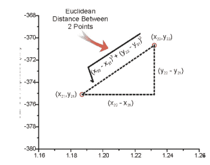

[Source](https://vitalflux.com/different-types-of-distance-measures-in-machine-learning/)

此外，当我们计算具有数字数据类型(即整数或浮点)的两组数据之间的距离时，使用欧几里德距离。

*请记住，如果您的数据具有不同比例的特征，则必须在计算欧几里德距离之前对所有列的特征进行标准化或规范化*。如果不执行特征的缩放，则特征中的大值将支配距离度量。

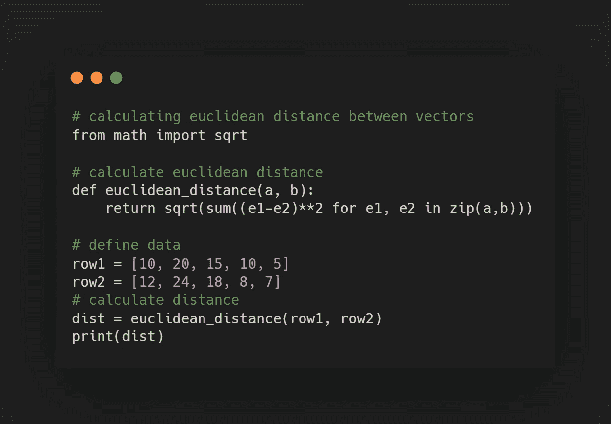

> **曼哈顿距离**

*曼哈顿距离也称为城市街区距离或出租车距离，计算两个实值向量之间的距离。在数学上，曼哈顿距离被计算为两个不同数据点之间的绝对距离之和。*

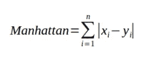

[Source](https://aiaspirant.com/distance-similarity-measures-in-machine-learning/)

当两个向量位于一个均匀的网格状棋盘或城市街区时，通常使用这种方法。出租车这个名字给人一种直观的感觉，即出租车在城市街区(在网格上是坐标)之间的最短路径是多少。

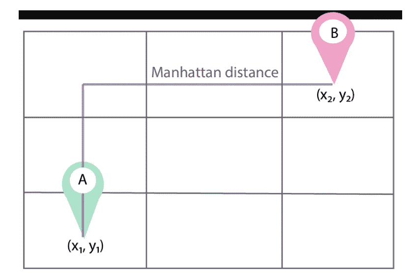

[Source](https://vitalflux.com/different-types-of-distance-measures-in-machine-learning/)

当我们在整数维空间中有实值向量时，通常推荐使用曼哈顿距离而不是欧几里德距离。

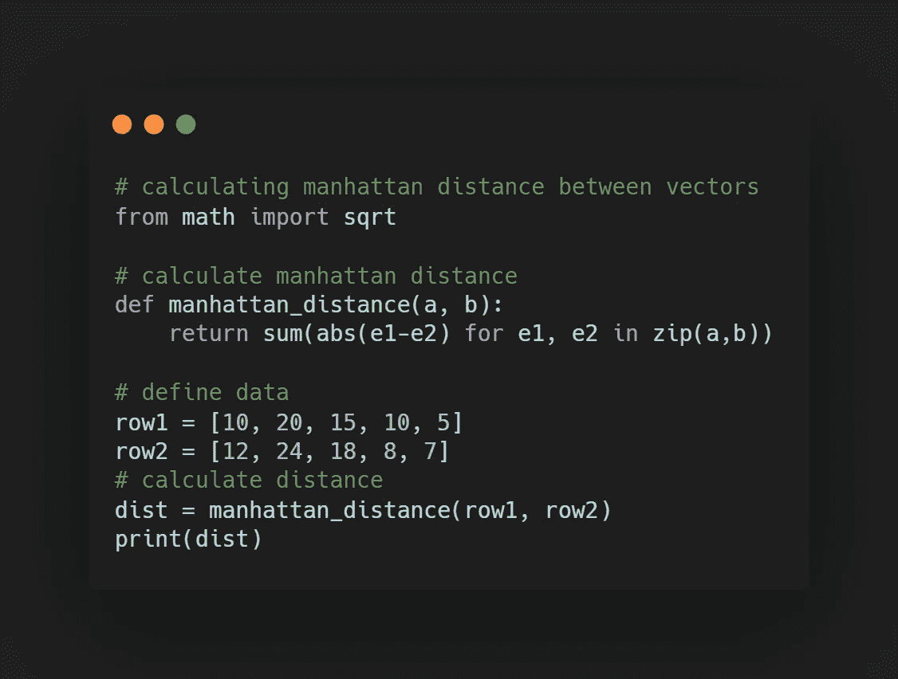

> **切比雪夫距离**

*切比雪夫距离计算为两个不同向量之间的绝对差的最大值。也叫棋盘距离或 L 无穷远距离或最大值距离。*

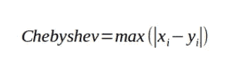

[Source](https://aiaspirant.com/distance-similarity-measures-in-machine-learning/)

从这个*距离中我得到的最好的直觉是棋盘中国王的移动，它可以向上、下、左、右任何方向移动。*

切比雪夫距离有时用于物流仓库，因为它有效地测量了起重机移动一个物体所用的时间。也广泛用于计算机辅助制造应用中，用于优化飞机上的机器操作。

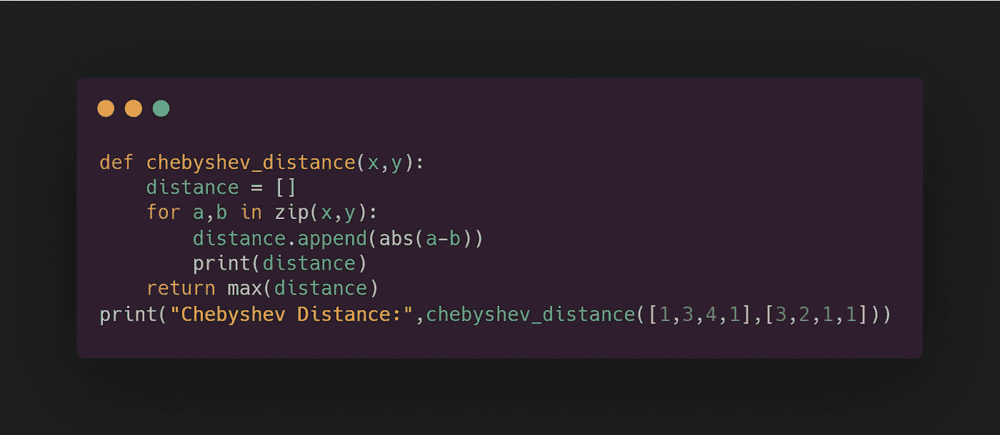

> **闵可夫斯基距离**

*闵可夫斯基距离概括了欧几里德距离和曼哈顿距离*。它也被称为 p-范数向量，因为它添加了一个称为“p”的参数，允许计算不同的距离度量。

对于不同的 p 值，闵可夫斯基会是-

*   p=1，距离测度是曼哈顿测度。
*   p=2，距离测度是欧几里德测度。
*   p = ∞，距离测度是切比雪夫测度

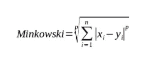

[Source](https://aiaspirant.com/distance-similarity-measures-in-machine-learning/)

当我们实现任何使用 Minkowski 作为距离度量的机器学习算法时，我们可以调整超参数“ *p* ”。

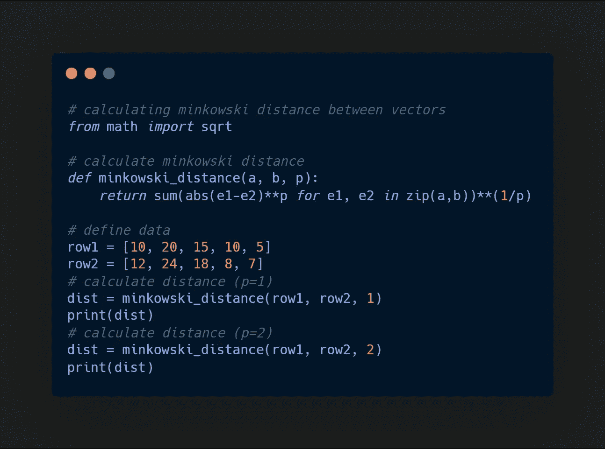

> **汉明距离**

啊！当我们的数据中有分类属性时，使用海明距离。汉明距离衡量两个必须具有相同长度的字符串之间的相似性。

海明距离基本上量化了两个属性是否不同。当它们相等时，汉明距离为 0，否则为 1。

在下面的代码片段中，你可以看到我们正在计算两个字符串“欧几里得”和“曼哈顿”之间的汉明距离。这两个串之间的距离可以被计算为这两个串之间的比特差数量的平均值或总和。

因此，这两个字符串之间的汉明距离将是 7。还要记住，汉明距离只在我们有相同长度的字符串时有效。

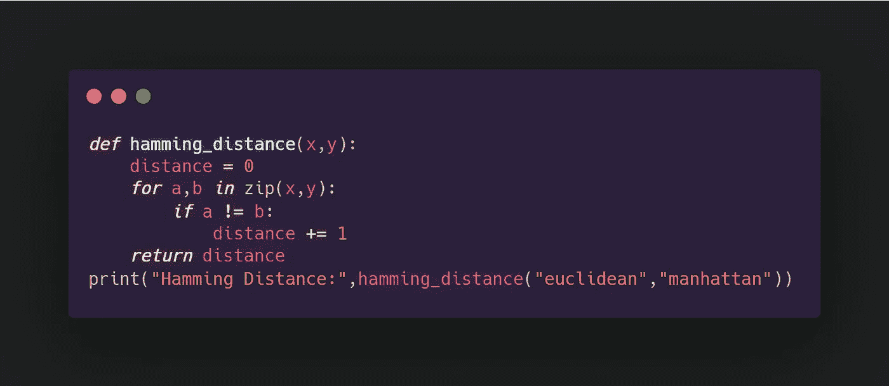

> **余弦相似度**

*余弦相似度基本上衡量的是两个非零向量之间的相似度。它基本上是最相似的两个向量之间的余弦角。*

大多数相似向量之间的角度为 0 度，因此 cos 0 的值为 1。此外，彼此相反的向量具有-1 的值，即 cos(180 度)。

因此推断余弦相似度的范围从-1 到 1。

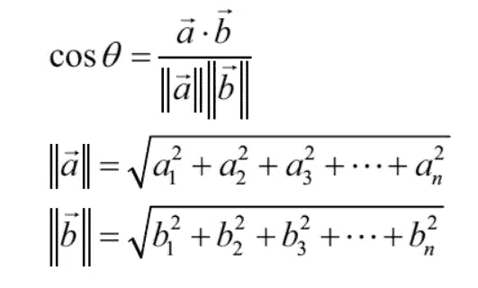

[Source](https://vitalflux.com/different-types-of-distance-measures-in-machine-learning/)

当我们想要计算两个稀疏向量之间的距离时，使用[余弦距离](https://en.wikipedia.org/wiki/Cosine_similarity)。例如，如果收集了 1000 个关于汽车的属性，其中 200 个是互斥的(意味着一辆汽车有这些属性，而其他汽车没有)，那么只需要在计算中包括 800 个维度。

*余弦相似度只关心两个向量之间的角度，而不关心它们之间的距离*。

```
 cosine distance = 1-cosine similarity
```

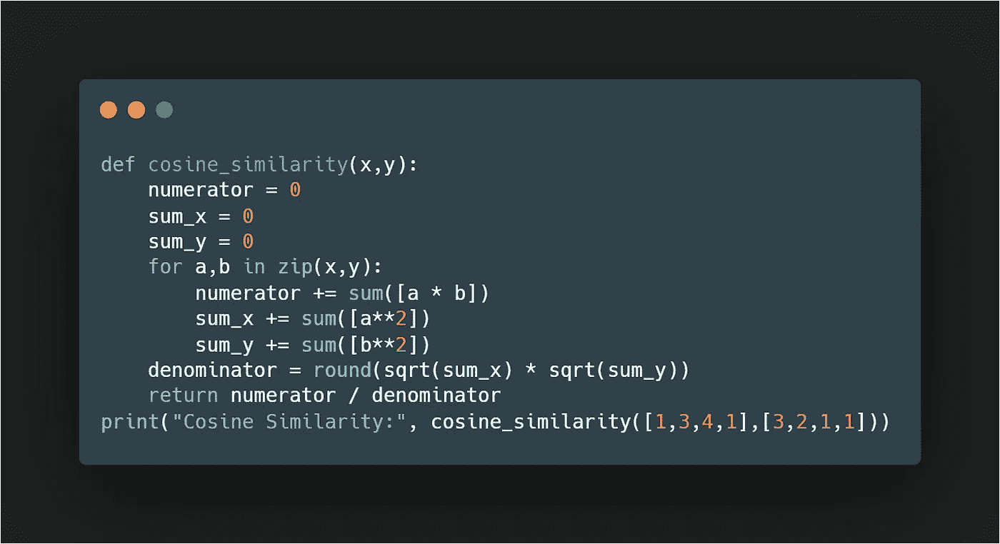

> **Jaccard 相似度**

*在 Jaccard 中，相似性用于理解两个样本集之间的相似性。Jaccard 相似性强调两个有限样本集之间的相似性，而不是向量，它被定义为交集的大小除以样本集的并集的大小。*数学上写成:

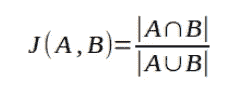

[Source](https://aiaspirant.com/distance-similarity-measures-in-machine-learning/)

与余弦距离不同，Jaccard 距离的计算公式如下

```
 Jaccard distance = 1 — jaccard similarity
```

Jaccard 相似性通常用于具有图像检测应用的卷积神经网络中，其中它测量对象检测算法的准确性。

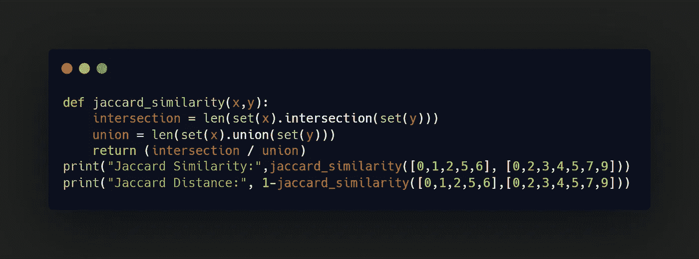

> **推论**

在这篇博客中，我们讨论了数据科学家应该知道的各种距离度量。距离度量的选择应该基于您的数据。

*   *如果特征相似，或者如果我们想要找出两个数据点之间的距离，可以使用欧几里德距离。*
*   *当我们的维度很高时，曼哈顿更受青睐。*
*   *在分类特征的情况下，使用汉明距离。*
*   *当我们关心向量的方向而不是大小时，使用余弦相似度。*

> **参考文献**

*   [艾野心家的博客](https://aiaspirant.com/distance-similarity-measures-in-machine-learning/)
*   杰森·布朗利的精彩解释。
*   克里斯·纳伊克的 Youtube 视频
*   [通过分析得出的距离度量类型 Vidhya](https://www.analyticsvidhya.com/blog/2020/02/4-types-of-distance-metrics-in-machine-learning/)
*   [机器学习指标](https://vitalflux.com/different-types-of-distance-measures-in-machine-learning/)

如果你喜欢这个博客，请点击👏跟我来。如果你注意到思维方式、公式、动画或代码有任何错误，请告诉我。

*干杯！*