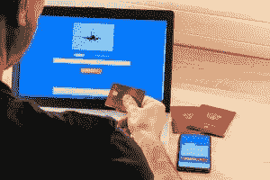

# 7 个有趣的 Java 项目想法&初学者主题[2022]

> 原文：<https://medium.com/geekculture/7-interesting-java-project-ideas-topics-for-beginners-2022-f93eb18f9883?source=collection_archive---------5----------------------->

Java 是最流行和最需要学习的编程语言之一。由于其平台独立性和多平台支持，Java 是 IT 和软件领域的主要编程语言。公司总是在寻找能够开发创新 Java 项目的熟练 Java 开发人员。所以，如果你是一个 Java 编程初学者，你能做的最好的事情就是做一些实时的 **Java 项目。**

在本文中，我们将探索一些有趣的 **Java 项目**，初学者可以通过这些项目来测试他们的 Java 知识。在这篇文章中，你会发现 7 个**顶级 Java 项目创意** **，供初学者**获得 Java 实践经验。

但是首先，让我们解决一个更相关的问题，这个问题一定潜伏在您的脑海中:**为什么要构建 Java 项目**？

当谈到软件开发职业时，有抱负的开发人员必须从事自己的项目。开发真实世界的项目是磨练您的技能并将您的理论知识转化为实践经验的最佳方式。

在激烈的竞争中，一个有抱负的 Java 开发人员必须拥有实际 Java 项目的实践经验。事实上，这是当今大多数雇主的主要招聘标准之一。当你开始着手 **Java 项目**时，你不仅可以测试你的优势和劣势，还可以获得对你的职业生涯有极大帮助的曝光率。

# 1.航空订票系统

开始为学生们试验动手的 Java 项目的最好方法之一是开发航空订票系统。所提出的机票预订系统是一个基于 web 的 Java 项目。这是一个全面的乘客处理系统，包括库存、票价、电子机票操作和在线交易。航空订票系统的主要特点是:

*   机票的预订和取消。
*   航空系统功能的自动化。
*   执行交易管理和路由功能。
*   对顾客做出快速反应。
*   维护乘客记录并报告每日的商务交易。

这个集成的机票预订管理应用程序具有一个开放的架构，鼓励添加新的系统和功能。这意味着该应用程序可以进行调整，以跟上航空公司业务的动态需求。如果你正在寻找酷的 java 项目添加到你的简历中，这是一个。

VRS 软件套件包含四个关键模块，即用户注册、登录、预订和取消。对于初学者来说，这是一个重要的 java 项目，该应用程序允许所有通信通过 TCP/IP 网络协议进行，从而促进了全球范围内内部网和互联网通信的使用。

# 2.[课程管理系统](https://www.codewithc.com/course-management-system-java-project/)

这是一个优秀的 Java 项目，适合初学者。顾名思义，本课程管理系统是为教育机构设计的在线管理软件应用程序。该项目的主要目标是促进学校、学院和大学的学生和教师之间在提交项目、作业、论文和接收教师反馈方面的无缝互动。该项目有三个相互关联的模块:

*   **管理员模块** —该模块专门用于管理管理功能，如为学生和教师创建帐户、创建课程、对科目进行编码、管理员工、工资单等。基本上，这个模块为其他两个模块奠定了基础。
*   **学生模块** —该模块专为学生使用而设计。他们可以登录他们的账户查看他们的课程作业，提交他们的项目，从教师那里获得反馈，等等。
*   **导师模块** —该模块供导师使用，导师可以登录自己的账户，查看学生提交的项目，与学生交流，并为学生提供指导。

正如我们前面提到的，这个项目旨在通过互联网促进合格教师和学生之间的信息共享。

# 3.[数据可视化软件](https://www.codewithc.com/data-visualization-java-project/)

在由数据科学、商业智能和商业分析推动的现代行业中，数据可视化是一个至关重要的元素。它指的是数据的可视化表示，可以是图形或图像格式。这是一个重要的 java 项目，适合初学者。该数据可视化项目旨在概述[数据可视化](https://www.upgrad.com/blog/data-visualisation-the-what-the-why-and-the-how/)中的设计和实现技术。该项目的目标是:

*   通过适当的图形或图像表示，准确有效地传达隐藏在数据中的洞察力。
*   为有效传达想法提供对复杂数据集的相关见解。
*   在传达准确信息的同时，激发观众的注意力和参与度。
*   既实用又美观。

该数据可视化软件以数据可视化的形式显示网络中的节点连通性。您可以使用鼠标或触控板将其定位在不同的位置。这个项目最好的部分是你可以根据你的需求增强和调整软件的特性和功能。提及 **Java 项目**可以让你的简历看起来比别人有趣得多。

# 4.[电费结算系统](https://www.codewithc.com/electricity-billing-system-project-java/)

该项目是传统电力计费系统的现代版本。这个 Java 项目的主要焦点是将电力计费系统计算机化，使其更加无缝、可访问和高效。该软件计算在特定时间内消耗的单位，并相应地计算为这些单位支付的金额。对于初学者来说，这是优秀的 Java 项目理念之一。以下特征使得电力计费系统更加面向服务和简单明了:

*   它具有高性能的速度和准确性。
*   它允许电力办公室和客户之间的无缝数据共享。
*   它受到高度安全措施和控制的保护。
*   它包括调试的必要规定。

与传统的计费系统不同，这种计算机化的软件不需要大量的人工来处理和管理账单生成的过程。一旦安装在系统上，它会自动计算消耗的单位和账单，并向每个客户提供仪表读数。当用户需求发生变化时，您可以继续在系统中添加新功能。

# 5.[电子医疗管理系统](https://www.codewithc.com/e-health-care-management-system-java-project/)

开始为学生试验动手 Java 项目的最佳想法之一是开发电子医疗保健管理系统。电子医疗保健管理系统是一个基于网络的项目，旨在为医院和诊所的员工数据和患者医疗数据提供有效的管理。

数据挖掘技术是这个项目的核心，它由两个模块组成:管理模块和客户端模块。管理模块与医疗保险管理有关，包括医疗保健部门、医生、护士、病房和职员，而客户机模块是为病人设计的。在许多方面，商业智能正在革新医疗保健。

**电子医疗管理系统的主要特点是:**

*   它在医生和病人之间建立了一个清晰的联系和沟通渠道。
*   它可以准确分析医院资源的使用率，包括实验室设备、床位使用率、管理、药品等。
*   它利用 CRISP-DM(数据挖掘的标准跨行业流程)创建一个准确有效的管理系统。
*   它消除了丢失数据和不正确数据的问题。

通过这些功能，电子医疗保健管理系统将有助于克服现有医疗保健管理系统的缺点和挑战。这将有助于顺利管理医院工作人员，并加快提供保健服务的进程。

**也试试:** [Python 项目思路&话题](https://www.upgrad.com/blog/python-projects-ideas-topics-beginners/)

# 6.[电子邮件客户端软件](https://www.codewithc.com/email-client-software-java-project/)

那么，为什么不利用你的技能开发一个令人印象深刻的基于邮件系统的 java 项目呢？这个项目是一个电子邮件程序，设计用于发送和接收电子邮件。在这个项目中，您将使用标准的套接字和网络以及 Java 邮件 API。该项目中使用了两种主要协议——SMTP 和 POP3。这是面向初学者的 java 项目之一。

通常，传统的电子邮件客户端软件通过网络浏览器如 Hotmail、Yahoo、Google 等进行电子邮件发送。由于这些系统使用 HTTP 端口 80 来访问所有的电子邮件，这并不是发送敏感或机密消息的最佳方式。黑客可以轻易地侵入软件系统，破坏或滥用数据。

该项目的功能类似于此——ISP(互联网服务提供商)的邮件服务器处理来自 ISP 的电子邮件。所有发送的电子邮件首先到达邮件服务器，然后被处理并转发到另一个邮件服务器所在的收集者的目的地。

收集器端的邮件服务器接收传入的电子邮件，并在收件箱中对它们进行电子分类。现在，收件人可以使用他们的电子邮件应用程序查看收到的电子邮件。整个交易是通过程序直接连接邮件服务器进行的，这比现有的电子邮件客户端软件安全得多。

**也读作:**[Java 中的事件处理](https://www.upgrad.com/blog/event-handling-in-java/)

# 7.[图书管理系统](https://www.codewithc.com/library-management-system-java-project/)

这个软件项目是用 Java 实现的，采用 MS Access 数据库设计。它是为通过一个集成的计算机系统管理和维护任何教育机构的图书馆而设计的。图书馆管理软件将使图书馆员在处理图书馆日常工作时更有效率。

在传统的图书馆管理系统中，一切都是手工完成的。所有的图书馆操作和记录，包括书籍的数量，书籍的类型，书籍的名称，学生借书/还书的记录等等。，都是通过笔和纸来完成的。自然，这个过程需要大量的时间、精力，甚至人力资源。如果你正在寻找最后一年的 java 项目，这是最适合你的。

提议的项目旨在解决与传统图书馆管理系统相关的所有挑战。由于它在计算机化的数据库中存储和管理所有的图书馆记录，它消除了手工记录的需要。该软件包括不同的模块，每个模块处理和管理特定的库操作。提及 **Java 项目**可以让你的简历看起来比别人有趣得多。

通过使用这个软件应用程序，图书馆员和学生不需要搜索整个图书馆来找到一本书。他们可以输入书籍的名称和作者，系统将显示该搜索关键词/短语的所有可能书籍的列表。这是这个图书馆管理软件最好的特点之一。