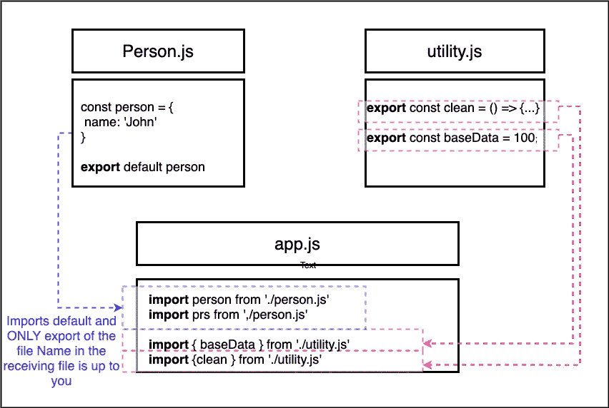

# 在使用任何框架/库之前，需要掌握 7 个 Javascript 概念

> 原文：<https://medium.com/geekculture/7-js-concepts-to-master-a71f33d676f3?source=collection_archive---------2----------------------->

## 基本现代 JavaScript 的简单指南


Photo by [Eric & Niklas](https://unsplash.com/@penguinphotography?utm_source=medium&utm_medium=referral) on [Unsplash](https://unsplash.com?utm_source=medium&utm_medium=referral)

像 React 或 Vue 这样的 JavaScript 库/框架正在统治着 web 开发世界。但是要真正体会它们的威力，您必须对某些现代 JavaScript 概念有很好的理解和掌握。

如果您知道 JavaScript，但还没有使用过 ES6 或任何其他现代版本的 JavaScript，那么直接进入 React 之类的东西可能看起来很可怕。您甚至可能认不出它是 JavaScript，不知道它是哪种新的外星语言。

放松点。你可以马上拿到这些。这篇文章将作为你的简单参考。别忘了把它加入书签。另外，不要忘记查看本文末尾的**资源**部分，以便进一步阅读。

系好安全带…我们光速前进…

# 1.理解“let”和“const”

我相信您可能熟悉`var`，这是在 JavaScript 中创建变量的典型关键字。我们知道，在一个程序的过程中，有些变量是不会改变的。它们就是所谓的*常数*。从技术上来说，它们都只是变量，因为 JavaScript 只知道`var`。

ES6 是 JavaScript 的新版本，引入了两个不同的关键字`let`和`const`。

当然`var`仍然有效，但是强烈建议你使用`let`和`const`。`Let`就像新的`var`，你把它用于变量值。

> 这里最重要的一点是，如果你想创建一个真正的变量或者改变它的值，就使用`let`。如果你正在创建一个常量值，比如你分配一次就不会改变的东西，那么使用`const`。当您使用现代 JS 框架/库时，这种情况比您想象的更常见。

让我们快速看一下它们是如何工作的。在过去的日子里，我们会做这样的事情

```
var userName = 'John';
console.log(userName);
```

那么如果我们给`username`重新赋值

```
userName = 'Doe';
console.log(userName);
```

让我们运行它。您将看到`John`首先被打印，然后是`Doe`

现在我们用`let`代替`var`

```
let userName = 'John';
console.log(userName);userName = 'Doe';
console.log(userName);
```

当您重新运行代码时，您将看到相同的输出，没有任何变化。因此`let`本质上与`var`一样工作。所以，有什么大不了的？

> 声明是全局作用域或函数/局部作用域。而`let`是块范围的，即花括号`{}.`内的任何东西。同样，`var`变量可以被重新声明和更新。`let`变量只能更新，不能重新声明。这里有一篇来自 freecodecamp 的好文章深入探讨了这种差异。

现在让我们来看看`const`

```
const userName = 'John';
console.log(userName);userName = 'Doe';
console.log(userName);
```

现在，如果您尝试运行它，您将会看到首先打印出`John`,然后是一条错误消息。

```
TypeError: Assignment to constant variable.
```

这是因为 a `const`的值不能通过重新赋值来改变，也不能重新声明。

# 2.箭头功能及其使用方法

哦天啊。这个最让我兴奋。你最常遇到的另一个构造是*箭头 functions⁴* 。不仅仅是声明函数的语法糖，还有`this`关键字在箭头函数中的表现。

带有关键字`function`的普通 JavaScript 函数如下所示。

```
function doSomething() {
  // some more logic...
}
```

或者你可以把它作为一个函数表达式

```
var doSomething = function() {
  // Some more logic ...
}
```

现在，这就是一个**箭头函数**的样子。还有，被称为**的胖箭头功能。**

```
const doSomething = () => {
 // Some more logic...
}
```

这里我们将函数引用存储到一个常量中，在`=`的右边是箭头函数的语法。圆括号`()`中有一个参数列表。这里是 none，后面是`=>`或箭头，后面是花括号`{}`之间的函数体。

> 由于省略了`function`关键字，Arrow 函数不仅具有更短的语法，它还提供了好处，并消除了我们过去与可怕的`this`关键字的许多混淆。
> 
> 理解臭名昭著的`this`关键字是如何工作的是一个很好的兔子洞。看看这些媒体文章[这里](/search?q=this%20keyword) ⁵。

让我们看几个例子和箭头函数的变化。首先，让我们从一个普通函数作为参考点开始

```
function printUserName(userName) {
   console.log(userName);
}printUserName('John');
```

输出是*约翰。*箭头功能等价物将如下所示(当然，如果您打算重新分配该功能，您将使用`let`而不是`const`)

```
const printUserName = (userName) **=>** {
   console.log(userName);
}printUserName('John');
```

您仍然会看到*约翰*作为输出。让我们看看这种语法的几种替代方法。如果你只收到一个(正好一个！)参数，您可以使用省略括号的捷径，例如

```
const printUserName = userName **=>** {
   console.log(userName);
}printUserName('John');
```

然而，如果你有一个函数不接受任何参数，那么你将不得不像这样使用空括号

```
const printUserName = () **=>** {
   console.log('John');
}printUserName();
```

同样，对于多个参数，您必须使用括号

```
const printUserName = (userName, age) **=>** {
   console.log(userName, age);
}printUserName('John', 28);
```

这些是关于论点的不同变化。关于功能体也有不同的选择。如果你有一个函数，只是返回一个数字的平方。我们可以有一个像这样的短箭头函数，你可以省略花括号和`return`关键字。

```
const squared = number => number ** 2; 
console.log(squared(3));
```

# 3.学习 Exports⁶和 Imports⁷的模块化代码

学习如何编写模块化 JavaScript 是必不可少的，即使你没有使用任何框架/库。为了更好的可维护性和重用性，代码被分割到多个文件中。

在`export`和`import`语句或者所谓的*模块*背后的想法是，在一个 JavaScript 文件内部，我们可以从另一个文件导入内容。以便 JavaScript 文件本身知道它们的依赖关系。

它可能看起来像这样



Created by author

第一个文件`person.js`我们有一个`constant` *person* ，它存储了一个 JavaScript 对象。我们使用关键字`export`和`default`默认导出这个文件。

我们还有另一个文件`utility.js` ，我们在其中导出多个东西，一个名为`clean`的`constant`保存一个函数，另一个保存一个数字的`baseData`。

我们有第三个文件`app.js`。我们从`person.js`和`utility.js`进口。这需要几个`import`语句。

我们看到`person.js`使用了`default`关键字。这仅仅意味着，如果我们从那个文件导入一些东西，它将是默认的导出。在我们的例子中，它将是常量`person`。因此，我们可以在 app.js 中随意命名`person`，你可以看到，在 app.js 的前两条语句中，我们导入了 person.js，但是使用了两个不同的名称`person`和`prs`，名称并不重要。

`utility.js`有一点不同，我们从两个不同的常量导入，因此我们使用花括号`{}`来明确地从该文件中指定特定的内容。这些被称为*命名出口。在`utility.js`中提供准确的名称很重要。你也可以把它写成一条语句*

```
import {clean, baseData} from './utility.js'
```

使用*默认导出，*你可以随意命名

```
import person from './person.js'
import prs from './person.js'
```

用*命名导出，*你可以这样做

```
import {clean} from './utility.js'//also use an alias
import {clean as cln} from './utility.js'//or import everything with * with an alias and use it as bundled.clean
import * as bundled from './utility.js'
```

# 3.了解 Classes⁸

类来自面向对象的编程世界，是的，你也可以在 JavaScript 中使用它们。

把类想象成创建对象的蓝图/模板。他们就像制作饼干的切饼刀，饼干是对象。另一个例子是使用模板来绘制形状，其中模板是类，而形状是对象。

使用`class`关键字定义一个类。一个类可以同时拥有属性和方法。属性是附加到类的变量。方法是附加在类上的函数。在下面的代码片段中，`person`是一个以`name`为属性的`class`，而`call`是一个方法

```
class Person {
   name = 'John'
   call = () => {// Some logic...}
}
```

当你想用一个`class`创建一个`object`时，它被称为*实例化*一个类。使用`new` ⁹关键字实例化一个类(换句话说，创建一个对象)。

```
const myPerson = new Person()
myPerson.call()
console.log(myPerson.name)
```

类也支持继承。您可以从另一个类继承所有属性和方法，并向继承的类中添加新的属性和方法。您使用`extends`关键字来继承类。

```
class person extends Human
```

让我们看一个`class`的快速例子

```
class Person {
  constructor() {
    this.name = 'John';
    }
   printMyName() {
     console.log(this.name);
}const person = new Person();
person.printMyName();
```

约翰的输出是

*在上例中，我们定义了一个`class` `Person`。您会注意到我们使用了一个`constructor`函数。构造函数允许您为创建的对象设置默认特征。*

*另外，您会注意到我们使用了`this`关键字来引用该类的当前实例。*

*让我们看一个使用同一个类继承⁰的简单例子*

```
*class Human {
  constructor () {
    this.gender = 'male';
    }
    printGender() {
      console.log(this.gender);
    }
}// Inherit from Human Class
class Person **extends** Human {
  constructor() {
    **super()**;
    this.name = 'John';
    }
   printMyName() {
     console.log(this.name);
}const person = new Person();
person.printMyName();
person.printGender();*
```

*这里，Person 类继承/扩展了 Human 类。您会注意到，即使是人类类也有构造函数。为了访问人类类中的构造函数，我们必须使用`super()`函数。*

*您将会更经常地遇到类，尤其是在 React 中基于类的组件。*

# *4.在类中使用 NextGen 属性和方法*

*下一代 JavaScript 还为初始化属性和方法提供了新的语法。*

*我们已经知道，属性就像附加在类/对象上的变量。方法就像附加到属性/对象上的函数。*

*使用 ES6 格式，我们已经看到在类中这样使用构造函数*

```
*constructor () {
  this.myProperty = 'value'
}*
```

*使用 NextGen JavaScript，我们可以跳过构造函数，直接在类中分配属性。在幕后，这仍然会被转换成一个构造函数，但是你会有一个更容易的时间来编写它。*

```
*myProperty = 'value'*
```

*这和方法非常相似。在 ES6 中，我们有如下方法*

```
*myMethod () {...}*
```

*下一代 JavaScript 的方式是使用类似于设置属性的语法。简单地把一个方法想象成一个属性，它把一个函数存储为一个值，然后我们得到*

```
*mymethod = () => {...}*
```

*这样做的一个好处是，因为我们使用 arrow 函数作为属性值，所以我们不会遇到令人困惑的关键字`this`的问题。*

*为了看到这一点，我们可以修改上一节中的例子*

```
*class Human {
  gender = 'male';
  printGender = () => {
      console.log(this.gender);
    }
}// Inherit from Human Class
class Person **extends** Human {
  this.name = 'John';
   printMyName = () => {
     console.log(this.name);
}const person = new Person();
person.printMyName();
person.printGender();*
```

# *5.有用的 Spread & Rest 运算符*

*现在让我们看看两个新的操作符，它们将使我们作为开发人员的生活变得更加容易。他们是传播和休息运营商。有趣的是，它们看起来一样`…` (3 个点)。根据您使用它们的位置，它们可以作为 spread 或 rest 操作符。*

*spread 运算符用于拆分数组元素或对象属性。所以我们“展开”一个数组或对象。*

*例如，如果我们有一个旧数组，我们想将旧数组中的所有元素添加到一个新数组中，并额外添加一些元素，这就是我们要使用的语法。*

```
*const newArray = [...oldArray, 1,2]*
```

*`oldArray`前面的`…`将简单地取出所有元素，并将它们添加到新数组中。这同样适用于对象*

```
*const newObject = {...oldObject, newProp: 3}*
```

*这里，`…`取出`oldObject`和值，将它们作为`newObject`的键值对相加。顺便提一下，如果旧对象已经有了一个`newProp,`，它将被 newProp 用值 3 覆盖。*

*现在让我们看看 Rest 操作符。这是同一个`…`操作符，但用法不同，这里它用于将一组函数参数合并到一个数组中。这里有一个例子*

```
*const sortArgs  = (...args) => {
  return args.sort()
}*
```

*`sortArgs`函数接收无限数量的参数，使用`…`，我们只写一个参数`args`。但是我们可能会收到不止一个参数，它们都将被合并到一个数组中。我们可以方便地将数组方法应用到我们的论证中。*

# *6.解构*

*析构允许我们轻松地提取数组元素或对象属性，并将它们存储在变量中。*

*我知道你在想，这听起来就像是 spread operator 做的事情。听我说完！*

> *Spread 取出所有元素或所有属性，并将它们分布在一个新的数组或对象中。析构允许我们提取单个元素或属性，并将它们存储在变量中。*

*对于数组，它看起来像这样*

```
*[a,b] = ['Hello','John']
console.log(a) // prints Hello
console.log(b) // prints John*
```

*如果我们有一个包含两个元素的数组——Hello 和 John，那么我们可以使用等号左边奇怪的语法将变量`a`和`b`分别赋给`Hello`和`John`*

*对于对象析构，语法是一样的，但是用了花括号`{}`。*

```
*{name} = {name:'John', age:28}
console.log(name) // Prints John
console.log(age) // undefined*
```

*在数组析构中，顺序定义了我们取哪个属性，对于对象析构来说是属性名。因此,`=`符号左侧的`{name}`指向右侧的`name`属性并提取值。这就是为什么记录`age`属性会产生`undefined`的原因。*

# *7.刷新原始⁴和参考⁵类型*

*这不是一个现代的 JavaScript 概念，但是正确理解这一点非常重要。它可以让你免于在无意中牺牲很多个晚上的调试时间！*

*如果我们创建一个这样的数，这就是一个原始类型*

```
*const number = 5*
```

*现在，如果我们创建第二个数字`num2`并将其分配给`number`，这实际上创建了一个真正的`number`的新副本并将值分配给`num2`。*

```
*const num2 = number
console.log(num2) // prints 5*
```

> *数字、字符串、布尔值都是原始类型。当你在另一个变量中重新赋值或存储时，就会创建一个真实的副本。*

*如果我们观察对象和数组*

```
*const person = {
  name = 'John'
}*
```

*现在，如果我们创建第二个对象`secondPerson`并将`person`赋值*

```
*const secondPerson = person;
console.log(secondPerson); // prints same vale as person*
```

*当我们记录`secondPerson`的值时，它打印出与`person`相同的值。它不会复制`person`，而是将`person`对象存储在内存中，并将指向该内存位置的指针复制到`secondPerson`。*

*现在，如果我们在将`person`的名称属性分配给`secondPerson`之后更改它，我们仍然会看到为`secondPerson`记录的`person`的新值。*

```
*const secondPerson = person;
person.name = 'Doe'
console.log(secondPerson); // prints same value as updated person*
```

*这与数组的行为相同。这变得非常重要，因为它会导致代码中的意外行为。如果你像这样复制数组或对象，并打算创建实际的副本，这是行不通的！*

*为了创建引用类型的实际副本，我们可以使用 spread 操作符`…`。所以我们修改后的代码将如下所示*

```
*const person = {
  name = 'John'
};const secondPerson = {
  ...person
};*
```

*现在`seconPerson`是一个实际的副本。修改`person`不会影响`secondPerson`。*

# *结论*

*如果你能走到这一步，太棒了！谢谢你抽出时间。现在不要被这些新语法吓倒，这仍然是 JavaScript。吸收这些的最好方法是通过实践。我鼓励您回到前面的章节并进行练习，进一步的阅读请查看参考资料部分。黑客快乐！*

*您可能还喜欢:*

*[](/nerd-for-tech/21-lessons-from-building-clones-on-youtube-45340535cf32) [## 在 Youtube 上构建克隆的 21 个教训

### 作为一名软件开发人员，如何巩固你的学习和成长

medium.com](/nerd-for-tech/21-lessons-from-building-clones-on-youtube-45340535cf32) 

# 资源

说到 JavaScript 的真相来源绝对是 [Mozilla 开发者网络(MDN)](https://developer.mozilla.org/en-US/docs/Web/JavaScript) 。

1.  `[var](https://developer.mozilla.org/en-US/docs/Web/JavaScript/Reference/Statements/var)`上的 MDN 参考
2.  `[let](https://developer.mozilla.org/en-US/docs/Web/JavaScript/Reference/Statements/let)`上的 MDN 参考
3.  `[const](https://developer.mozilla.org/en-US/docs/Web/JavaScript/Reference/Statements/const)`上的 MDN 参考
4.  [箭头功能](https://developer.mozilla.org/en-US/docs/Web/JavaScript/Reference/Functions/Arrow_functions)上的 MDN 参考
5.  [理解 javascript 中的](/search?q=this%20keyword) `[this](/search?q=this%20keyword)` [关键字](/search?q=this%20keyword)
6.  `[export](https://developer.mozilla.org/en-US/docs/web/javascript/reference/statements/export)`上的 MDN 参考和默认导出
7.  `[import](https://developer.mozilla.org/en-US/docs/Web/JavaScript/Reference/Statements/import)`上的 MDN 参考
8.  [类上的 MDN 引用](https://developer.mozilla.org/en-US/docs/Web/JavaScript/Reference/Classes)
9.  了解 MDN 上的`[new](https://developer.mozilla.org/en-US/docs/Web/JavaScript/Reference/Operators/new)` [关键字](https://developer.mozilla.org/en-US/docs/Web/JavaScript/Reference/Operators/new)
10.  了解更多关于 MDN 上 JavaScript 中的[继承](https://developer.mozilla.org/en-US/docs/Learn/JavaScript/Objects/Inheritance)
11.  [扩展语法上的 MDN 参考](https://developer.mozilla.org/en-US/docs/Web/JavaScript/Reference/Operators/Spread_syntax)
12.  [MDN 剩余参数语法](https://developer.mozilla.org/en-US/docs/Web/JavaScript/Reference/Functions/rest_parameters)
13.  [关于析构的 MDN 引用](https://developer.mozilla.org/en-US/docs/Web/JavaScript/Reference/Operators/Destructuring_assignment)
14.  [原始类型上的 MDN 引用](https://developer.mozilla.org/en-US/docs/Glossary/Primitive)
15.  [Javascript 中的引用类型](https://developer.mozilla.org/en-US/docs/Web/JavaScript/Data_structures)*