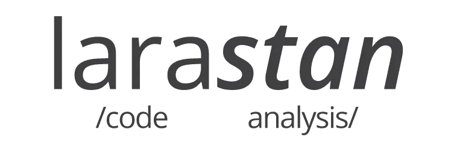
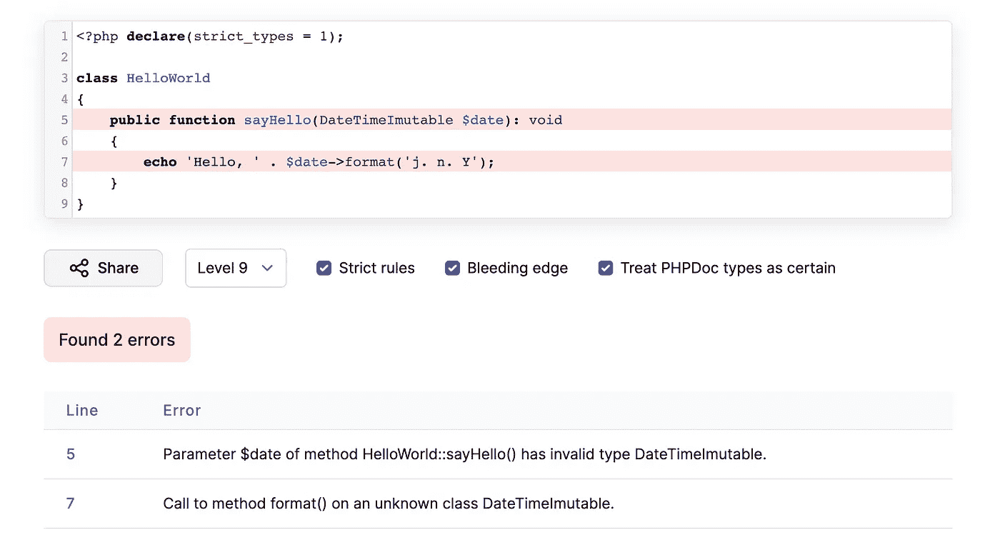
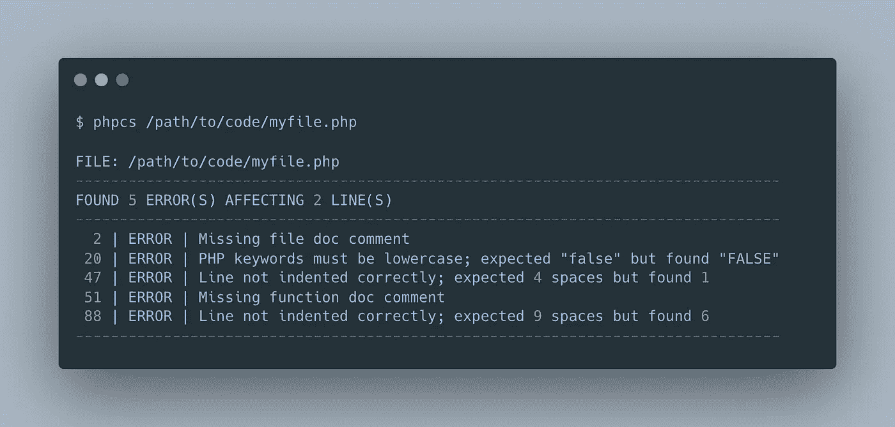
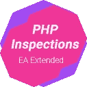
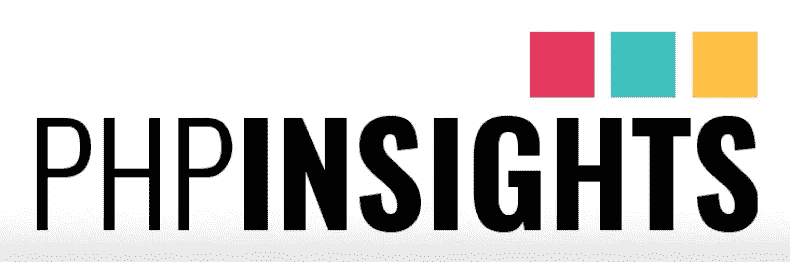
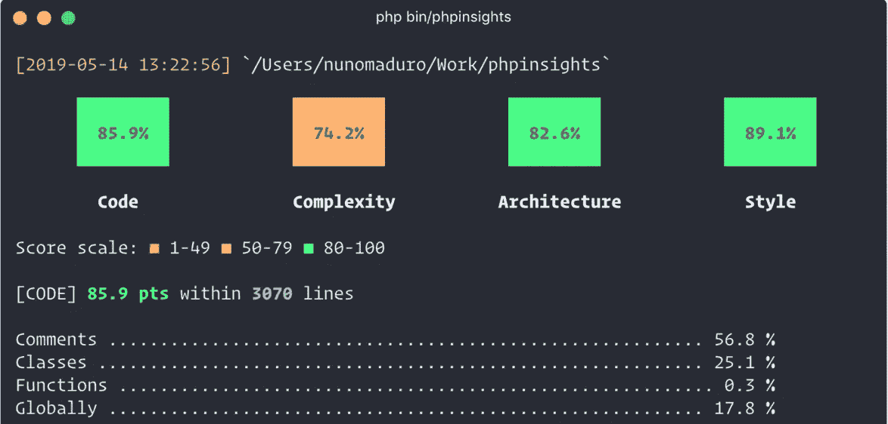
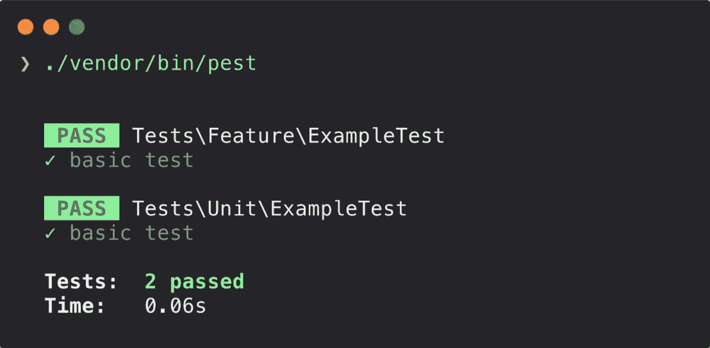
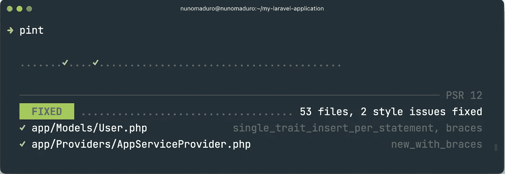

# 7 个 Laravel 包来提高编码标准和减少 bug

> 原文：<https://medium.com/geekculture/7-laravel-packages-to-improve-coding-standards-and-reduce-bugs-c6b6d853fe7b?source=collection_archive---------0----------------------->

分析编码标准和减少错误的包

Photo by [Christopher Gower](https://unsplash.com/@cgower?utm_source=unsplash&utm_medium=referral&utm_content=creditCopyText) on [Unsplash](https://unsplash.com/s/photos/code?utm_source=unsplash&utm_medium=referral&utm_content=creditCopyText)

对修复同样的问题和花费更多时间来提高你的应用程序编码标准感到沮丧？对于有更多开发人员开发的大型应用程序来说，这是一个普遍问题。我们花了更多的时间来维护整个团队的编码标准和减少错误，为了使这变得简单，我们有一些自动化的包。

众所周知， [Laravel](https://laravel.com/) 社区每天都在快速增长，为 Laravel 开发的包也在增加。我们将在本文中研究几个包，以改进 PHP 编码标准，并自动化一些手工完成的任务。

# 拉腊斯坦

larastan

[Larastan](https://github.com/nunomaduro/larastan) 是一个编码标准修复工具，它是 Laravel 的一个 [PHPStan](https://phpstan.org/) 包装器。Larastan 专注于查找代码中的错误。甚至在你为代码编写测试之前，它就能捕捉到所有类型的错误。

## 突出

1.  将静态类型添加到 Laravel 中，以提高开发人员的工作效率和代码质量。
2.  支持 Laravel 的大部分魔法方法。
3.  发现代码中的错误。

**Github - 4.1K ⭐️**

# PHPStan

PHPStan 是一个静态代码分析工具，它专注于在不实际运行代码的情况下发现代码中的错误。甚至在你为代码编写测试之前，它就能捕捉到所有类型的错误。在运行实际代码之前，可以检查每一行代码的正确性，从这个意义上说，它使 PHP 更接近于编译语言。

## 突出

1.  在 bug 进入生产之前找到它们。
2.  逐渐融合
3.  传统兼容性
4.  第三方框架集成

PHPStan

**Github - 11.2K ⭐️**

# PHP 代码嗅探器

[PHP CodeSniffer](https://github.com/squizlabs/PHP_CodeSniffer) 也是一个编码标准工具。它对 PHP 文件进行标记，并检测是否违反了一组已定义的编码标准。

PHP CpdeSniffer 是一组两个 PHP 脚本。主`phpcs`脚本标记 PHP、JavaScript 和 CSS 文件，以检测违反已定义编码标准的情况，第二个`phpcbf`脚本自动纠正违反编码标准的情况。PHP 代码嗅探器是一个重要的开发工具，可以确保你的代码保持干净和一致。

PHP code sniffer

**Github - 9.6K ⭐️**

# 表象

Phan 是一个 PHP 静态分析器。Phan 更喜欢避免假阳性，并试图证明不正确而不是正确。

Phan 寻找常见问题，并在类型信息可用或可以推断时验证各种操作的类型兼容性。Phan 对流控制有很好的理解，可以跟踪一些用例中的值(例如，数组、整数和字符串)。

**Github - 5.3 K ⭐️**

# PHP 检查

php-inspections

[PHP Inspections](https://github.com/kalessil/phpinspectionsea) 是 PhpStorm IDE 的静态代码分析器和代码审查工具。

## 突出

1.  架构相关问题
2.  弱控制类型和可能的代码构造简化
3.  性能问题
4.  魔术方法使用的验证
5.  异常处理工作流的验证
6.  兼容性问题
7.  各种耗时的错误
8.  安全问题

**Github - 1.3 K ⭐️**

# PHP 洞察

phpinsights

PHP Insights 是一个直接从终端对代码进行静态分析的工具。通过运行一个命令，它显示代码的质量，代码的复杂性，架构和编码风格。

## 突出

*   代码质量和编码风格分析
*   代码架构及其复杂性的漂亮概述
*   旨在与 Laravel、Symfony、Yii、Magento 等一起开箱即用
*   包含使代码可靠、松散耦合、简单和干净的内置检查

PHP insights-terminal

**Github - 4.7 K ⭐️**

# 害虫

pest

Pest 是一个优雅的 PHP 测试框架，专注于简单性。它有一个很好的界面来显示测试结果，还有易于理解的 API 来编写测试。

Pest 还有针对 PHP Strom 和 VS 代码的 [IDE 插件](https://pestphp.com/docs/ide-plugins)。

pest-terminal

**Github - 5.1 K ⭐️**

# 拉勒维尔品脱

l-pint

Laravel Pint 是一个为极简主义者设计的固执己见的 PHP 代码风格修复工具。Pint 建立在 [PHP-CS-Fixer](https://github.com/FriendsOfPHP/PHP-CS-Fixer) 的基础上，它使确保你的代码风格保持干净和一致变得简单。Pint 是 Laravel 框架的新成员。它将在全新安装时预装。

默认情况下，Pint 不需要任何配置，并会通过遵循 Laravel 固执己见的编码风格来修复代码中的代码风格问题。

pint-terminal

**Github - 2 K ⭐️**

# 结论

有多种开源工具可以维护编码标准，减少 Laravel 中的 bug。从上面选择最适合您的项目和环境的工具。

感谢您的阅读。