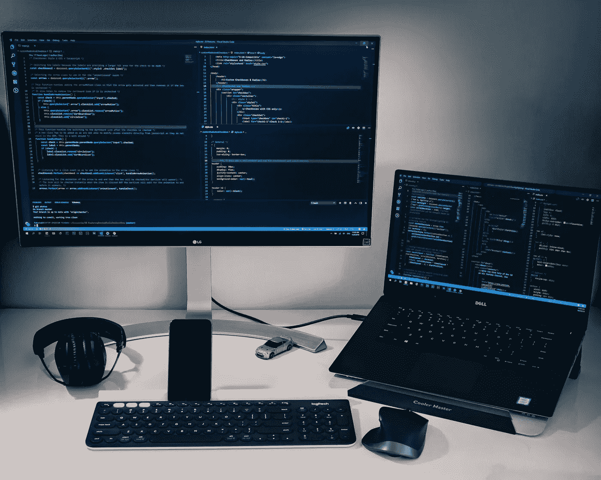

# 成为更好的 macOS 开发者的 7 个 macOS 项目

> 原文：<https://medium.com/geekculture/7-macos-projects-to-become-a-better-macos-developer-5043f4237a3c?source=collection_archive---------2----------------------->

## 立即构建一款出色的应用

Photo by [Safar Safarov](https://unsplash.com/@safarslife?utm_source=unsplash&utm_medium=referral&utm_content=creditCopyText) on [Unsplash](https://unsplash.com/s/photos/Swift?utm_source=unsplash&utm_medium=referral&utm_content=creditCopyText)

阅读大量代码是提高开发技能的最佳方式之一。开源项目是了解最佳实践、编码风格和许多其他主题的最佳地方。这里我整理了 7 个 macOS 项目，可以帮助你学到很多东西。