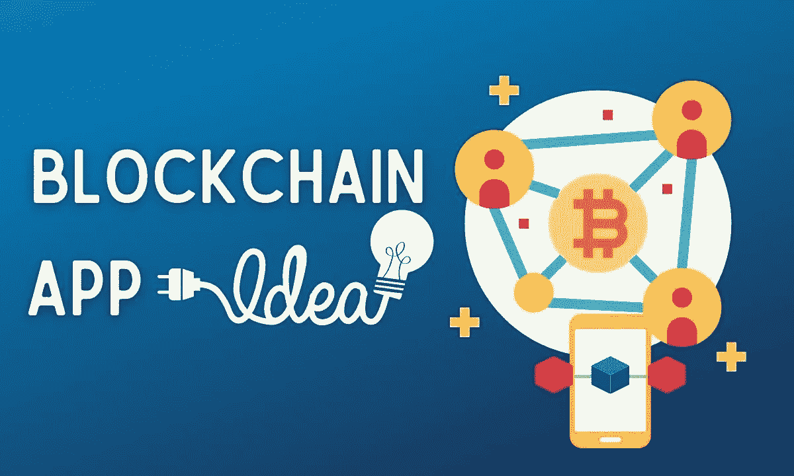
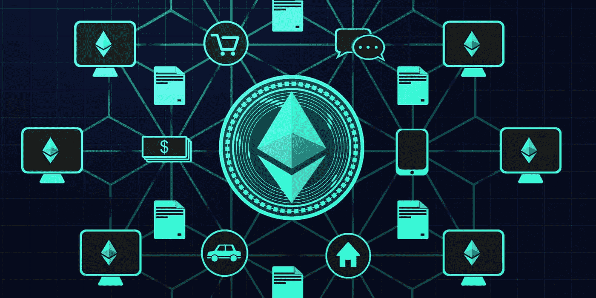
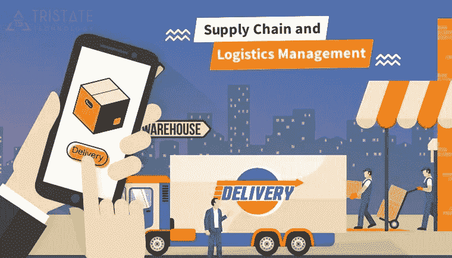
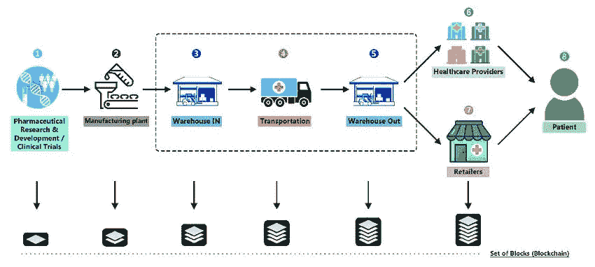
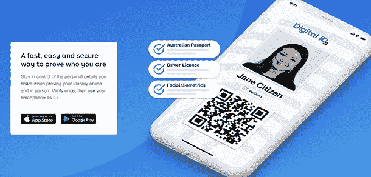
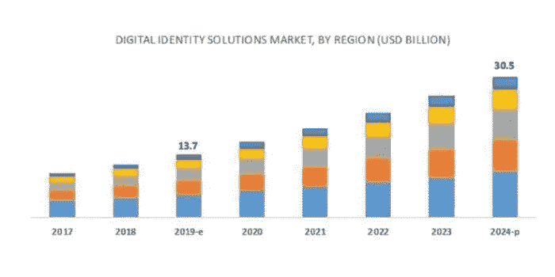
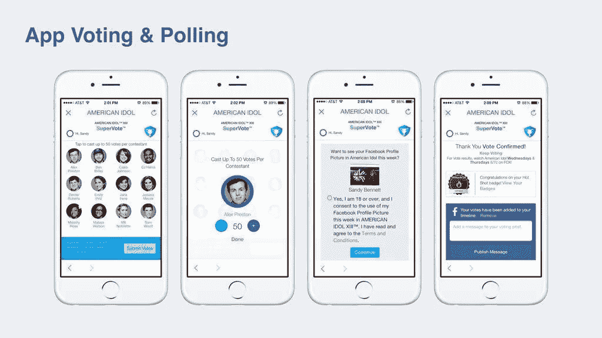
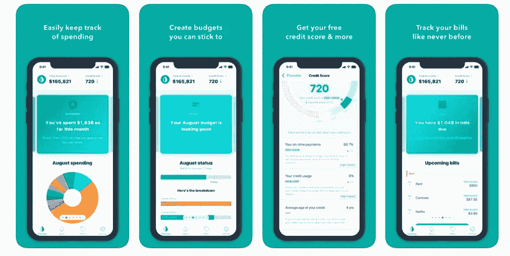
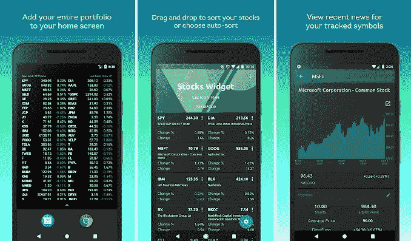

# 7 个令人兴奋的区块链应用创意，推动 2022 年的业务增长

> 原文：<https://medium.com/geekculture/7-mind-blowing-blockchain-app-ideas-to-boost-up-business-growth-in-2021-df231b103893?source=collection_archive---------7----------------------->

在全球范围内，区块链市场预计将从 2020 年的 30 亿美元增长到 2025 年的 397 亿美元，2020-2025 年期间的复合年增长率(CAGR)为 67.3%。

*Image Source:* [*marketsandmarkets*](https://www.marketsandmarkets.com/Market-Reports/blockchain-technology-market-90100890.html#:~:text=Blockchain%20market%20size%3F-,The%20global%20blockchain%20market%20size%20is%20expected%20to%20grow%20from,67.3%25%20during%202020%E2%80%932025.)

对安全移动应用、简化业务流程和无缝供应链管理应用的需求不断扩大，这增加了区块链技术在商业应用中的部署。

简单来说，[区块链技术](https://emma347.medium.com/what-is-blockchain-how-is-blockchain-technology-going-to-help-e0593a60a046)提供安全和匿名的交易。它生成准确的点对点安全交易，有两个最重要的角色:

1.  数据安全
2.  虚拟盒式交易价值

为了更好地了解它，让我们用一个例子来讨论它:

早些时候，互联网被用来处理多种任务，如发送或接收邮件或阅读和分享文章，但现在，这种先进的互联网与金融部门的数字资产，可以触摸和保护的有价值的对象一起工作。这些资产以编码的形式存储在一个网络到网络的链上，这个链就是区块链。

2009 年推出区块链；从那时起，它改变了行业的思维方式，因为现在企业寻求更加透明、安全和可靠的技术。

**知名公司**如 **IBM** 、**三星 SAP** 、**马士基**都在利用**区块链技术**的去中心化账本系统。

让我们继续前进，了解将推动您在 2021 年及未来几年业务增长的 7 大区块链应用创意。

# 最佳区块链应用创意 2021–22

你可以在即将到来的区块链项目中使用的区块链应用理念将有助于你的企业在市场上取得良好的影响力，并在技术采用竞争中保持领先地位。

# 1.分散式应用

*Image Source:* [*marketsandmarkets*](https://www.marketsandmarkets.com/Market-Reports/blockchain-technology-market-90100890.html#:~:text=Blockchain%20market%20size%3F-,The%20global%20blockchain%20market%20size%20is%20expected%20to%20grow%20from,67.3%25%20during%202020%E2%80%932025.)

DApps 是运行在对等计算机网络上而不是单台计算机上的数字程序。这种区块链应用程序的想法将帮助您的企业建立一个将数据存储在分散数据库中的应用程序。

大多数小型到大型企业广泛使用 DApps 来跟踪货物和跨境金融交易，而不包括任何第三方，即中央银行。

**Chainlink** 、 **PokerKing** 、 **LBank** 和 **Crypto** 、 Kitties 都是市场上比较知名的 DApps。

2018 年活跃**dapp 数量跨越 2.3k 被 42k 个不同活跃用户使用**。(《自杀风险投资报告》)

嗯，创建 DApps 非常困难，所以你可能需要雇用在优秀的区块链应用开发公司工作的区块链开发人员，因为这将支持你创建可靠、安全、动态的去中心化应用。

**基于区块链的 DApps 优势**

*   开放源代码
*   没有中心故障点
*   内部货币的使用
*   分散共识机制

# 2.供应链管理应用程序

*Image: Tristate Technology*

供应链管理应用是一种被广泛采用的区块链应用理念，主要提供实时分析系统，有效处理服务和商品的流动，涉及通过供应链网络将原材料转化为最终产出的所有方法。

区块链供应链管理应用将支持简化工作流程，并将流程引向正确的方向。它提供了观察明确的业务供应链活动的透明度，以提高客户价值并在市场中获得竞争优势。

**供应链管理软件**部门**收入**预计在 2021 年达到**17144.51 万美元，预计在 2021-2025 年**之间 **CAGR** 为 **6.53%** **，导致**市场** **成交量**为**22082 美元。( [Statista](https://www.statista.com/outlook/tmo/software/enterprise-software-/supply-chain-management-software/worldwide#revenue) )****

*Image Source: ResearchGate*

**基于区块链的供应链管理应用优势**

*   订单管理
*   存货管理
*   基于云的移动性
*   物流和运输详情
*   分析和预测
*   退货管理
*   安全性和可扩展性

# 3.基于数字身份的应用

*Image Source: SecureIDNews*

简而言之，数字身份是在显示外部代理的计算机系统上创建的实体的一条信息。数字身份应用程序为人们在各种场所(如企业、网站和酒吧)验证身份提供了一种更简单、更快捷、更可靠的方法，无需提供原始证书的复印件。

**Bluink** 、 **globaliD** 和 **Yoti** 是市场上一些著名的基于数字身份的应用。

在全球范围内，**数字身份解决方案**市场在 2019 年创造了**137 亿美元的**收入，预计到 2024 年将达到**305 亿美元，2019 年至 2024 年的复合年增长率为 **17.3%。**(marketsandmarket.com)**

*Image Source: marketsandmarket.com*

**基于区块链的数字身份应用的优势**

*   拥有重复身份证明的便利性
*   自我主权身份
*   轻松流畅的识别
*   非托管逻辑解决方案
*   分散式 web 身份管理

# 4.运输和物流应用

*Image Source: OpenGeeksLab*

交通领域的区块链技术为订单转移、跟踪和验证提供了快速和可扩展的解决方案。在区块链的支持下，卡车部件的供应链可以很容易地在数字账本上进行跟踪。

此外，运输和物流应用程序包括一个分散的公共总账系统，可以实时记录所有修改，并减少笔误。

**基于区块链的交通物流 app 福利**

*   文档的简单协调
*   降低运输成本
*   简单的批准和许可
*   安全、经过验证和更新的数据

# 5.政府投票应用程序

*Image Source: Beatgrid Media*

政府在开发领先的政府投票应用程序时面临一个重大问题。在制作投票应用程序时，保持高标准的隐私并消除投票篡改可能很困难，但在应用程序中集成区块链技术可以帮助您解决这些问题。

此外，总部位于区块链的数字政府应用程序提供了数据保护、简化的流程、减少的欺诈和更好的问责制。这类应用消除了单点故障，保护了公民的敏感数据和政府的安全。嗯，如果你正在考虑开发投票应用程序，那么我会建议你在知名的 [**区块链应用程序开发公司**](https://www.valuecoders.com/blockchain-development-company?utm_source=medium_blockchain_idea&utm_medium=d7&utm_campaign=blockchain_idea) 工作，寻求专家的帮助，因为这样做可以帮助你形成一个可靠的应用程序。

**基于区块链的政府应用优势**

*   减少冗余
*   简化流程
*   扩展的安全性和安全性
*   减少审计负担
*   更好的数据完整性
*   提高效率和降低成本

# 6.个人理财 App

*Image Source: mova.in*

基于区块链的个人财务管理应用程序是实施最多的财务区块链应用程序，旨在毫不费力地扩展到市场，为业务增加价值。

消费者更关注他们的工资，这些应用程序可以帮助企业在市场上取得良好的影响力。此外，这些应用程序是一个重要的应用程序，用户可以轻松地对他们的收入和投资进行分类，并实时跟踪活动，以全面、更好地了解如何高效、明智地处理财务。

**区块链在个人理财 app 中的好处**

*   立即结算
*   增强资本优化
*   更好的透明度和可追溯性
*   提高安全性和安全性
*   降低交易对手风险
*   减少错误处理和协调

# 7.股市应用程序

*Image Source: Android Example 365*

区块链技术肯定会在几个方面影响股票市场的未来。目前，由于中介的参与，一些企业通过合同流程需要几天才能获得批准，如交易所、票据交换所和监管流程。

但如果我谈论区块链网络，那么补偿时间从几天减少到几分钟，并提供增强和减少的错误交易。股票市场区块链应用程序的想法是促进一种独特的数字资产的交易。

**区块链股市 app 好处**

*   更好的互操作性和信任
*   提高透明度和公平性
*   简单的清算和结算流程
*   交易后事件的自动化
*   简单合法的所有权转移

因此，市场上有几个区块链应用程序的想法，你可以用来开发一个有影响力的应用程序，以帮助企业在市场上保持领先地位。

# 包扎

我希望入围的顶级区块链应用程序创意最适合您的初创公司、中小企业或大型企业。那么，要将区块链应用的想法转化为现实，你可能需要利用最顶层的 [**区块链软件开发公司**](https://www.valuecoders.com/blockchain-development-company?utm_source=medium_blockchain_idea&utm_medium=d7&utm_campaign=blockchain_idea) 的区块链软件开发服务。这将帮助您的企业形成一个独特而非凡的基于区块链的 app。