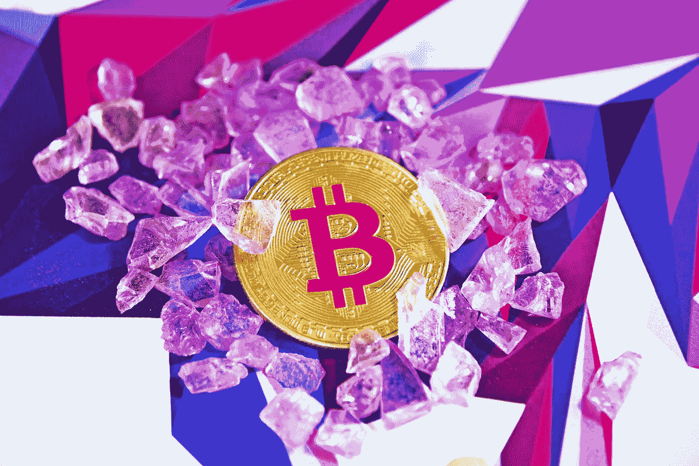

# 投资加密时你会犯的 7 个错误

> 原文：<https://medium.com/geekculture/7-mistakes-you-will-make-when-investing-in-crypto-2ef873e53abb?source=collection_archive---------12----------------------->

## 以及如何避免它们

Photo by [Executium](https://unsplash.com/@executium?utm_source=unsplash&utm_medium=referral&utm_content=creditCopyText) on [Unsplash](https://unsplash.com/s/photos/crypto?utm_source=unsplash&utm_medium=referral&utm_content=creditCopyText)

比特币有什么好大惊小怪的？

它出现在新闻中，社交媒体上，你的收件箱里，甚至你的屠夫也在谈论它(屠夫什么时候变成财务顾问了？LoL)。一些人对此持否定态度，试图灌输 FUD，而另一些人则声称这是自《切片面包》和《FOMO》以来最好的事情。