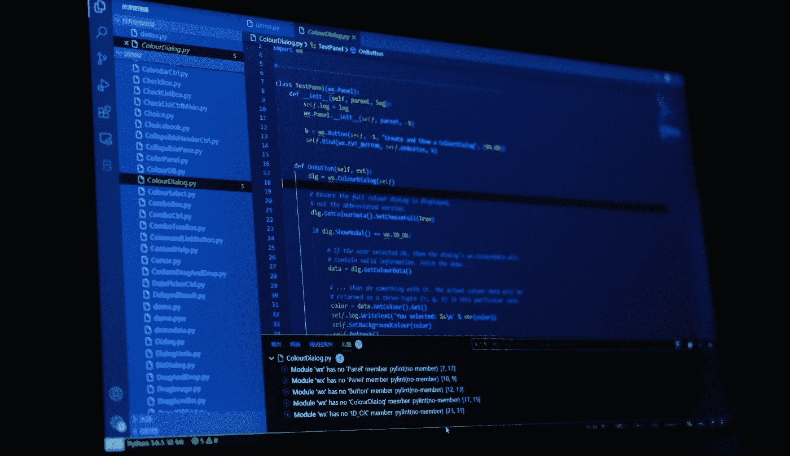

# 你应该知道的 7 个最好的 Python CLI 库

> 原文：<https://medium.com/geekculture/7-python-cli-library-you-should-know-cba23c873b34?source=collection_archive---------1----------------------->

## 增强您的 Python 开发能力

Photo by [Riku Lu](https://unsplash.com/@riku?utm_source=medium&utm_medium=referral) on [Unsplash](https://unsplash.com/?utm_source=medium&utm_medium=referral)

有句谚语“不必多此一举”。图书馆就是最好的例子。它帮助你以一种简单的方式编写复杂而耗时的功能。根据我的观点，一个好的项目使用一些最好的可用库