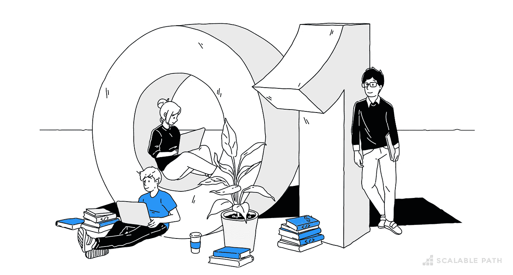

# 区分伟大程序员和优秀程序员的 7 个品质

> 原文：<https://medium.com/geekculture/7-qualities-that-differentiate-a-great-programmer-from-a-good-programmer-283ff1775a79?source=collection_archive---------59----------------------->

## ***7*** *让一个伟大的程序员与众不同的品质*

伟大的程序员是罕见的。他们的生产力是一般开发人员的 3 倍，是糟糕开发人员的 10 倍*。世界上最顶尖的 1%的开发人员不仅仅编写可靠的代码，还拥有重要的无形特质。