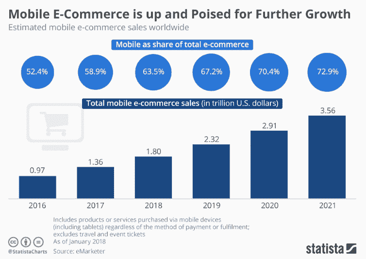
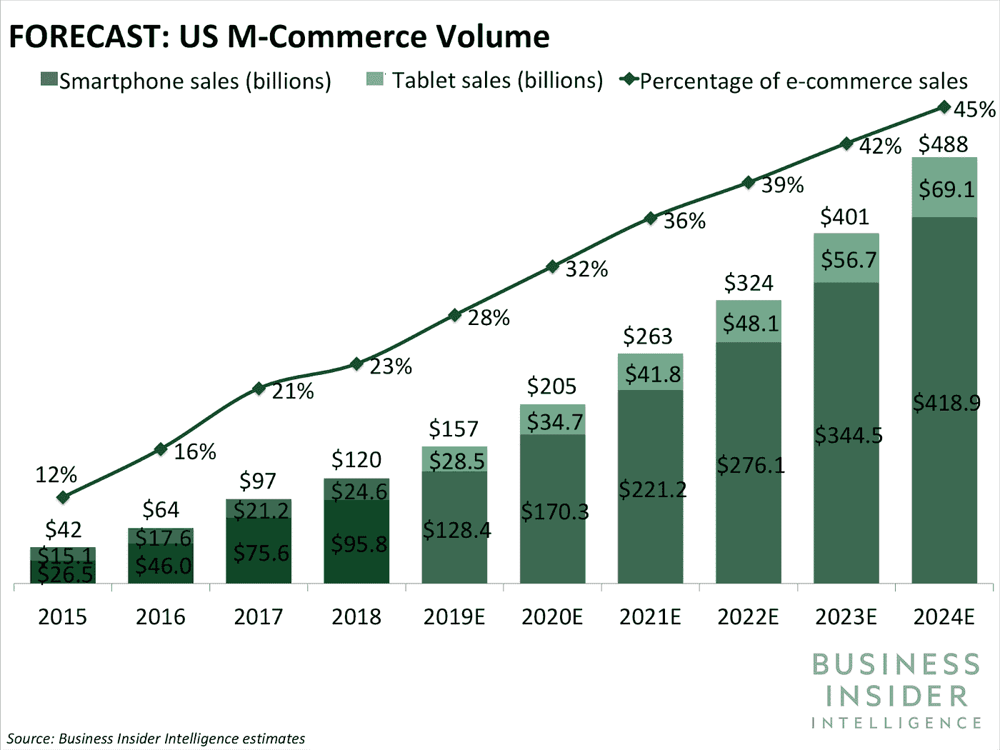
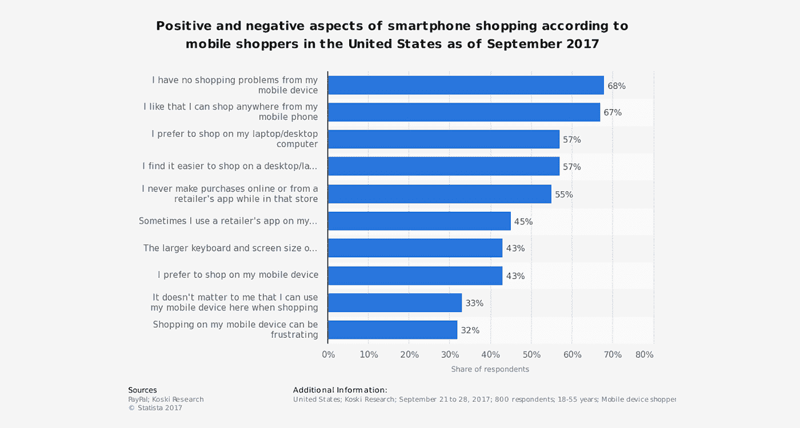
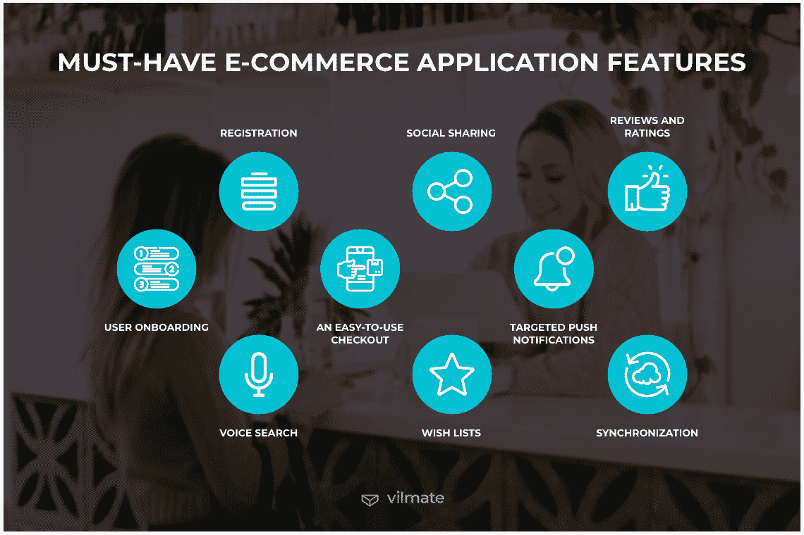

# 移动应用对您的电子商务业务至关重要的 7 个原因

> 原文：<https://medium.com/geekculture/7-reasons-why-a-mobile-application-is-significant-to-your-ecommerce-business-7466d6d93ba3?source=collection_archive---------22----------------------->

[Image source](https://www.netsolutions.com/insights/businesses-need-mobile-ecommerce-app/)

想想你的企业可以以天空为极限做些什么。不断扩大的电子商务行业证明，人们比以往任何时候都更喜欢购物，你可以在任何地方通过任何设备接触到他们——但并非所有设备都会带来同等程度的成功。

最近的研究表明，96%的美国成年人拥有一部手机(包括 81%的 T2 人拥有智能手机)。也就是说，确保他们可以通过他们喜欢的平台访问你的网站或应用程序是很重要的，这样你就不会错过了！

[Image source](https://buildfire.com/mobile-ecommerce-statistics-data/)

如今，电子商务业务的范围是无限的；根据皮尤研究中心的一项研究，仅去年一年，全球就有 97%的互联网用户在网上购物。

近年来，移动商务一直在稳步普及，这主要是由于触摸屏等技术的进步，触摸屏模拟了类似于通过计算机浏览器浏览网站的体验，但数据存储无用。您一定想知道为什么要实现

## **#1。购物者更喜欢在手机应用程序上浏览商品**

就购物目的而言，移动应用程序比移动浏览器方便得多，尤其是在一次性访问电子商务网站时。78%的受访者表示，他们更愿意使用该应用程序，而不是通过手机的浏览器窗口浏览！

这种偏好并不令人惊讶:通过在你的设备上安装优步或 Seamless 等应用程序，你可以轻松点餐，而不必经过许多步骤和排队等候。有了这些便利(而且没有信息被泄露的风险)。

很容易理解为什么这么多人现在更喜欢使用移动应用程序，而不是仅仅通过他们的互联网浏览器应用程序(如 Chrome 或 Safari)中的网址访问网站。此外， [**电子商务开发商**](https://www.valuecoders.com/hire-developers/hire-ecommerce-developers) 也越来越受到企业主的青睐。

[Image source](https://www.businessinsider.in/finance/news/rise-of-m-commerce-mobile-ecommerce-shopping-stats-trends-in-2020/articleshow/72860972.cms)

## **#2。移动电子商务应用增强客户忠诚度**

使用移动应用程序，您可以赢得更多客户的忠诚度。即使他们只是下载它来查看你有什么，客户也倾向于回来使用这些功能，这些功能将有助于他们在未来进行购买——例如检查他们的订单历史或为他们最喜欢的商品之一的即将到来的销售设置提醒。

因为人们使用应用程序的时间是从工作电脑、手机、平板电脑或我们现在随身携带的任何其他设备上浏览网站的三倍，所以这些时间是有意花费的，而不是浪费在浏览页面上，因为访问者真正想要的只是联系信息！

## **#3。缩短响应时间**

app 比网站快；这就是电子商务应用程序开发受欢迎的原因。应用程序将部分数据存储在移动设备上，因此，与必须一次性检索所有信息的网络浏览器相比，它们从服务器下载的信息要少十分之一。

这意味着应用程序可以更快地完成操作，因为加载屏幕所需的等待时间或其他延迟时间远少于传统电脑或笔记本电脑。新的应用程序使用户能够简化他们的体验并节省时间。用户可以在应用程序的设置中设置默认偏好，然后应用程序只加载相关内容。

这让客户更加主动，这样他们就不会浪费宝贵的时间去浏览不相关的材料，或者被不需要的广告轰炸，最终占据你手机屏幕的空间。

## **#4。增强的用户体验**

提升你的商店的用户体验可以带来更多的销售。向用户展示应用和产品的方式至关重要，因为他们希望导航简单，没有无关的按钮或横幅，以免分散他们对所需内容的搜索。

当涉及到布局时，移动应用程序是有限制的，所以如果做得正确，这可以通过在移动屏幕上保持简单来对公司有利，这将导致令人满意的客户体验。

[Image source](https://www.toptal.com/designers/ux/ecommerce-ux-mobile-experience)

## **#5。获得竞争优势**

在这个消费者以移动设备为先的时代，如果你没有应用程序，你的电子商务网站将处于劣势。事实上，你现在仍然有任何销售是幸运的，但这不会永远持续下去，因为客户宁愿通过手机的便利和速度购物，而不是等待网站加载到台式电脑或平板电脑上。

另一方面，作为一家初创公司并创建一个强大的电子商务移动应用程序，将使你在应对当今要求苛刻的购物者时，比其他没有电子商务应用程序的网站更具优势，这些购物者经常在选择他们想要购买的网站之间犹豫不决；来自——您的还是其他竞争对手的？

这就是为什么你应该明智地选择 [**电子商务开发解决方案**](https://www.valuecoders.com/ecommerce-software-solutions) 来迎合你的客户的雄辩和魅力的应用程序体验。现在，地球上的每个零售商都在与亚马逊竞争。你基本上可以从他们那里买到世界上所有的东西——仅在美国，就有 9500 万人拥有亚马逊 Prime 会员。

显然，他们可能没有你的品牌产品，但你有多独特？顾客可以在他们的应用程序中获得其他品牌的类似产品吗？

大概吧！因此，任何时候有人访问你的网站或店面，看到它不符合客户期望在网上找到的标准，那么他们就没有理由购买——所以保持这些高质量的视觉效果，这样你就不会在与梅西百货等其他零售商的竞争中失利，梅西百货上周也刚刚宣布了“最重要的电子商务推广”计划

## **#6。使用应用程序的功能**

在数字时代，智能手机不仅仅是一个交流的工具。它们还提供对服务和应用的访问，任何在这些设备上安装了应用的企业都可以使用这些服务和应用。你可能听说过与 Instagram 或脸书等社交媒体网站相关的地理标记，但你知道当它与你公司的基于位置的应用程序结合使用时会创造奇迹吗？

*   **全球定位系统:**地理定位使用全球定位系统技术，这样用户的手机就能随时精确定位他们的确切地址；如果他们正在寻找方向或需要帮助找到附近的东西，例如最近的商店营业时间(通常显示在每个商店旁边)，这将非常有用。地理编码坐标经常被标记在卫星和航空摄影的地图上，这意味着可能再也不会有了。
*   **麦克风**:语音搜索是手机应用程序中另一个令人难以置信的功能，它简化了搜索过程，或者就像你在现实生活中一样问他们问题！这更加个性化，让那些可能对网上购物犹豫不决的顾客放心地从你的商店购买，而不会过早地做出可能不会成功的承诺。
*   相机:许多电子商务应用程序允许顾客分享购买物品的照片，并通过 Instagram 等应用程序分享到他们的社交媒体账户上，这样世界各地的人都可以看到别人穿上产品后有多棒——这给了潜在买家购买前的信心，因为现在他们知道它不会被藏在某个抽屉里再也看不到了；此外，由于许多购物者希望。

[Image source](https://vilmate.com/blog/how-to-build-an-ecommerce-mobile-app/)

## **#7。增加客户保持率**

任何时候你能够产生电子商务销售，这应该让你非常高兴。但话虽如此，不要让你的成功故事就此结束，与和 [**电子商务开发公司**](https://www.valuecoders.com/ecommerce-development-services-company) 联系，为你的客户提供无缝购物体验！研究显示，回头客的价格可能比新客户高 25 倍，但客户保持率仅提高 5%，利润就可以比以前增加四分之一以上，每次回访只需 5 美元。

38%的用户在下载电子商务应用后会再次访问 11 次以上。简而言之，这是一个很好的机会，他们会在 11+次访问期间至少购买一个。

移动用户经常访问这些应用程序；那是一个做生意的好机会。它使企业能够随时创造销售。

但是，正如我们所希望的那样，世界经济总是可以从一些帮助中受益——这就是为什么我们建议不仅要专注于创造新客户，还要留住现有客户？研究表明:吸引新客户的成本是销售一个回头客的 25 倍，而将你的保留率提高 5%就能获得 25%-95%的利润。

## **结束**

创建一个电子商务移动商店是一个接触和吸引新客户的好方法。这并不难，但是在你的网站有足够的流量让你做任何销售之前需要时间。您应该考虑创建一个可能适合您的业务目标的所有原因。

由于无数的好处， [**电子商务应用程序开发服务**](https://www.valuecoders.com/ecommerce-development-services-company) 正在获得巨大的牵引力，并使企业能够迎合现代电子商务购物体验。