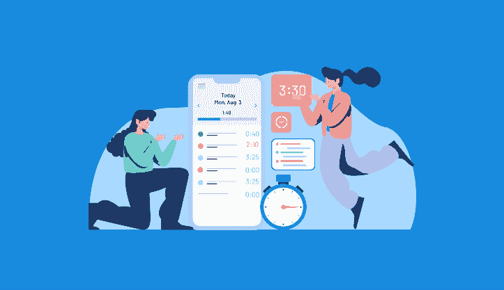

# 您的企业需要最佳上下班打卡应用程序来跟踪工作时间的 7 个理由

> 原文：<https://medium.com/geekculture/7-reasons-your-business-needs-the-best-clock-in-and-out-app-to-track-work-time-4eb5163edc64?source=collection_archive---------19----------------------->

7 Reasons Your Business Needs the Best Clock in and Out App to track work time

[来源](https://www.actitime.com/wp-content/uploads/2020/03/The-10-Best-Time-Tracking-Solutions-of-2020.png)

在现代商业世界中，跟踪员工的工作时间并确保每个人都尽自己最大努力工作是至关重要的。对于大多数企业来说，这意味着使用员工填写工作日开始和结束时间的时间卡。虽然这种方法有效，但它不是很准确，并且缺乏 GPS 技术的实时数据跟踪。此外，如果没有合适的工具，在您的企业中节省时间也是一项挑战。

做到这一点的一个方法是确保您的员工使用最佳的进出应用程序时钟来跟踪他们的工作时间。这些应用程序对于任何希望改进其流程的企业来说都是必不可少的，使您能够确保不会遗漏任何时间，并解放您员工的时间(从日常手动任务中),以便他们可以更有效地将时间用于工作或在家与家人相处。

看看这七个原因，为什么你的企业需要最好的上下班打卡来跟踪工作时间，这样你就可以看到实施一个可以如何改善你的运营。

## **1)提高效率**

您的企业一直在寻找提高效率和生产力的方法。该应用程序的正确上下班时间可以帮助你做到这一点。通过跟踪员工的工作时间，您可以确定将提高效率的改进领域。

有了这样的软件，很容易确定员工在具体任务上花了多长时间，以及他们把时间花在了哪里。因此，如果你的一名员工上班打卡太晚或早退而没有记录在案， [**GPS 时间跟踪软件**](https://www.workstatus.io/best-gps-time-tracking-software-online?utm_source=gp&utm_medium=chanty-rn&utm_campaign=RN) 将为你捕捉这些信息，你就能弄清为什么会发生这种情况。

带 gps 的打卡应用程序使管理员工变得更加简化，同时也提高了准确性，因为经理可以更好地了解员工一天都在做什么，以及谁在什么时候打卡上下班。

员工也可以更好地了解他们在任何给定时刻应该做什么，因为带 gps 的打卡应用程序旨在让他们负责，同时让他们准确知道在指定的时间范围内什么时候打卡和下班。

## **2)带有自动计算功能的简易时间表**

对于忙碌的企业主来说，自动计算听起来像是梦想成真，但它们是通过最好的上下班打卡应用程序实现的。这个应用程序可以通过快速准确地计算工作时间来简化工资单，帮助您避免代价高昂的错误。

这有助于确保每个工人都得到正确的报酬，并且不存在加班或休息时间的法律问题。一个带 gps 的打卡应用程序也可以防止盗窃，因为它可以在每个工人轮班时跟踪他们的位置，这样你就可以随时知道每个人在哪里。

此外，轻松计算工作时间有助于您节省填写时间表等手工任务的时间。你所要做的就是为你的员工创建电子时间卡(分配班次，总工作时间)，通过电子邮件提交，或者上传到在线系统。然后，你的时间追踪软件会帮你完成剩下的工作。对于希望在更短时间内完成更多工作的经理来说，这是最有用的工具。

## **3)提供更准确的报告**

**It Delivers More Accurate Reports**

[来源](https://searchengineland.com/wp-content/seloads/2019/11/analytics-reports-ss1920-800x450.jpg)

如果您正在寻找一种能够提供更准确报告的时间跟踪解决方案，请考虑 GPS 时间跟踪软件。这种类型的软件使用 GPS 来跟踪员工的时间和位置，所以你可以确定数据是准确的。GPS 时间跟踪软件还可以用来跟踪员工的工作效率，查看哪些员工工作得晚或早，等等。

通过这些准确的报告，你可以准确地计算工资，确定你的团队是否高效工作，甚至防止盗窃。当企业在其员工的智能手机或平板电脑上使用启用 gps 的 GPS 时间跟踪器应用程序时，他们可以随时随地访问所有这些信息，从而节省您的时间和金钱。

此外，它让雇主完全控制他们的员工。有了每个员工去过哪里、何时在那里、在那里呆了多长时间的准确记录，老板们就能确保没有人偷懒，高效地完成工作。

## **4)有助于节约成本**

如果你不跟踪员工的时间，你就错过了为你的企业节省成本的机会。启用 GPS 的时间追踪器应用程序可以帮助您准确了解员工的时间使用情况，并确保他们高效工作。这可以帮助你更好地改变你的业务，并为你省钱。

跟踪员工的工作时间是为你的企业节省成本的一个重要部分，但它不仅仅是有助于平衡你的账目。例如，你可以使用这些应用程序来确保每个员工完成一整天的工作并获得一整天的工资。

这将使您的员工受益，并提高您企业的生产率，节省工资成本并提高业务实践的效率。

有了对员工如何度过工作时间的这些类型的了解，公司可以减少在低效流程上浪费的时间，并改革流程以增加公司的整体利润。

## 让一切变得更有效率

作为企业主，你希望确保一切尽可能顺利地运行。你需要最好的打卡和应用程序来跟踪员工的工作时间。这个应用程序将帮助您跟踪您的员工何时工作以及何时面临挑战，以了解哪里可能存在瓶颈或问题。

通过精简一切，你将能够计划并找出未来需要改进的地方，以及如何处理这些问题以获得更好的结果。你还将有一个在任何给定时间谁值班的准确记录，并将他们的时间表与他们的工作时间进行比较，以确保没有人过度工作或工作不足。

总而言之，这有助于您创建更顺畅的工作流程，并提高整体生产力！它还通过使组织任务、交流期望和记录进展变得更容易来节省时间。最好的上下班打卡应用程序可以确保一切都在掌控之中。

## **6)限制员工操纵**

如果你想让你的企业成功，你必须确保你的员工在规定的时间内工作。做到这一点的最好方法是使用打卡系统和追踪他们工作时间的应用程序。这个应用程序将限制员工操纵他们的时间，所以你可以确保他们在应该工作的时候工作。

它还可以帮助您跟踪员工的工作效率，并发现可以改进的地方。当员工被限制操纵自己的时间时，他们会对自己的行为更加负责。了解这种责任将激励他们提高绩效，因为他们知道你在监督他们。

有了这些知识，员工就会更加努力地工作，因为他们知道自己的工作受到了监控。导致更高质量的工作和更好的结果交付。

## **7)增强的上下班透明度**

为您的业务使用打卡和应用程序有很多好处。一是它有助于提高组织内部的透明度。随着每个人的电子打卡上下班，将更容易看到谁在什么时候工作以及工作多长时间。这可以帮助你识别旷工或迟到的模式，并相应地解决它们。

透明度的提高也意味着出错的空间更小。它消除了对他们是否正确打卡的任何担忧，因为所有记录都以数字形式保存，并且可以全天候访问。

此外，如果员工未经允许迟到或早退，他们的经理会立即知道，因为他们可以访问每个员工每天活动的时间表历史记录，这将有助于满足截止日期并降低成本。它还通过确保每个人全天专注于自己的任务，帮助保持较高的生产力水平。

# **遗言**

市场上有许多优秀的上下班打卡应用，但只有少数能真正提供企业所需的功能和优势。在这篇博客中，我们介绍了一些商务友好型考勤跟踪应用的首选，以及在选择应用时的一些其他重要考虑因素。

无论你是需要一个排班的应用程序，还是只想知道你的员工工作了多少时间，这里都有适合你的东西。查看它们，看看哪一个最适合您的需求！

今天到此为止。

我们希望您喜欢阅读 7 大商业打卡上下班应用。如果你有，那么别忘了和你的朋友分享这个博客。

我们下次会用另一个有趣的话题来关注你。

直到那时！

坚持读书学习。

谢谢大家！！