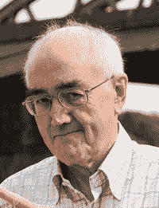
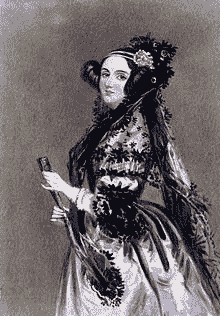

# 激励中小企业技术创新者的 7 个榜样

> 原文：<https://medium.com/geekculture/7-role-models-inspiring-smb-tech-innovators-df9daf3f6963?source=collection_archive---------8----------------------->

## 11 月是鼓舞人心的榜样月。谁是你的技术灵感？

Image via [Shutterstock](https://www.shutterstock.com/editor/image/motivated-winner-man-on-mountain-top-1617649147)

你小时候有榜样吗？成年后呢？《今日心理学》[对领导者及其下属的一项研究显示，几乎所有被调查的领导者都称自己童年时有道德榜样。然而，同一项研究发现，这种经历是否会转移到他们自己的职业生涯和管理风格取决于他们成年后是否有榜样*。*](https://www.psychologytoday.com/us/blog/fulfillment-any-age/201311/we-all-need-role-models-motivate-and-inspire-us)

对于成年人来说，鼓舞人心的榜样通常扮演导师的角色——无论是直接影响我们的导师，还是在他们去世后很久仍影响我们的出版作品、哲学或生活方式的人。

【T11 月是 [**鼓舞人心的榜样月**](https://nationaldaycalendar.com/national-inspirational-role-models-month-november/) **，**也许没有任何地方能找到前进和努力工作的动力——通常是通过批评和怀疑——就像在创新和技术领域一样至关重要。在这个艰难的领域，一个我们尊重并与之相关的人所分享的经历，他们的奋斗、希望和胜利，他们的思维方式和体验生活的方式都成为我们自己道路上的灯塔。

以下是成功的科技企业家、创新者和专家对鼓舞人心的榜样(传奇的和当代的)的看法，他们的观点“指导”了他们自己成功的科技企业或职业生涯。

*剧透:下面没有埃隆·马斯克和杰夫·贝索斯*

## 詹姆斯·伯克

Image via [Wikipedia commons](https://en.wikipedia.org/wiki/James_Burke_(science_historian)#/media/File:James_Burke_(science_historian).jpg)

詹姆斯·伯克被称为“西方世界最有趣的人之一”。作为一名英国科学历史学家和广播员，他创作并推出了广受欢迎的电视连续剧)*(1978)，以及其关于科学和技术历史的深度哲学续集 [*【宇宙改变的那一天】*](https://en.wikipedia.org/wiki/The_Day_the_Universe_Changed) (1985)。*

*网络安全咨询公司 Zenaciti 的首席执行官安德鲁·柏拉图(Andrew Plato)在信息安全(网络安全)行业工作了 25 年，创建了世界上最早的安全公司之一 Anitian，他讲述了伯克如何影响他自己的技术创新生涯:*

> *“伯克 1978 年的开创性系列*‘连接’*对我的生活产生了极大的影响。*【连接】*通过历史追溯科技进步的起源，展示了突破性创新通常是偶然相遇、创造性适应和盲目运气的结果。伯克激发了我对技术、创新和创造力的热爱。此外，伯克是一个优秀的沟通者，激励我成为一名作家。伯克的热情和创造力可以让最无聊的话题变得有趣。我模仿了伯克的许多沟通技巧，这对我成为一名领导者很有帮助。”*

## *马特·库珀*

**

*Matt Cooper. Screenshot via [ProBono Institute](https://www.probonoinst.org/events/2019-annual-dinner/co-chair-spotlight-matt-cooper-capital-one/#:~:text=Matt%20Cooper%20is%20General%20Counsel,Capital%20One%20in%20January%202009.)*

*Matt Cooper 是 Capital One Financial Corporation 的法律总顾问，也是该公司执行委员会的成员。他是由 350 名律师和法律专业人士组成的 Capital One 业务部门的负责人，也是欧洲最著名的风险投资基金之一章鱼投资(Octopus Investment)的董事长。*

*詹姆斯·哈福德-泰勒是一位连续创业者，也是奢侈品转售网站 [Cudoni 的创始人。从 12 岁时出售亨利·霍夫斯(Henry Hoovers)到登上福布斯*“30 岁以下 30 岁欧洲”*零售&电子商务排行榜，他走过了漫长的道路。](https://www.cudoni.com/)*

*他成功的原因不仅仅是有一个像库珀这样的榜样，而是有足够的勇气去接触他的榜样，并把它变成一个学习的故事。*

> *“我比任何人都尊敬马特·库珀。我职业生涯中最自豪的时刻是，我成功说服那个人 a)让我去他家喝杯咖啡，b)他说服自己投资这家企业，并在随后的每一次筹资活动中都这样做了。对我来说，最大的里程碑是让他成为主席。*
> 
> *“事实是，当我考虑如何将自己塑造成一名领导者时，他所代表的东西非常独特。我认为我们生活在一个道德和人们及领导人做出的决定都有很多问题的世界里，有时我会质疑他们的动机是什么。对于一个已经取得成就的人来说,[Cooper]是难以置信的谦虚。他非常诚实，教会我反馈是一份礼物。他很乐意告诉我我不擅长什么，而不是表扬我。我希望能达到他一半的成就，但更重要的是他做事的方式。”*

## *安妮塔·博格*

**

*Image via [Wikipedia commons](https://en.wikipedia.org/wiki/Anita_Borg#/media/File:Anita_Borg.jpg)*

*作为 20 世纪计算机科学的先驱，安妮塔·博格继续创建了全球性非营利组织妇女与技术研究所和 T2 格蕾丝·赫柏计算机女性庆典。然而，她自己的编程之旅是在 60 年代在一家小保险公司任职期间自学的。*

*直到今天，她的成就和教育遗产仍然激励着科技界的男男女女。埃里克·麦基就是其中之一，他是 T4 数据中心的高级网络工程师。*

> *“安妮塔·博格是我最大的榜样之一，在我的科技之旅中，她一直是我灵感的主要来源。我对她能够在科技界取得的成就感到敬畏，而当时女性在科技界还闻所未闻，她也是我选择在本科和硕士阶段学习计算机科学的主要原因之一。当我还在高中的时候，我就看到了她的故事和成就，这给我留下了深刻的印象。我可能不是一个女人，但我发现她的故事如此感人，她的成就如此巨大，因为她是这个巨大领域中的独狼。"*

## *卡特·米利肯·雷姆*

*如果你对科技不感兴趣，你可能知道卡特·勒姆是帕丽斯·希尔顿的丈夫。但精通技术的企业家会知道，考特尼·勒姆(Courtney Reum)和他的兄弟一起，是商业畅销书*《创业捷径:用来自战壕的非传统建议加速成功》的作者作为前高盛投资银行家、投资者和企业家，不仅仅是勒姆，他的书已经成为创业企业家的榜样。**

*[数字营销专家、前谷歌员工、企业家和天使投资人凯文·米勒](https://kevinmiller.com/)最近在 2021 年美国商业奖中被评为“年度企业家”股票:*

> *“遵循勒姆的建议后，我自己也成长为一名企业家和投资者。这本书提供了大量关于企业家精神的见解，帮助我的企业获得了竞争优势。所给建议的非传统性质帮助我理解了快速提升我的搜索引擎优化机构所需的主要组件。*

## *阿达·洛芙莱斯(内·拜伦)*

**

*Ada Lovelace. Public domain via [Wikipedia](https://en.wikipedia.org/wiki/Ada_Lovelace#/media/File:Ada_Lovelace_portrait.jpg)*

*我们通常把拜伦的名字与一些最伟大的英国诗歌联系在一起。但命运的转折是，他的女儿艾达成为了世界上第一个探索技术的程序员和第一人(特别是查尔斯·巴贝奇的分析引擎，现代计算机的未实现的前身)，不仅仅是一台计算机器，而是一种社会协作工具。*

*阿达·洛芙莱斯可能生活在两个世纪前，但她仍然是现代世界中一个强大的女权主义者。SaaS 公司的 UX 设计师 Victoria Bachina 同样被阿达·洛芙莱斯的先锋思想和坚强决心所鼓舞。*

> *“作为科技界的现代女性，我们可以从 Ada 对工作的坚持和坚定不移的奉献中学到很多。如果到了 2021 年，我们仍然不得不在 STEM 中拨开父权制的荆棘，我们可以想象 Ada 在 19 世纪 40-50 年代作为一名女性追求她的研究并推动其出版意味着什么。这是一个令人难以置信的灵感，尽管她一生短暂，但她不仅成为了一名天才的数学家，而且成为了一名有洞察力和创造力的思想家，他对计算机科学的愿景比她的时代领先了一百年。”*

## *劳拉·霍根*

**

*Lara Hogan. Screenshot via [larahogan.me](https://larahogan.me/)*

*劳拉·霍根(Lara Hogan)是一名工程领导者，也是几本书的作者，包括[为性能而设计](http://shop.oreilly.com/product/0636920033578.do)(奥赖利，2014 年)、[建立设备实验室](http://buildingadevicelab.com/)(五个简单的步骤，2015 年)和[揭开公众演讲的神秘面纱](https://abookapart.com/products/demystifying-public-speaking)(一本书之外，2016 年)。从一名自学成才的前端 web 开发人员，到获得 Etsy 的工程总监职位和 Kickstarter 的工程副总裁，Hogan 成为了科技行业中备受推崇的导师和榜样。*

*他们可能是异地恋，但霍根仍然是科技企业家的灵感来源，比如 Cindy Corpis，SearchPeopleFree 的首席执行官。*

> *“劳拉同样完美地戴着许多帽子，是每个女人的榜样。是她让我相信永远都不会太晚，也不应该限制一个人尝试新事物。当我决定创办 SearchPeopleFree 时，我正享受着一份稳定的职业。当劳拉决定学习被认为是男人的世界的编程时，许多人警告过我，就像那时许多人警告过我一样。但是，我们都听从了自己的心声，充分享受了我们的冒险。”*

## *张安琪*

**

*Angie Chang. Screenshot via [GirlGeekX](https://girlgeek.io/team/angie-chang/#:~:text=Angie%20is%20CEO%20and%20co,was%20editor%2Din%2Dchief.)*

*《快公司》(Fast Company)评选的“科技领域最具影响力的女性”之一，Angie Chang 是“*Girl Geek X”*的首席执行官和创始人，她是科技行业女性的现代灵感来源。Girl Geek X 是一个联系和激励科技界女性的平台，它举办现场和在线活动，促进联系，并赋予科技界女性权力。她还是 Hackbright Academy 的战略合作伙伴副总裁，这是一所女子工程学校，已有 500 多名女性软件工程师毕业。*

*Adam Korbl 是一位经验丰富的数字企业家，是公司 Amplify Ventures、Fill App 和 iFax T3 的创始人兼首席执行官，她认为 Chang 是一位超越性别角色的导师，正是她的建议让他在创办科技公司时应对未知。*

> *“创办一家(科技)公司从来都不容易。我一直在与麻烦作斗争，害怕
> 失败，害怕失败，但后来我尊敬安吉，看到她令人难以置信的
> 工作，然后我意识到并从我的错误中吸取教训，继续前进。*
> 
> *“她常说，‘要有好奇心。学习新事物。结识新朋友。跟随你的直觉，探索未知。谷歌东西。四处打听。向任何愿意倾听的人推销你的创业想法，然后改进你的推销。找到和你完全不同的志趣相投的人，这样你就能学会预测和应对他们。做最难的事。“胸怀大志”。这就是我的感受，这些话对某些人来说可能听起来很简单，但请相信我，学习“大胆思考”是一个完整的过程。很难吗？有；但是值得吗？是的。”*

## *一锤定音*

*你有没有注意到，在上面的引用中，常提出了一个让人觉得很奇怪的建议？*

***“找和你一点都不像的志同道合的人”***

*事实上，这种明显的矛盾是我们可能获得的一些最好的学习、指导和榜样的关键。一个鼓舞人心的榜样应该是与我们有着深层关系的人，但也应该是足够勇敢的人，足以将我们推出舒适区——无论是通过他们的话语，他们的战斗，还是他们活生生的例子。*

*这个鼓舞人心的榜样月，让我们在生活中找到一个这样的人——一个穿越时空的导师，或者一个邻居——他将支持我们的目标，推动我们征服未知。*