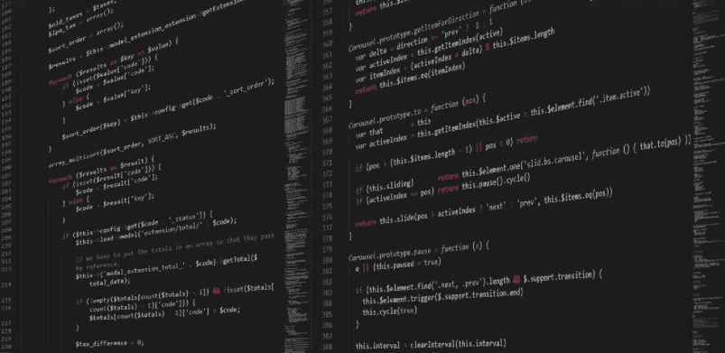

# 成为杰出 Java 开发人员的 7 个步骤

> 原文：<https://medium.com/geekculture/7-steps-to-become-an-outstanding-java-developer-2c6fc047d6e7?source=collection_archive---------18----------------------->

如果你是一名 Java 开发人员，并且对技术充满热情，你可以遵循这 7 个步骤，它们会让你成为一名杰出的 Java 开发人员。

## 1.对 OO 原则有很强的基础和理解

对于一个 Java 开发人员来说，对面向对象编程有很强的理解是必须的。没有扎实的 OOPS 基础，就无法体会到 Java 这样的面向对象编程语言的美妙之处。如果你对 OOPS 没有一个很好的概念，即使你正在使用 OOP 语言，你可能仍然在以过程化的方式编码。仅仅研究 OO 原则定义，帮助不会很大。我们应该知道如何以面向对象的方式应用这些原则来设计解决方案。因此，一个人应该对对象建模、继承、多态、设计模式等有很强的了解。

## 2.继续编码

从理论上讲，事情看起来更简单。我们可以在理论上很容易地给出一个问题的解决方案。但是当我们开始实施我们的方法时，我们可以意识到问题的深度。您将逐渐了解语言限制，或者在编码时设计最佳实践。所以继续编码吧。

## 3.掌握核心 API

如果你不知道语言结构和核心 API，理论知识再强也没用。对于 Java 来说，你应该对核心 API 有很强的实践经验，比如`java.lang.*`、I/O、异常、集合、泛型、线程、JDBC 等等。在构建 web 应用程序时，无论您使用哪种框架，理解 servlets 和 JSP 的相关概念也是至关重要的——这是必须的。

## 4.关注博客并回复

我们并不孤单。世界各地有成千上万狂热的技术爱好者在博客上发表他们对技术的见解。您还可以从其他博客和开发者那里获得关于相同技术的有价值的观点。一些人可能会发现特定的框架特性非常有用，而另一些人可能会发现那些特性愚蠢且毫无意义，并给出了他自己的原因。因此，您可以从使用这些工具的其他开发人员那里看到好的和坏的方面。

从查看其他博客中获得价值的另一个方法是用你的观点和问题来回复/评论帖子。

## 5.将常用的代码片段/实用程序放在手边

随着时间的推移，您可能需要一次又一次地编写/复制-粘贴相同的代码/配置。保留像 log4.properties、JDBC 配置等这样的配置片段。而像`StringUtils`、`ReflectionUtils`、`DBUtils`这样的实用程序会更有帮助。我知道它本身不会让你成为一名优秀的开发人员。但是想象一下，某个合作开发人员让你帮忙从一组对象中获取一个属性值列表，然后你就用你的`ReflectionUtil`在几分钟内给出了解决方案:这将使你变得杰出。

## 6.了解不同的开发方法

熟悉各种方法，如敏捷、SCRUM、XP、瀑布等。如今，开发方法的选择取决于客户。一些客户喜欢敏捷，一些客户喜欢瀑布模型。对各种方法有想法将是一个真正的加分。

## 7.记录/博客你对技术的想法

在日常工作中，您可能会学到新的、更好的做事方法，以及最佳实践、架构思想等。继续记录这些想法，写博客，和/或在社区中分享。假设您解决了一个在进行简单概念验证时出现的奇怪问题，并在博客中对此进行了描述。也许世界上其他地方的开发人员在生产部署的应用程序中面临着同样的问题。想想这个解决方案对开发人员有多重要。所以，把你的想法写在博客上，也许有一天它们会对别人或自己有所帮助！