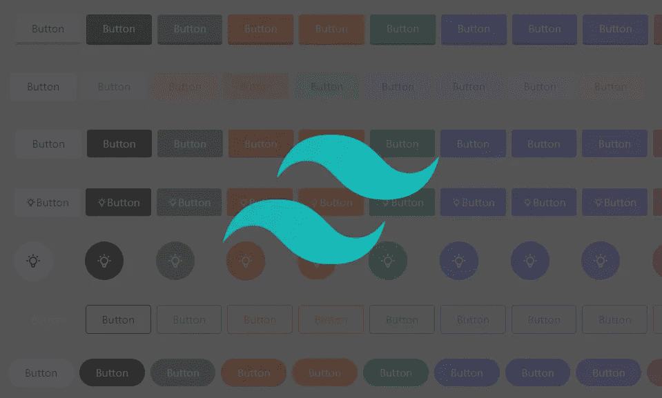

# 7 个尾翼按钮

> 原文：<https://medium.com/geekculture/7-tailwindcss-buttons-4f0016117ffa?source=collection_archive---------59----------------------->

这里有 7 个基本的顺风 CSS 按钮的例子。这些按钮示例被添加到一个 [React Tailwind 项目](https://www.ordinarycoders.com/blog/article/reactjs-tailwindcss)中，但是 Tailwind 类的属性值也适用于 HTML。

如果您是 Tailwind 的新手，请查看[前端开发前三名 CSS 框架](https://www.ordinarycoders.com/blog/article/top-3-css-frameworks)的 [TailwindCSS](https://www.ordinarycoders.com/blog/article/top-3-css-frameworks#tailwind-css) 部分。

# **尾翼按钮**