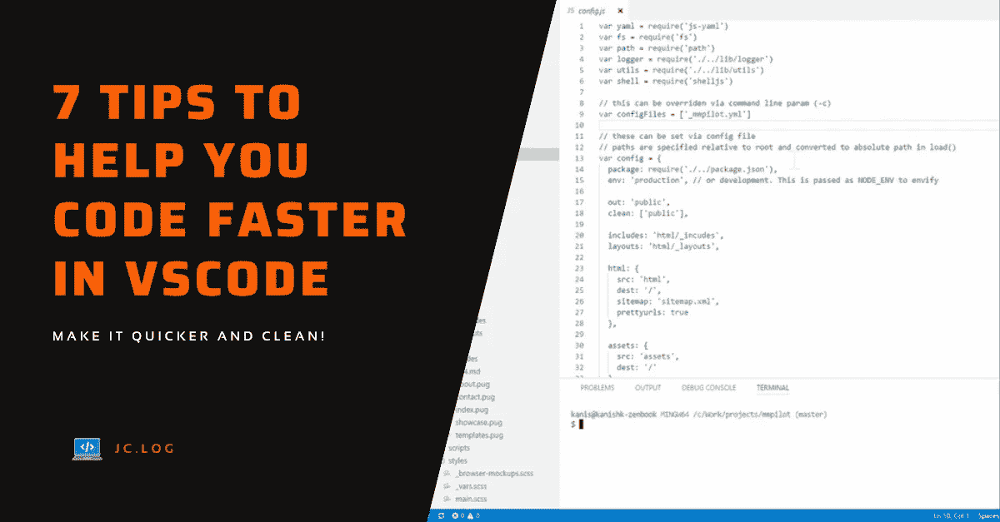
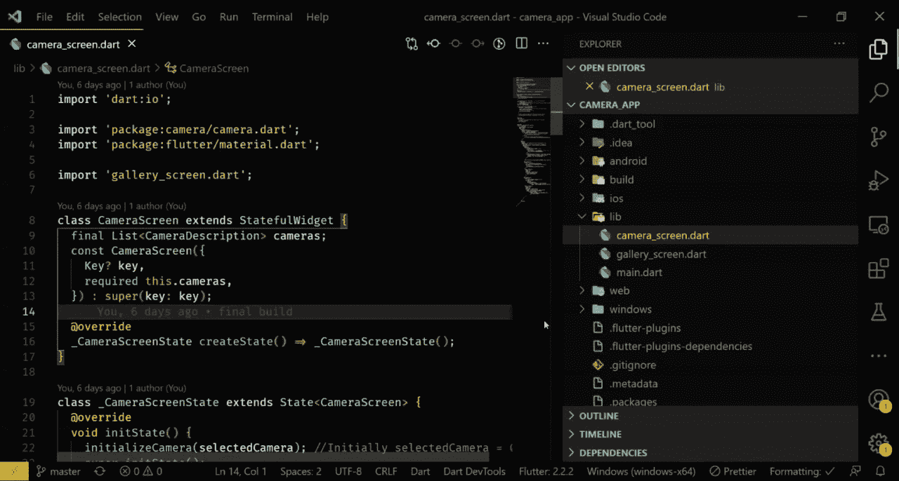
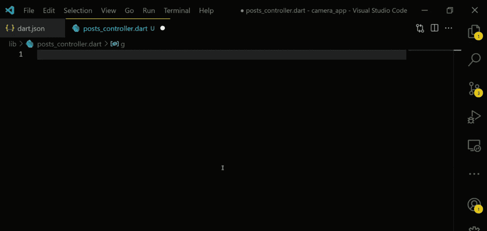
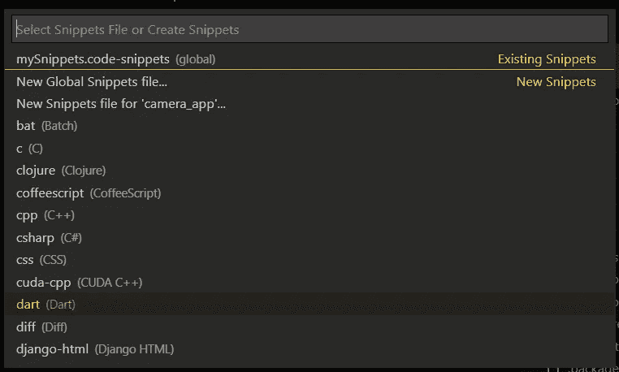
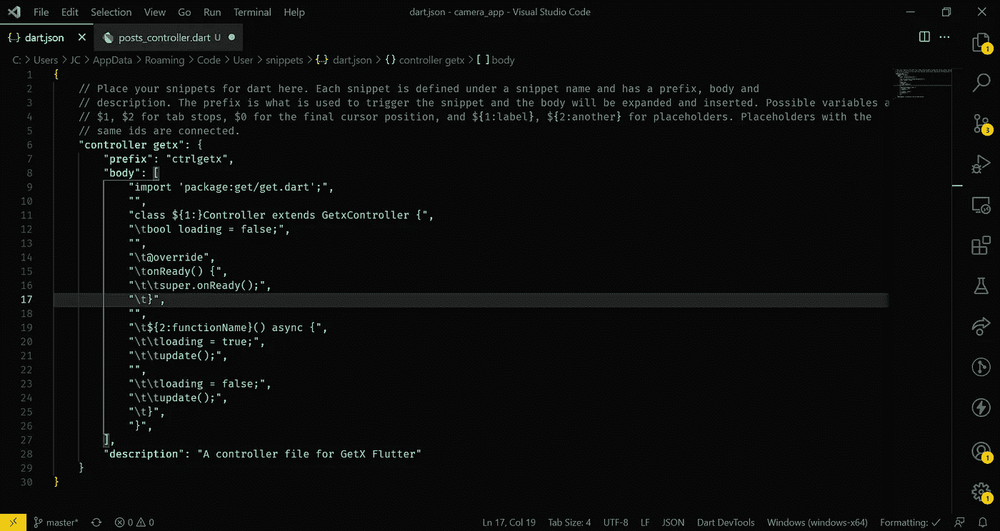
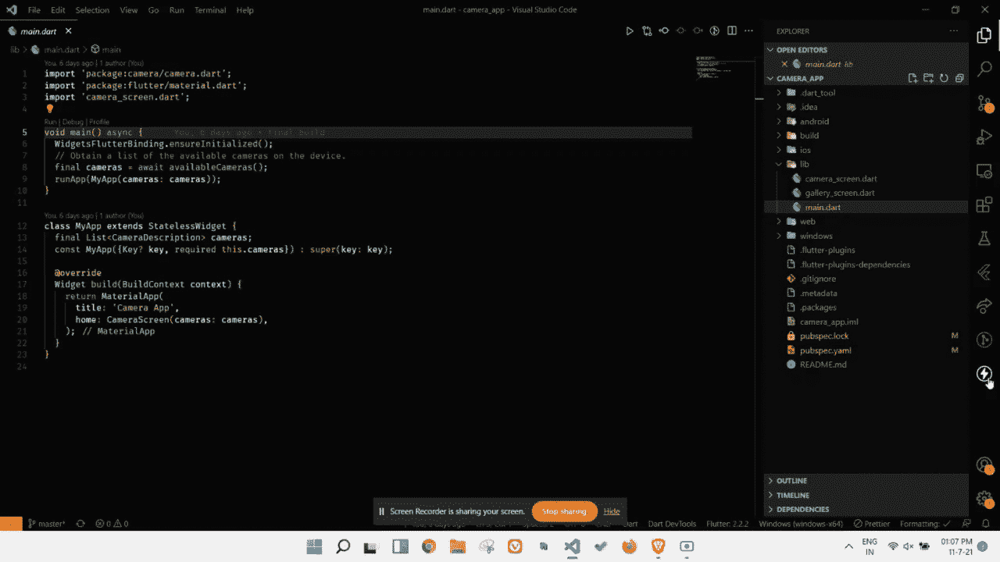
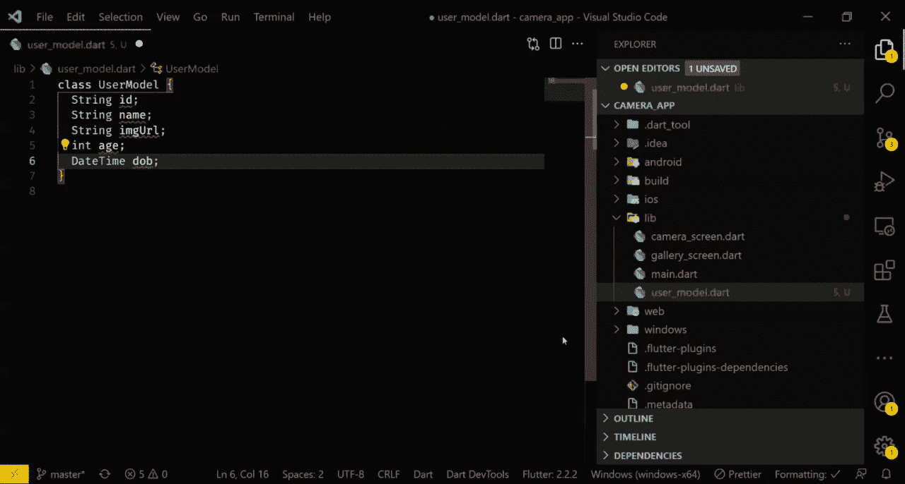
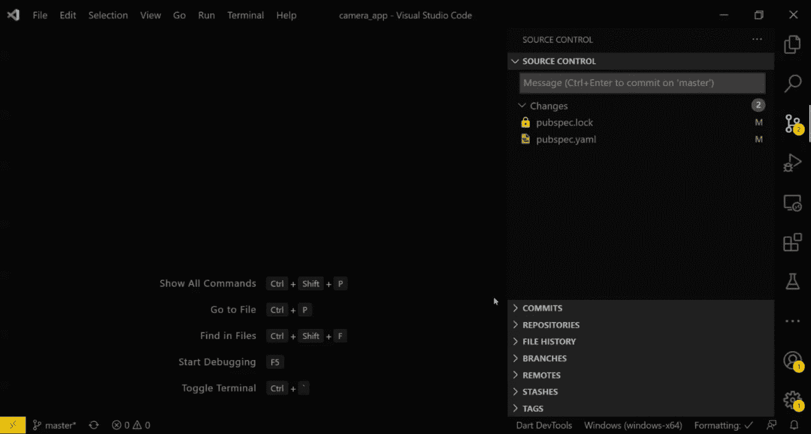
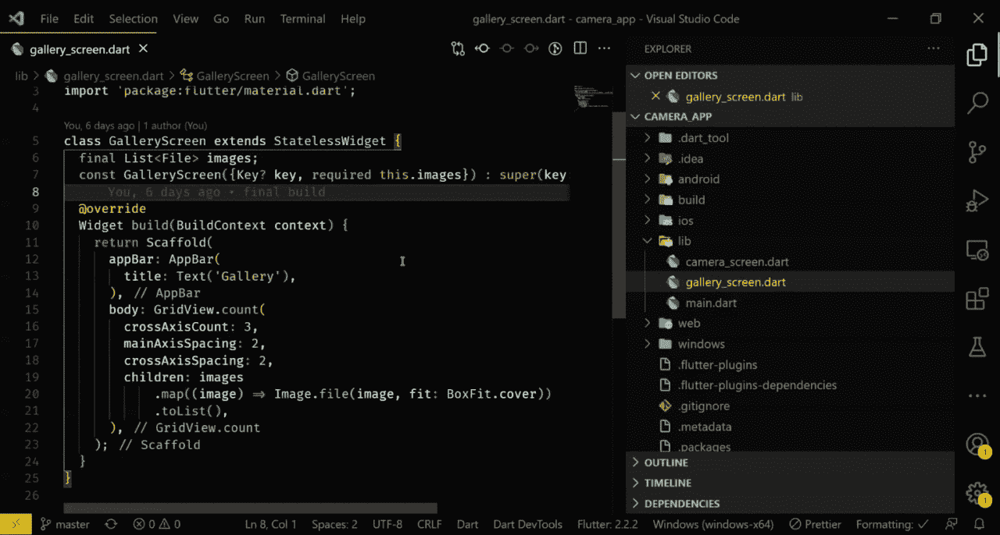
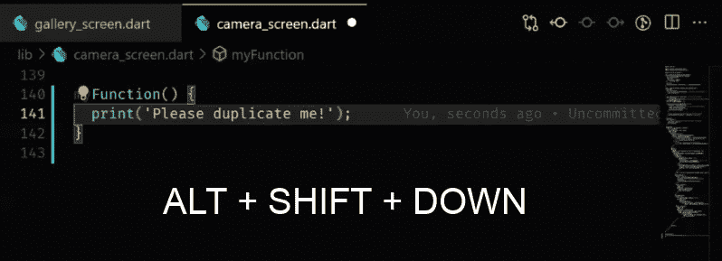

# 帮助您在 VSCode 中更快编码的 7 个技巧

> 原文：<https://medium.com/geekculture/7-tips-to-help-you-code-faster-in-vscode-33252f78fac8?source=collection_archive---------1----------------------->

让我们同意一件事，我们都热爱 Visual Studio 代码。我几乎所有的编码项目都使用 VSCode。在我看来，它功能丰富，各方面都很简洁。

所以，让我们看看一些技巧和窍门，如果你使用 VSCode，可以使你的编码更快。

# 1.停止使用鼠标查找文件

VSCode 有一个非常干净和用户友好的项目浏览器。但是，使用鼠标查找文件会花费一些时间。不用鼠标，你可以按下`CTRL + P`键，开始输入你要搜索的文件的名称。一看到匹配文件列表，就可以按下`Enter`键打开它。

我知道切换到这个会很难，但是一旦你掌握了它，它将会是一个节省时间的工具。

# 2.创建您自己的片段

我们都在 VSCode 中使用代码片段，但不是我们自己的。我们使用来自扩展库的一组代码片段，但是这些代码片段是通用的。

每个人都有特定的编码方式，它可以在单个项目或多个项目的几个地方重复。对于重复的代码，创建自己的代码片段可以节省时间。

这里有一个例子。当我在 Flutter 中构建一个项目时，我需要创建许多控制器文件。为此，我创建了这个片段，它让我的速度更快。

My Snippet Example

让我们快速地看看如何制作一个定制的代码片段。去`File -> Preferences -> User Snippets`。之后，选择要为其创建代码片段的语言。

Select language

My controller snippet settings

# 3.用 ThunderClient 代替 Postman

我们都必须调用 API 来测试我们的应用程序和网站，为此，我们大多数人都使用 Postman。Postman 很棒，功能丰富，但让另一个应用程序只打开 API 调用有点乏味。

迅雷客户端是邮差替代，但它是 VSCode 扩展，不是单独的 app。所以点击迅雷客户端图标，你就可以开始了。它不像 Postman 那样功能丰富，但对普通用户来说已经足够了。我这种情况，自从装了迅雷客户端，就没用过 Postman。

从市场安装扩展

Thunder Client

它支持所有类型的请求，如 GET、POST、PUT、PATCH、DELETE 等。除此之外，导入和导出集合和环境变量也是迅雷客户端的其他功能。

Thunder Client Example

# 4.使用数据/模型类生成器

在编写一个应用程序或网站时，我们通常需要创建数据/模型类，其中有几个方法，如`toJson`、`fromJson`、`toMap` 等。

手动创建它们会花费很多时间，请使用生成器。我个人为我的 flutter 应用程序使用了 [**Dart 数据类生成器**](https://marketplace.visualstudio.com/items?itemName=BendixMa.dart-data-class-generator) 扩展。

下面是我如何使用这个扩展。

# 5.使用 VSCode 的源代码控制而不是终端

在我们的大部分项目中，我们使用版本控制，如 Github、Gitlab 等。我们通常使用终端将更新推送到 repo(或 windows 中的命令提示符)。相反，使用 VSCode 内置的基于 GUI 的源代码控制。

使用这个工具，你可以做各种各样与版本控制相关的事情，比如登台、提交、推送、拉取、克隆、分支签出等等。

# 6.使用重命名符号功能

还记得当我们需要改变一个已经被无数次使用的变量名吗？这是最糟糕的。如果变量在不止一个文件中使用，你将花费一个小时来分别查找和替换它们。

嗯，VSCode 有一个叫做`Rename Symbol`的特性，使用它你可以重命名一个变量或类，它会在每次出现时自动重命名它。

这是你怎么做的。右键单击任何变量，您将看到选项。输入新名称并按下`Enter`。将光标放在想要更改的变量上后，您也可以按下`F2`来触发相同的动作。

# 7.使用快捷方式复制或移动代码行

我们经常想要复制它下面的一串行。但为此，我们使用传统的选择、复制和粘贴方法。

相反，在下面您要复制的行上按`ALT + SHIFT + DOWN`键。就这么简单。请看下面的实际操作。

同样，要上下移动一行，可以分别使用`ALT + UP`或`ALT + DOWN`。

这一次到此为止。我希望你喜欢它。

感谢您阅读至此。请务必留下任何建议和评论👏为了这个故事。