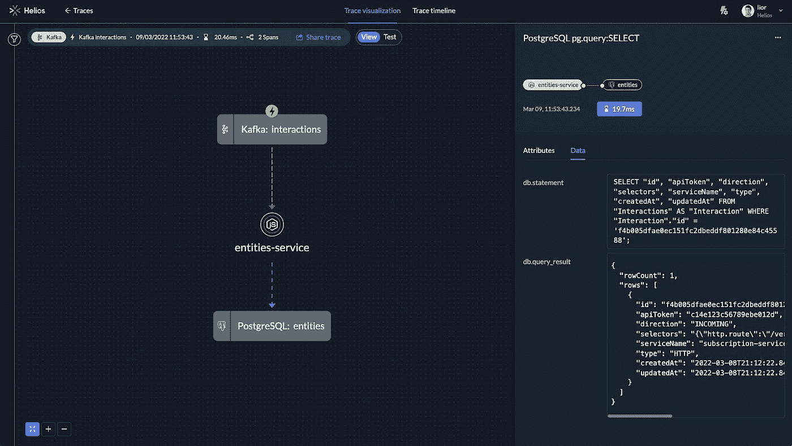
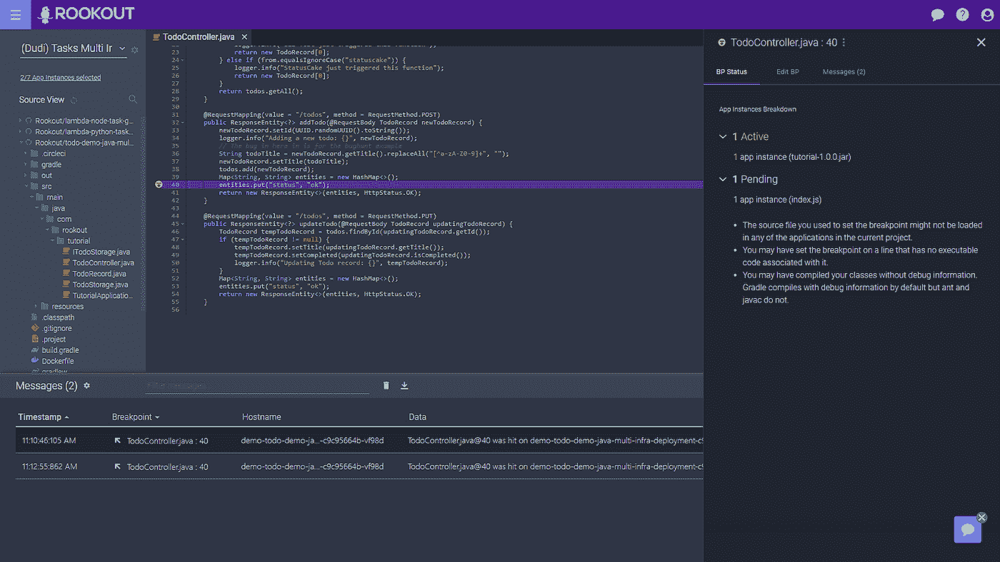
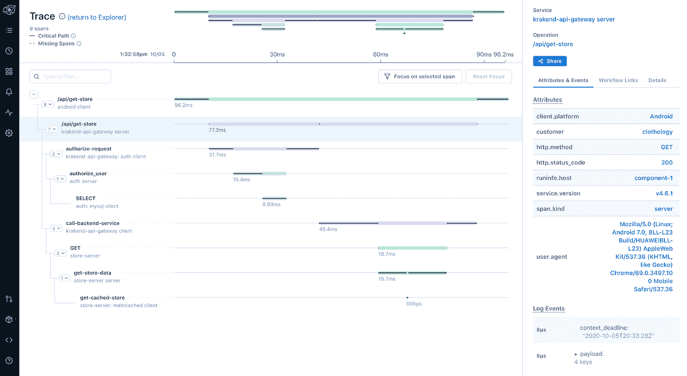
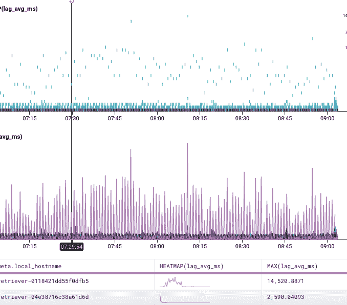
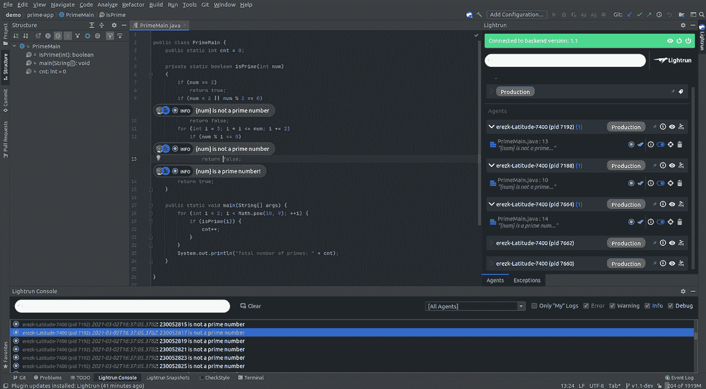
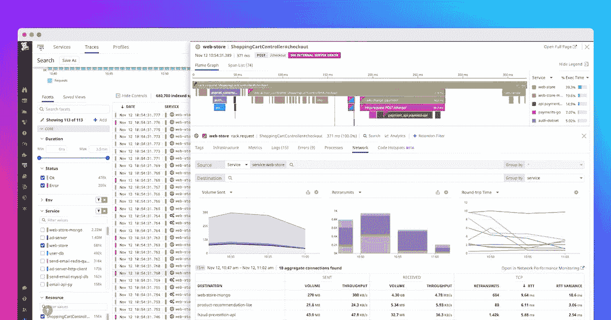
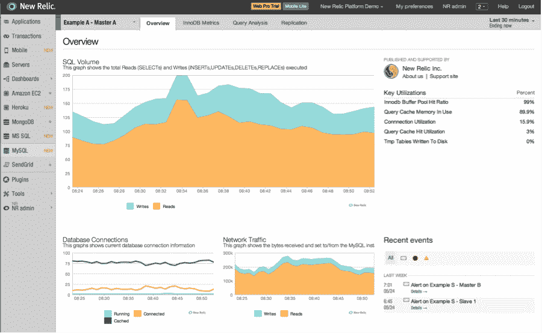

# 微服务调试和故障排除的 7 个工具

> 原文：<https://medium.com/geekculture/7-tools-for-debugging-and-troubleshooting-microservices-e97e37d5ec0c?source=collection_archive---------4----------------------->

有多种工具可用于故障排除和调试微服务。有这么多可能的抽象和复杂层次，开发人员必须深入到他们的日志、依赖和报告中。随着微服务架构的复杂性增加，许多管理员和开发人员会发现自己正在努力管理和支持已经超越他们的系统。

但是，调试和排除微服务工具仍然是必要的。这里有 7 个工具可以帮助你:

# 1.艾里奥斯

Helios 旨在让开发人员在整个开发过程中轻松学习、调试和测试分布式系统。因此，Helios 通过采用分布式跟踪，提供了对整个微服务架构和每个服务的有用见解。然后，Helios 使用这些数据来自动化微服务测试的开发，并提供对单个故障和低效的见解。

因为开发人员很难掌握他们的代码如何与系统的其他组件一起工作，所以项目开发经常停滞不前。与此同时，即使是单个微服务或 API 中的一个小问题，也可能迅速导致大型分布式应用程序停止运行。

Helios 的目标是帮助开发人员理解他们的代码如何与应用程序的其他部分协同工作。Helios 从应用程序中收集全局跟踪数据，并使用 OpenTelemetry 为开发人员提供上下文信息..这意味着他们可以精确地重复他们的代码如何与大规模应用程序一起工作，例如，更容易地检测和重现错误。

# 2.Rookout

Rookout 是一个改变游戏规则的开发工具，用于云本地调试和实时数据收集。Rookout 设计用于生产设置和当代架构调试，包括微服务应用。Rookout 中的不间断断点允许您动态捕获任何形式的数据，无需额外的代码、重新部署或重新启动。

他们可以快速收集数据，以便在试运行和生产中进行高效的故障排除。在代码的不同点添加调试行可以让他们观察到代码被触及的地方，然后迅速定位真正的问题。

有了 Rookout 的即时不间断断点，您可以在几秒钟而不是几天内从实时系统中收集变量和整个堆栈跟踪数据。他们现在可以隔离问题的根源，而无需修改或推出新代码。这甚至可以在不延迟或暂停堆栈的情况下完成。

在为 Rookout 编写简单代码时，您会遇到 AWS Lambda 在执行后无法访问的情况。如果 AWS Lambda 没有主动运行，Rookout 将不能让您检查它的细节。

Rookout 通过在生产和暂存过程中实时提供不间断断点，消除了等待故障排除的需要。快速添加日志行会产生更完整的日志，这给调试过程带来了更多的麻烦。最终的结局？微服务故障排除的平均时间从数小时减少到了几分钟。

然而，带有 Python 运行时的 AWS Lambda 函数的冷启动时间(包括 Rookout 服务)大约要长 2.5 秒。

# 3.轻盈的步伐

Lightstep 是一个相对较新的调试工具。这是一个随时可用的工具，可实时提供与事件相关的数据、日志和事件。这简化了问题分析和解决方案。

Lightstep 有一个单一的仪表板，显示指标和跨数据，同时突出显示影响性能的数据偏差。

它可以自动检测跟踪数据中的关键路径，从而更有效地调查故障的根本原因。

此外，它们使您能够轻松地从更广泛的分布式系统环境过渡到特定的服务。

在对动态复杂的环境进行故障排除时，它们提供了至关重要的上下文。这是因为它们允许开发人员检查不同的基于云的微服务之间的底层关系。将跟踪数据与代码级、特定于情况的调试数据集成的能力为开发人员提供了对应用程序行为的更多洞察，将可观察性推进到下一个发展阶段:可理解性。这种能力不仅可以看到应用程序的内部状态，还可以完全理解其结构和操作。

由于 Lightstep 较新，许多功能仍处于早期开发阶段。搜索功能偶尔会出现不足，一些用户抱怨性能不佳。然而，由于 Lightstep 团队定期发布新的更新，他们不断评估他们可能改进的地方。

其他问题包括数据处理缓慢和需要改进卫星部署文件。

# 4.蜂窝

Honeycomb 是一个用于事件观察和关联的分布式系统。它不同于其他工具。这是因为它放弃了单一请求跟踪策略，转而采用更自由的方式在所有层和维度中收集和查询数据。

Honeycomb 使用具有 JSON 结构的“事件”。它将这些事件保存到后端以供后续检索。用户可以使用 web 应用程序运行查询，以深入了解他们的(通常是生产)系统。

Honeycomb 收集每个级别的数据，如负载平衡器、微服务和数据库，标记数据，并允许用户混合搭配和稍后对数据运行即席查询。Honeycomb 使用这种方法，因为跟踪留给您一个悬而未决的问题，即谁的查询是有代表性的，因此首先值得关注。一旦数据出现在 Honeycomb 中，用户可以从多个级别连接数据，并组合和分配功能给它们。他们还可以随着时间的推移比较不同系统的性能。

蜂巢没有 SLO 对非企业版本的支持，与其他 SaaS 公司的集成也较少。

对于传统的监控用例来说用处不大。虽然 Honeycomb 有仪表板和触发器特性，但它们目前还很初级，不足以主动监控复杂服务的健康状况。

# 5.闪电

Lightrun 是世界上第一个可持续调试和观察的平台。对于开发人员来说，向生产和试运行环境实时添加日志、指标和跟踪既简单又安全。开发人员和 I&O 领导者受益于 100%的代码级可观察性和生产问题的快速解决。这使得开发人员可以从应用程序中实时收集数据。它们消除了您当前用于调试应用程序的迭代、非敏捷技术。

使用该工具可以调试微服务。您可以实时添加日志、性能数据和断点。这不需要修复问题或在本地复制错误，从而使调试微服务更加容易。

数据污染错误会导致不良数据。这本身没什么大不了的。问题是这些数据可能会跨微服务传播到数据库中。一个很好的例子是“未定义的”，它从错误的 JavaScript 代码中传播出来并侵入数据库，污染了整个数据库。事后，通常通过在写入或发送数据的位置插入堆栈日志来调试它们。在那里使用一个条件，只是为了确保数据是无效的，并确定违规。这可以通过使用代码和类似 Lightrun 的连续可观测性工具来实现。

# 6.数据狗

Datadog 是一款面向 IT 和 DevOps 团队的监控和基于 SaaS 的数据分析解决方案。他们检查基础设施和云服务性能指标，以及服务器、数据库和工具的事件跟踪。

各种规模的组织和公司都使用 Datadog。这支持数字化和云解决方案，推动开发、运营、安全和业务团队之间的协作，并加快应用上市时间。此外，Datadog 还能更快地解决问题，保护基础设施和应用程序以了解用户行为，并跟踪关键业务指标。

Datadog 关联来自 SaaS、云提供商和服务的指标，包括 Web 服务器、StatsID、SQL 和 NoSQL 数据库。

使用实时仪表板，Datadog 可以简单地分析、通知和绘制海量数据。他们可以限制性能指标，以便您可以专注于重要的事情。它们还通过允许您更改和评论生产数据的注释来促进团队交流。

然而，很难找到 Datadog 的培训，对许多人来说，学习曲线相当陡峭。此外，还有很多说明已经过时，不适合 Windows。

# 7.新遗迹

New Relic 是一个基于云的可观察性工具，旨在帮助您开发完美的软件。它目前有三个主要组成部分:全堆栈可观测性、应用智能和遥测数据平台。

全栈可观察性在单一链接体验中可视化、分析和排除整个软件栈的故障。你不再在程序间跳跃，不再试图把支离破碎的数据拼凑起来，找出问题所在。

应用智能使你能够更快地识别、理解和处理情况。它提供降低警报噪音的 AIOps 解决方案，使您能够识别数据中可能会丢失的洞察力。

此外，遥测数据平台允许您在一个位置接收、显示和警告来自几乎任何来源的所有指标、日志和跟踪。

# 结论

由于调试微服务固有的复杂性，对许多开发人员来说，调试微服务总是很困难。随着业务的发展，他们将雇佣比以前更多的微服务，每个组织使用的微服务量也有望大幅增加。

因此，投资额外的工具、研讨会和培训可以让已经在解决微服务架构问题的开发人员受益匪浅。