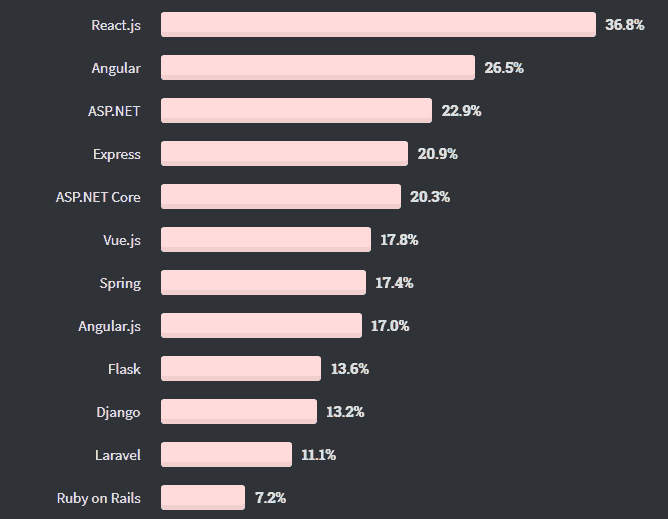
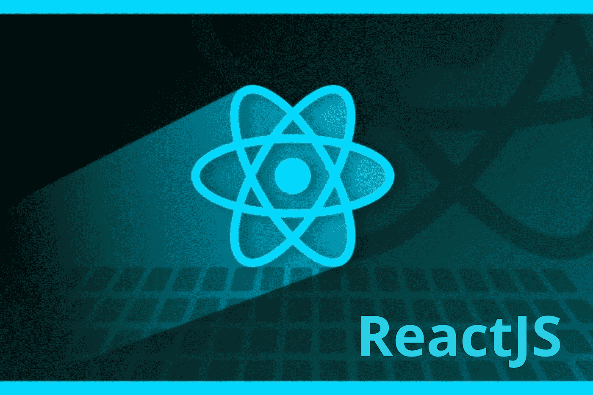
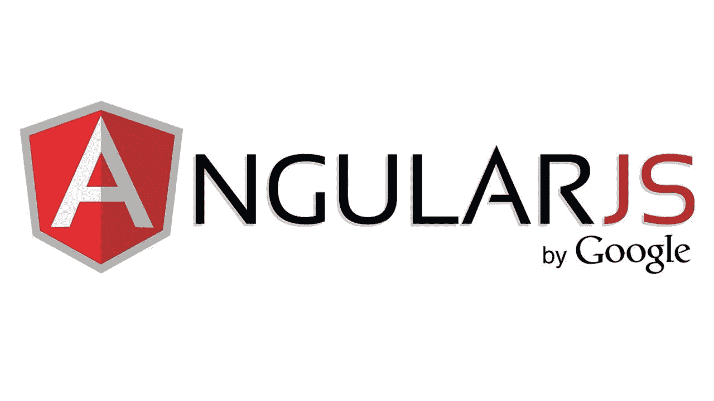
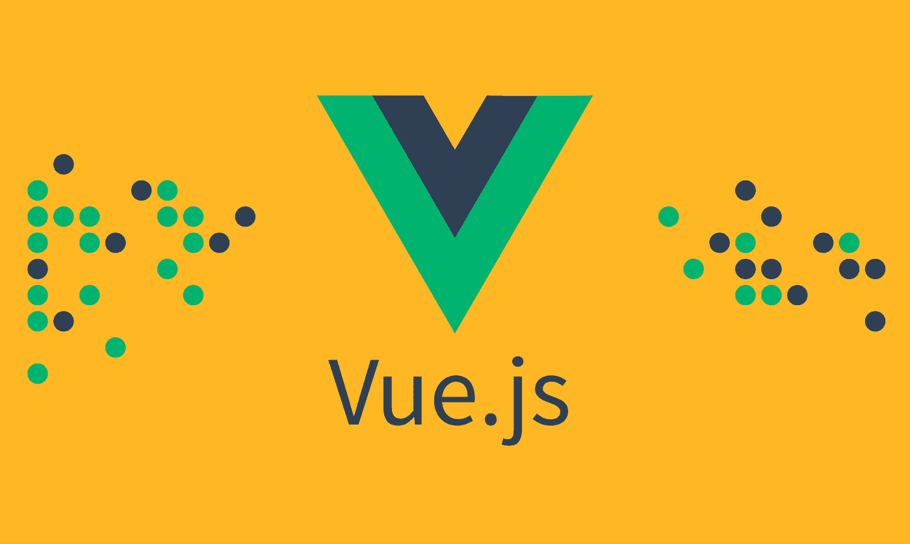
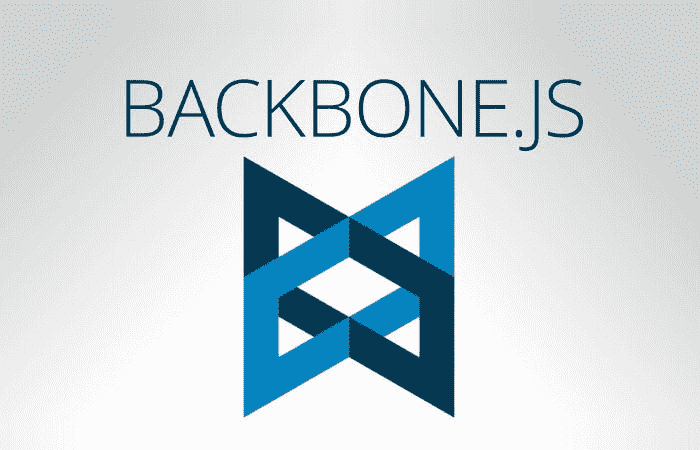
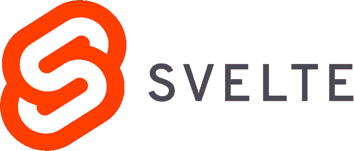
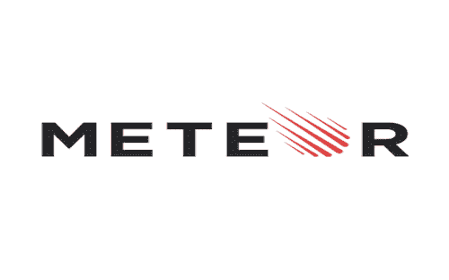

# 7 个最顶端的令人羡慕的前端 JavaScript 框架

> 原文：<https://medium.com/geekculture/7-topmost-and-admiring-frontend-javascript-frameworks-3a2cdada8850?source=collection_archive---------53----------------------->

如今，企业应该把重点放在提高他们的网上存在。可以看出，在 COVID 19 期间，大多数完全依赖真实访问的初创公司、中小企业和大型企业都转向了在线交流和访问。这导致在线商业软件的使用增加，因此，利用软件开发服务的采用也增加了。

为了创造领先的软件，在创新思想上下功夫是非常重要的，同时，在软件开发中使用足够的、合适的和顶层的技术也是必要的。

为了快速创建软件的前端和后端，企业通常选择框架，这是好的，但同时，如果您选择低性能的前端框架，它可能会转化为一个坏的策略。

嗯，为了帮助你在这里挑选最好的前端框架，我列出了几个总体上提供良好性能并帮助企业节省时间和金钱的 web 开发框架，最终创建了 web 应用程序的领先前端。

# 将在 2021–22 年使用的最著名的前端框架

在我看来，真正的头脑风暴和深入挖掘框架的功能和特性是列出最佳前端框架所必需的。

你也可能在为你的网络或移动应用选择合适的前端框架时感到困惑；在这种情况下，您可以从顶级定制软件开发公司的熟练前端开发人员那里获得帮助。

如果我说 JS 前端框架，那么， **ReactJS，ExpressJS，**和 **AngularJS** 是极力推荐的平台。

Image Source: [StackOverflow](https://insights.stackoverflow.com/survey/2020#technology-web-frameworks-professional-developers2)

让我们进一步查看 2021 年顶级前端框架的列表。

**反应堆**

Image Source: Hint Web

它是最顶层的、被广泛推荐的前端开发框架之一。ReactJS 开发服务包括顶级特性和功能，允许企业构建可定制的 web 应用程序。

在一定时间内，ReactJS 的性能得到提高；这变得可行，因为脸书和其他专家社区维护它。 [**聘请 ReactJS 开发人员**](https://www.valuecoders.com/hire-developers/hire-reactjs-developers) 从**最好的** **ReactJS 开发公司**驻**印度**；这样做将有助于您利用 ReactJS 框架构建领先的 web 应用程序。

——[*GitHub*](https://github.com/react-boilerplate/react-boilerplate)*明星:* ***27.2K***

*— GitHub 分叉:* ***5.7K***

*—著名的* *使用 ReactJS 创建的 web 应用:* ***【网飞】、*** *和* ***Airbnb***

**ReactJS 特性**

*   单向绑定
*   虚拟绑定
*   声明式用户界面
*   基于组件的体系结构
*   JavaScript 语法扩展

**安古拉吉斯**

Image Source: There view stories

AngularJS 是著名的 JavaScript (JS)前端开发框架之一，由 Google Angular unit 管理。它是一个开源和免费的客户端框架，包含丰富的功能来支持初创公司、中小企业和大品牌创建高质量和移动/网络友好的网络应用程序。

如果你想有效利用这个框架，那么 [**从最好的 **AngularJS 开发公司**雇佣 Angular 开发者**](https://www.valuecoders.com/hire-developers/hire-angularjs-developers) 将是你最好的选择。

— [GitHub](https://github.com/angular/angular.js) 明星: **59.6k**

— GitHub forks: **28.5k**

—使用 AngularJS 的大品牌:**谷歌、**和 **Udemy**

**AngularJS 关键特征**

*   模型视图控制器(MVC)框架
*   DOM 操作
*   POJO 模型
*   增强的服务器管理
*   双向装订
*   路由和双向绑定

**VueJS**

Image Source: Medium

VueJS 是一个优秀的前端开发框架，它鼓励您快速创建优秀的 web 应用程序。这个客户端框架可以用于构建 web 和移动应用程序。

它的简洁、无缝集成和一些限制使它成为最好的前端 JavaScript 框架之一。为了正确有效地使用这个框架，你可以 [**雇佣 VueJS 开发人员**](https://www.valuecoders.com/hire-developers/hire-vuejs-developers) 在知名的 **VueJS 开发公司**工作。

— GitHub 叉子: **28.5K**

— [GitHub](https://github.com/vuejs/vue) 明星: **180.9K**

—使用 VueJS 构建的热门网站: **Gitlab、Wizz Air** 和 **Chess**

**VueJS 特性**

*   单列元素
*   虚拟 DOM 渲染和性能。
*   双向数据绑定
*   强大的工具生态系统
*   集成能力和灵活性

**简要文档**

*   **EmberJS**

Image Source: Wikipedia

EmberJS 是使用最多的前端框架之一；它在某种程度上类似于 AngularJS 和 BackboneJS。它允许您修复错误，提高性能，以及弃用。使用这个框架，您不允许使用现成的设置来创建新的应用程序，但是您也有权使用自动生成来创建控制器、组件和项目文件。

——[*GitHub*](https://github.com/emberjs/website)*星辰:* ***622***

*—GitHub forks:****1.4k***

*—著名的* *使用 EmberJS 创建的 web apps:****Oyo，LinkedIn，*** *和* ***埃森哲*** *。*

**EmberJS 特性**

*   车把模板引擎
*   QUnit 测试框架
*   用于快速原型制作的 CLI 工具
*   错误修复
*   脊椎 j

Image Source: Creative Beacon

允许您处理代码的最重要的 JavaScript 框架。这个框架实际上充当了一个主干，因为它完全让您能够创建引人入胜的 web 应用程序。该框架不包括 Dojo 或 jQuery UI 之类的小部件。众所周知，这个框架是轻量级的，因为它只依赖于 JavaScript 库。

— GitHub forks: **5.6K**

— [GitHub](https://github.com/jashkenas/backbone) 明星: **27.8K**

—使用 BackboneJS 建立的著名网站:**自由职业者、Reddit、**和 **PayPal**

**BackboneJS 特性**

*   包括构建模块，如视图、模型等
*   自动更新 HTML
*   支持 100 多种扩展
*   MVC 框架
*   支持形成网络和移动应用
*   苗条的

Image Source: Dev Community

它是一个基于组件的 JS 框架，用于前端开发，有点类似于 VueJS 和 ReactJS。Svelte 促进了具有可重用元素的统一用户界面的形成。它没有客户端依赖性，这就是框架运行速度快的原因。苗条的框架包括有限的功能，并使用它；您可能需要编写代码或使用第三方工具。

——[*GitHub*](https://github.com/sveltejs/svelte)*明星:* ***47.4K***

*—GitHub forks:****2.2K***

*—大品牌使用**:****格子，诺波，*** *和* ***无云***

**苗条的关键特征**

*   真正的反应
*   少写代码
*   没有虚拟 DOM

## **流星**

Image Source: Pentroz Technology

Meteor 是一个领先的用 NodeJS 编写的 JavaScript 前端框架，所以它可以用于客户端和服务器端的 app 开发。该框架在快速原型开发方面非常出色，也可以用于 web 和移动应用程序开发。这个全栈框架包括像 tracker 和 blaze 这样优秀的库；这些有助于构建一个流畅、一致的用户界面。

——[GitHub](https://github.com/meteor/meteor)明星: **42.4k**

— GitHub 分叉: **5.2k**

—使用**流星**的大品牌:**埃森哲、**和**德勤**

**meteorojs 关键特性**

*   干净、强大的数据同步
*   实时页面更新
*   热门代码推送
*   延迟补偿

# 包扎

强烈建议使用这里提到的最顶端的前端 JavaScript 框架，因为它们加速了前端开发过程。但是您所需要的是集中精力选择适合您当前或即将到来的业务项目需求的前端框架。

如果你在选择合适的、最好的前端开发框架时仍然感到困惑， [**聘请顶尖**前端开发公司**的前端开发人员**](https://www.valuecoders.com/hire-developers/hire-front-end-developers) 。这不仅有助于你选择合适的框架，也有助于你在 web 应用开发中有效地使用所选的框架。