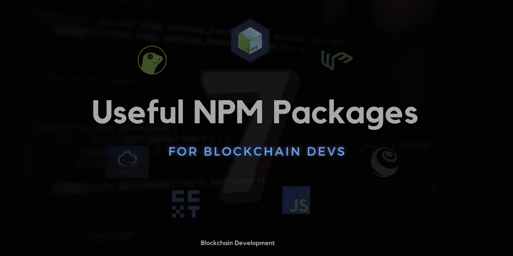
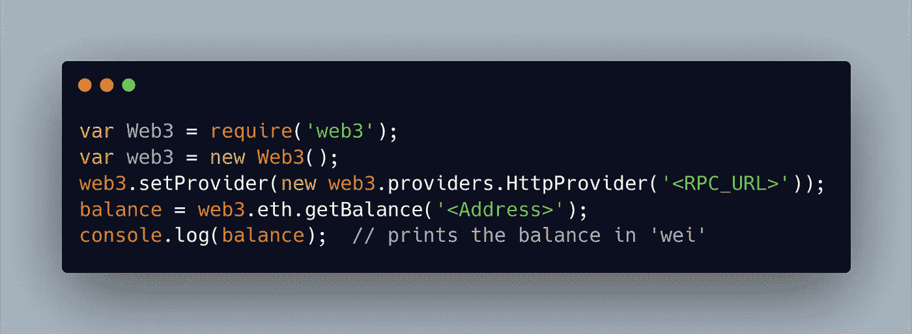
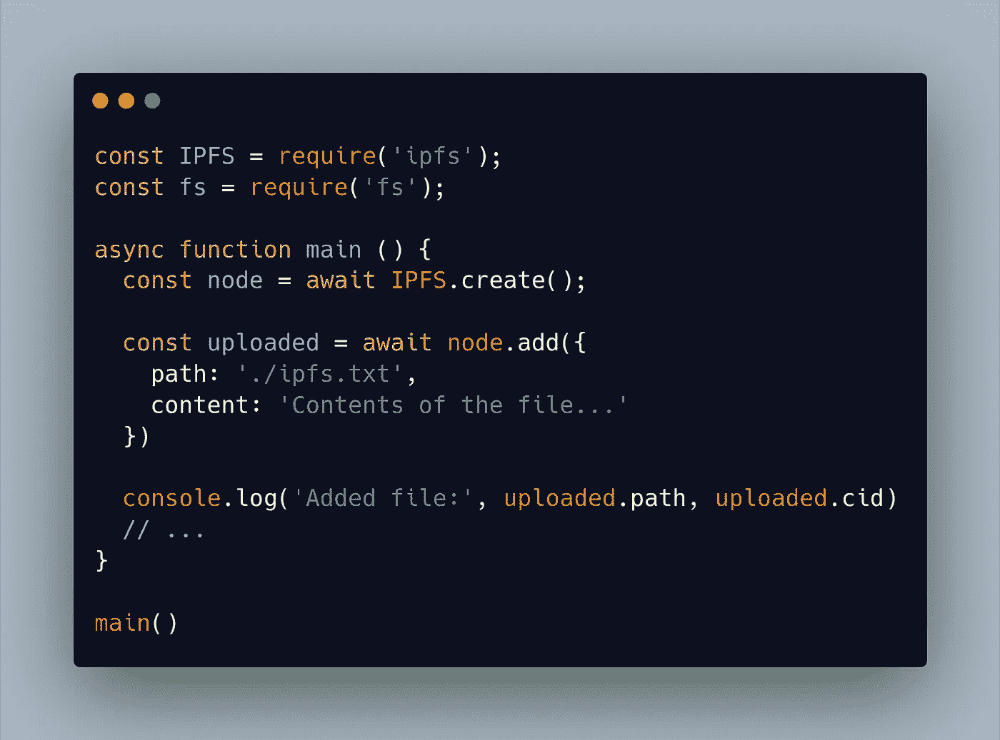
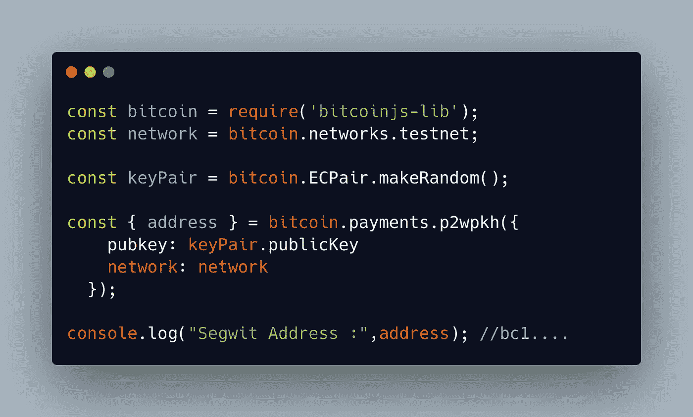
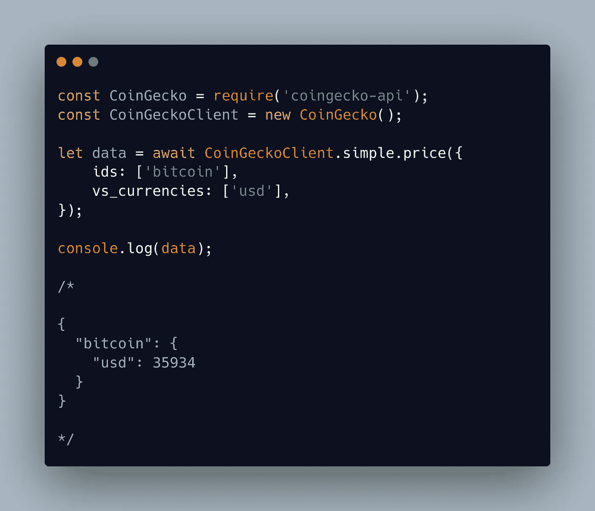
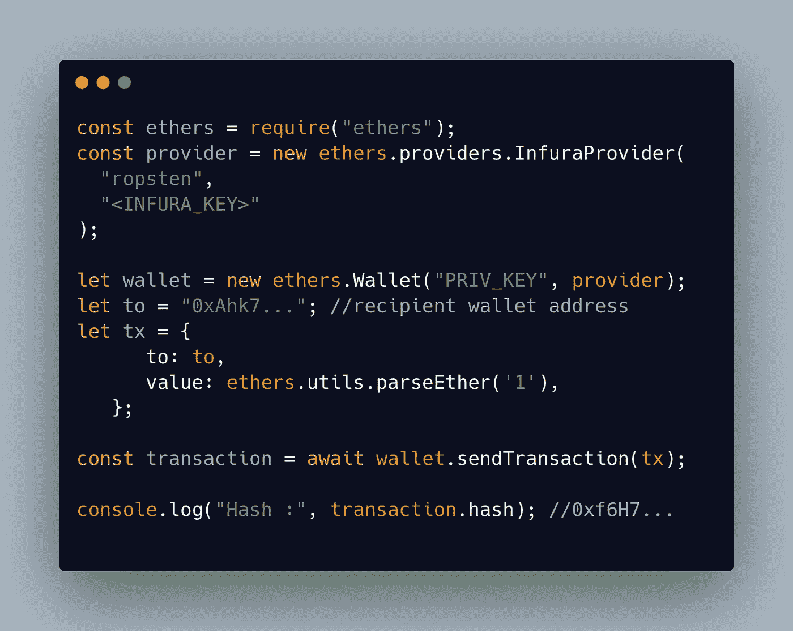

# 对区块链开发者有用的 7 个 NPM 库

> 原文：<https://medium.com/geekculture/7-useful-npm-libraries-for-the-blockchain-developers-7662729d77b6?source=collection_archive---------15----------------------->

## 给初学者的精选清单。

如今，我们可以看到区块链技术的高使用率，尤其是加密货币。因此，这些技术正在转变为我们日常生活中不可替代的一部分。然而，由于其广泛的适用性，区块链几乎为下一个十年保留了其位置。

缺乏信任和对隐私的需求为加密货币成为万亿美元的产业铺平了道路。每天都有几个项目和技术创新涌现出来。任何技术要获得如此高的采用率和可用性，都必须有一个桥梁，让任何正常人都能与底层系统进行交互。

这个桥梁就是应用程序。因此，很明显，开发者社区在技术发展中扮演着至关重要的角色。他们必须有足够的信心从零开始一个项目想法，并将其部署到生产中。在开发阶段，开发人员拥有一些实现通用逻辑的助手工具/库会更容易，这样他们就可以专注于构建应用程序的核心逻辑。今天，我们将浏览一些可以在客户端和服务器端应用程序中使用的有用的 npm 模块。

> 以下列表未按任何标准排序。我不打算深入研究任何模块。目标是提供每个模块的概述。我们开始吧！

# 1.)Web3.js:

Web3.js 是最受欢迎和最著名的库之一，用于与 EVM 兼容的区块链网络如以太坊、币安智能链等进行交互..它提供了广泛的 API，用于连接本地或远程节点并与之交互。

例如，我们可以使用`web3.js`检索以太坊地址的余额，如下所示:

更多信息，请查看他们的[官方文档。](https://web3js.readthedocs.io/)

# 2.)Ipfs-核心:

`[ipfs-core](https://www.npmjs.com/package/ipfs-core)`库用于与`ipfs`交互。这是一个非常简单的软件包。使用该模块，我们可以轻松地向`ipfs`网络上传和检索文件。

> 什么是 IPFS？
> 
> IPFS 是一个分布式系统，用于存储和访问文件、网站、应用程序和数据。

**示例**:

# 3.)Bitcoinjs-lib:

`[bitcoinjs-lib](https://www.npmjs.com/package/bitcoinjs-lib)`是一个使用 NodeJS 开发基于比特币的应用程序的优秀包。它为地址生成提供了 API，并帮助我们为几乎所有类型的地址(如`P2KH`、`P2SH`和`P2WPKH`)构建从简单到复杂的事务。

下面的代码片段将生成一个随机的`Segwit`地址:

# 4.)Coingecko-api:

这是我最喜欢的图书馆之一。它使用起来简单明了。这是一个非常有用的模块，可以用于各种用例，例如，获取硬币/代币的实时价格，获取资产的汇率，检索代币的详细信息等等。

获取`Bitcoin`的美元价格的示例代码。

# 5.)Ethers.js:

`[ethers.js](https://www.npmjs.com/package/ethers)`类似于上面讨论的`web3.js`包。但是`ethers.js`比`web3.js`更轻，更紧凑。因此，它适用于前端应用。此外，它有一个非常好的[文档](https://docs.ethers.io)，因此 ethers.js 绝对是一个初学者友好的软件包

你可以在这里了解更多关于`web3.js`和`ethers.js` 和[的区别。](/l4-media/announcing-ethers-js-a-web3-alternative-6f134fdd06f3)

示例代码演示了如何从`Private Key` 创建钱包实例，以及如何将`ETH`传输到接收方钱包。

# 6.)松露:

[Truffle](https://www.npmjs.com/package/truffle) 是一个完整的框架，可以用于开发和测试基于 Solidity 编写的智能合约。

使用该模块，可以很容易地在 EVM 兼容的实时网络上编译、测试和部署合同。

一些有用的命令:

*   `truffle init` —初始化一个新的块菌项目
*   `truffle compile` —编译项目的所有智能合同。
*   `truffle test` —运行项目的`test`目录下指定的单元测试
*   `truffle migrate --network <network_name>` —将编译好的契约(字节码)部署到指定的网络。

# 7.)CCXT:

[CCXT](https://www.npmjs.com/package/ccxt) 是另一个有趣的模块，可用于连接和交易全球的加密货币/替代货币交易所和支付处理服务。

根据他们[的文件](https://github.com/ccxt/ccxt):

*它提供对市场数据的快速访问，用于存储、分析、可视化、指标开发、算法交易、策略回溯测试、bot 编程、网店集成和相关软件工程。它旨在供编码人员、开发人员、技术熟练的交易员和金融分析师使用，以在其基础上构建交易算法。*

你可以在这里找到用法示例。

**注意:上面提到的一些模块将来可能会被弃用。因此，请在安装 npm 模块的过程中注意弃用警告/漏洞。**

编码快乐！