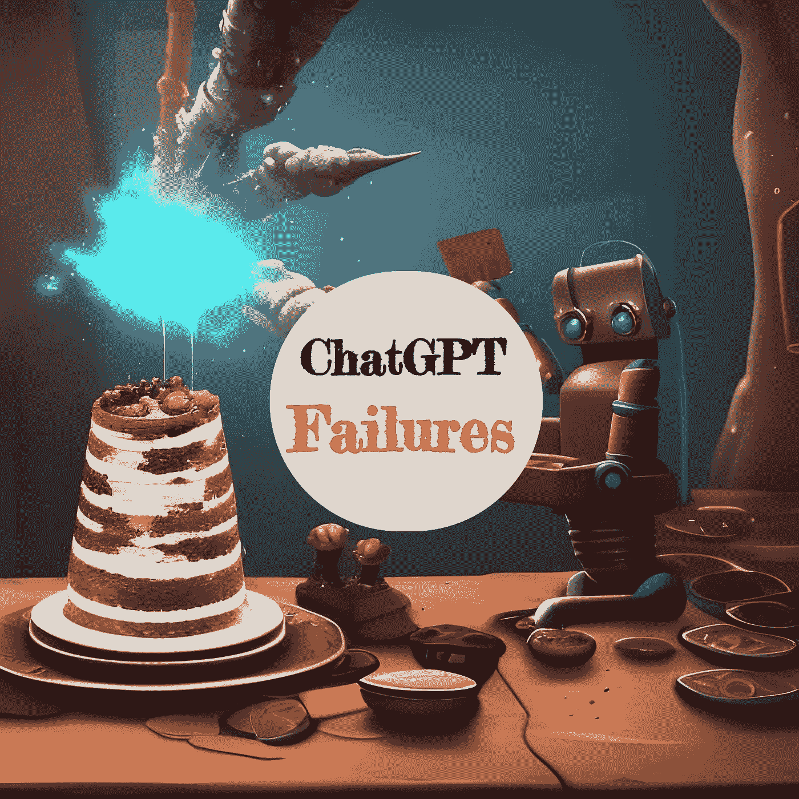

# ChatGPT 在回答问题时的 7 个不足之处

> 原文：<https://medium.com/geekculture/7-ways-chatgpt-falls-short-in-question-answering-f7cf809e9d12?source=collection_archive---------5----------------------->

## 为什么乔丹·彼得森对 ChatGPT 的看法是错误的

我刚刚看了一段乔丹·彼得森谈论 ChatGPT 的片段。虽然[ChatGPT](/geekculture/chatgpt-the-new-ai-tool-everybody-is-talking-about-3ccd209709e1)也给我留下了深刻的印象，但我确信他对 chat GPT 当前和未来能力的评估是完全错误的。