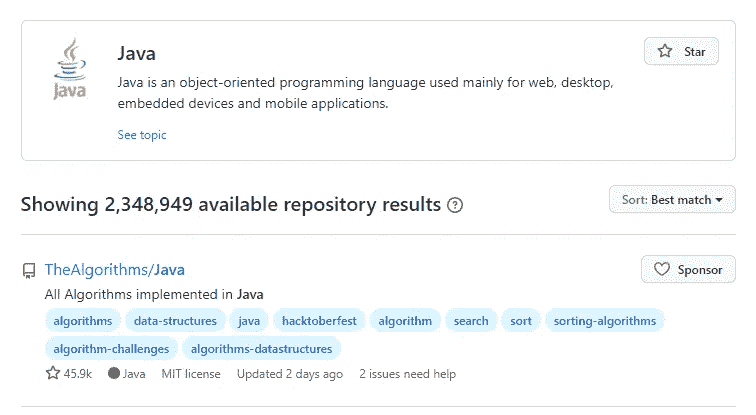

# 每个 Java 开发者都应该知道的 7 个网站

> 原文：<https://medium.com/geekculture/7-websites-every-java-developer-should-know-9df07c9dcb1b?source=collection_archive---------11----------------------->

## 信息是关键。

# 1.开源代码库

GitHub 不仅是开发者发布和维护代码的仓库，也是任何对编程或计算机科学知识感兴趣的人的学习工具。你可以搜索你感兴趣的任何话题，并根据明星的数量选择一些热门资源