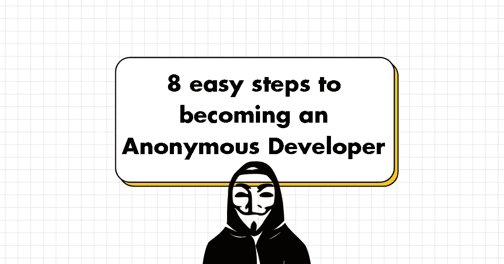
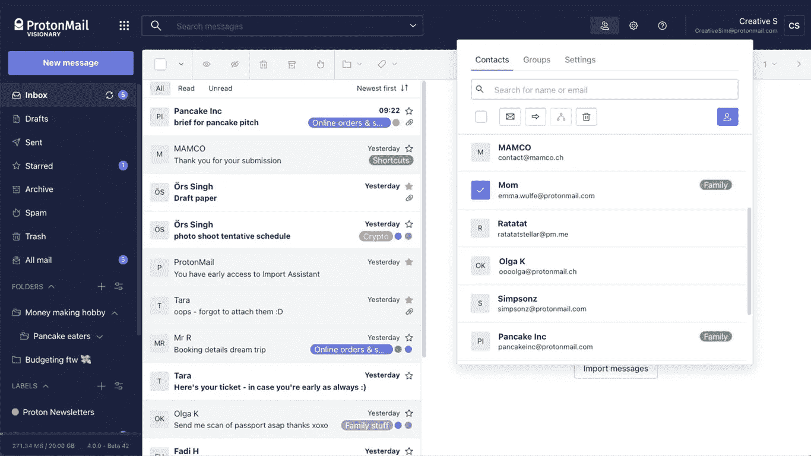
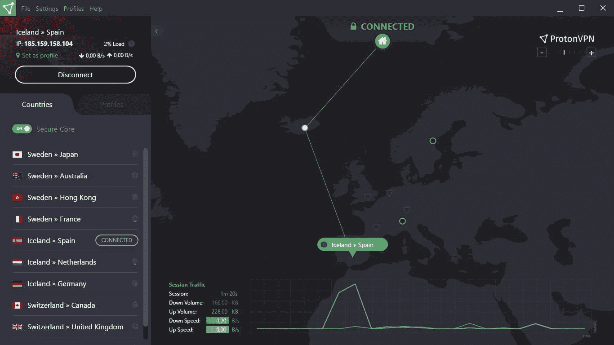
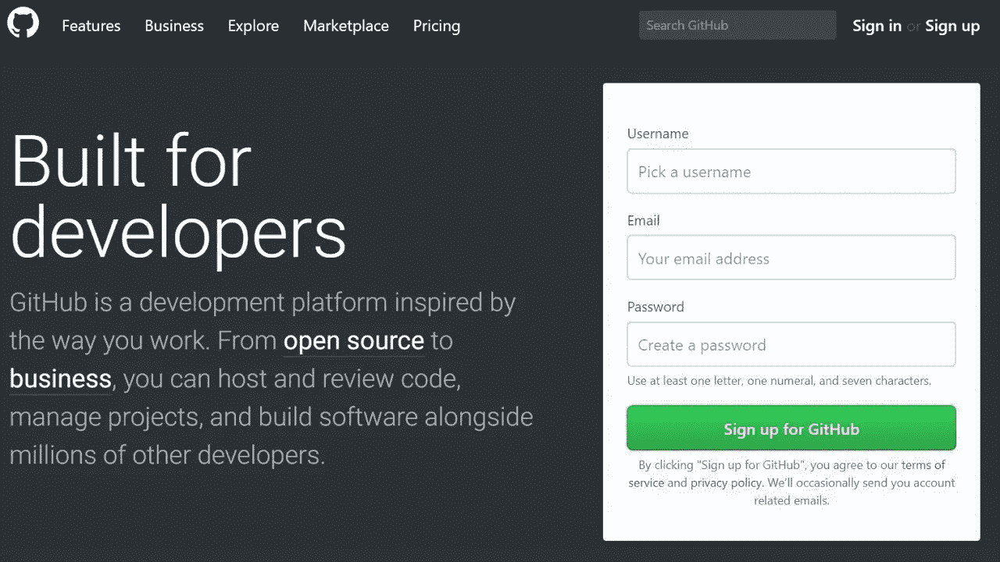
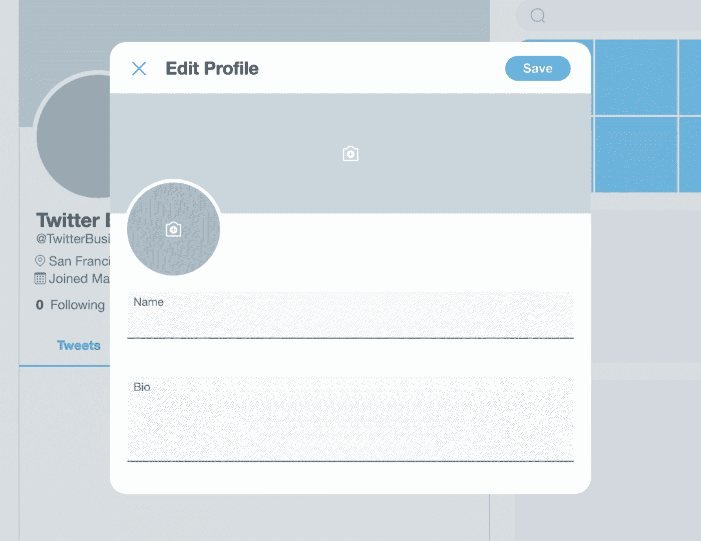
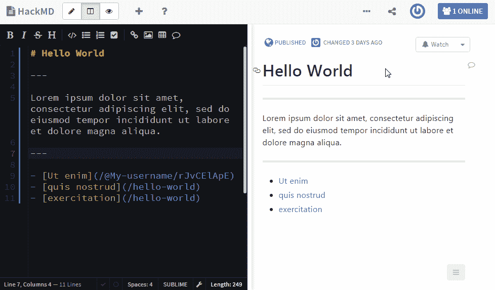
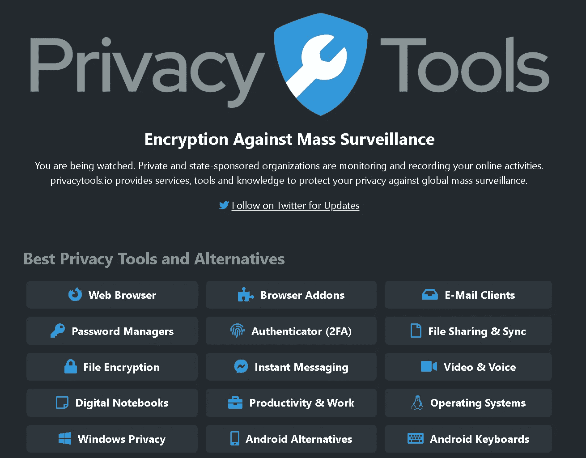

# 成为匿名开发者的 8 个简单步骤

> 原文：<https://medium.com/geekculture/8-easy-steps-to-becoming-an-anonymous-developer-348736c8c4e9?source=collection_archive---------10----------------------->

By Me :)

*在一般计算环境中，匿名意味着通过各种应用程序隐藏用户的姓名和身份*

这是一个帮助你开始开发匿名开发者账户的快速指南。无论是全栈开发人员、道德黑客还是区块链开发人员，都可能出于各种原因选择匿名。

这里有 8 个步骤来确保你的软件开发者身份是安全的:

# 1.在您选择的浏览器中创建新的浏览器配置文件

*   [火狐](https://support.mozilla.org/en-US/kb/profile-manager-create-remove-switch-firefox-profiles)及其衍生产品
*   [铬](https://support.google.com/chrome/answer/2364824?hl=en&co=GENIE.Platform%3DDesktop)及其衍生物

From Online Tech Tips

# 2.创建一个新的 Protonmail 帐户。

*   设立新账户时，Protonmail *不会询问任何个人身份信息*。
*   对于恢复选项，请确保您没有使用可以连接到您真实电话号码的电子邮件。

From Protonmail

# 3.创建相应的 VPN 帐户

*   无论何时处于*和*模式下，都使用此 VPN。您也可以使用 ProtonVPN

From ProtonVPN

# 4.用您的新电子邮件创建一个 Github 帐户

*   生成新的 SSH 密钥并将它们添加到这个 Github 帐户

From Github

# 5.用你的新身份创建一个新的 Twitter 账户

From Twitter

# 6.使用您的新身份创建一个新的 Reddit 帐户

*   使用您选择的请求子编辑为您的新匿名帐户获取一个新的唯一 pfp

From How-to Geek

# 7.创建一个 cryptpad.fr 和一个 hackmd 账户，满足你所有的笔记和加密存储需求

From HackMD

# 8.上 privacytools.io 寻找其他可以保护你隐私的工具

From Privacytools.io

# 9.(可选)在新的浏览器配置文件中到处安装 ublock origin、privacy badger 和 https

👇你还有什么让开发者保持匿名的小技巧？值得这么麻烦吗？

> 👋**在[媒体](/@pooriaarab)—[LinkedIn](https://www.instagram.com/pooria.arab/)—[Twitter](https://twitter.com/pooria_arab)—[insta gram](https://www.instagram.com/pooria.arab/)—[抖音](https://www.tiktok.com/@pooria.arab)**
> 
> 更多关于 Web3，Crypto，NFTs，DeFi 等的好东西…
> 
> 点击获取终极 NFT 发布战略

*免责声明:*

本文涵盖的内容不被视为权威建议，这些仅是我自己的推测性观点、想法和理论。这里分享的内容仅用于教育目的。

*不要纯粹根据本文提供的信息采取行动。一定要事先做好自己的调查和尽职调查。*