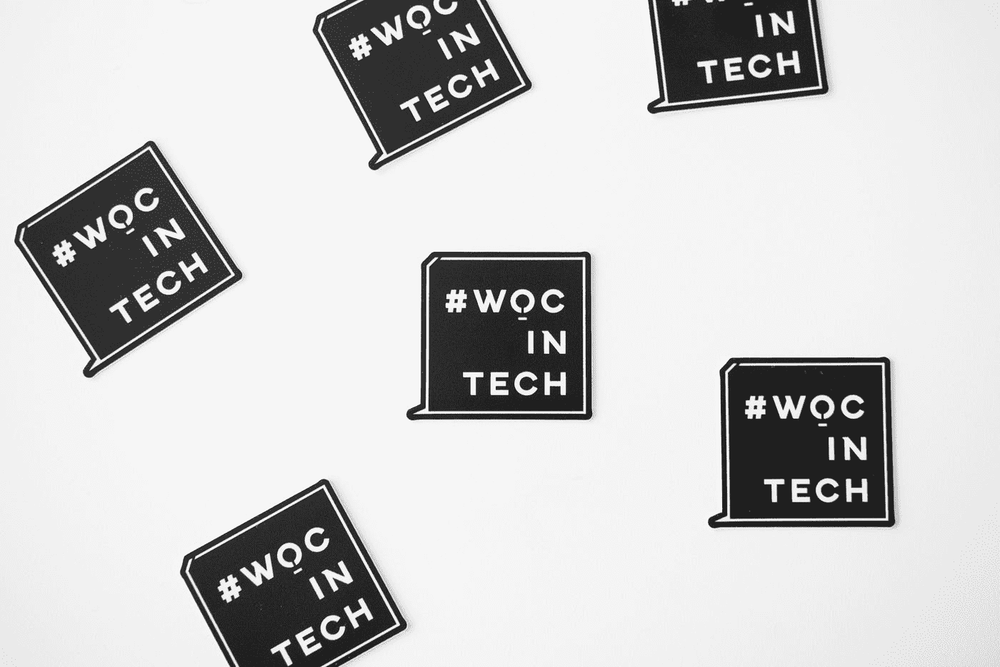

# 赋予妇女权力和教育妇女的 8 种基本加密资源

> 原文：<https://medium.com/geekculture/8-essential-crypto-resources-that-empower-and-educate-women-cb97a8c7b454?source=collection_archive---------6----------------------->

## 包括 Web3、区块链、加密教育、社区和工作论坛

Photo by [Christina @ wocintechchat.com](https://unsplash.com/@wocintechchat?utm_source=medium&utm_medium=referral) on [Unsplash](https://unsplash.com?utm_source=medium&utm_medium=referral)

最近，我在听《T2》对区块链和网络安全领袖奥拉因卡·欧登尼拉的采访时，再次想起了加密行业的[性别差异](/yardcouch-com/women-its-time-to-take-over-crypto-b13187315cbb)，奥拉因卡·欧登尼拉在 2018 年创立了[黑人女性区块链委员会](https://bwbc.io/)…