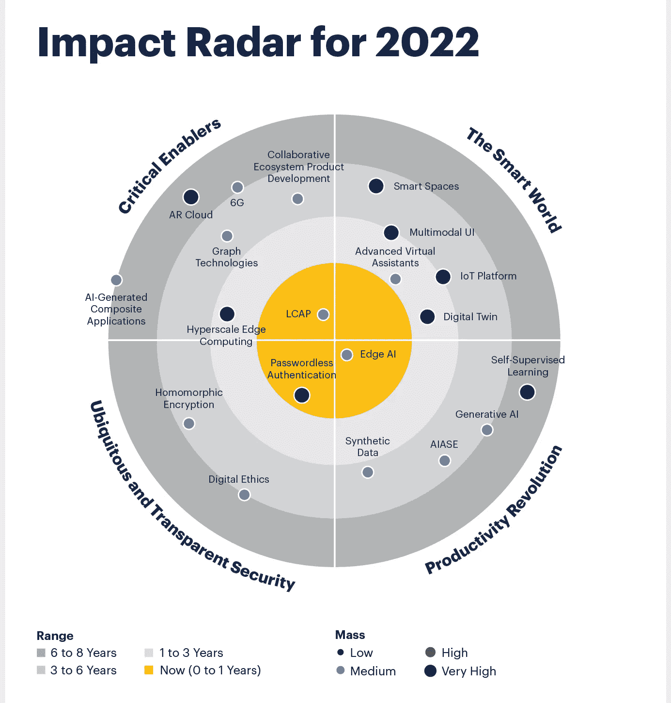

# 需要关注的 8 个高影响力技术趋势

> 原文：<https://medium.com/geekculture/8-high-impact-technology-trends-to-keep-an-eye-on-3f1b6ed7a642?source=collection_archive---------22----------------------->

Image Source: [Gartner](https://www.gartner.com/en/articles/5-impactful-technologies-from-the-gartner-emerging-technologies-and-trends-impact-radar-for-2022)

根据 Gartner 的《2022 年技术和趋势》,从我们日常生活中已经出现的某些技术，到对未来几年影响最大的未来技术，让我们一起来看看预计在不久的将来影响最大的 8 项技术。

## 1.无密码认证