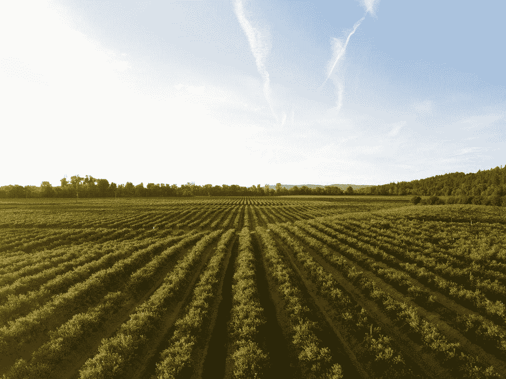
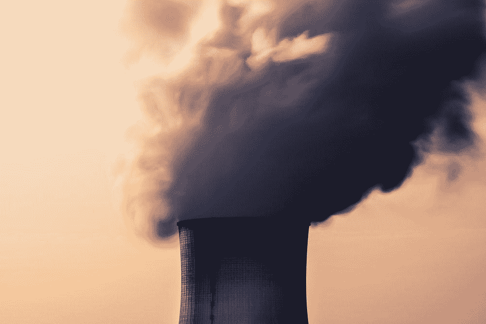
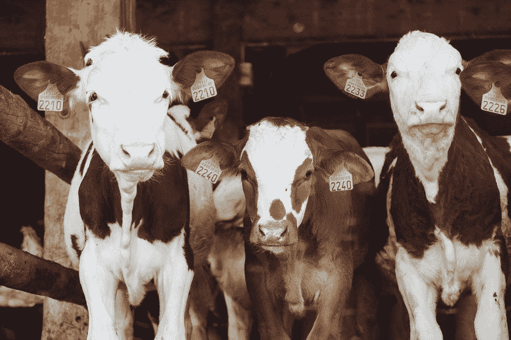
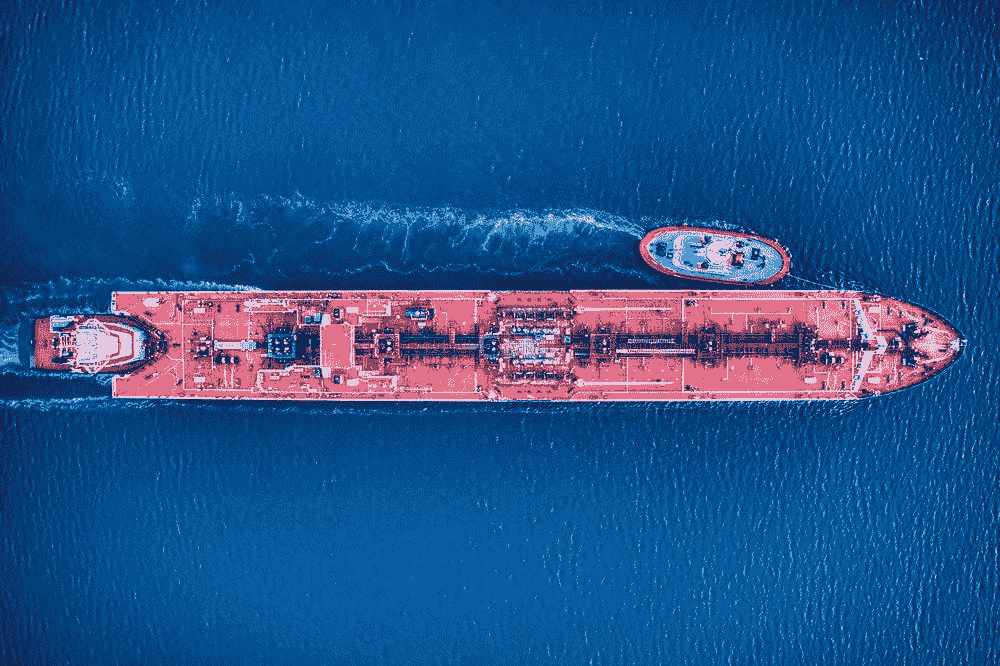
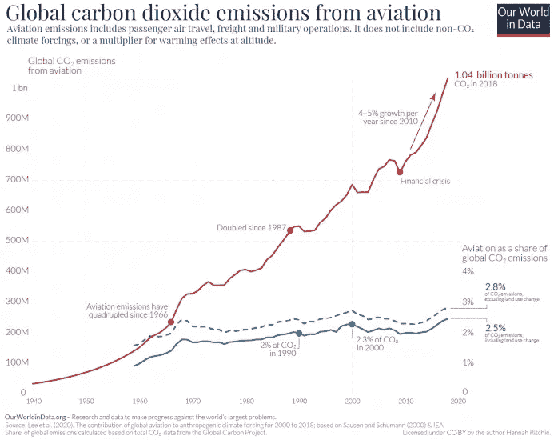
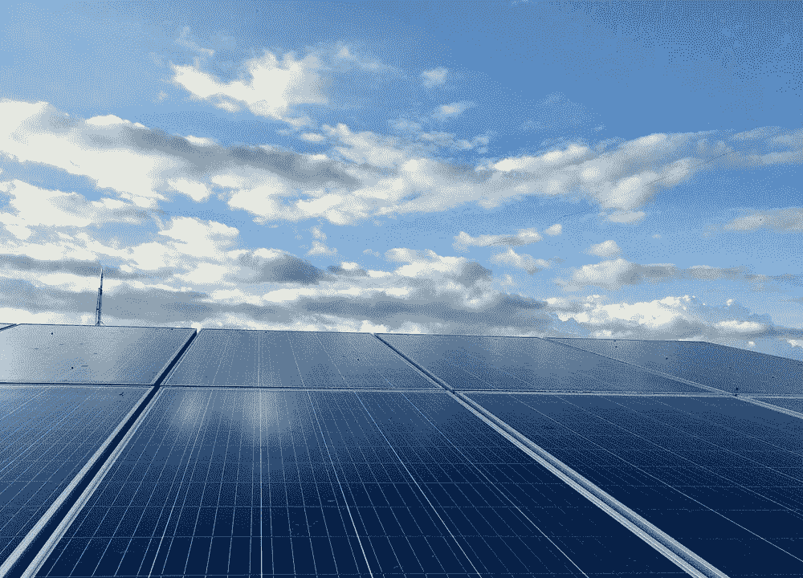

# 8 项有前途的技术可以帮助我们应对气候危机

> 原文：<https://medium.com/geekculture/8-promising-technologies-that-could-help-us-tackle-the-climate-crisis-861e57d3dec4?source=collection_archive---------9----------------------->

从特大火灾和干旱到超级风暴、冰盖融化和海平面上升，全球变暖的破坏只会越来越严重。人类活动对环境的负面影响似乎不可阻挡，很明显，将我们带到这一点的相同模式不会提供任何解决方案。

我是一个大的技术官僚，我相信开发和部署新技术可以帮助我们摆脱对碳密集型产业的依赖。我们已经有了诸如太阳能、风能和水电等可负担得起的、面向市场的解决方案，而且在不远的将来还有一些新技术可以加速我们走向绿色未来。

在这第一次汇编中，您将了解八项有前途的技术，它们可以使现代生活更加可持续。

## 1.用于碳捕获的增压土壤

**挑战**

从根本上说，气候变化和土壤退化这两个世界上最紧迫的挑战可以归结为一个简单的不平衡:空气中的碳太多，而地下的碳不够。

在过去的几年里，碳捕获已经获得了广泛的欢迎，承诺通过捕获和安全地储存碳来帮助限制 CO2 排放对全球变暖的贡献；然而，现有技术——包括直接空气碳捕获——影响非常有限，价格昂贵，并且很难推广。要使碳捕获技术可行，它们需要低成本、易于采用和易于扩展。这就是微生物介导的封存有望实现的目标。

**科技**

微生物介导的封存是一种通过微生物真菌和细菌从大气中去除碳的方法。有问题的技术？一种应用于种子的生物处理方法，将大气中的碳转化为更稳定的化合物，然后储存在地下深处。

[Soil Carbon Co](https://www.soilcarbon.co/) ，是一家澳大利亚农业科技初创公司，专门从事微生物介导的封存，他们解释说“一些微生物，例如黑色素内生真菌，以含有不稳定碳化合物的植物根系分泌物为食，并产生黑色素。这是一种更稳定的多芳香碳化合物，可抵抗与土壤中的水反应而分解。此外，已经表明这种碳沉积在被称为土壤微团聚体的压缩土壤小球中。这些微聚集体提供了一个厌氧的家园，碳可以在这里安全地长期储存。”

**势**

这项技术的一个主要卖点是成本低，易于采用，不像许多再生农业方法。从本质上讲，农民所要做的就是给他们的作物接种微生物，然后顺其自然。更重要的是，它是高度可扩展的——全球已经有数百万农民，基础设施以农作物的形式准备好了——

土壤碳公司的创始人说，“与其他碳封存机制相比，植物驱动的微生物过程是最有效的碳捕集方式。封存过程不需要额外的设备、土地或能源。”

## 2.低排放水泥

**挑战**
全世界每年在建筑中使用 40 亿吨水泥；事实上，对水泥的需求仅次于对水的需求。但这是一个隐藏的碳元凶，需要将石灰石加热到超过 2700 度的化学反应，同时释放出大量的二氧化碳，这使得混凝土行业占全球碳排放总量的 5——7%。

**技术人员**

有几种措施可以减少水泥生产过程中的二氧化碳排放:利用废热作为替代能源；二氧化碳捕获和储存技术；降低熟料与水泥的比率；替代燃料和生物质燃料的使用；替代原材料的使用；节能燃烧过程。

例如，初创公司 [Solidia](https://www.solidiatech.com/) 开发了一种“可持续水泥制造技术”,可以在较低的温度下生产，减少三分之一的排放。它还有一种“可持续的混凝土固化技术”，使用二氧化碳代替水，锁定污染物，减少 70%的碳排放，每年可能节省 3 万亿升淡水。

**潜力**
如果是一个国家，水泥的排放量会排第三。如果整个行业都采用减少二氧化碳排放的技术，我们可以节省数十亿吨二氧化碳，节约用水、时间和金钱。

## 3.低甲烷奶牛

**挑战**
[甲烷的吸热能力是二氧化碳的 30 倍](https://www.sciencedaily.com/releases/2014/03/140327111724.htm)，而食草动物产生了三分之一的甲烷排放。虽然牛放屁是所有的笑话，但 95%的甲烷泄漏实际上是通过打嗝从前端出来的。

奶牛在消化纤维食物时，通过胃中的微生物产生甲烷，这一过程被称为肠道发酵。奶牛吃什么对它们产生多少甲烷有很大影响。消化某些类型的食物比消化其他食物产生更多的甲烷。例如，消化干草和草产生的甲烷比玉米多。

**科技**
[2018 年的一项实验](https://www.npr.org/sections/thesalt/2018/07/03/623645396/surf-and-turf-to-reduce-gas-emissions-from-cows-scientists-look-to-the-ocean)显示，在奶牛的饮食中添加海藻可能会减少一半的甲烷产量！但研究人员发现这种解决方案有一个问题:奶牛似乎不太喜欢海藻的咸味！

其他科学家正在采取遗传学的方法。2019 年发表的一项[研究](https://www.sciencedaily.com/releases/2019/07/190708112514.htm)发现，牛胃中发现的产甲烷细菌的类型和数量与其基因构成有关。知道了这一点，科学家可以培育出胃中这些细菌较少的奶牛。

另一种选择是由英国初创公司 [Zelp](https://www.zelp.co/) 发明的一种笼头，它可以宽松地套在奶牛的鼻孔上，监测甲烷排放，并用催化剂将其转化，产生水和危害较小的二氧化碳。该设备可以将牛的排放量降低一半。

**势**
仅在美国，就有 9000 多万头牛。可穿戴技术可以帮助牧场主跟踪和申报他们减少的排放量，同时还可以为他们提供关于牛群健康状况的宝贵数据。

## 4.氢能船

**挑战**
海运排放的温室气体占全球温室气体排放量的 2.5%，此外，它还排放导致哮喘和癌症的污染物。航运业产生了全球 18-30%的氮氧化物(NOx)污染和 9%的硫氧化物(SOx)污染。

来自海事行业内部人士的机密数据显示，现在仅 15 艘世界上最大的船只排放的污染物就可能与世界上所有的汽车一样多，所以你可能会问，为什么在电动汽车方面有这么多努力，而在减少船只排放和污染方面却没有什么努力？

斯堪的纳维亚国家的一个合作伙伴正在建造一艘由氢燃料电池驱动的大型渡轮，这种电池从氢气中产生能量，只释放水。氢本身将是绿色的，来源于风能分解水分子。

这艘渡轮将在 2027 年连接奥斯陆和哥本哈根，每年可减少 64，000 吨二氧化碳。美国能源部强调了氢在公海上的巨大潜力，称其适合为“世界舰队中的大多数船只”提供动力。

## 5.绿色长城

**挑战**
荒漠化是气候变化的主要原因和影响之一。在 70 年代，跨越撒哈拉沙漠南缘的萨赫勒地区的大片肥沃土地开始严重退化。仅在几年内，由于气候变化、人口增长和不可持续的土地管理做法的综合影响，这个曾经郁郁葱葱、几代人支撑着数百万人生计的地区变得日益干旱和贫瘠。

没有足够的生产性土地来种植粮食或维持体面的生活，贫穷的恶性循环很快出现。多年来，这加剧了严重的食物和水资源短缺，不断发生的自然资源减少的冲突，大规模失业和被迫迁移。

**技术员**

基于自然的解决方案是应对气候变化最有希望的方法之一。[绿色长城](http://greatgreenwall.org/)是一项由非洲人领导的运动，其宏伟目标是在整个非洲建立一个 8000 公里长的世界自然奇观。

十年过去了，大约 15%的项目正在进行中，该项目已经以前所未有的规模让非洲退化的景观重现生机，为沿途生活的数百万人提供了粮食安全、就业和留下来的理由。

这座墙有望成为不仅非洲大陆，而且整个国际社会面临的许多紧迫威胁——特别是气候变化、干旱、饥荒、冲突和移民——的令人信服的解决办法。

一旦完工，绿色长城将是地球上最大的活建筑，是大堡礁的 3 倍。

潜力到 2030 年，长城的目标是恢复 1 亿公顷目前退化的土地，封存 2 . 5 亿吨碳，并在农村地区创造 1000 万个就业机会。

## 6.电动飞机

**挑战**
航空业对气候变化的贡献——占全球变暖的 3.5%，或二氧化碳排放量的 2.5%——通常比人们想象的要少。与其他部门相比，它目前的排放量相对较小。

关键的挑战是去碳化特别困难。我们有解决方案来减少许多最大的[排放者](https://ourworldindata.org/ghg-emissions-by-sector)——如电力或公路运输——的排放，现在的问题是扩大它们的规模。我们可以部署可再生能源和核能技术，并过渡到电动汽车。但是我们还没有解决航空问题的有效方法。

一些设计概念正在出现，例如，空中客车公司已经宣布计划在 2035 年拥有第一架零排放飞机，使用氢燃料电池。电动飞机可能是一个可行的概念，但由于电池技术和容量的限制，很可能仅限于非常小的飞机。

电子飞机离起飞越来越近了。去年六月，一架改装的塞斯纳九人座飞机在华盛顿州上空飞行了近 30 分钟。10 月，一架混合动力电动飞机在加州上空巡航了 2 小时 30 分钟。

**潜力**
一半的飞行里程不到 500 英里，为电子飞机创造了一个甜蜜点。英国廉价航空公司 EasyJet 计划到 2030 年将伦敦至阿姆斯特丹等航线的电子飞机旅行商业化。

## 7.浮动太阳能电池板

**挑战**
大型太阳能装置很难在人口稠密、土地昂贵或地形崎岖的国家选址。太阳能也产生间歇性电力，必须由其他能源补充。

**技术员**

浮动太阳能装置由安装在漂浮在水体上的结构上的太阳能电池板阵列组成，并且正在成为可再生能源领域的一种有前途的趋势。

首个浮动光伏系统于 2007 年在日本爱知建成。自那以后，包括法国、意大利、韩国、西班牙和美国在内的其他几个国家已经测试了小规模系统。

Q CELLS 公司通信经理 Ian Clover 表示，与陆上装置相比，在合适的条件下，漂浮太阳能电站的发电量可以比可比的陆上阵列多 10%。

“这是因为水的冷却效果确保太阳能电池组件不会在高于最佳温度的温度下运行，从而确保更容易实现峰值功率输出，”他解释道。

此外，他表示，漂浮太阳能电站不太可能遇到任何第三方遮挡，这意味着它们可以享受“比许多陆上电站更长、不间断的峰值性能”。

水电大坝上的漂浮太阳能装置利用了水电附近未使用的水面，可以在黑暗中产生能量。韩国一座新的漂浮太阳能发电厂将是世界上最大的，发电量为 41 兆瓦。

T2 这座核电站将为 6 万人提供电力，但根据世界银行的数据，全球有超过 15 万平方英里的人造水库，浮动太阳能具有“太瓦级的潜力”。

## 8.潮汐能

**挑战**
潮流是沿海社区尚未开发的巨大能源，很难利用，因为汹涌的海水会冲击和损坏水下设备。

**科技**

潮汐能是由涨潮和落潮时海水的涌动产生的。潮汐能是一种可再生能源。

在 20 世纪，工程师们开发了利用潮汐运动在有显著潮差(高潮和低潮之间的面积差异)的地区发电的方法。所有的方法都使用特殊的发电机将潮汐能转化为电能。

潮汐能生产仍处于初级阶段。到目前为止，发电量很小。世界上很少有商业规模的潮汐发电站在运行。第一个位于法国的拉兰斯。最大的设施是韩国的西华湖潮汐发电站。

今年 2 月，可持续海洋公司在加拿大推出了世界上第一个浮动潮汐能平台，这是一艘装有六个潜水涡轮机的驳船，可以随着潮汐流转动，产生稳定的电力。

**潜力**
部署在新斯科舍省因涨潮而闻名的芬迪湾，初期项目将为 3000 户家庭供电。如果潮汐能成为一种可靠的、可扩展的技术，它可以满足全球超过 5%的能源需求。

## 我们还应该在列表中包括哪些其他技术？

## 别忘了鼓掌向我们表示你的支持！！