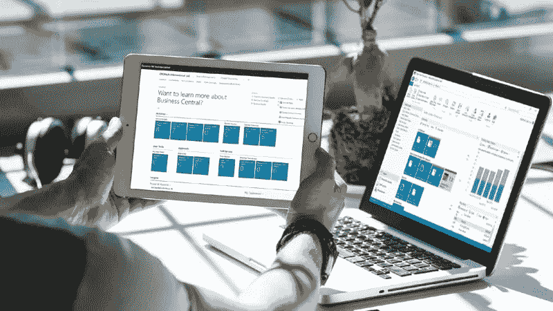
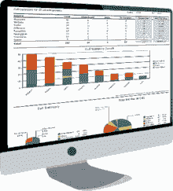

# Business Central 是企业最佳云 ERP 解决方案的 8 个理由？

> 原文：<https://medium.com/geekculture/8-reasons-why-business-central-is-the-best-cloud-erp-solution-for-businesses-9f6285b0bb07?source=collection_archive---------15----------------------->

Business Central

时代已经变了，对技术的依赖已经成倍增长，尤其是在过去几年里，原因大家都知道。

我们没有想到疫情会把我们推回自己的家里，从而导致全球公司工作方式的重大变化。即使疫情迟早不在那里，公司为自己配备一个强大的 ERP 系统的需求总是触手可及的。

说到 ERP，尽管市场上有许多企业资源规划系统—[**Dynamics 365 Business Central**](https://www.nevastech.com/solutions/microsoft-dynamics-365/microsoft-dynamics-365-business-central/)**是各种规模的企业最受欢迎的 ERP 之一，这些企业正在寻找连接其业务数据、自动化业务流程并确保数据来回无缝交易的系统。**

## **了解 Dynamics 365 Business Central 成为最佳企业云 ERP 解决方案之一的原因:**

> **1.云:从任何地方访问，**
> 
> **2.自动化业务流程**
> 
> **3.单一存储库**
> 
> **4.仓库和供应管理**
> 
> **5.经济高效的解决方案**
> 
> **6.更快的实施**
> 
> **7.易于扩展**
> 
> **8.多重整合**

**借助 Microsoft Dynamics 365 Business Central，您可以使用单一解决方案连接您的团队，改善客户体验，检查业务洞察力，提高财务可见性，并实现最佳结果。现在，让我们简要地看一下为什么 Dynamics 365 Business Central 是迄今为止最好的。**

****

**Microsoft Dynamic 365 Business Central**

## **1.**云:从任何地方访问****

**与内部解决方案不同，公司不需要在办公室中分配特定的空间来维护系统。这项工作还没有结束——你需要一个维护团队，硬件检查，升级，如果有的话，等等。然而，在云 ERP 中，Dynamics 365 Business Central 的所有复杂性都由微软团队负责，因此无论您身在何处，您都可以随时访问系统。你所需要的只是一个强大的互联网连接和访问数据的用户凭证。**

** [## Dynamics 365 内部商务中心| Nevas Technologies

### Microsoft Dynamics 365 Business Central On-Premise 已于 2018 年 10 月 1 日正式启动，正式使其…

www.nevastech.com](https://www.nevastech.com/solutions/microsoft-dynamics-365-business-central-on-premise) 

## **2。** **自动化业务流程**

当员工可以从事其他创收活动时，拥有一个可以为公司增长工作的系统是多么酷？这就是当您使用 Dynamics 365 Business Central 实现业务流程自动化时所发生的情况。消除手动数据输入，减少完成任务所需的人工干预，避免冗余，并自动执行重复性任务以提高生产效率。

## **3。** **单个存储库**

你有多少次经历过这样的情况:你花了无数次在电脑上搜索文件，却忘记了它们实际存储在哪里？你并不孤单。我们也经历了那场磨难。但是有了 Dynamics 365 Business Central，所有关于您业务的重要文件—客户数据、制造、财务、仓库信息等—都存储在云上的单个系统中。

## **4。** **仓库和供应链管理**

了解何时补充仓库中的库存，检查多个地点的现有库存水平，提高供应链管理的效率，更快地完成订单处理，并确保更快地交付给客户。所有这一切携手并进，使使用 Microsoft Business Central 实现更大增长的企业受益。

## **5。** **性价比高的解决方案**

考虑到市场上顶级的商务管理解决方案，您可以从 D365 商务中心获得的价格具有额外的优势。商务中心有两种定价方式。而 Essentials 的费用为每个用户每月 70 美元。另一个名为 Premium 的套餐大约是每个用户每月 100 美元。最棒的是，使用这个系统对你的成长没有额外的费用。

## **6。** **更快实现**

让我们以内部解决方案为例。你的办公室需要一个专用空间。您需要根据硬件环境进行设置。您需要一个团队来为您的空间设置内部安装。而 Dynamics 365 商业中心云提供了光速般的快速实施。一旦你付了钱，填好细节，嘣——就可以用了。

## **7。** **易于缩放**

我们使用的任何系统或购买的任何软件的主要目的都是为了推进业务方式，从而直接或间接地增加我们的收入或带宽。这正是 Microsoft Business Central 的目标——与您的公司一起成长。在 Business Central 的帮助下，无论您想在公司内做什么，都可以无缝地完成，从而推动您的业务增长。

## 8。 **多重整合**

Dynamics 365 Business Central 可以与 Office 365 等内部解决方案快速集成，从而减少了集成第三方应用程序所需的额外时间。此外，用户还可以获得 Microsoft BI 这一突出功能，使用它您可以获得关于您的品牌如何建立的分析和可操作的见解。此外，该系统还可以根据您的业务需求进行定制，只需在这里或那里做一些修改。

> **Bayen 需要质量，你必须投资和升级！**

# **额外优势:通向云的桥梁**

“云之桥”是微软团队设计的一项计划，旨在帮助目前使用 Dynamics GP 或 Dynamics SL 的企业将其内部部署转换到 Microsoft Dynamics 365 Business Central。这样，迁移和实施变得比以前更加容易，并且可以在很短的时间内完成。此外，还有额外的好处，比如提供 Microsoft Dynamics 365 Business Central 的无风险试用版，以及为选择全面采用云的公司提供多种理由。

## **结论**

如果你没有一个强大的 ERP 解决方案来管理你的业务流程，你就在竞争中落后了。今年你能做的最明智的决定是将任务自动化，这样你的员工就可以花更多的时间来推动你的业务发展。微软 365 Business Central 拥有运营灵活性、最佳性能、财务管理、可操作的洞察力等卓越特性，是您确保未来业务发展和快速提升增长所需的系统。**