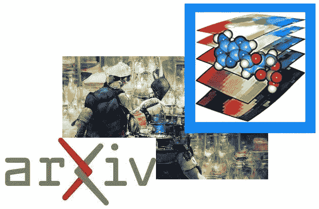

# 如果你对机器学习和人工神经网络的科学应用感兴趣，不要错过的 8 个资源

> 原文：<https://medium.com/geekculture/8-resources-to-not-miss-if-you-are-into-machine-learning-and-artificial-neural-networks-for-science-63d5a780f5bf?source=collection_archive---------16----------------------->

Picture made by the author exemplifying some of the resources presented in the article.

# 1.从基础到核心 ML 与一本书刚刚免费发布的 PDF 格式

> 代数，拓扑学，微分学，计算机科学和机器优化理论…