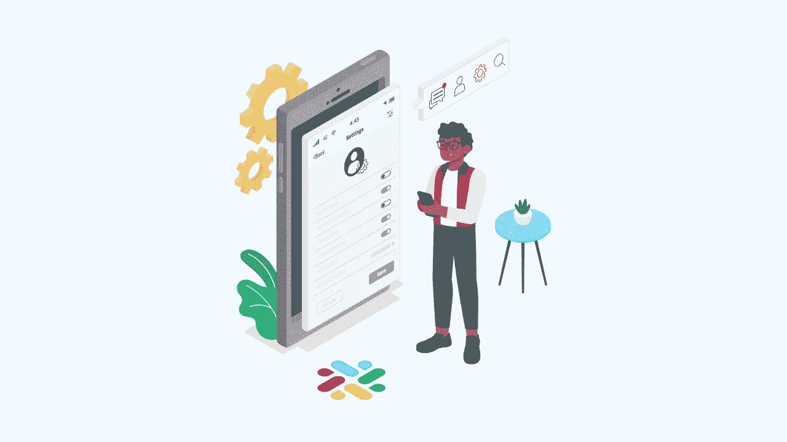

# 你应该马上开始使用的 8 个松弛特性

> 原文：<https://medium.com/geekculture/8-slack-features-that-you-should-start-using-right-away-42fc583a0969?source=collection_archive---------12----------------------->

在这种在家工作的文化中，团队管理软件在带来纪律和管理协调方面变得至关重要。将团队管理应用程序/工具融入您的日常工作生活可能会很复杂。使用您的任务管理解决方案来自动化您在日常工作中使用的应用程序，将有助于您更好地使用该工具。我们已经编制了一个集成列表，使利用您的任务管理工具轻而易举！

**直接导线断裂**

花更多的时间追踪线索并手动记录无数次，而不是找出它们的来源。领导是从企业的各种来源中产生的，将您的营销渠道与 Slack 集成可以让您的领导直接与您的任务管理器应用程序同步。

*   **社交媒体:**将您的任务管理工具连接到您的社交网络应用程序，如脸书、Instagram 和 Twitter，以接收您的线索的即时更新。

*   **Unbounce:** 一个应用程序，可以让你看到你的网页产生了多少线索。当您将此与您的任务管理器结合使用时，您将清楚地了解特定登录页面或博客内容的表现。

*   **Salesforce** :将您的任务管理器与您的客户关系管理(CRM)软件同步，以自动传输信息。这可以让销售代表同时在两个不同的应用程序上更新他们带来的销售线索，从而节省他们的时间。

这些集成使同步、更改和查看您的销售线索以及何时和从变得简单。这可以节省时间，并确保营销和销售团队步调一致。在信息被锁定之前，它会经过公司内部的几个接触点；销售线索碎片化只是让您跟踪这些接触点。

**通过集成，团队协作变得更加容易。**

使用任务管理应用程序的目的是改善团队合作。这里有一个应用程序列表，你的任务经理应该使用它来与团队的其他成员协作并更有效地工作。

*   **同步你的邮件:**在内部，你的任务管理器允许你和你的团队成员联系；然而，将它与您的电子邮件同步将使您能够做出判断，例如应该根据外部通信将哪个团队成员分配到工作中。

*   **共享驱动:**一个项目可能由几个团队成员共同完成，在被接受之前可能要经历几个开发阶段。将 Google Drive 等基于云的驱动器与 Slack 相集成，让团队成员可以轻松更新驱动器中的单个项目和任务，并在他们的任务管理器中接收更新通知。电子表格、文档和演示文稿都可以轻松共享。

*   **同步您的日历:**您可以在任务管理器中设置状态，通知您的队友您有空。然而，你是否记得主动更新你的状态以及你在任务管理器上的活跃程度将决定这一点。同步日历可以让您与同事共享日程安排，并提醒即将召开的会议。

*   **创建活跃的待办事项列表:**工作在不同团队成员的信息之间堆积了大量时间。筛选通信是低效和耗时的。这会增加你错过最后期限的可能性。将你的任务管理器和笔记软件结合起来，它会立即传递到你的笔记中。

*   **如何让你的团队保持社交意识:**营销人员投入大量时间和精力开发社交媒体宣传材料。另一方面，他们花更多的时间说服公司里的每个人推销这些抵押品。如果你想接触更多的观众，你的团队成员是你应该首先联系的人。让他们了解品牌的新事件和活动可能是一种耗时的方法同步社交网络应用程序，每次发布新内容时都发送通知是自动化的，让你摆脱所有繁重的劳动。

**创造旅程，帮助你更有效地管理任务**

虽然我们关注的是 Slack，但是同样的集成也可以与市场上的任何其他团队管理平台一起开发。每天都有大量新的应用程序出现，为你提供无限的方式来组合你最喜欢的应用程序。查看 [Quickwork](https://quickwork.co/) 平台，开始用很少或没有编码来创建旅程，或者联系我们以了解更多关于任务管理器连接选项的信息！