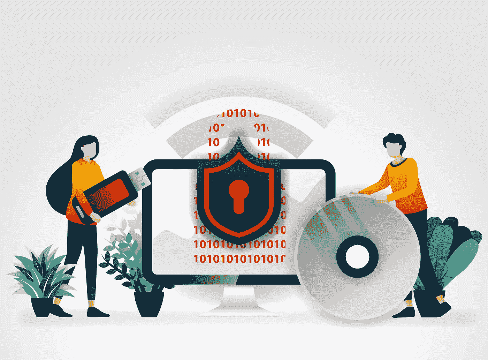
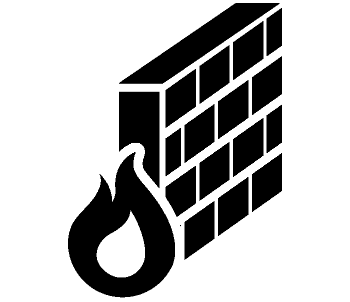
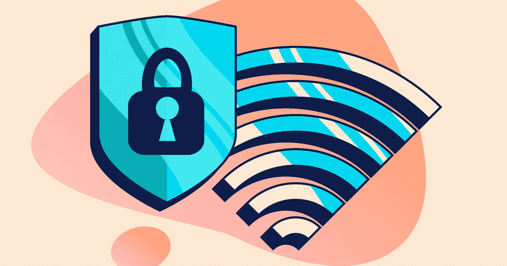
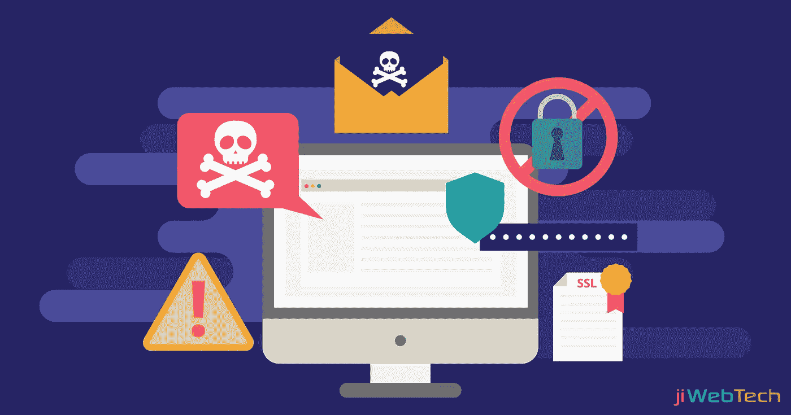

# 安全浏览网页和访问互联网的 8 个技巧

> 原文：<https://medium.com/geekculture/8-tips-for-safe-web-browsing-and-accessing-the-internet-953c4e9e47c0?source=collection_archive---------16----------------------->

黑客每 39 秒就试图闯入一个系统。你最不希望的事情就是让他们侵入你的系统。

如果你想避免个人信息和金钱被盗，安全的网络浏览是必不可少的。一旦黑客进入了你的设备，他们就可以对你的生活造成严重破坏。

但是，您能做些什么来确保自己不会成为攻击的牺牲品呢？这本方便的互联网安全指南会帮助你。

# 1.让您的操作系统、浏览器和插件保持最新

黑客们总是在寻找进入人们电脑系统的新方法。每当在浏览器、插件或操作系统中发现漏洞，就会发布更新以防止黑客入侵。

您必须及时了解这些变化，并下载任何新的更新。

# 2.阻止弹出窗口

虽然大多数弹出窗口都是令人讨厌的广告，试图让你购买一些东西，但有些可能更加恶意。

为了避免恶意让你意外点击链接，在弹出窗口拦截。

按照以下步骤打开弹出窗口阻止程序:-

# 打开或关闭弹出窗口

1.  在你的电脑上，打开 Chrome。
2.  *在右上角，点击 3 个圆点图标(省略号)*
3.  *设置。*
4.  *在“隐私和安全”下，单击“站点设置”。*
5.  *单击弹出窗口和重定向。*
6.  *在顶部，将设置转到允许的*

# 3.使用防病毒软件

不言而喻，要阻止病毒和恶意软件的攻击，您应该在系统上安装防病毒软件。

有许多不同的免费选项可供选择。这里有一些建议。

# 4.使用防火墙

黑客正试图进入你的系统。阻止它们的最好方法之一是安装防火墙。如果您的计算机已经安装了防火墙，请确保它已打开并且是最新的。

要安装防火墙，请访问此链接→ [防火墙安装](https://blink.ucsd.edu/technology/security/user-guides/firewall/windows7.html)

# 5.使用强密码

每当您使用密码访问任何网站时，您应该确保它是唯一的。使用强密码意味着它们不容易被猜到。混合使用字母和数字，并经常更换密码。

# 6.使用书签

为了避免在键入您经常访问的网站名称时出错，您应该始终将您的页面加入书签。书签链接每次都会带你到正确的页面。

考虑使用允许您在所有设备上访问书签的浏览器。

# 7.考虑一下你是从哪里上网的

如果您在咖啡店和机场等公共场所使用您的设备访问互联网，请考虑您所连接的网络的安全性。

除了小心公共网络之外，考虑使用安全的充电数据拦截器来保护插入公共 USB 插座的设备。

# 8.避免点击电子邮件中的链接

病毒和恶意软件很容易通过电子邮件传播。您只需点击电子邮件中的恶意链接，您的设备就可能被感染。即使您知道电子邮件来自谁，也应该始终将链接视为可疑。

# 安全网页浏览

现在您已经知道了一些安全浏览网页的最佳技巧，您可以保护自己免受攻击。请记住始终保持您的浏览器、防病毒软件和操作系统最新，并避免点击电子邮件中的链接。

我希望这些建议能保护你的安全。如果你喜欢读这篇文章，请留下你的评论。

这里是我的几篇文章，你可能会喜欢读:)

 [## 在家工作是骗局吗？回顾:出现工作吗？

### 随着世界变得日益数字化，对于不同行业的公司来说…

ks-9.medium.com](https://ks-9.medium.com/is-arise-work-from-home-a-scam-review-does-arise-work-16300b98932c)  [## 9 种无意识的肢体语言会让你像看书一样阅读别人

### 你有没有发现自己在做这些事情？

ks-9.medium.com](https://ks-9.medium.com/the-9-unconscious-body-language-signs-thatll-have-you-reading-someone-like-a-book-e1f16b327ef6)  [## 在你的博客中应用的最好的免版税照片

### 今天，你将了解到在你的帖子中使用图片是多么重要，以及在哪里可以找到最好的免版税照片和…

medium.com](/swlh/the-best-royalty-free-stock-photos-to-apply-in-your-blog-5e55859cb5e8)