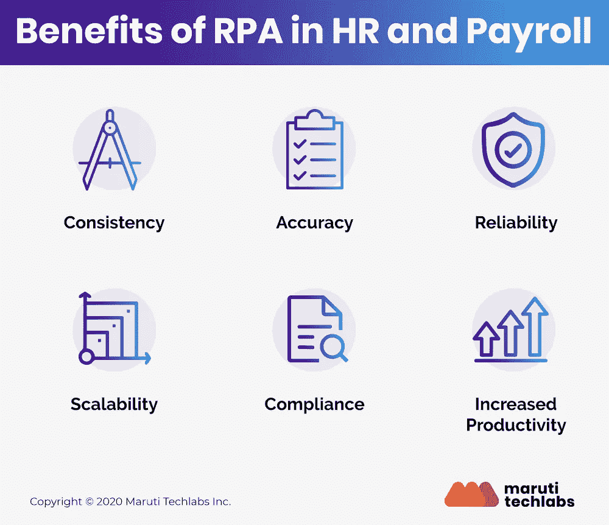

# 人力资源流程自动化:让你的组织受益的 8 种方式

> 原文：<https://medium.com/geekculture/8-ways-hr-process-automation-can-benefit-your-organization-ac7028bc920e?source=collection_archive---------25----------------------->

人力资源中的 RPA 有助于将人放回人力资源中。听起来很矛盾？这是事实。[机器人流程自动化服务](https://marutitech.com/robotic-process-automation-services/?utm_source=medium&utm_medium=content_promotion&utm_campaign=HR_process_automation)帮助组织简化其事务性人力资源任务，以便人力资源团队可以专注于更有价值和更具战略意义的活动，例如为您的员工提供面对面的时间或解决问题。

无论是维护时间表、定期更新员工数据、确保合规性还是报告，机器人流程自动化都可以帮助消除日常人力资源运营中涉及的大量事务性活动。

根据德勤最近在[进行的一项调查](https://www2.deloitte.com/ch/en/pages/human-capital/solutions/human-capital-robotic-process-automation.html)，RPA 是一种可行且经过验证的解决方案。超过 74%的受访者计划在未来几年探索该技术，近 22%的受访者已经试点或完全实施了 RPA。

这篇文章将讨论所有你需要知道的人力资源 RPA 及其好处。让我们开始吧。首先，什么是人力资源自动化？

# **什么是人力资源流程自动化？**

人力资源流程自动化是通过自动化标准和重复性的人力资源活动来提高人力资源部门效率的过程，从而使他们能够专注于复杂的任务，如决策和战略制定。

RPA 本质上是软件机器人，它自动化人力资源部门中基于规则的高度事务性流程，几乎不需要或不需要人工干预。除了提高准确性和数据处理效率之外，RPA 还可以降低总体人力资源相关成本。这些包括新员工入职、处理工资单、福利登记和合规报告，需要大量的手动和重复性劳动。

## **人力资源流程自动化的优势**

通过[人力资源流程自动化](https://marutitech.com/robotic-process-automation-services/?utm_source=medium&utm_medium=content_promotion&utm_campaign=HR_process_automation)，组织可以以相当低的成本快速设计、简化、集成和部署必要的服务。

如果实施得当，人力资源自动化可以获得重要的好处。以下是人力资源自动化的八大优势:

1.  **准确性和更高的生产率** —人力资源流程自动化使用预编码技术，最大限度地减少误差。此外，通过让员工专注于更高价值的任务，RPA 由于快速处理和数据共享而直接有助于公司的整体战略目标和生产效率。
2.  **一致性** — [在人力资源部门实施 RPA](https://marutitech.com/successful-rpa-implementation/) 减少了数据录入错误和文件错放/丢失。RPA 可确保复制和无错性能，消除运营期间的任何输出变化。
3.  **可扩展性—** 大规模运营时，RPA 所需的工作量显著降低。操作可以根据需要快速增加或减少。这使得整个系统的工作浪费最小。
4.  **经济高效—**RPA 的另一个[优势是它还降低了与基于纸张的处理相关的存储和打印成本。它还通过以最佳运营成本高效招聘员工来促进组织发展。](https://marutitech.com/benefits-of-rpa-in-business/)
5.  **数据驱动的报告—** 借助人力资源流程自动化，您可以利用见解深刻的报告做出明智的业务决策，并有更多时间分析人力资源数据以做出明智的决策。
6.  **留住人才—** 由于员工参与度提高，人力资源流程自动化降低了员工流动率。您还可以与其他利益相关者合作，雇佣、培训和保留熟练劳动力。
7.  **可靠性** —没有人工干预和树叶，效率提高，因为机器人 24×7 工作，性能一致。点击此处了解有关 RPA 的 [RoI 测量的更多信息。](https://marutitech.com/roi-of-rpa/?utm_source=medium&utm_medium=content_promotion&utm_campaign=HR_process_automation)
8.  **灵活性—**RPA 解决方案非常灵活，无论部署环境如何，都可以遵循既定的程序。

## **结论**

RPA 承诺通过将人类从单调的工作中解放出来，为组织提供更多敬业的员工和明确的竞争优势。人力资源领域的机器人技术可以减少错误、准确分析、提高可伸缩性以及整体简化人力资源运营。

大多数组织迟早会意识到 [RPA 服务](https://marutitech.com/robotic-process-automation-services/?utm_source=medium&utm_medium=content_promotion&utm_campaign=HR_process_automation)在削减成本、提高效率和确保顺利执行方面的优势。

如果您希望提高员工效率和生产力，同时大幅缩短交付时间，[请立即联系我们](https://marutitech.com/contact-us/?utm_source=medium&utm_medium=content_promotion&utm_campaign=HR_process_automation)，获取满足您业务需求的最佳 RPA 解决方案。