# Web 开发人员的 83 个工具

> 原文：<https://medium.com/geekculture/83-tools-for-web-developers-a54cfa7fa522?source=collection_archive---------8----------------------->

***今天我们将学习一些好的、有用的工具和库，用于网页开发和设计。***

# 天天网

Day.js 是一个极简主义的 Javascript 库，大小只有 2Kb 左右。它可以在浏览器和 NodeJs(服务器端)上工作。和 moment js 挺像的，切换到这个库可以放心。此外，它还可以在当今最流行的浏览器上运行，如 Windows XP 上的 Chrome、Windows 7 上的 IE 8、9 和 10、Windows 10 上的 IE 11、Linux 上的最新 Firefox 以及新的 Safari。

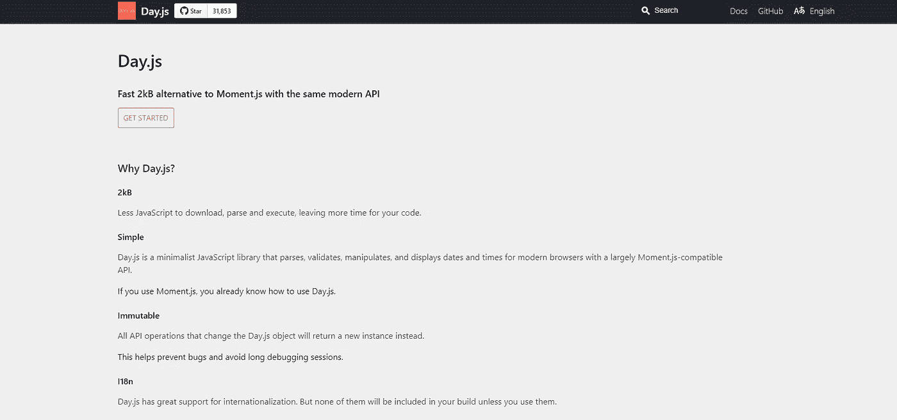

Day.js

[链接](https://day.js.org/en/)

# 单声道图标

Mono Icon 是一个开源的图标，你可以很容易地将它快速完全免费地应用到你的网站上。您可以通过 CDN 将它直接嵌入到 HTML 页面中，或者通过 npm 为您的 web 项目安装它。

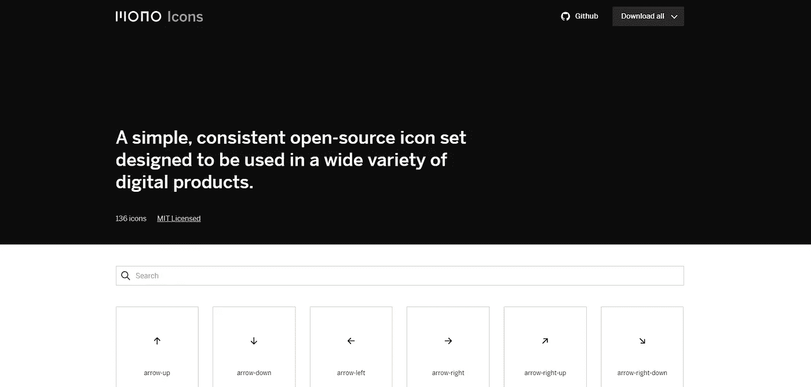

Mono Icon

[链接](https://icons.mono.company/)

# 可视扩展代码 Cho Microsoft Edge

随着 Edge 浏览器的开发，VS Code 还发布了一个新的扩展，可以直接在 VS Code 中测试和运行 edge web 项目，而无需在计算机上安装该浏览器。

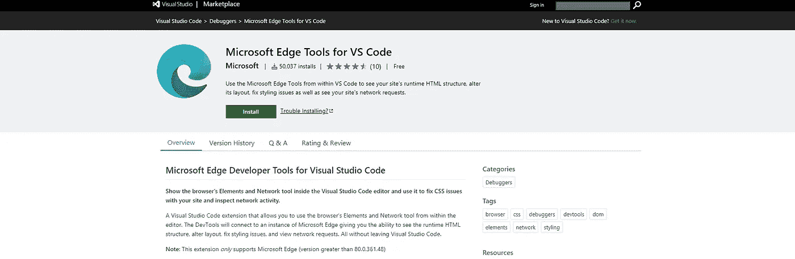

Visual Extension Code Cho Microsoft Edge

[链接](https://marketplace.visualstudio.com/items?itemName=ms-edgedevtools.vscode-edge-devtools)

# 斑点生成器

Blob generator 是一个在线工具，可以通过 SVG 编辑为网页创建复杂的形状。您只需要更改所提供的属性，代码就会自动生成。

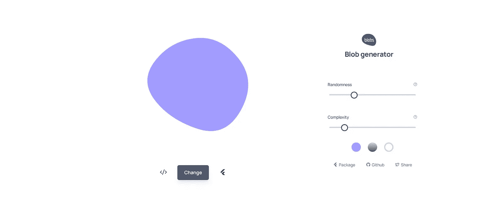

Blob generator

[链接](https://blobs.app/)

# 图书馆探测器

Library Detector 是 Google Chrome 的一个扩展，可以很容易地看到一个网站使用的 Javascript 技术。

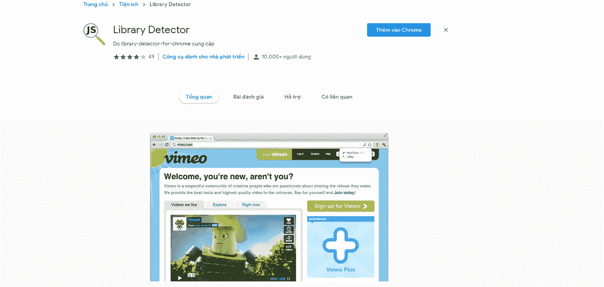

Library Detector

[链接](https://chrome.google.com/webstore/detail/library-detector/cgaocdmhkmfnkdkbnckgmpopcbpaaejo)

# ts 粒子—打字稿粒子

ts Particles—TypeScript Particles 是在 particles.js 的基础上重新编写的库，目的是让你更容易地创建更多的背景动画，并提供更多的实用工具和支持功能。我喜欢这个库的一点是，它可以用于许多不同的框架，如 reactjs、vuejs、angularjs、Jquery…

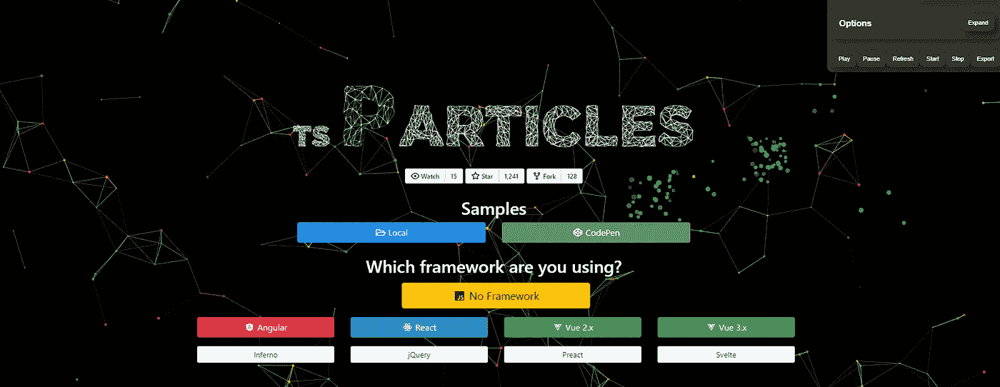

tsParticles — TypeScript Particles

[链接](https://particles.matteobruni.it/)

# CSS 值

CSS Value 是一个网站，有一个功能，可以很容易地确定某个 CSS 属性的值。例如，如果您选择了文本装饰属性，它会自动显示相关属性:文本装饰、文本装饰颜色、文本装饰线条、文本装饰跳过、文本装饰样式、文本装饰粗细…

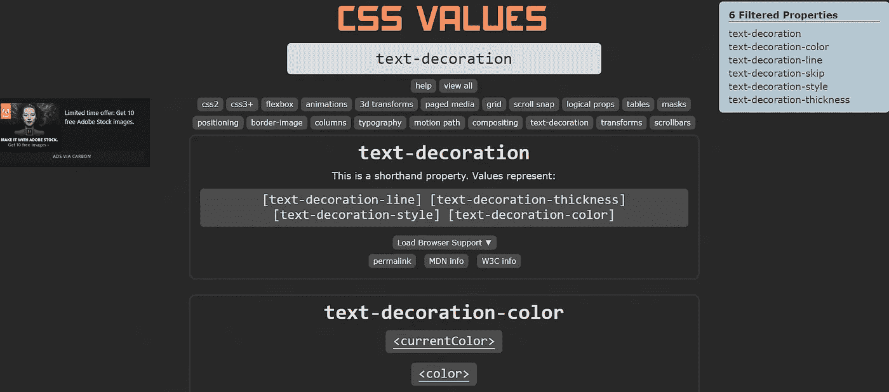

CSS Value

[链接](https://cssvalues.com/)

# RunJS

RunJS 是一个桌面应用程序，可以帮助你编写专门的 Javascript 和 Typescript 代码。它的一些优点是，您可以快速测试代码，使用库轻松导入和测试代码，并且能够修改界面、主题和字体以适应您的偏好。

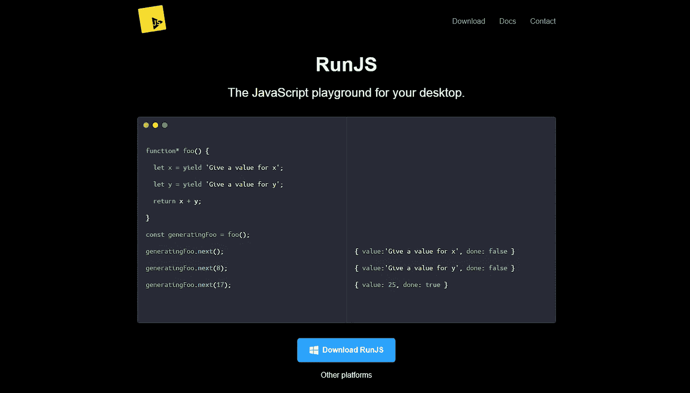

RunJS

[链接](https://runjs.dev/)

# 二重唱日期选择器

Duet 日期选择器是由 Duet Design System 的开发的开源代码。它允许您轻松地为您的网站构建一个日期选择器组件，而无需使用任何额外的库。我觉得这个库中的一些功能是有一个黑暗和光明的主题，能够设置允许用户选择的时间间隔，按地区设置日期…

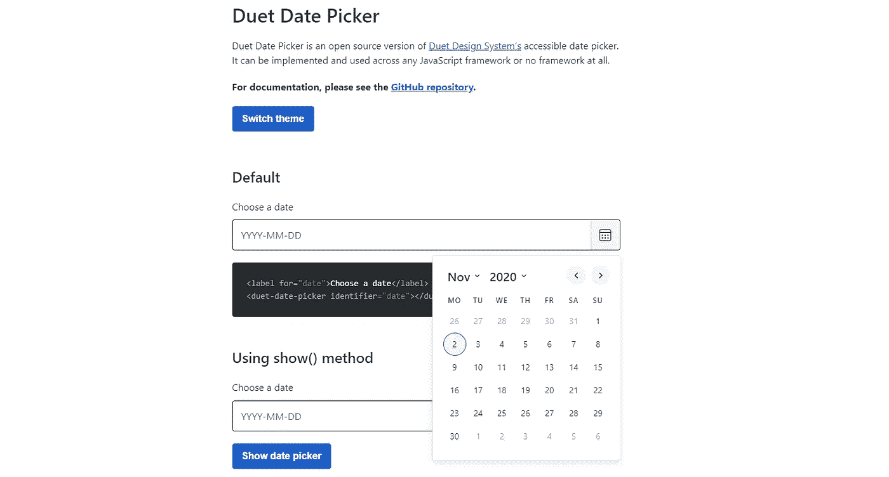

Duet Date Picker

[链接](https://duetds.github.io/date-picker/)

# urlcat

urlcat 是一个紧凑的 Javascript 库，大小只有 0.8kb 左右，没有使用任何额外的库。它使得在 URL 上快速简单地建立查询成为可能，也避免了我们为网站建立 URL 时常见的错误。

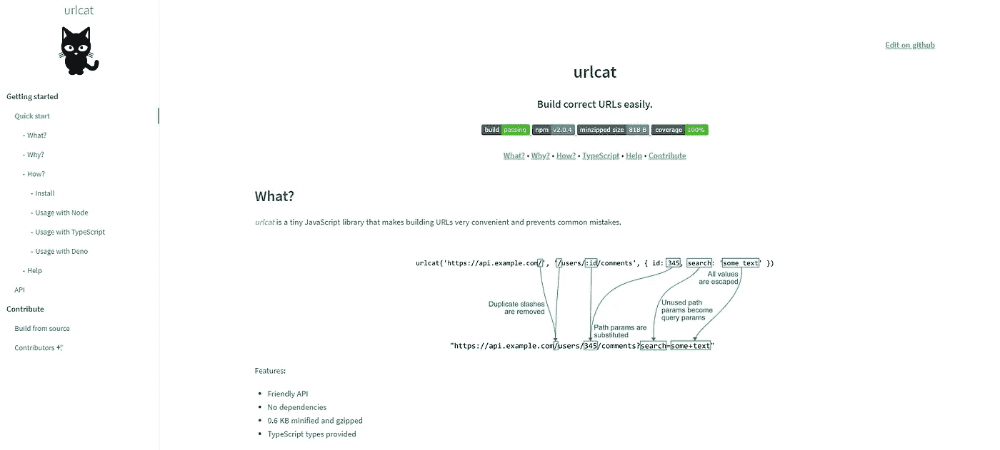

urlcat

[链接](https://urlcat.dev/#/)

# 中兴通讯

ztext.js 是一个 javascript 库，可以轻松地为网页构建 3D 文本，并可用于所有类型的字体。此外，您还可以为 SVG、图像、表情符号等其他元素创建 3D 效果。

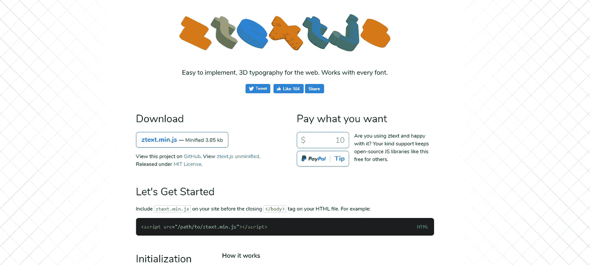

ztext.js

[链接](https://bennettfeely.com/ztext/)

# GitHub 配置文件自述文件生成器

GitHub Profile README Generator 是一款在线网络工具，可以帮助您以最完整和详细的方式在 GitHub 上创建您的个人资料页面，包括标题、工作、编程语言技能、(前端)、后端、框架……)、社交网络链接……

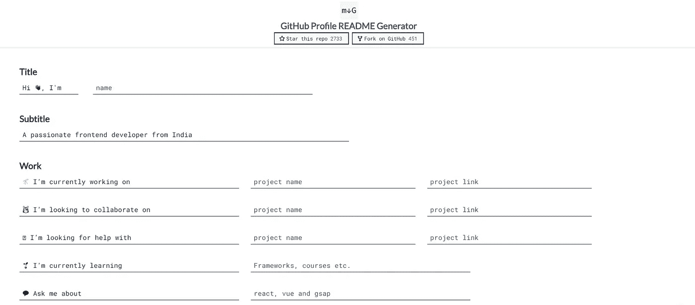

GitHub Profile README Generator

[链接](https://rahuldkjain.github.io/gh-profile-readme-generator/)

# 在线包装 SVG

Wrap SVG Online 是一个应用程序，通过拖放从您的计算机上传的图像，可以轻松编辑网页的 SVG 图像。

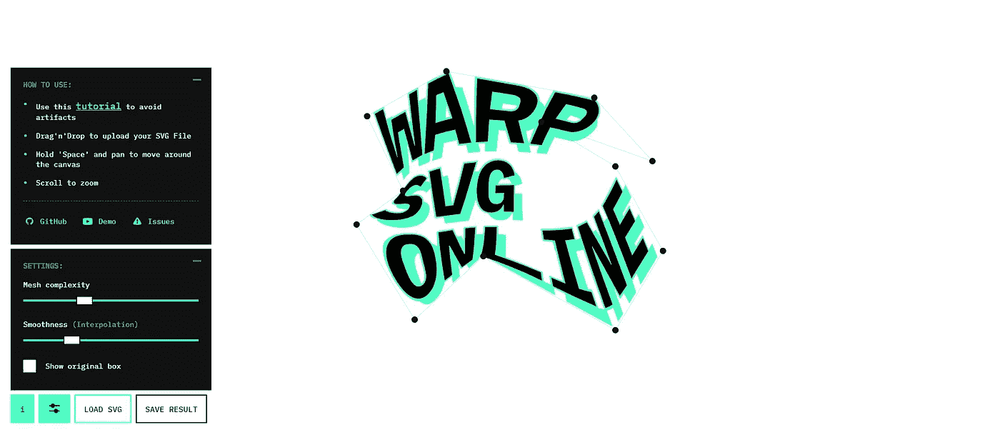

Wrap SVG Online

[链接](https://pavellaptev.github.io/warp-svg/)

# 3D 书籍图像 CSS 生成器

3D 图书图像 CSS 生成器是一个在线工具，允许您快速轻松地创建 3D 图书封面，并将其应用到您的网站。你只需要提供一张书的图片，编辑提供的宽度(书的宽度)、高度(书的高度)、厚度(书的厚度)等 CSS 属性……随你喜欢，代码片段 HTML、CSS 会分别自动生成。

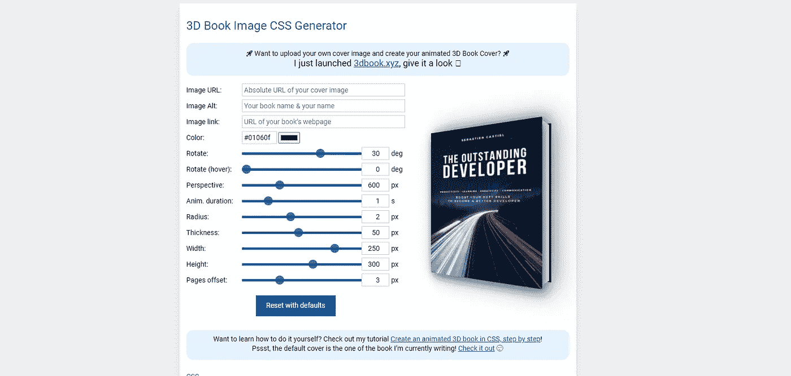

3D Book Image CSS Generator

[链接](https://3d-book-css.netlify.app/)

# 打印. js

Print.js 是一个紧凑的 Javascript 库，允许您直接在网页上打印文件，而不必重定向或使用嵌入。它支持 PDF、HTML(如 form…)、images、JSON 等多种格式的打印…此外，它还可以在 Chrome、Firefox、Safari、Edge 和 Opera 等大多数流行的浏览器上运行。

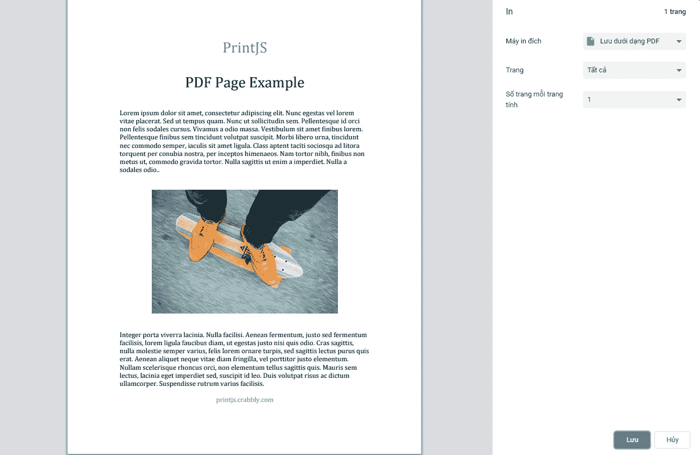

Print.js

[链接](https://printjs.crabbly.com/)

# 制表机

制表软件允许你创建交互式的数据表格，就像排序、添加、编辑或删除 HTML 表格一样简单。我们可以从 Javascript 数组、AJAX 数据源或 JSON 格式获取表的数据。此外，它还支持当今大多数流行的浏览器，如谷歌浏览器、火狐浏览器、Safari 浏览器、Opera 浏览器和 Edege 浏览器。也适用于如今流行的 ReactJS、VueJS、AngularJS 等 javascript 前端框架。

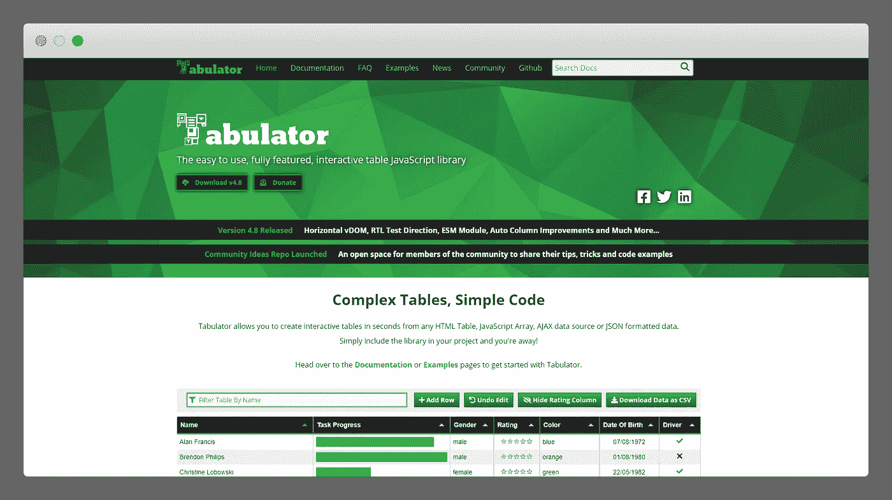

Tabulator

[链接](http://tabulator.info/)

# 纹理 JS

Textures JS 是一个库，可以帮助你快速方便地为网页创建 SVG 模式。它构建在 D3.js 之上，目的是可视化您的数据。在我看来，它在使用相应的模式来划分地图中的区域时使用得相当多。

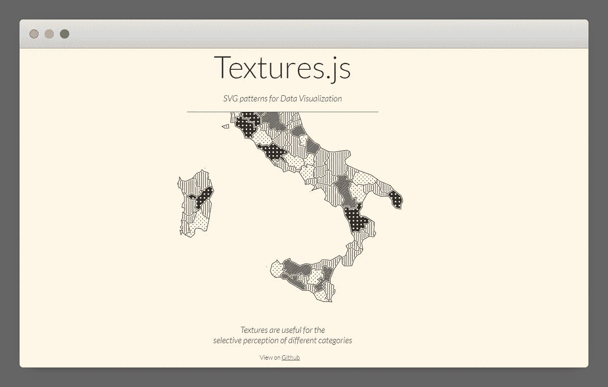

Textures JS

[链接](https://riccardoscalco.it/textures/)

# DOCX

DOCX 是一个库，允许您创建。使用 Javascript 或 Typescript 从网页元素中获取 docx 文件。它在浏览器和服务器端都工作得很好(使用 Nodejs)。据我所知，它对网站的每个组件都有很多详细的例子，以及当你将它应用到 React，Vue 或 angularJS 时的具体教程。

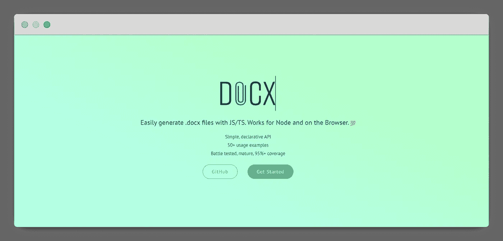

DOCX

[链接](https://docx.js.org/#/)

# Keen-Slider

Keen-Slider 是一个免费的 Javascript 库，可以快速轻松地创建一个触摸滑块组件(通常在手机上)和许多其他有用的调整功能，如垂直滑块、多张幻灯片、幻灯片的惰性加载模式……据我所知，这个库还有一个非常好的功能，可以根据 IOS 设计和网站的背景过渡效果创建一个 timepicker(选择时间)。

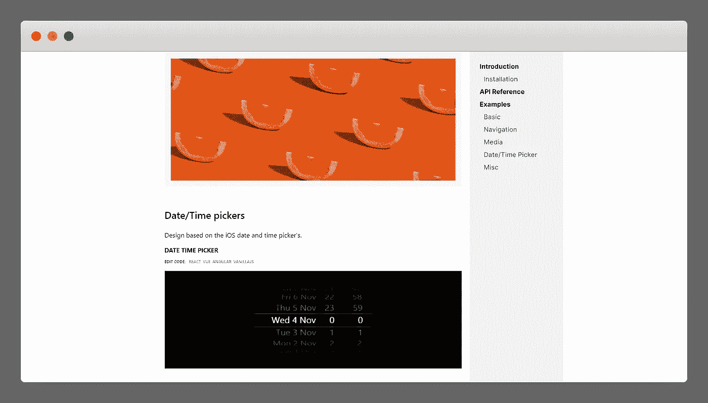

Keen-Slider

[链接](https://keen-slider.io/)

# 数学 JS

Math JS 是一个开源的数学库，在 Github 上有超过 10.5k 的星星，用于 Javascript 和 NodeJS(服务器端)。它可以让你灵活地计算和处理许多不同的数据类型，如数字、大数、复数、分数、单位和矩阵。

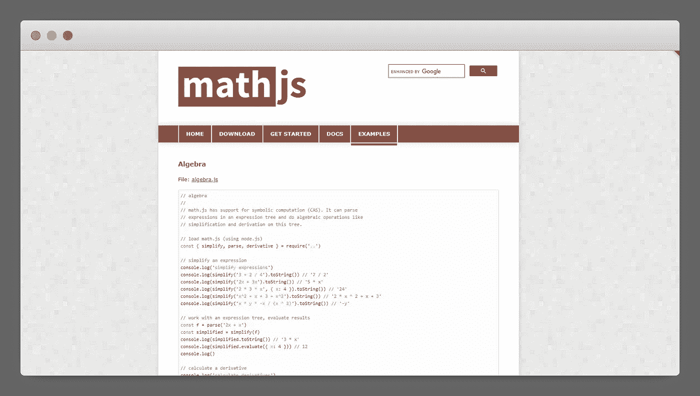

Math JS

[链接](https://mathjs.org/)

# 粗略符号

Rough Notation 是一个紧凑的 Javascript 库，它帮助你为网页中的元素创建注释，具有许多漂亮的效果，如下划线、方框、圆圈、高亮、括号等

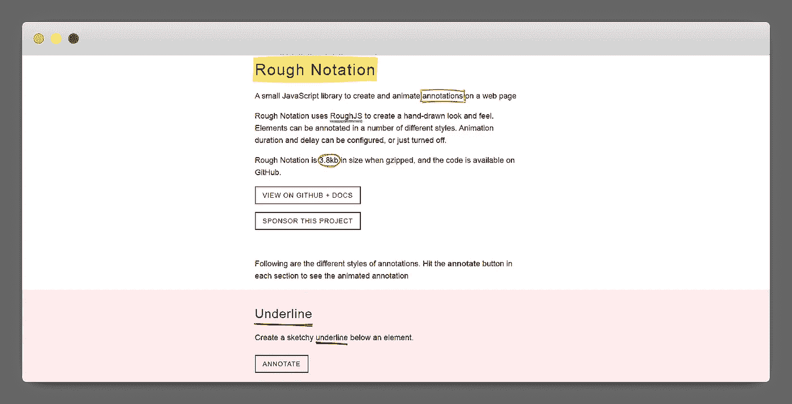

Rough Notation

[链接](https://roughnotation.com/)

# 翻转

Flip 是一个插件，可以让你快速方便地为你的网站创建带有翻转效果的计数器。如果你需要创建活动计时器、促销或筹款活动，我认为这是最适合你的库。

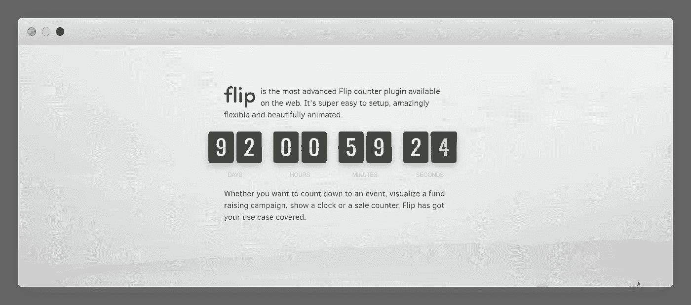

Flip

[链接](https://pqina.nl/flip/)

# 报价折扣

Quotebacks 是一个在线工具，可以让你在网站上快速嵌入设计精美的报价。我们只需要为程序提供 4 个基本参数:引用段落、作者姓名、标题和引用来源的 url。然后代码会自动生成，你只要复制到你想显示的网站就可以使用了。

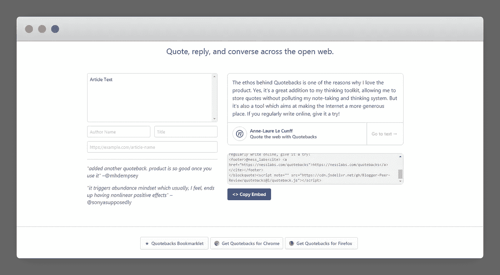

Quotebacks

[链接](https://quotebacks.net/)

# SVG 路径可视化工具

SVG Path Visualizer 是一个工具，通过输入 SVG 路径数据，帮助您快速直观地查看 SVG 图像。此外，该工具还提供了详细的说明，以便您能够理解如何创建基本的 SVG 形状，如直线、曲线、三角形等

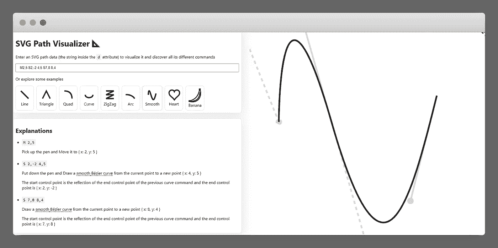

SVG Path Visualizer

[链接](https://svg-path-visualizer.netlify.app/)

# Toast UI 编辑器

Toast UI 编辑器是一个文本编辑器，允许你在网页中编辑文本或所见即所得的 Markdown 文档。通过将库分成许多不同的插件，这将使我们更容易优化，只添加必要的功能到我们的网站。插件编辑器-插件-图表:显示编辑器的图表，编辑器-插件-代码-语法-突出显示代码片段，编辑器-插件-颜色-语法编辑文本的颜色。..但是现在只支持纯 javascript，ReactJs，VueJs 和 Jquery 而已！

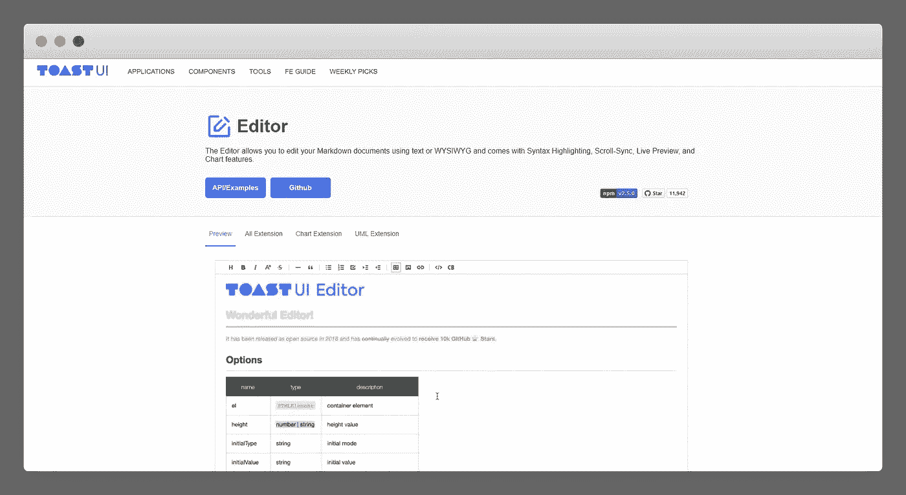

Toast UI Editor

[链接](https://ui.toast.com/tui-editor)

# 杰克斯尔

Jexcel 是一个紧凑的 Javascript 库，它可以帮助你用从 JS 数组、JSON、CSV 或 XSLX 文件中提取的数据为你的网站创建高度交互的表格。在我看来，它有一些非常有用的功能，如用户友好的界面，易于定制和与其他插件和库结合，用简单的操作处理复杂的数据。

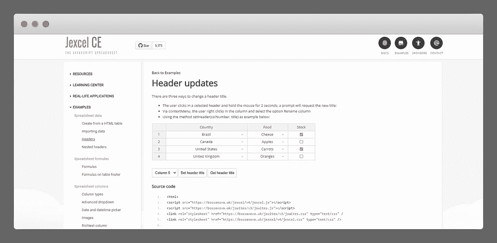

Jexcel

[链接](https://bossanova.uk/jexcel/v4/)

# Chocolat.js

js 是一个 Javascript 库，它使得在网页上显示响应灯箱变得容易。此外，您还有权在同一页面上设置一个或多个图像，全屏显示图像或将其限制为您想要的任何 div 标签。

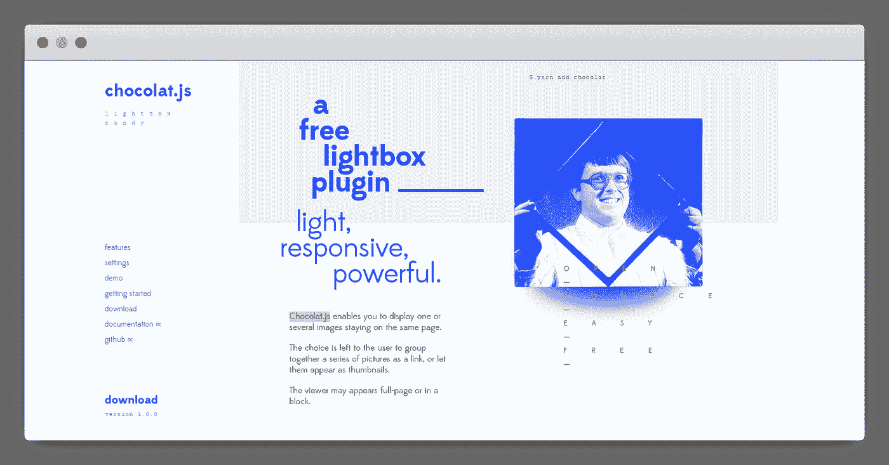

Chocolat.js

[链接](http://chocolat.insipi.de/)

# 图像比较查看器

Image Compare Viewer 是一个用 Javascript 构建的开源库，它使得创建一个直接在网页上比较两幅图像的组件成为可能。在我看来，它经常被用来比较编辑前后的图像，以帮助用户有一个更直观和有区别的看法。

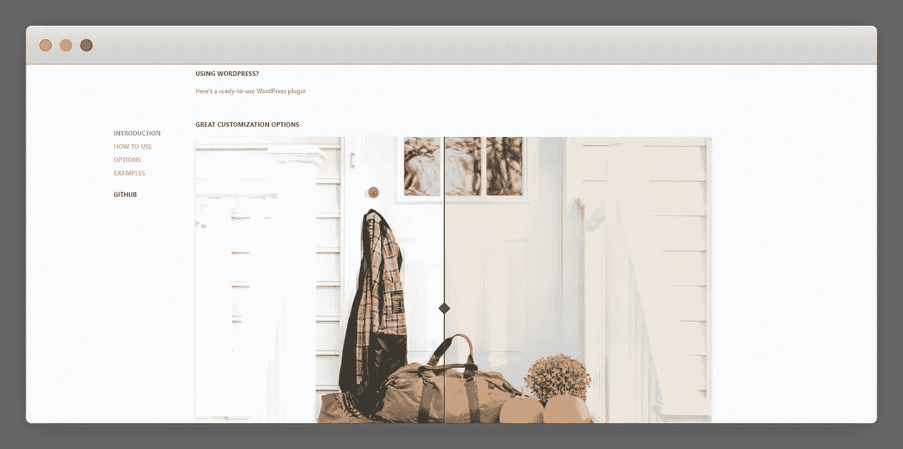

Image Compare Viewer

[链接](https://image-compare-viewer.netlify.app/)

# 三角化

Trianglify 是一个库，允许你通过组合和构建三角形来为你的网站创建美丽的背景图案。你只需要选择由库提供的参数，如宽度、高度、调色板、单元格间距…你想设置的背景图案。

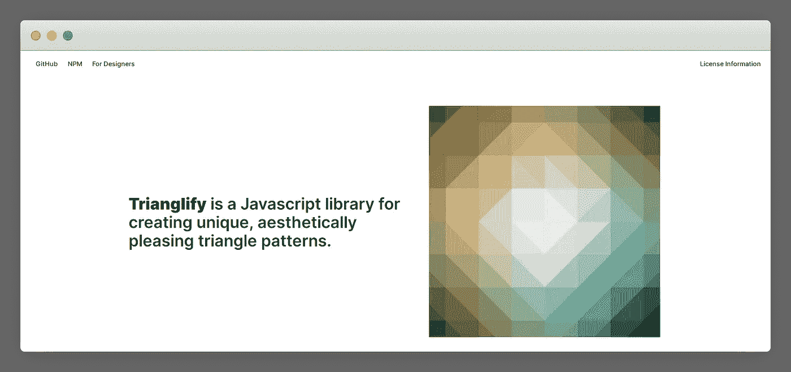

Trianglify

[链接](http://qrohlf.com/trianglify/)

# Notyf

Notyf 是一个 Javascript 库，可以帮助你为大小只有 3Kb 左右的网站创建 toast 消息。它显示在许多不同的设备屏幕上，并且易于与当今流行的 JS 框架(如 React、Angular、Aurelia、Vue 和 Svelte)一起使用。

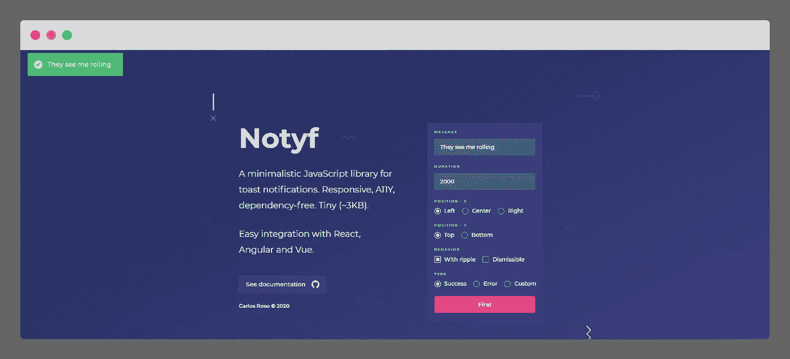

Notyf

[链接](https://carlosroso.com/notyf/)

# Dinero.js

js 是一个 javascript 库，它提供了许多特性来帮助你工作和处理网络中与货币相关的问题。

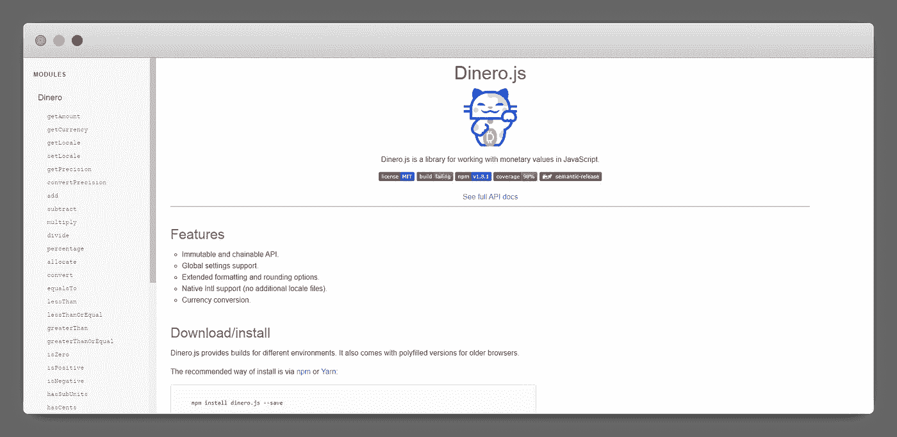

Dinero.js

[链接](https://dinerojs.com/)

# BEM 备忘单

BEM CHEAT SHEET 是一个网站，它为您提供了一种更加优化和一致的方式来为您的网站组件命名类。根据这一规则命名将有助于团队中的开发人员轻松理解每个类的功能，并更有效地协同工作。

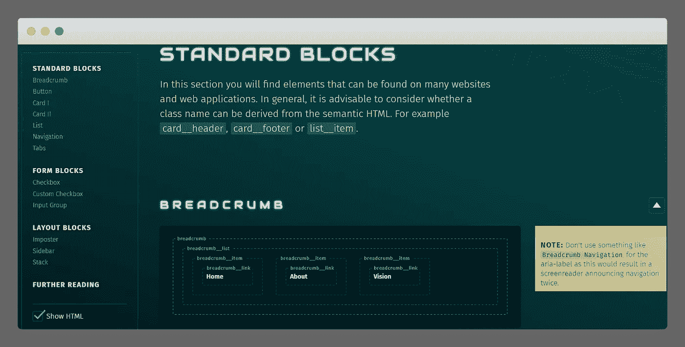

BEM CHEAT SHEET

[链接](https://9elements.com/bem-cheat-sheet/)

# Rough.js

raw . js 是一个图形库，用于在网页中快速方便地绘制线条、曲线、圆弧、多边形、圆和椭圆。另外，它也支持 SVG 路径！

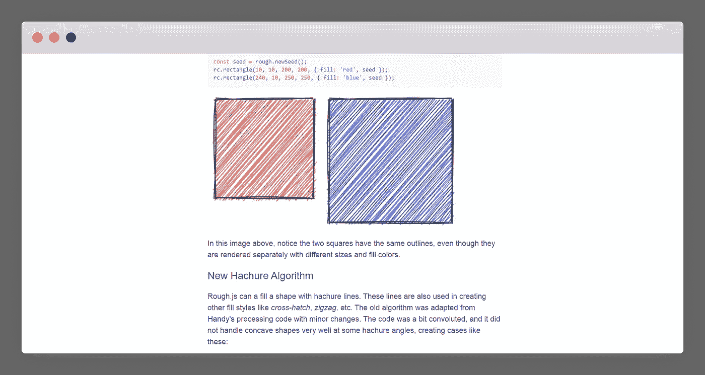

Rough.js

[链接](https://roughjs.com/posts/release-4.0/)

# simpleParallax.js

js 是一个开源的 javascript 库，体积小巧，它将帮助你简单方便地为网站图像创建视差动画效果。

simpleParallax.js

[链接](https://simpleparallax.com/)

# 免费图标制作者

favicon 是一个小图标，当用户访问您的网站时，它会显示在浏览器选项卡上。你也可以使用另一种格式，如 svg…我想向你介绍一种工具，可以帮助你轻松地创建 favicon，设计精美，完全免费，免费的 Favicon Maker。

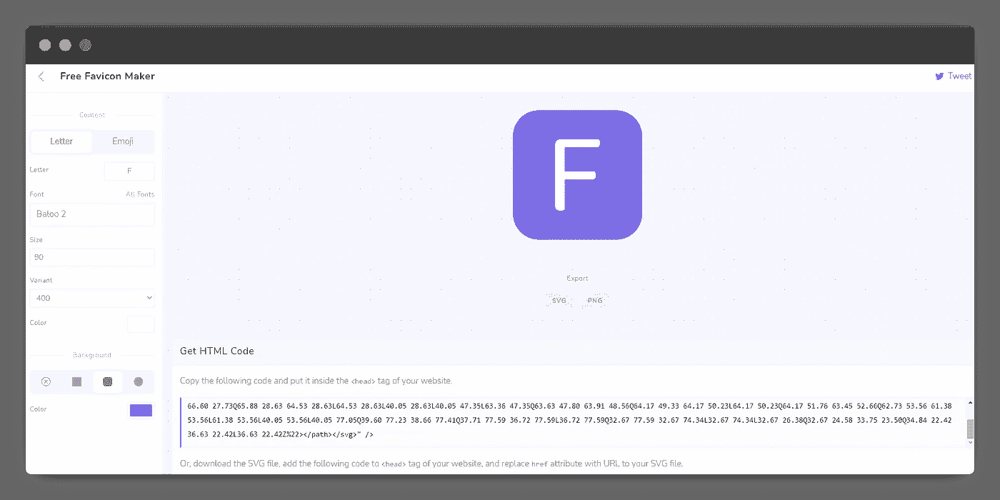

Free Favicon Maker

[链接](https://formito.com/tools/favicon)

# 良好的行高

**良好的行高**让你更直观地看到网页中文本的属性用法`line-height`。它提供了 3 个主要属性供您自定义编辑身份

*   字体大小:字体大小。
*   乘数:行间距。
*   网格行高:定义网格中的线。

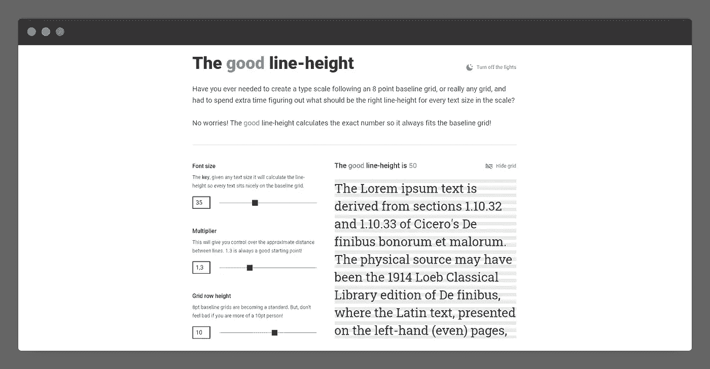

The good line-height

[链接](https://www.thegoodlineheight.com/)

# CSS 3D 转换

这是一组使用 perspective 属性为网页创建 3D 对象的方法。这里我最喜欢的部分是每个代码片段旁边都有一个具体的例子。这将使你更容易形象化你的受众，并看到哪些适合你的网站。

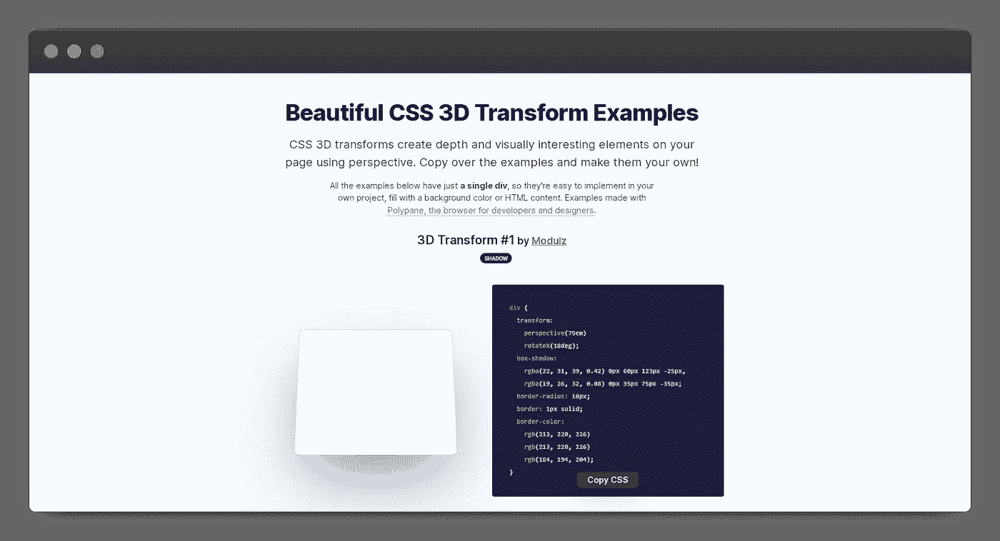

CSS 3D Transform

[链接](https://polypane.app/css-3d-transform-examples/)

# 优秀的网页设计

好的网页设计是一个网站，收集了许多漂亮的着陆页设计，并分为许多部分，如 CTA(行动呼吁)，导航栏，页脚，案例研究…

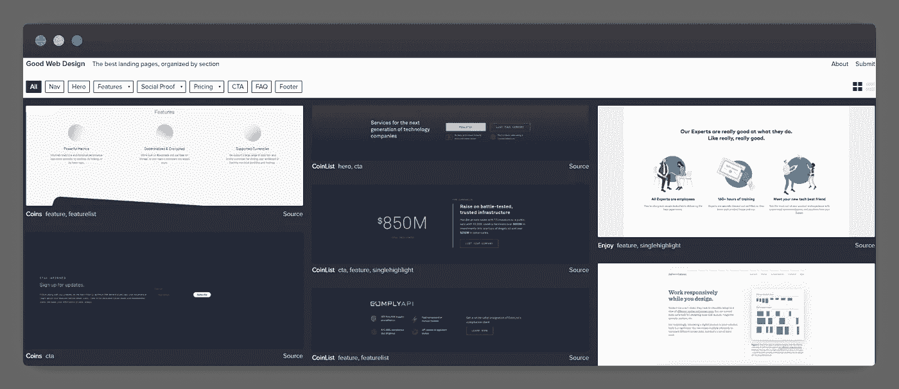

Good Web Design

[链接](https://www.goodweb.design/)

# BGJar

BGJar 是一个在线工具，可以让你轻松快速地为你的网站创建 SVG 背景。你只需要编辑必要的信息，web app 会自动导出图片或代码供你应用到网站上。

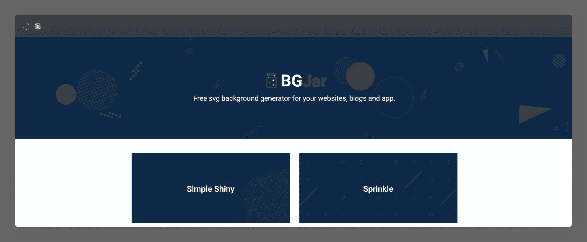

BGJar

[链接](https://bgjar.com/)

# 引导图标

以前，引导图标的诞生是为了满足构建引导组件、文档..然而，今天它也可以通过 SVG 格式的图标用于许多其他项目。它将帮助你轻松地通过 CSS 来设计图标的样式，并且不用担心图像破碎。

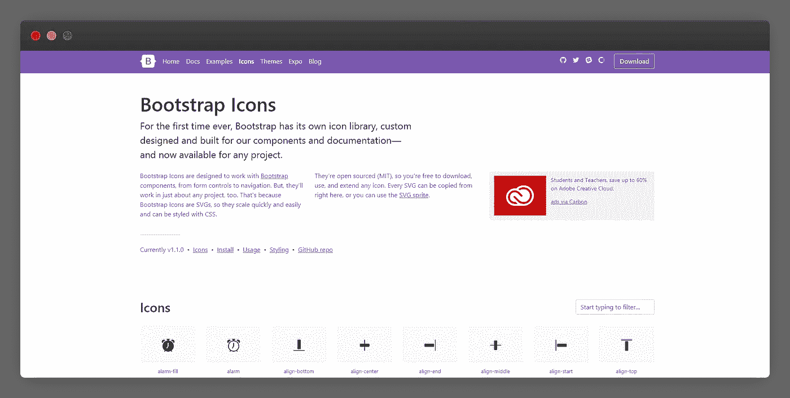

Bootstrap Icons

[链接](https://icons.getbootstrap.com/)

# 斯奎尔利

Squircley 帮助你为网络中的对象创建漂亮的形状，如背景、图标、标志…

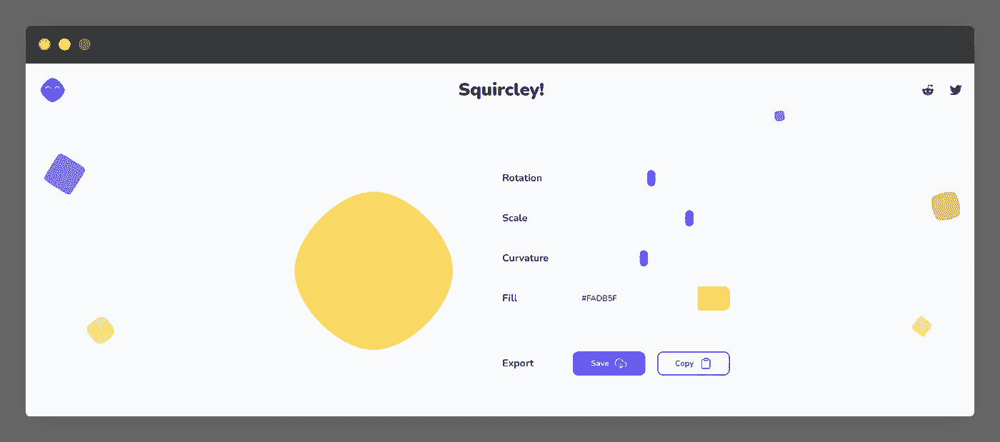

Squircley

[链接](https://squircley.app/)

# mailgo

通常，当您打开邮件链接时，浏览器将使用默认应用程序来打开电子邮件编辑器。至于 mailgo，你可以设置选项，帮助用户打开 Gmail、Outlook 等其他邮件编辑器……或者默认打开。除了使用 a href="mailto:"标记之外，它还可以与 href="tel:" too！

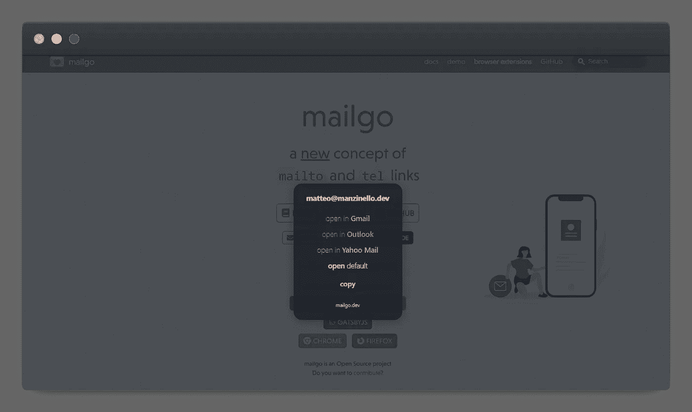

mailgo

[链接](https://mailgo.dev/)

# 伪造图标

Forge Icon 是一个为您的 web 项目(如电子商务、旅游、社交网络、应用程序设计等)组合许多不同类型图标的地方

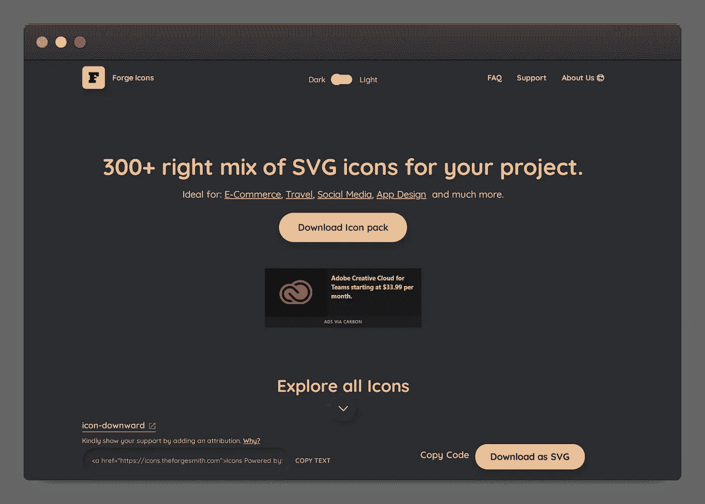

Forge Icon

[链接](https://icons.theforgesmith.com/)

# 古方斯

字体方面，我用谷歌字体最多。它既免费又有很多漂亮的字体。然而，在如此庞大的字体数量下，你很难找到适合你网站的字体。所以，我给大家介绍一个工具，叫 GooFonts。它的任务是将谷歌字体的字体类型划分成许多小数组，如报纸、学校、卡通、标志等字体

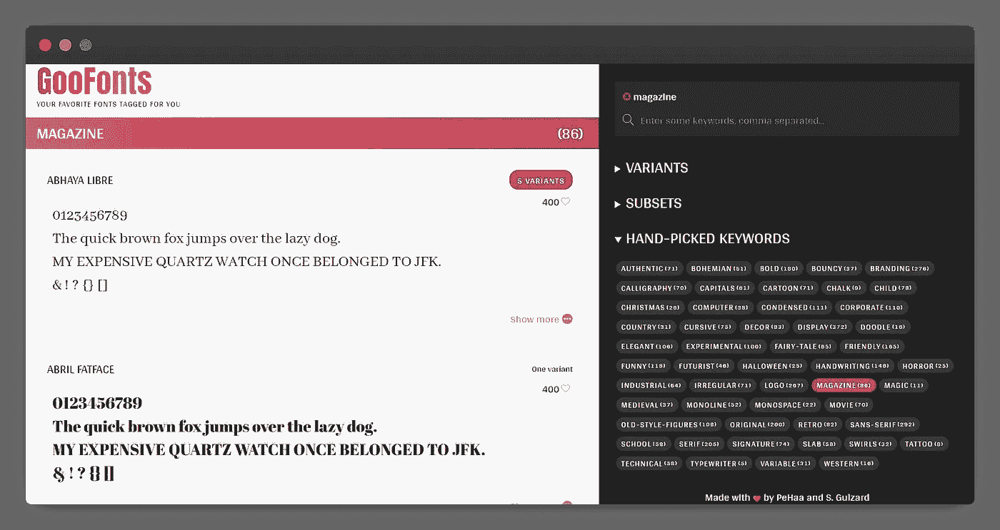

GooFonts

[链接](https://goofonts.com/)

# CSS 蜘蛛

CSS Spider 是 Google Chrome，Firefox 的一个扩展，主要任务是帮助你查看属性并获取网页中任何对象的 CSS 代码。

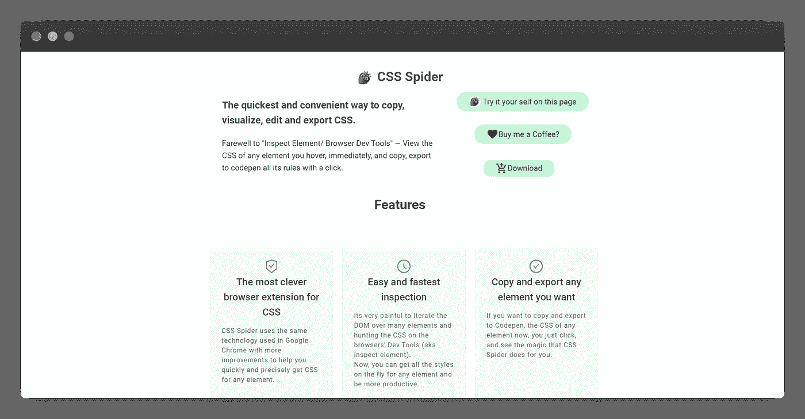

CSS Spider

[链接](https://cssspider.fresalabs.com/home)

# 少量

在编程中，我们通常会把**好的有用的代码**用在解决问题之后储存起来。主要目的是如果你以后遇到类似的情况，你可以使用它重用，而不必浪费时间搜索和思考。

**Bit** 的诞生就是为了让你更容易的在上面工作。它会将代码立即存储在云上，你可以在任何地方访问它，而不用担心安全性。有两种保存代码片段的方式是**私有**(只有你能看到)和公共(所有人都能看到)。

所以 **Bit** 工具也是你可以参考的来自其他程序员(比如 public)的很多有用代码的地方。对于免费版本:

*   1 个私人项目。
*   不限数量的公共项目。
*   不限数量的私有和公共组件。
*   有一个支持的社区。

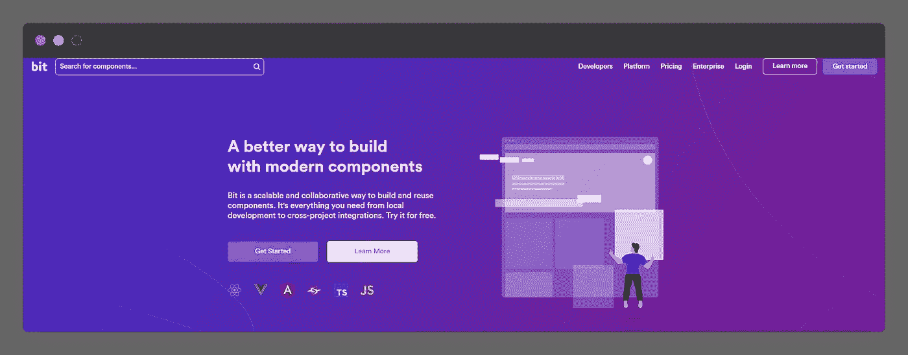

Bit

[链接](https://bit.dev/)

# Hat.sh

Hat.sh 是一个免费的工具，可以帮助你快速、简单、安全地加密文件。

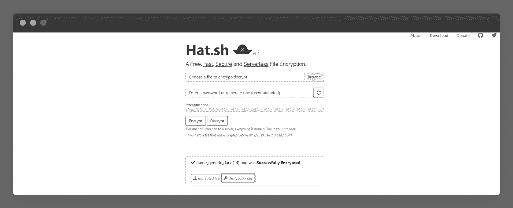

Hat.sh

[链接](https://hat.sh/)

# 屏幕大师

screen.guru 是一个在线工具，可以让你为你的网站截图。

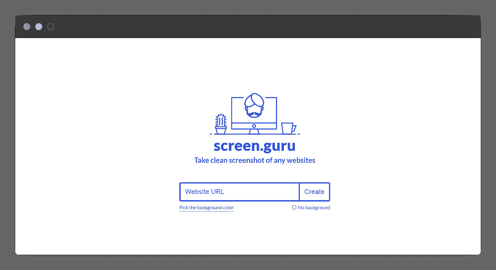

screen.guru

[链接](https://screen.guru/)

# 字体基础

FontBase 为网页设计者提供了一个友好的界面，帮助你快速方便地管理字体。它有许多便利，如一键式谷歌字体库，总是与新版本更新，轻松的字体搜索，字体激活，而不必安装…

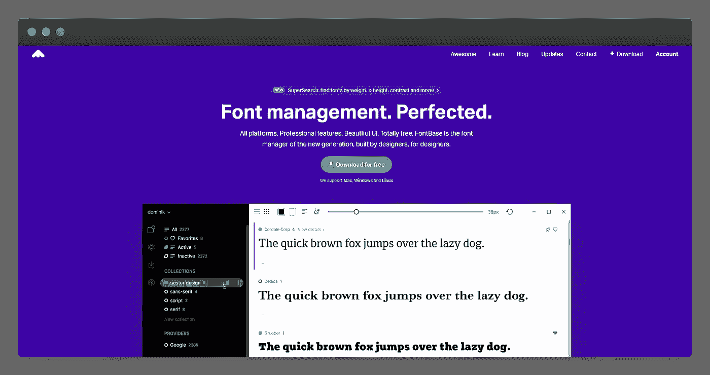

FontBase

[链接](https://fontba.se/)

# 乌伊洛戈斯

uiLogos 是一个网站，它为网站聚合了超过 25 个专业设计文件。不过它只允许导出 PNG 文件，如果要使用 SVG 文件，大约需要支付 37 美元。

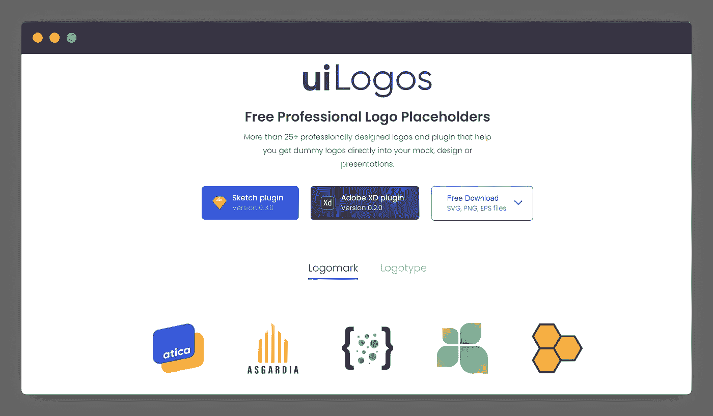

uiLogos

[链接](https://uilogos.co/)

# 德弗洛伦

DevLorem 是一个帮助你在网页开发过程中创建插图的工具。

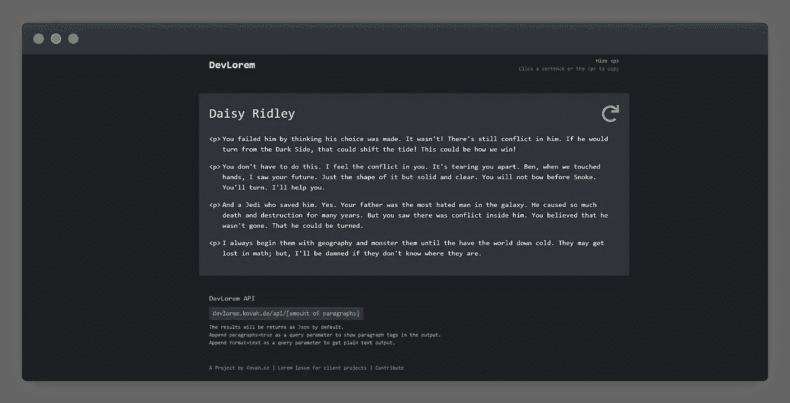

DevLorem

[链接](https://devlorem.kovah.de/p)

# CSSReference.io

CSSReference 是 CSS 属性指南的集合。我最喜欢它的是通过说明性的例子可视化信息的能力。这也会让你更容易吸收和享受学习编码的乐趣。

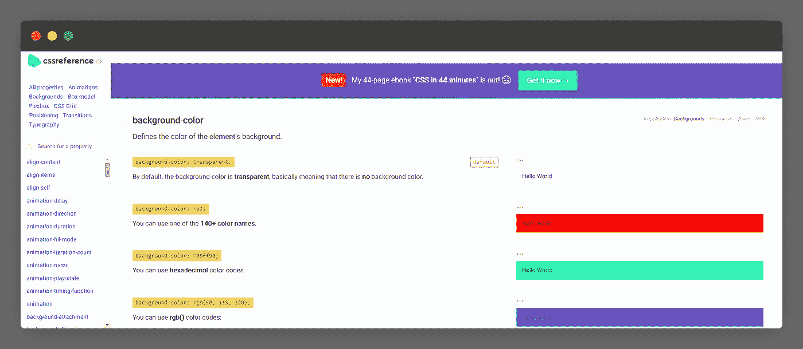

CSSReference.io

[链接](https://cssreference.io/)

# 代码

Codeimg 是一个帮助你通过图像显示你的代码的工具，它有许多支持功能，比如为背景选择一个主题，为代码指定颜色，字体大小，语言…

Codeimg

[链接](https://codeimg.io/)

# HTMLReference.io

HTMLReference 是一个类似 CSSReference 的网站，其目的是通过特定的示例收集所有 HTML 属性的说明。

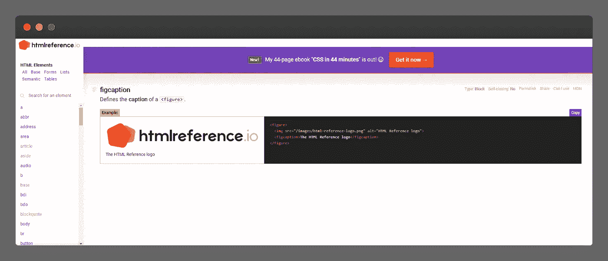

HTMLReference.io

[链接](https://htmlreference.io/)

# 波形片段

Wavesnippets 是一个工具，它允许您将想要与其他人共享的代码部分制作成视频或 GIF 动画。这种形式的一个强有力的例子是，它使其他人更容易理解和更好地理解您编写的代码序列。

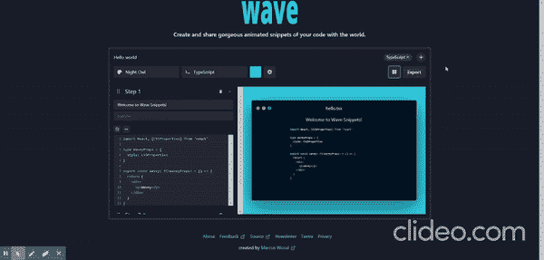

Wavesnippets

[链接](https://www.wavesnippets.com/)

# 英雄模式

Hero Patterns 是一个用于网页设计的 SVG 背景模式集合。

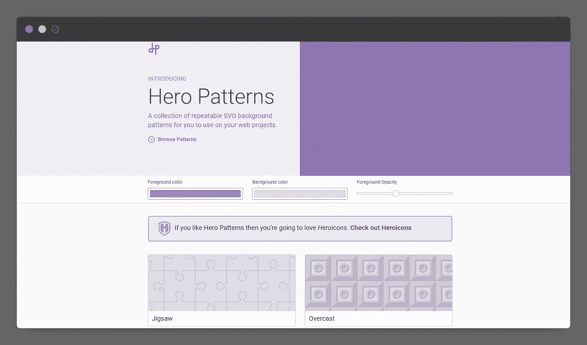

Hero Patterns

[链接](http://www.heropatterns.com/)

# 方框图标

Boxicons 是一个为网页设计者和开发者提供的简单免费的矢量图标集合。

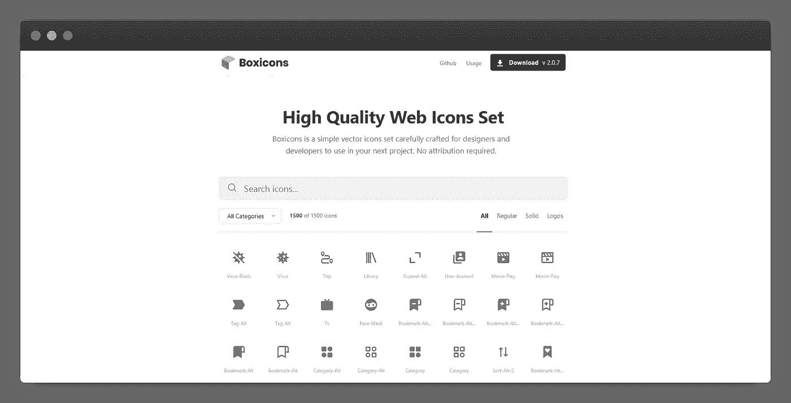

Boxicons

[链接](https://boxicons.com/)

# 雪橇

Coaster 是一种软件，可以很容易地在 Unsplash 上找到并下载图像。此外，它还支持 Windows 和 Mac 两种操作系统版本。

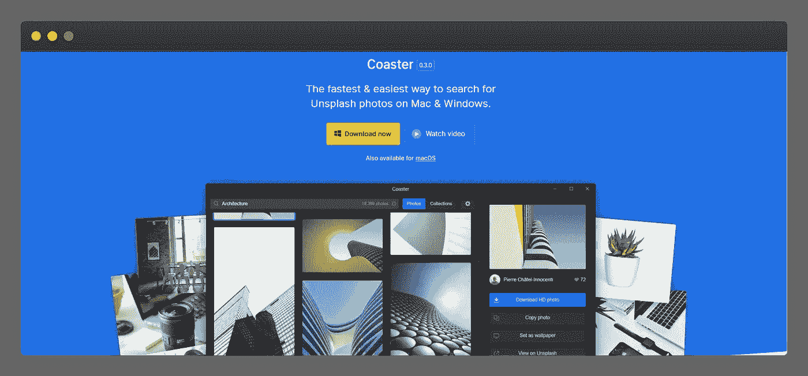

Coaster

[链接](https://heycoaster.com/)

# 漂亮的快照

Pretty Snap 是一个工具，可以帮助你为图片创建漂亮的背景，并显示在网页上。

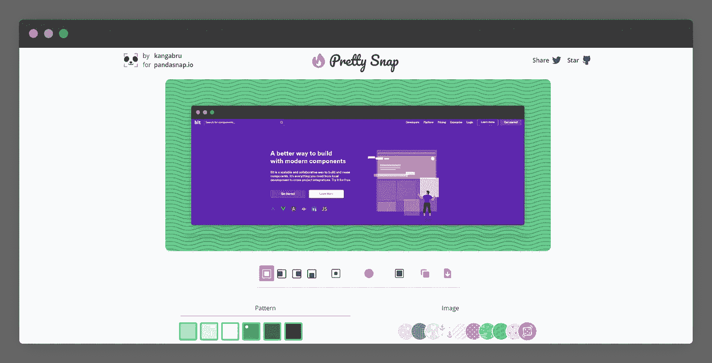

Pretty Snap

[链接](https://prettysnap.app/)

# 链接到 qr

Link-to-qr 是一款免费的网站二维码生成器。

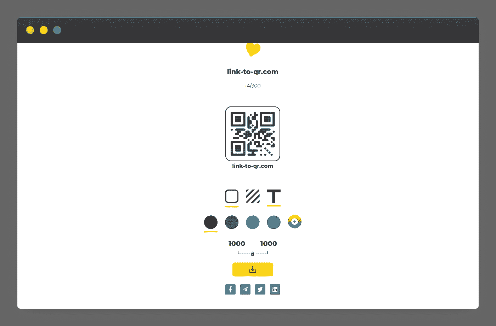

Link-to-qr

[链接](https://link-to-qr.com/)

# CSS 背景图案

CSS 背景图案是一个美丽的网站背景图案的集合。我喜欢这个网站的一点是，我们可以立即在工具的网站中应用您想要的背景。

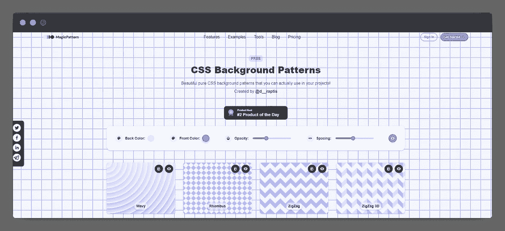

CSS Background Patterns

[链接](https://www.magicpattern.design/tools/css-backgrounds)

# 生成 SVG 波

生成 SVG 波是一个在线工具，帮助您为您的网站创建 SVG 背景波。

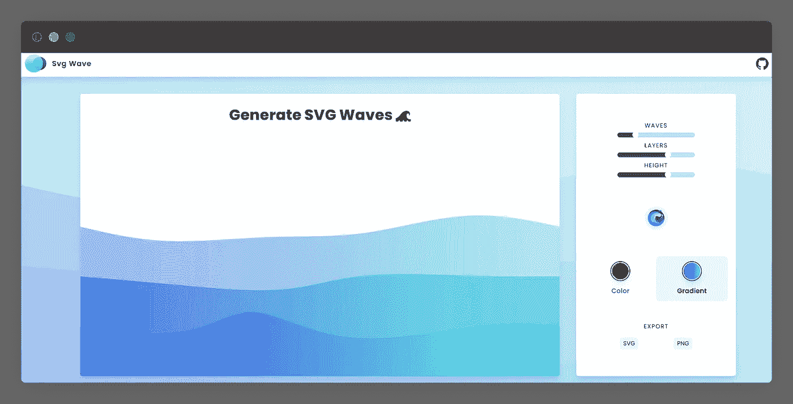

Generate SVG Waves

[链接](https://svgwave.in/)

# 设备快照

DEVICE SHOTS 使您可以轻松地将网站的照片应用到许多当今流行的设备屏幕上，如电脑、手机、平板电脑等

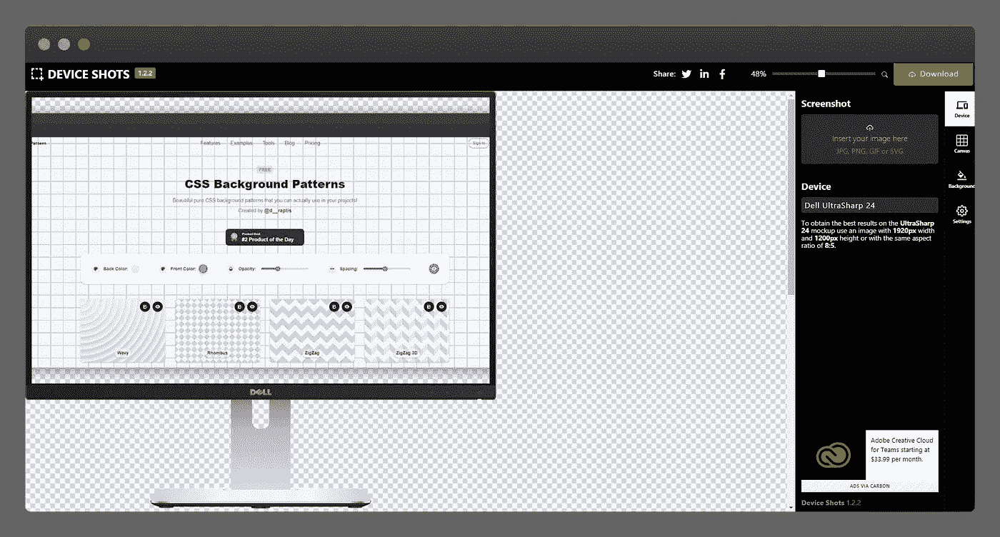

DEVICE SHOTS

[链接](https://deviceshots.com/)

# CSS 网格布局生成器

这是一个帮助你使用 CSS 简单快速地构建复杂网格系统的工具。

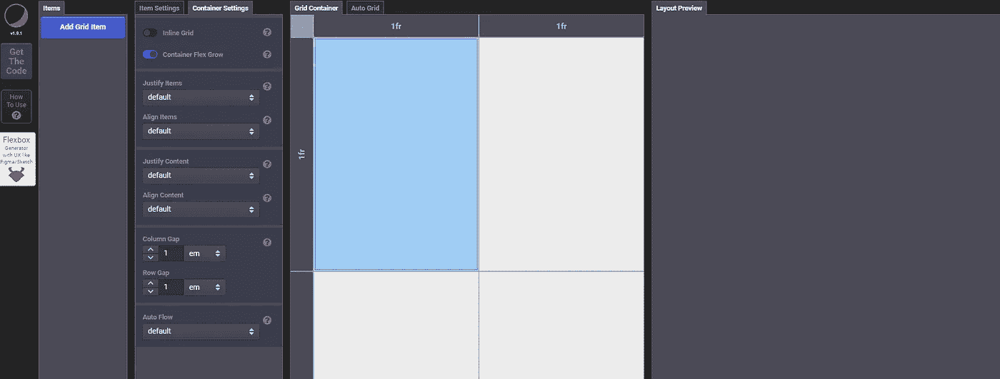

[链接](https://css-grid-layout-generator.pw/)

# CSS 双色调生成器

这个工具帮助你设置图像的 CSS 属性，比如图像的距离，不透明度，模糊度，颜色…

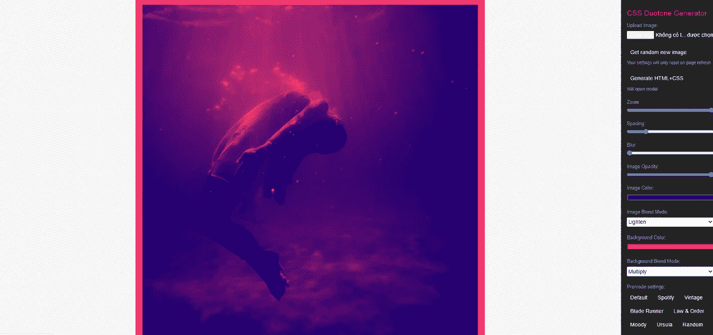

[链接](https://cssduotone.com/)

# CSS3 发生器

CSS3 生成器帮助您快速创建复杂的属性，如框阴影、渐变、过渡…此外，对于每个属性，它将提供更多关于浏览器对该属性支持的信息。

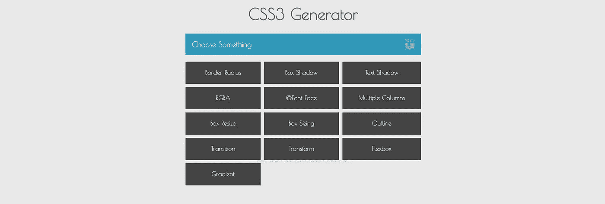

[链接](http://css3generator.com/)

# 箱式模型

Box-model 是 Codepen 上的一个应用程序，它可以帮助您在设置 web 中对象的填充、边距和边框属性时更直观地看到！

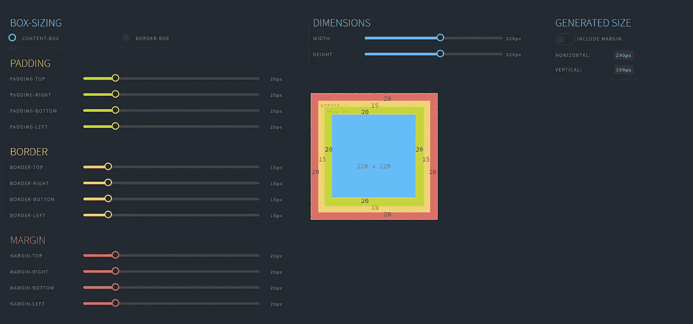

[链接](https://codepen.io/carolineartz/full/ogVXZj)

# 动画 CSS 背景生成器

动画 CSS 背景生成器是一个工具，允许你用我们提供的颜色创建动画背景。此外，它还为您提供了一些其他设置，如计数，大小，平均速度。

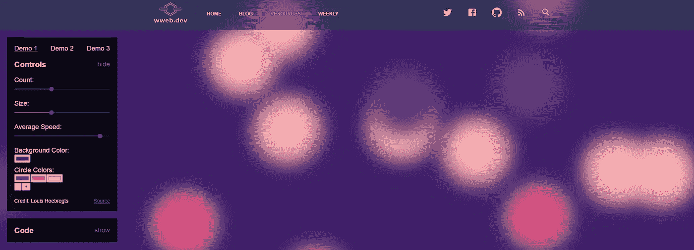

[链接](https://wweb.dev/resources/animated-css-background-generator)

# Web 代码工具

Web Code Tools 是一个帮助您在 CSS 中设置公共属性的工具，方法是为该属性输入您想要的值。此外，它在预览中还有一个可视化示例，因此您可以根据输入的值轻松地可视化结果。

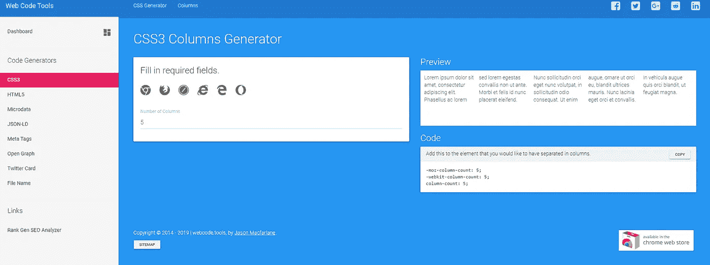

[链接](https://webcode.tools/css-generator)

# 享受 CSS

Enjoy CSS 是一个帮助你为网页中的许多对象设置样式的工具，比如输入、按钮、块…你的工作是选择你想要设置样式的对象，然后选择与该对象相关的 CSS 值，结果会立即出现。

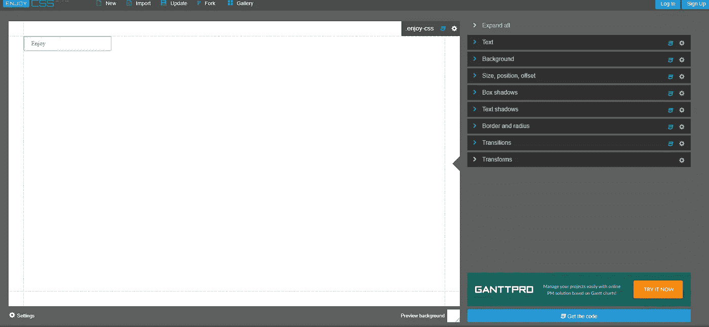

[链接](https://enjoycss.com/)

# CSS 门户

CSS 门户就像享受 CSS 页面，它是一个网站对象的 CSS 生成器工具的集合，如翻转开关生成器，文本渐变生成器，色带生成器…

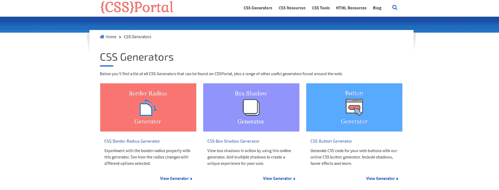

[链接](https://www.cssportal.com/css-generators.php)

# CSS3 发电机设计裕量

CSS3 生成器是一个工具，可以帮助你设置网页设计中常见的属性，如阴影、滤镜、变换等。

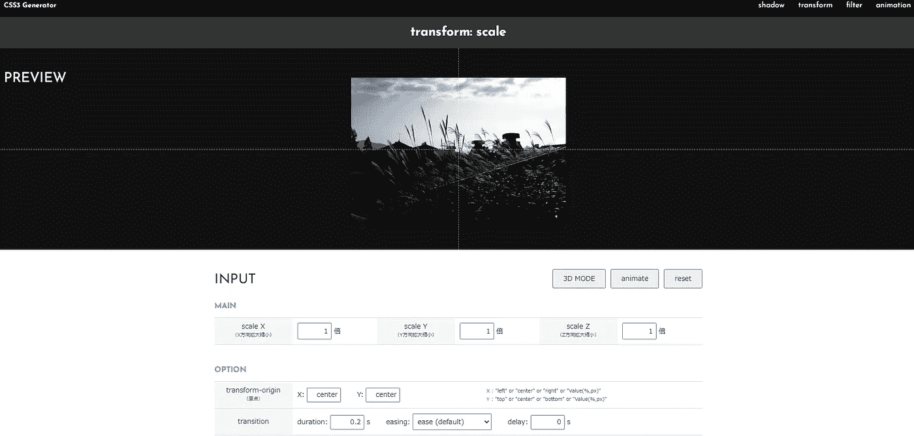

[链接](http://ds-overdesign.com/)

# HTML 表格生成器

这是一个工具，可以让你很容易地在你的网站中编辑表格组件。

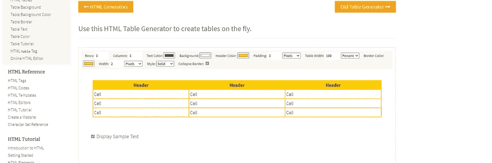

[链接](https://www.quackit.com/html/html_table_generator.cfm)

# 制作 CSS

Making CSS 是一个致力于聚合工具帮助你轻松生成 CSS 的网站。

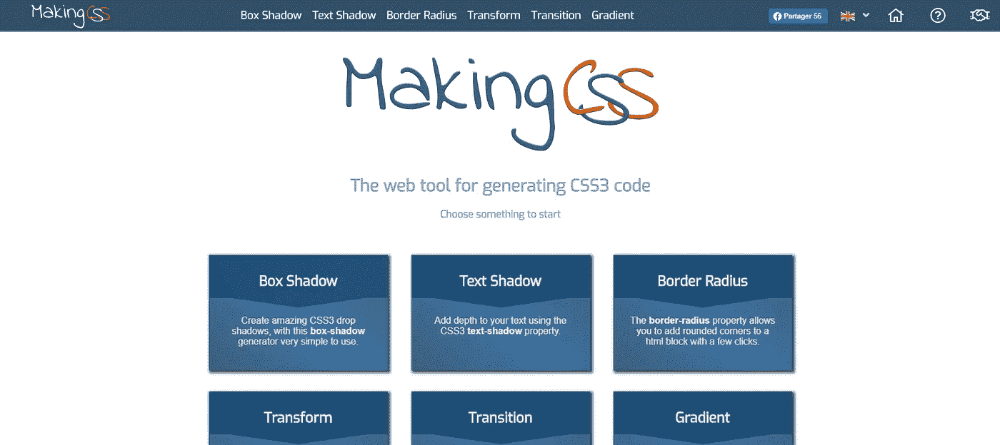

[链接](https://makingcss.com/)

# CSS Matic

CSS Matic 是一个包含工具的网站，可以使网页设计更加简单。

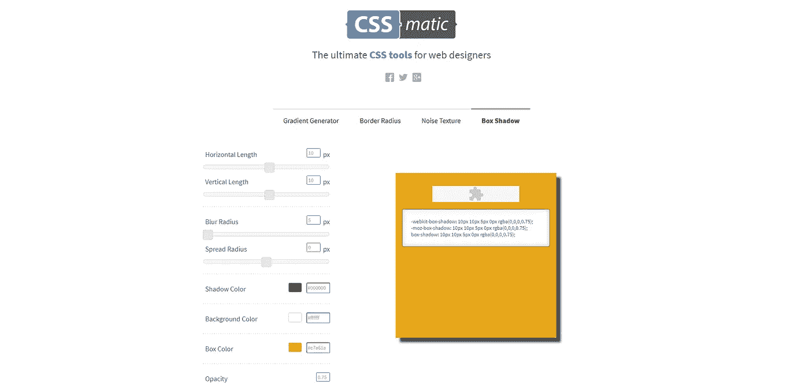

[链接](https://www.cssmatic.com/)

# CSS 砖石生成器

CSS 砖石生成器是一个构建网格系统(如社交网络 pinterest)的工具，有助于以更优化的方式显示图像。

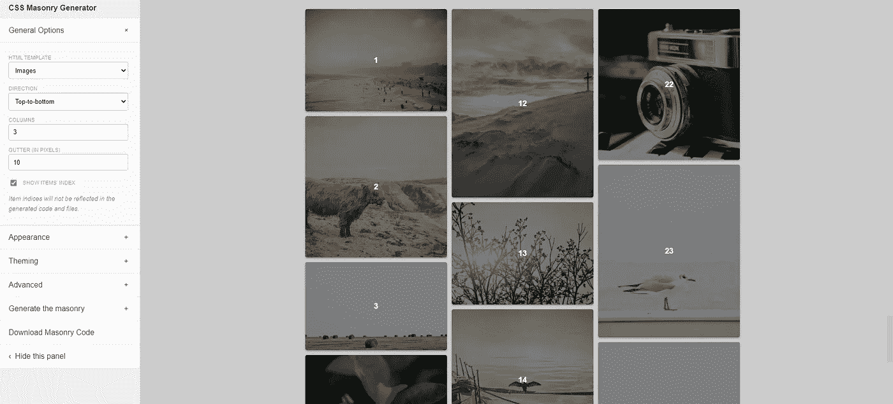

[链接](https://w3bits.com/tools/masonry-generator/)

# CSS 背景图案生成器

这是一个工具，通过选择工具提供的可用信息，帮助您轻松构建网站的背景图案。

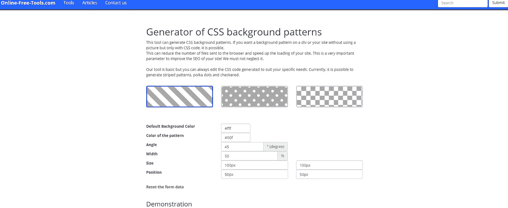

[链接](https://online-free-tools.com/en/css_pattern_generator_background)

# 英雄生成器

这是一个工具，可以帮助你通过 CSS 属性轻松地构建带有图像和内容的标题。

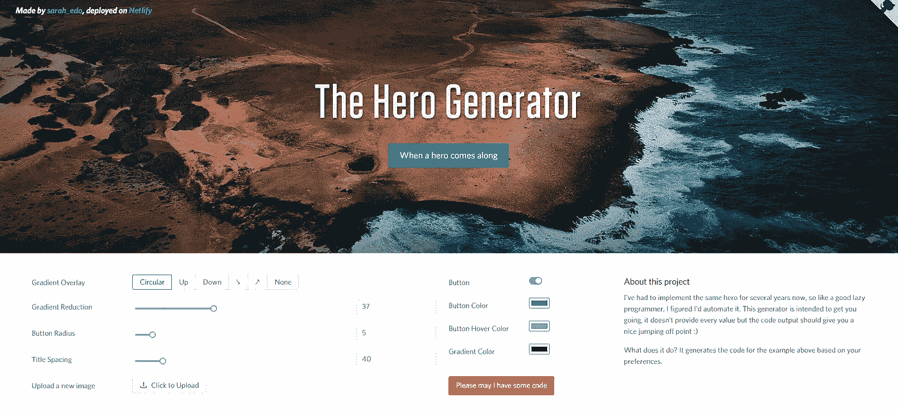

[链接](https://hero-generator.netlify.app/)

# CSS 按钮创建者

CSS 按钮创建器使得用 CSS 设计按钮组件变得快速而简单。

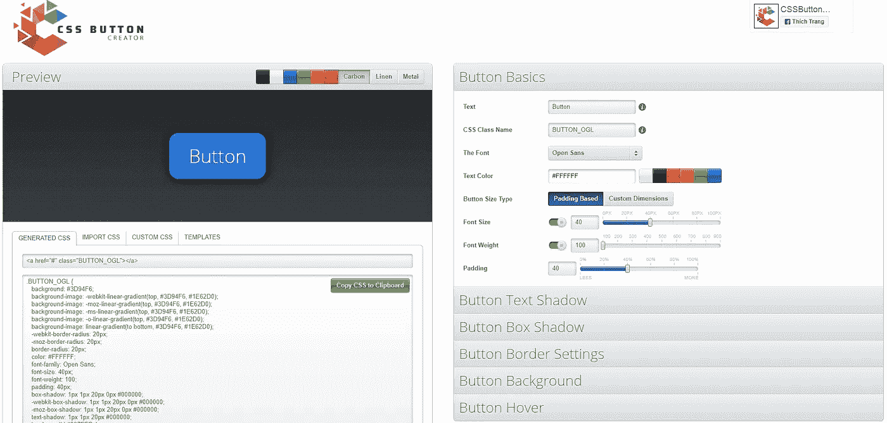

[链接](https://cssbuttoncreator.com/)

# CSSFilterGenerator

CSS 滤镜生成器是一个工具，当使用 CSS 中的滤镜属性处理亮度、模糊、灰度等图像时，它使可视化变得更加容易

[链接](https://www.cssfiltergenerator.com/)

# 复选框和单选按钮 CSS 生成器

Checkboxes & Radios CSS Generator 是一个帮助你轻松定制复选框和 HTML 单选按钮的工具。

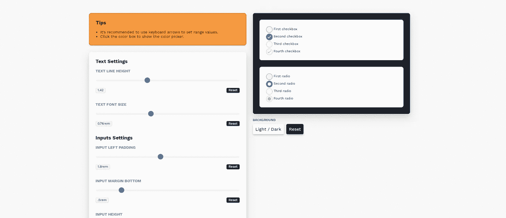

[链接](https://bun.js.org/)

# 柔性盒

Flexy Boxes 是一个工具，可以让你轻松快速的为你的网站构建 flex box！

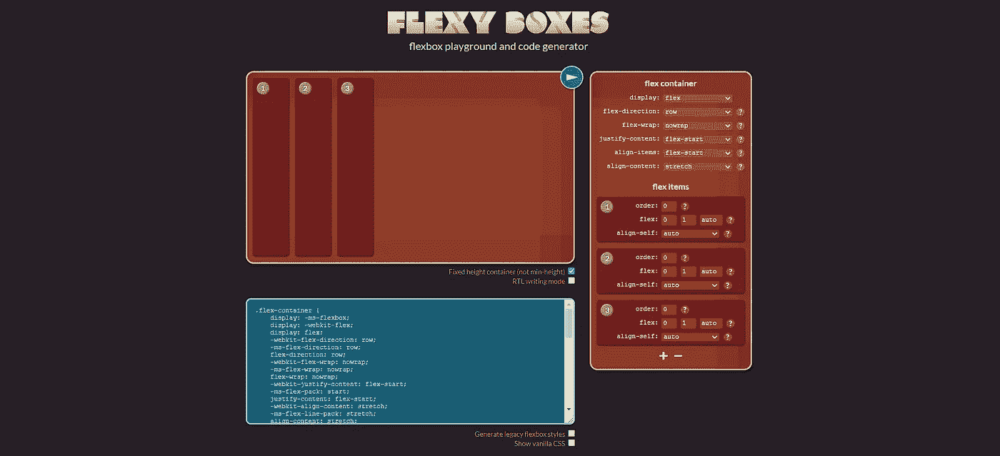

[链接](https://the-echoplex.net/flexyboxes/)

# 摘要

我希望这篇文章能为你提供有用的工具和库，如果你有任何问题，请发邮件给我，我会尽快回复。希望大家继续支持网站，让我能写出更多好文章。祝您愉快！

如果你想看更多的文章，请去 https://us.niemvuilaptrinh.com/