# 使用 AWS SageMaker 在云中部署本地培训的 ML 模型

> 原文：<https://medium.com/geekculture/84af8989d065?source=collection_archive---------0----------------------->

## 一个初学者指南，一步一步的实践例子。


Photo by [Debby Hudson](https://unsplash.com/@hudsoncrafted?utm_source=medium&utm_medium=referral) on [Unsplash](https://unsplash.com?utm_source=medium&utm_medium=referral)

在本文中，我将分享一个例子，说明我们如何使用 AWS SageMaker 服务在云中部署本地训练的机器学习模型。所谓“本地培训”，我指的是在我们的笔记本电脑中本地培训的 ML 模型(即 AWS 云之外)。我将带您经历各个步骤，从训练模型开始，到在 AWS 云中部署模型，并从本地客户端调用部署以获得预测。

# 介绍

如果我们在谷歌上搜索在 AWS 中部署 ML 模型的方法，我们会发现相当多的视频和文章谈论在 Amazon EC2 实例上部署 ML 模型。他们谈到推出 AWS EC2 实例来托管我们自己的 Flask 应用程序和 ML 模型；其中，客户端(浏览器)将用于将测试数据发送到托管在 EC2 上的 flask 服务器，该服务器又调用托管在相同 EC2 上的模型来获得预测，然后将预测结果发送到客户端。

但是这种方法只是使用 cloud VM ( EC2)来启动应用程序的另一个通用用例，与 ML 模型部署没有什么特别的关系。它不使用任何完全托管/无服务器的设施和好处，如 AWS SageMaker 端点可以为 ML 推断提供的按需可伸缩性(自动伸缩)。此外，EC2 实例在资源使用费用和所涉及的管理工作方面也可能代价高昂。

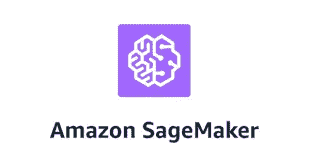

**AWS SageMaker** 通过推理管道、批量转换、多模型端点、生产变量的 A/B 测试、超参数调整、自动缩放等工具，提供了更好的方法来训练、测试和部署模型。

# 几个基本要素

在进入即将讨论的部署示例之前，我将尝试给出一些关于所使用的 AWS 服务的基本细节，以便完全不熟悉 AWS 的读者可以在尝试本文中讨论的步骤和服务之前，根据需要对 AWS 本身做一些进一步的基础研究。

[AWS SageMaker](https://aws.amazon.com/sagemaker/)

亚马逊 SageMaker 是一个完全托管的机器学习服务。它帮助数据科学家和开发人员快速准备、构建、训练和部署高质量的机器学习(ML)模型。它提供了一个集成的 Jupyter 创作笔记本实例，可以方便地访问您的数据源进行探索和分析。

[**亚马逊 S3**](https://aws.amazon.com/s3/?did=ft_card&trk=ft_card)

亚马逊简单存储服务(亚马逊 S3)是一种对象存储服务，提供行业领先的可扩展性、数据可用性、安全性和性能。我们可以使用 S3 来存储任何文件、模型、训练模型的输入数据等。

[**λ**](https://aws.amazon.com/lambda/)

AWS Lambda 是一种无服务器计算服务，让您无需配置或管理服务器即可运行代码。只需将您的代码上传为 ZIP 文件或容器图像，Lambda 就会自动精确地分配计算执行能力，并根据传入的请求或事件运行您的代码，适用于任何规模的流量。

[AWS API 网关 ](https://aws.amazon.com/api-gateway/)

Amazon API Gateway 是一个完全托管的服务，使开发人员可以轻松地创建、发布、维护、监控和保护任何规模的 API。API 充当应用程序从后端服务访问数据、业务逻辑或功能的“前门”。使用 API Gateway，您可以创建支持实时双向通信应用程序的 RESTful APIs 和 WebSocket APIs。

[**boto 3**](https://boto3.amazonaws.com/v1/documentation/api/latest/index.html) 
用于 Python 的 AWS SDK。您可以使用 AWS SDK for Python (Boto3)来创建、配置和管理 AWS 服务，例如亚马逊弹性计算云(亚马逊 EC2)和亚马逊简单存储服务(亚马逊 S3)。SDK 提供了面向对象的 API 以及对 AWS 服务的底层访问。

[**亚马逊 SageMaker Python SDK**](https://sagemaker.readthedocs.io/en/stable/index.html)

SageMaker Python SDK 为使用 Amazon SageMaker 提供了几个高级抽象。

# 在 SageMaker 中部署模型

简而言之，SageMaker 是 AWS 提供的 ML 服务，用于在云上编码、训练和部署 ML 模型。如果我们通读一下 **SageMaker 开发者指南**，我们可以了解服务框架是多么的庞大和多样，包括对许多流行算法的内置支持，从**线性学习器、XGBoost、K-NN、K-Means 等等。到深度学习框架，比如 Tensorflow，MXNet** 等。

将焦点带回到我们当前在 SageMaker 上部署模型的主题，需要注意的是，在 SageMaker 中有各种各样的方法来训练和部署 ML 模型

*   在 SageMaker 内部培训和部署，都使用 SageMaker 自己的内置算法容器(请注意这些是 AWS 管理的容器)。
*   在本地/在 SageMaker 外部训练我们的模型，然后使用 SageMaker 的内置算法容器来部署本地训练的模型(自带模型类型)。
*   使用 SageMaker 的(AWS 管理的)内置算法容器，但根据需要用我们自己的脚本定制培训(自带模型类型)。
*   在我们的本地容器(由我们构建和管理)中，以任何方法/或我们自己的算法训练我们的模型，然后将该容器带到 SageMaker 并部署使用(BYOC-自带容器)。

从上面列表的顶部到底部，ML 工程师的灵活性增加了，但是所需的复杂性和工作量也增加了，例如，您需要为 BYOC 类型的部署投入更多的精力。

# 在 AWS 云上部署本地培训的模型

在本文中，**我们将尝试上面**列表中的第二种方法。我特别感兴趣的是学习如何在我的笔记本电脑上获取我在本地训练的模型，并将其部署在 AWS cloud 上(而不必太担心如何使用 SageMaker 来训练模型)。

**让我们开始练习吧！** ..
由于我们在这里只关注部署，我们不打算在数据集 EDA、数据准备、超参数调整、模型选择等方面花费时间。等等。因此，我们采取了简单的鸢尾花数据集！

**尝试练习的先决条件-**

你需要有一个免费的 AWS 账户才能使用亚马逊的云服务，包括 SageMaker，Lambda，S3 等。以及**熟悉在 AWS 控制台上启动这些服务**。关于如何创建免费 AWS 帐户并尝试在 AWS 控制台上启动这些服务的详细信息，可以在网上轻松找到。

**重要信息** —请注意SageMaker 不是免费服务，根据您运行和使用笔记本实例等资源的时间长短，会产生一些费用。在您尝试这个部署练习之后，您必须正确地清理所有 SageMaker 资源、Lambda、S3 桶等。我已经在本文末尾分享了如何清理的细节。

**简而言之，我们的练习步骤如下。**

1.  加载数据集并在本地笔记本电脑中训练模型，无需使用任何云库或 SageMaker。

2.将训练好的模型文件上传到 AWS SageMaker 并在那里部署。部署包括将模型放在 S3 桶中，创建一个 SageMaker 模型对象，配置和创建端点，以及一些无服务器服务(API gateway 和 Lambda)来从外部触发端点。

3.使用一个本地客户机(我们使用 Postman)将一个样本测试数据发送到云中部署的模型，并将预测返回给客户机。Restful htttp 方法在这方面帮助了我们。

让我们来完成下面详细的分步练习。

# 训练模型

1.  在本地笔记本电脑中，使用 Jupyter 笔记本，在流行的鸢尾花数据集上训练 XGBoost 分类模型。

**2。测试模型，并使用 joblib 在本地保存模型文件。**

以上两个步骤请参考我的 github [资源库](https://github.com/raja-surya/aws-deployment-1)中的**iris-model-creation . ipynb**笔记本。

从 [github](https://github.com/raja-surya/aws-deployment-1) 下载 iris-model-creation.ipynb 到你的笔记本电脑上，运行它来创建模型和 test_point.csv 文件。

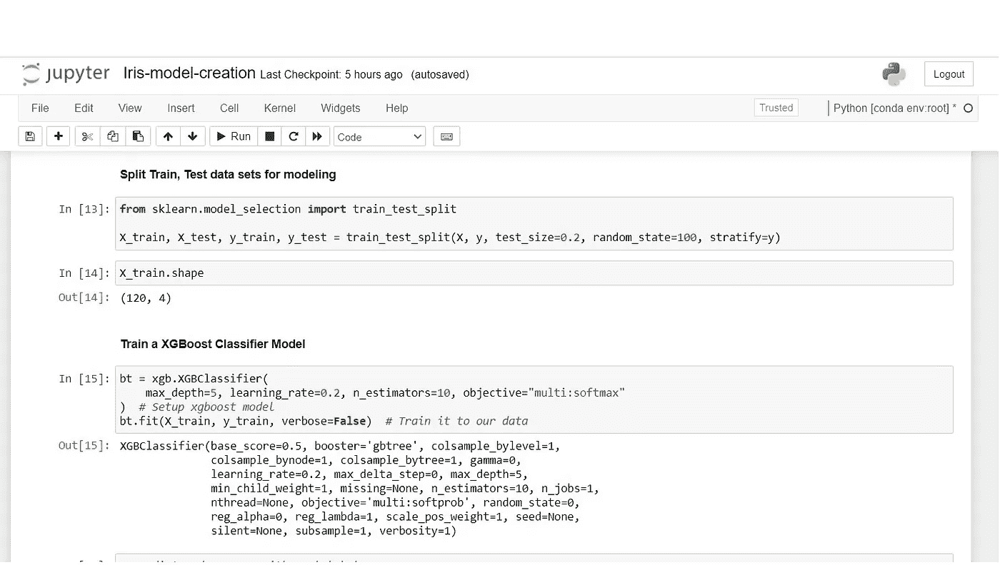

在 iris-model-creation 笔记本中，基本上我们下载 iris flower 数据集，在其上运行一个简单的 XGBoost 模型，对其进行测试，并使用 joblib dump 将模型保存为本地文件。出于测试目的，我们在 test_point.csv 中保存了一些样本花数据。

# 在 SageMaker 中部署模型

接下来的两个步骤，请参考我的 github [资源库](https://github.com/raja-surya/aws-deployment-1)中的**iris-model-deployment . ipynb**笔记本。

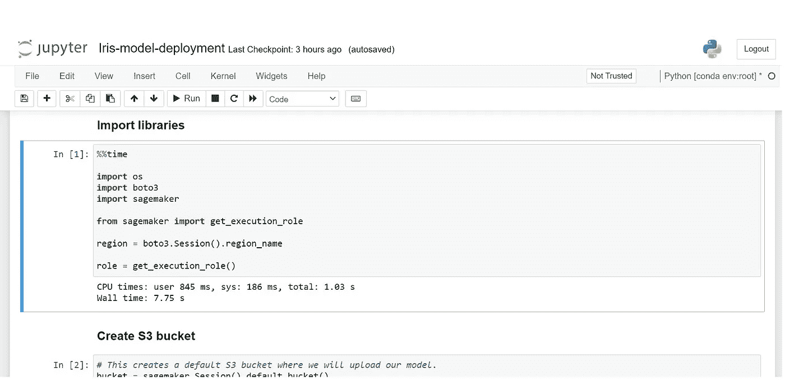

**我们必须在 SageMaker 中上传并运行此笔记本，而不是在本地。**

**3。在 AWS 控制台中，创建一个 SageMaker 笔记本实例，并打开一个 Jupyter 笔记本。** 
将本地训练好的模型、test_point.csv 和 iris-model-deployment.ipynb 文件上传到 sageMaker 笔记本。

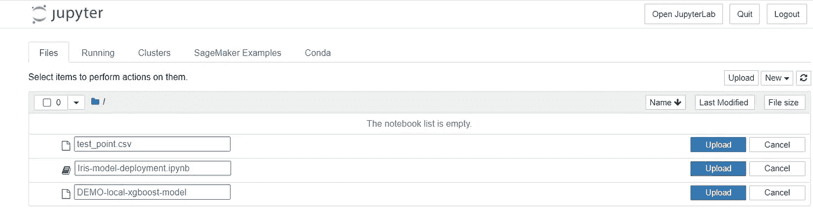

**4。在 SageMaker 中运行 iris-model-deployment 笔记本。**

**重要-运行笔记本中的所有单元格，除了最后一个**-**‘删除端点’。**

当你看到弹出“没有找到内核”时，选择并设置 conda_python3 为内核。

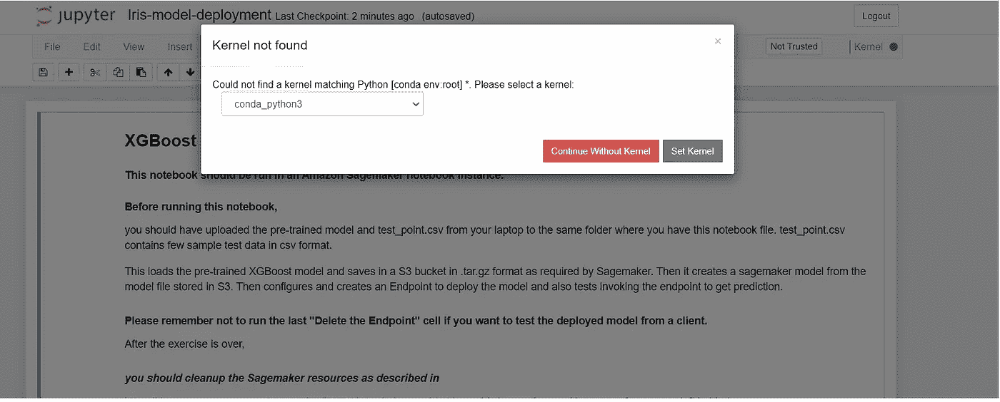

笔记本代码执行以下操作。

*   加载模型文件，打开并测试它，然后将它上传到 S3 存储桶(SageMaker 将从那里获取模型工件)。
*   从存储在 S3 的模型中创建一个 SageMaker 模型对象。为此，我们将使用 SageMaker 内置的 XGBoost 容器，因为该模型是用 XGBoost 算法在本地训练的。根据您用于建模的算法，您必须正确选择相应的内置容器，并处理与之相关的细微差别..SageMaker 开发人员指南应该对此有所帮助。
*   创建端点配置。端点是一个接口，外部世界可以通过它使用部署的模型进行预测。关于端点的更多细节可以在 SageMaker 文档中找到。
*   为模型创建一个端点。
*   从部署笔记本中调用端点，以确认端点和模型工作正常。

运行笔记本到现在，您可以看到在 AWS 控制台的
Sagemaker->Inference->Endpoints 下创建的端点。

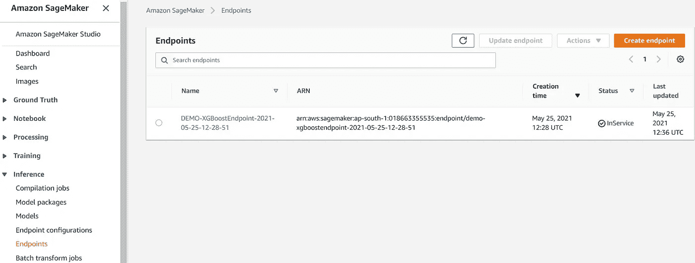

您必须记下显示的端点名称。这将在创建 Lambda 函数时使用(在下一节中描述)。

# 为端到端通信启动必要的 AWS 服务

完成上述步骤后，我们将部署模型，并准备好从外部调用 SageMaker 端点，以从部署的模型中获得实时预测。

下图显示了如何使用无服务器 AWS 架构调用部署的模型。一个客户端脚本调用一个[亚马逊 API 网关](https://aws.amazon.com/api-gateway) API 动作并传递参数值。API 网关是向客户端提供 API 的层。API Gateway 将参数值传递给 Lambda 函数。Lambda 函数解析该值并调用 SageMaker 模型端点，将参数传递给相同的。模型执行预测任务，并将预测结果返回给 Lambda。Lambda 函数解析返回值并将其发送回 API Gateway。API 网关用该值响应客户端。


**我们将使用亚马逊的 Rest API 网关**来实现我们的目的。我们将使用 Postman app 而不是 web 浏览器作为客户端，以保持简单(如果您想使用浏览器 web 界面，您需要将 Flask 打包在一个容器中，该容器需要放置在 SageMaker 中并在其中运行)。在我们的例子中，Postman 将用于发送 Restful POST 方法来调用 API 网关并获得响应(预测)。

所以我们需要设置 API 网关和 Lambda。让我们完成剩下的几个步骤。

**5。创建一个包含以下策略的 IAM 角色，该策略赋予 Lambda 函数调用模型端点的权限。**

```
{
    "Version": "2012-10-17",
    "Statement": [
        {
            "Sid": "VisualEditor0",
            "Effect": "Allow",
            "Action": "sagemaker:InvokeEndpoint",
            "Resource": "*"
        }
    ]
}
```

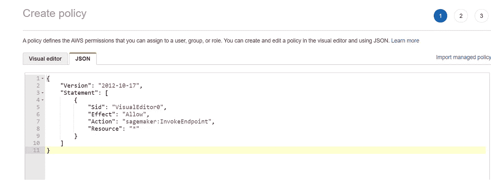

在创建角色并将策略附加到角色时，选择 Lambda 作为 AWS 服务中的用例。

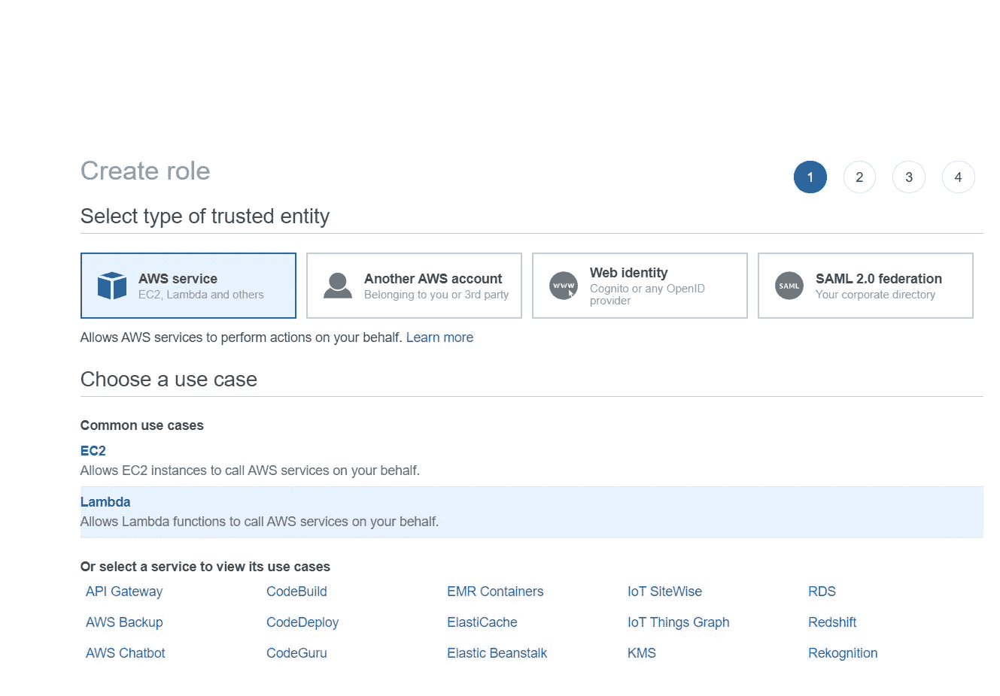

**6。用下面提到的 python 代码创建一个 Lambda 函数，该函数调用 SageMaker 运行时 invoke_endpoint 并返回预测。**

```
import os
import boto3
import json# grab environment variables
ENDPOINT_NAME = os.environ['ENDPOINT_NAME']
runtime= boto3.client('runtime.sagemaker')def lambda_handler(event, context):
    print("Received event: " + json.dumps(event, indent=2))

    data = json.loads(json.dumps(event))
    payload = data['data']
    #print(payload)

    response = runtime.invoke_endpoint(EndpointName=ENDPOINT_NAME,
                                       ContentType='text/csv',
                                       Body=payload) #print(response) result = json.loads(response['Body'].read().decode())

    classes = ['Setosa', 'Versicolor', 'Virginica']
    res_list =  [ float(i) for i in result] return classes[res_list.index(max(res_list))]
```

选择“从头开始创作”并给出一个函数名，选择运行时为 Python 3.8，如下所示。

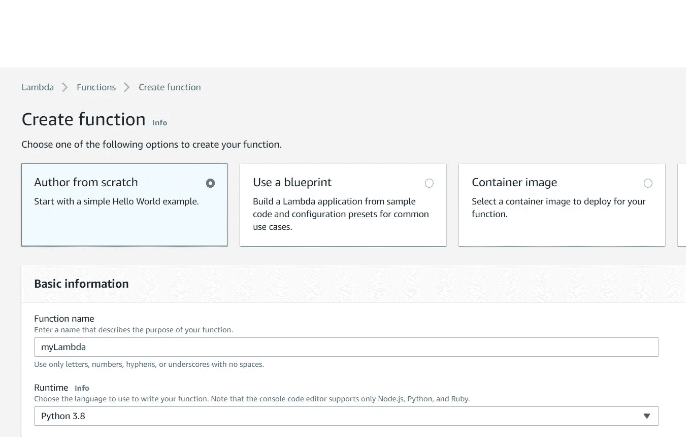

**选择“使用现有角色”**并选择您在上一步中创建的角色。

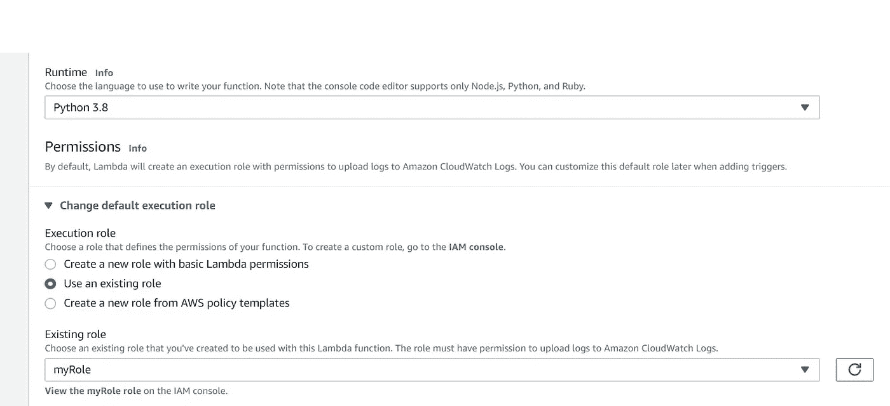

在 lambda 的代码部分下，输入本步骤开始时给出的 python 代码。**输入代码后，记得点击“部署”。**

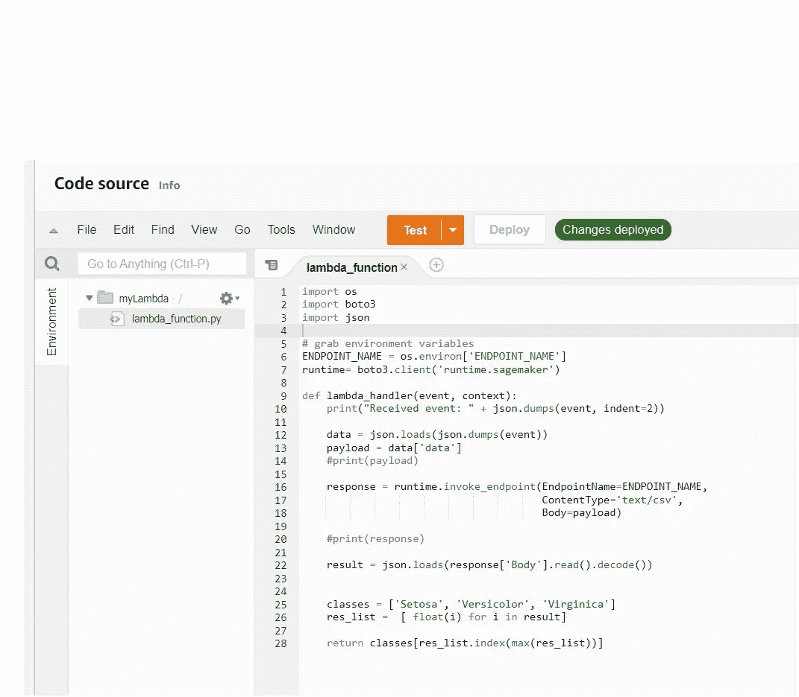

转到 Lambda 函数的 Configuration 选项卡，添加一个环境变量“ENDPOINT_NAME ”,并将其值设置为在前面的步骤中创建的相同端点。注意，Lambda 函数的代码中使用了这个环境变量。


我们已经完成了 Lambda 函数的设置。

**7。创建一个 REST API 并集成 Lambda 函数**

在 AWS 控制台上选择 API 网关服务，然后选择 REST API。


点击 Build 并选择“New API”。在您看到的下一个窗口中，从 Actions 下拉菜单中选择“Create Resource ”,并输入一个资源名称。

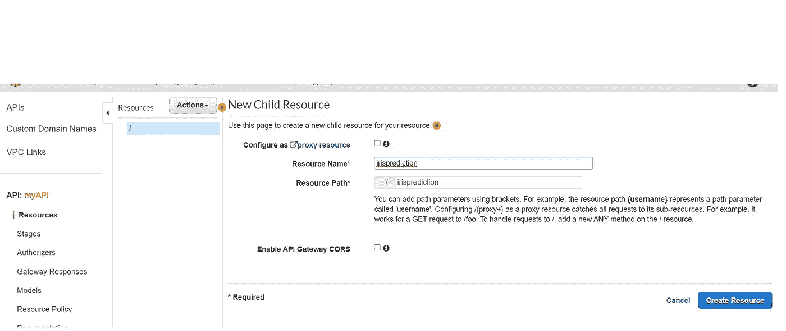

记下您选择的资源名称。它将是该服务创建的 URL 的一部分，稍后我们测试 Postman 的部署时会用到。这里我们选择资源名为“irisprediction”。创建资源后，从操作下拉菜单中选择“创建方法”。

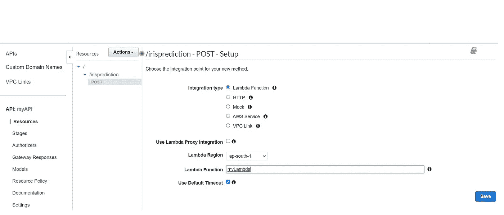

选择 POST 方法和“Lambda 函数”作为集成类型。输入您在前面步骤中创建的 Lambda 函数的名称。然后，从操作下拉菜单中选择“部署 API”。选择部署阶段“新阶段”并给出某个阶段名称。我选择输入“测试”。

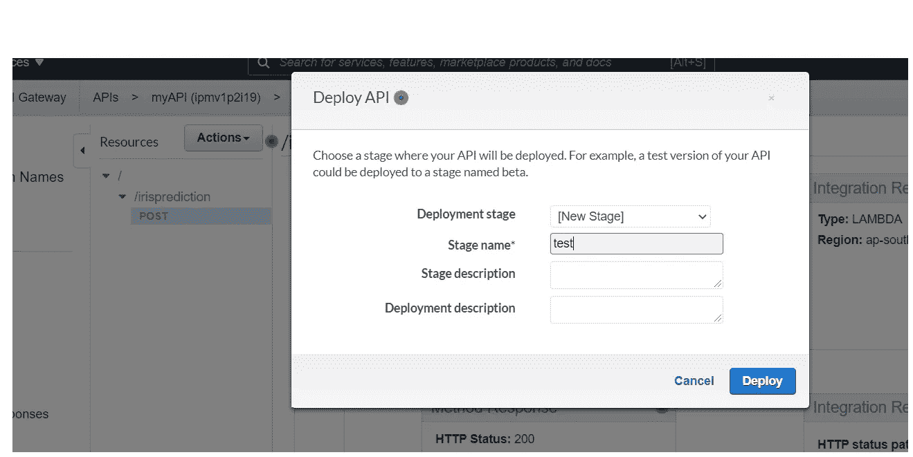

然后，最后当你点击“部署”，你会得到一个“调用网址”，如下所示。

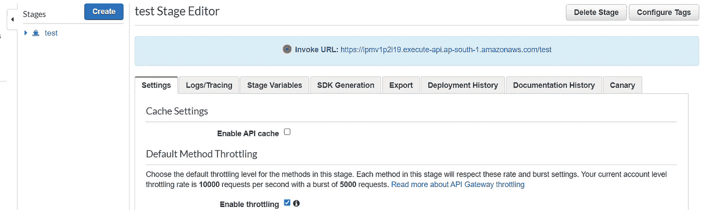

**请记下窗口上显示的 URL 为“调用 URL”。**它将在 Postman 中用于联系 API 网关，如下所述。

现在，我们已经完成了端到端通信路径的部署和设置。

# 从本地客户端测试最终部署

**8。最后，使用笔记本电脑中的 Postman 应用程序，将 Iris flower 测试数据发布到 API gateway，并从 AWS cloud 返回预测结果。**

示例 URL : ( **记住用您在前面的步骤中创建 API 时获得的 API URL 替换，并在末尾附加资源名称。**)

例如，如果您得到的调用 URL 是
https://kmnia 554 df . execute-API . us-east-1 . Amazon AWS . com/test/

将资源名称附加到上面的 URL，并在 postman 中使用。例如，在我们的例子中，它是“虹膜预测”。您可以看到下面给出的完整示例 URL 的屏幕截图。

使用方法:贴

在正文中，原始输入可以如下给出:

{ " data ":" 5.099999999999999645 e+00，3.299999999999999822e+00，1.699999999999956 e+00，5.00000000000000 e-01 " }

样本数据可以参考 test_point.csv。作为数据给出的四个数值参数只不过是一些鸢尾花数据点的样本萼片长度、萼片宽度、花瓣长度和花瓣宽度。


当我们发送数据时，我们成功地调用了已部署的模型端点，并接收回上面示例中的“Setosa”形式的花朵预测。

**因此，我们已经使用 SageMaker 在 AWS 云上成功部署了一个本地训练的模型，并看到了它在实时推理方面的工作！**

现在，最后也是最重要的一步是**清理我们已经创建并启动的 AWS 资源**，因为如果您让任何资源运行或占用空间，您将为该资源停留在那里的所有时间付费…

## 重要-清理，否则你支付费用！

1.  对于 SageMaker，记得删除笔记本实例、端点、端点配置和模型。你可以按照这个[链接](https://docs.aws.amazon.com/sagemaker/latest/dg/ex1-cleanup.html)进行同样的操作。
2.  转到 Lambda service 并删除您创建的函数。
3.  转到 Cloudwatch 服务，选择“日志组”并删除您在那里找到的日志组。
4.  转到 IAM 服务，删除您在本练习中创建的角色和策略。
5.  删除我们推出的 API 网关。

AWS SageMaker 上的模型部署练习到此结束。

希望你喜欢并欣赏它…谢谢你的关注！！

# **少量参考资料供进一步阅读:**

[亚马逊 SageMaker 文档](https://docs.aws.amazon.com/sagemaker/index.html)

[SageMaker 示例笔记本](https://github.com/aws/amazon-sagemaker-examples)

[亚马逊 SageMaker 技术深潜系列](https://www.youtube.com/playlist?list=PLhr1KZpdzukcOr_6j_zmSrvYnLUtgqsZz)